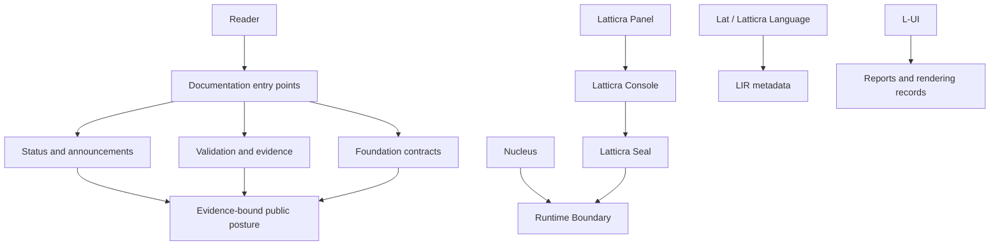

# Latticra

**Evidence-bound systems architecture for local authority, reports, receipts, and future runtime boundaries.**

## Academic presentation

The Latticra Substrate theorem presentation for Colorado Technical University is available here:

[Watch the Latticra academic presentation](build/presentation/latticra-academic/video/latticra-academic-presentation.mp4)

This presentation introduces Chase Bryan's Latticra Substrate model and the mathematical theorems underlying its lattice structure.

The Nucleus Supervisor Architecture academic presentation is available here:

[Watch the Nucleus academic presentation](build/presentation/nucleus-academic/video/nucleus-academic-presentation.mp4)

This presentation explains the Nucleus supervisor model, request lifecycle, effect gates, task reports, runtime boundary, update/server gates, and evidence recorder.

README route refreshed: 2026-05-29 CDT
Default branch: `main`
Edge edition checkpoint: `v0.3.0edge`
Next main edge line: `v0.4.0edge`

`v0.3.0edge` is the current working edge checkpoint for active validation work after the v0.1.0 reference-manual checkpoint and the v0.2.0edge no-effect validation checkpoint. It now recognizes bounded local operator effects, such as user-local install, local copy, receipt-writing, and operator-bundle staging surfaces, while root, network, USB, QEMU, package-manager, kernel, service, boot, production-readiness, and distribution-readiness authority remain closed unless a narrower record says otherwise. It is not a standard release, product-readiness claim, API-stability guarantee, or replacement for the generated v0.1.0 reference manual package.

`v0.4.0edge` will be the next main edge line for the effect-substrate and Model-1 bridge path. Preparing for it does not make `v0.4.0edge` the current checkpoint, cut a tag, accept mixed-build artifacts, launch Model-1, dispatch effects, or grant runtime authority.

## Edge and license posture

The edge labels describe validation posture only. They do not change the repository license model, create a product release, or silently relicense files.

| Edge line | Public meaning | License posture |
| --- | --- | --- |
| `v0.3.0edge` | Current working edge checkpoint for bounded local operator-effect visibility | Hybrid posture in [LICENSE](LICENSE): core/runtime/security substrate direction is AGPL-3.0-or-later, adoption-facing helpers stay Apache-2.0, documentation is CC-BY-4.0, and marks remain separate |
| `v0.4.0edge` | Next main edge line for the effect-substrate and Model-1 bridge path; not a release or tag claim here | Same hybrid posture; no new license listing, license-compliance claim, archive-readiness claim, or relicensing action is implied |

Use [LICENSES/README.md](LICENSES/README.md), [docs/LICENSE_POLICY.md](docs/LICENSE_POLICY.md), and [docs/DOCUMENTATION_LICENSE.md](docs/DOCUMENTATION_LICENSE.md) for the canonical license index.

Latticra is an early-stage systems substrate. It is built around a simple rule: before a system action becomes operational, the request, identity, capability, policy, boundary, and evidence posture should be explicit, inspectable, denied by default, and backed by reproducible records.

It is not a production platform, certified security product, hardened sandbox, root installer, network authority, operating-system replacement, Fedora-approved package, Ubuntu archive-ready package, Debian archive-ready package, FreeBSD official port, OpenBSD official port, or openSUSE official package.

## Current status at a glance

The current public posture is tracked in [STATUS.md](STATUS.md), [docs/status/CURRENT_STATUS.md](docs/status/CURRENT_STATUS.md), and [docs/status/ANNOUNCEMENTS.md](docs/status/ANNOUNCEMENTS.md). The [Production quality blocker ledger](docs/status/PRODUCTION_QUALITY_BLOCKER_LEDGER.md) keeps the green local quality signal separate from production readiness claims. The production-installer release artifact staging directory, release worktree cleanliness audit with stdout-only dirty inventory, release toolchain availability audit, release signing identity reference, release artifact candidate preflight, release artifact evidence template, and release artifact, SBOM, transcript, lifecycle, recovery, and multi-VM evidence intake validators are present. The SBOM and transcript evidence templates are also present for future reviewed SBOM and dry-run transcript bundles. They can check future tagged artifact evidence bundles, but they do not create or sign release artifacts, clean or revert tracked files, write dirty-inventory evidence, install release tools, generate or attach an SBOM, accept evidence, pass promotion, record transcripts, validate lifecycle, recovery, or multi-VM behavior, or claim production readiness. Strategy and near-term direction live in [docs/strategy/README.md](docs/strategy/README.md), [docs/project_notes/README.md](docs/project_notes/README.md), [docs/project_notes/CURRENT_DIRECTION.md](docs/project_notes/CURRENT_DIRECTION.md), and [docs/project_notes/UPCOMING_WORK.md](docs/project_notes/UPCOMING_WORK.md).

The [effect substrate transition intake](docs/LATTICRA_EFFECT_SUBSTRATE_TRANSITION_INTAKE.md) records the review order for future effect-runner, build-profile, and Model-1 bridge work before any capability promotion.

The [effect contract schema](docs/LATTICRA_EFFECT_CONTRACT_SCHEMA.md) satisfies the first transition-intake prerequisite by defining required contract and evidence-record fields while keeping effect execution, command execution, file mutation, Model-1 bridge execution, and runtime authority closed.

The [effect allowlist and build-profile boundary](docs/LATTICRA_EFFECT_ALLOWLIST_BUILD_PROFILE_BOUNDARY_CONTRACT.md) satisfies the second transition-intake prerequisite and requires a concrete operator-usable workflow before any effect-runner, build-profile, or Model-1 bridge promotion review.

The [effect runner implementation review boundary](docs/LATTICRA_EFFECT_RUNNER_IMPLEMENTATION_REVIEW_BOUNDARY.md) satisfies the third transition-intake boundary by defining runner classification and review evidence requirements while keeping runner dispatch, effect execution, command execution, file mutation, and runtime authority closed.

The [separate-build platform integration review boundary](docs/LATTICRA_SEPARATE_BUILD_PLATFORM_INTEGRATION_REVIEW_BOUNDARY.md) records the observed `~/Latticra` branch, build layout, artifacts, build profiles, and Model-1 tree as review inputs while keeping build execution, artifact import, artifact acceptance, mixed-build promotion, and Model-1 bridge execution closed.

The [Model-1 bridge protocol contract](docs/LATTICRA_MODEL1_BRIDGE_PROTOCOL_CONTRACT.md) satisfies the fifth transition-intake boundary by defining message format, trace correlation, authority handoff, target evidence, and denial behavior while keeping Model-1 launch, bridge execution, and runtime authority closed.

The [Model-1 import and mixed-build review boundary](docs/LATTICRA_MODEL1_IMPORT_MIXED_BUILD_REVIEW_BOUNDARY.md) satisfies the sixth transition-intake boundary by defining import scope, source provenance, mixed-build layout, target identity, bridge-protocol compatibility, target evidence, and non-claim evidence while keeping Model-1 import acceptance, mixed-build promotion, and effect dispatch closed.

The [computational proof foundation](docs/LATTICRA_COMPUTATIONAL_PROOF_FOUNDATION.md) begins the explicit computer-science and science framing for investigating simulation-bound reality hypotheses through proof objects, falsifiability, observer boundaries, physics constraint modeling, receipts, replay, and adversarial review while keeping `simulation_proven=0`.

The [computational math and physics evaluation](docs/LATTICRA_COMPUTATIONAL_MATH_PHYSICS_EVALUATION.md) records the first proof-lane order: evaluate the math, couple reviewed math to physics-model fields, then prepare a substrate-engine visual demonstration while keeping visual evidence and scientific claims closed.

The [Speculum premise](docs/LATTICRA_SPECULUM_PREMISE.md) now names the clarifying mirror beside the simulacrum so simulation-bound reality language remains a bounded research premise, not a public reality claim.

The proof-object lane now includes [Proof Object 1](docs/LATTICRA_PROOF_OBJECT_1_EMERGENT_PARTICLE_MASS.md), [Proof Object 2](docs/LATTICRA_PROOF_OBJECT_2_HIGGS_COUNTERPLAY.md), [Proof Object 3](docs/LATTICRA_PROOF_OBJECT_3_HIGGS_CAUSAL_CLOSURE_NO_GO.md), [Proof Object 4](docs/LATTICRA_PROOF_OBJECT_4_IDENTITY_REPLAY_IMPEDANCE.md), the [Candidate Particle Table](docs/LATTICRA_IDENTITY_REPLAY_IMPEDANCE_CANDIDATE_PARTICLE_TABLE.md), and the [L0 Mass-Ratio Runner](docs/LATTICRA_IDENTITY_REPLAY_IMPEDANCE_TOY_SUBSTRATE_L0_MASS_RATIO_RUNNER.md). The original Latticra claim is identity-replay impedance: mass as the replay-stable cost for a projected localized identity to remain itself under substrate update, with Higgs treated as effective physics that a deeper substrate ledger must reproduce.

For `v0.4.0edge`, the README integration posture is:

| Gate | README meaning |
| --- | --- |
| Current checkpoint | `v0.3.0edge` remains the current public edge checkpoint |
| Next main edge line | `v0.4.0edge` is the next main edge line, not yet a tag or release claim |
| Completed prerequisites | effect contract schema, evidence record contract, allowlist/build-profile boundary, effect-runner review boundary, separate-build platform review boundary, Model-1 bridge protocol contract, and Model-1 import/mixed-build review boundary |
| Required before integration | guarded Model-1 effect demonstration evidence |
| Still closed | Model-1 launch, effect dispatch, command execution, file mutation, artifact acceptance, mixed-build promotion, runtime authority, and production readiness |

<details>
<summary>Release artifact and installer evidence markers</summary>

```text
release_artifact_candidate_preflight_present=1
release_artifact_candidate_preflight_mode=no-effect-build-signing-readiness
release_artifact_candidate_preflight_passed=0
release_artifact_candidate_inputs_satisfied=0
release_artifact_staging_directory_present=1
release_artifact_staging_directory_path=artifacts/release
release_artifact_staging_directory_no_effect=1
release_artifact_candidate_parent_dir_exists=1
release_worktree_cleanliness_audit_present=1
release_worktree_cleanliness_audit_mode=no-effect-tracked-status-report
release_worktree_cleanliness_audit_passed=0
release_worktree_tracked_worktree_clean=0
release_worktree_tracked_dirty_count=<observed>
release_worktree_dirty_inventory_present=1
release_worktree_dirty_inventory_mode=stdout-only-tracked-status-list
release_worktree_dirty_inventory_complete=<observed>
release_worktree_dirty_inventory_count=<observed>
release_worktree_dirty_inventory_written=0
release_worktree_dirty_inventory_accepted=0
release_worktree_cleanliness_remediation_required=<observed>
release_artifact_candidate_tracked_worktree_clean=0
release_artifact_candidate_tracked_dirty_count=<observed>
release_toolchain_availability_audit_present=1
release_toolchain_availability_audit_mode=no-effect-command-visibility-report
release_toolchain_availability_audit_passed=0
release_toolchain_ready=0
rpmbuild_available=0
rpm_available=0
release_artifact_build_tool_available=0
release_artifact_query_tool_available=0
release_signing_identity_reference_validator_present=1
release_signing_identity_reference_valid=0
release_signing_identity_reference_fingerprint_format_valid=0
release_artifact_signing_identity_reference_present=0
release_artifact_signing_identity_reference_format_valid=0
secret_key_inspection_performed=0
signing_performed=0
release_artifact_created=0
release_artifact_present=0
source_archive_created=0
rpm_build_invoked=0
signature_created=0
checksum_recorded=0
release_artifact_evidence_written=0
release_artifact_evidence_accepted=0
git_add_performed=0
git_commit_performed=0
git_reset_performed=0
tracked_file_reverted=0
release_artifact_evidence_template_present=1
release_artifact_evidence_template_mode=no-effect-template
release_artifact_evidence_template_complete=0
release_artifact_evidence_written_by_template=0
release_artifact_evidence_accepted_by_template=0
release_artifact_evidence_intake_validator_present=1
release_artifact_evidence_intake_validation_mode=no-effect-validation
release_artifact_candidate_valid=0
release_artifact_sha256_matches=0
release_artifact_evidence_accepted_by_intake_validator=0
release_artifact_evidence_written_by_intake_validator=0
release_artifact_promotion_allowed_by_intake_validator_alone=0
sbom_evidence_intake_validator_present=1
sbom_evidence_intake_validation_mode=no-effect-validation
sbom_evidence_template_present=1
sbom_evidence_template_mode=no-effect-template
sbom_evidence_template_complete=0
sbom_generated_by_template=0
sbom_evidence_written_by_template=0
sbom_evidence_accepted_by_template=0
sbom_evidence_candidate_valid=0
sbom_evidence_accepted_by_intake_validator=0
sbom_evidence_written_by_intake_validator=0
installer_sbom_promotion_allowed_by_intake_validator_alone=0
installer_sbom_recorded=0
transcript_evidence_intake_validator_present=1
transcript_evidence_intake_validation_mode=no-effect-validation
transcript_evidence_template_present=1
transcript_evidence_template_mode=no-effect-template
transcript_evidence_template_complete=0
transcripts_created_by_template=0
transcript_hashes_calculated_by_template=0
transcript_evidence_written_by_template=0
transcript_evidence_accepted_by_template=0
transcript_evidence_candidate_valid=0
transcript_evidence_accepted_by_intake_validator=0
transcript_evidence_written_by_intake_validator=0
installer_transcript_promotion_allowed_by_intake_validator_alone=0
installer_install_transcript_recorded=0
installer_uninstall_transcript_recorded=0
installer_post_removal_absence_verified=0
lifecycle_evidence_intake_validator_present=1
lifecycle_evidence_intake_validation_mode=no-effect-validation
lifecycle_evidence_candidate_valid=0
lifecycle_evidence_accepted_by_intake_validator=0
lifecycle_evidence_written_by_intake_validator=0
installer_lifecycle_promotion_allowed_by_intake_validator_alone=0
installer_upgrade_path_validated=0
installer_rollback_path_validated=0
installer_downgrade_or_rollback_path_validated=0
installer_reinstall_idempotence_validated=0
recovery_evidence_intake_validator_present=1
recovery_evidence_intake_validation_mode=no-effect-validation
recovery_evidence_candidate_valid=0
recovery_evidence_accepted_by_intake_validator=0
recovery_evidence_written_by_intake_validator=0
installer_recovery_promotion_allowed_by_intake_validator_alone=0
installer_failure_mode_documented=0
installer_recovery_runbook_present=0
installer_recovery_drill_validated=0
installer_rollback_drill_validated=0
installer_failure_mode_evidence_recorded=0
multi_vm_evidence_intake_validator_present=1
multi_vm_evidence_intake_validation_mode=no-effect-validation
multi_vm_evidence_candidate_valid=0
multi_vm_evidence_accepted_by_intake_validator=0
multi_vm_evidence_written_by_intake_validator=0
installer_multi_vm_promotion_allowed_by_intake_validator_alone=0
installer_multi_vm_validation_completed=0
installer_fresh_vm_validation_completed=0
installer_repeat_vm_validation_completed=0
installer_existing_install_validation_completed=0
installer_non_root_cli_validation_completed=0
installer_root_boundary_validation_completed=0
release_artifact_promotion_gate_passed=0
production_installer_ready=0
host_mutation_performed=0
```

```text
docs/PRODUCTION_INSTALLER_RELEASE_ARTIFACT_STAGING_DIRECTORY_CONTRACT.md
docs/status/PRODUCTION_INSTALLER_RELEASE_ARTIFACT_STAGING_DIRECTORY_STATUS.md
docs/PRODUCTION_INSTALLER_RELEASE_SIGNING_IDENTITY_REFERENCE_CONTRACT.md
docs/status/PRODUCTION_INSTALLER_RELEASE_SIGNING_IDENTITY_REFERENCE_STATUS.md
docs/PRODUCTION_INSTALLER_RELEASE_WORKTREE_CLEANLINESS_AUDIT_CONTRACT.md
docs/status/PRODUCTION_INSTALLER_RELEASE_WORKTREE_CLEANLINESS_AUDIT_STATUS.md
docs/PRODUCTION_INSTALLER_RELEASE_TOOLCHAIN_AVAILABILITY_AUDIT_CONTRACT.md
docs/status/PRODUCTION_INSTALLER_RELEASE_TOOLCHAIN_AVAILABILITY_AUDIT_STATUS.md
docs/PRODUCTION_INSTALLER_RELEASE_ARTIFACT_CANDIDATE_PREFLIGHT_CONTRACT.md
docs/status/PRODUCTION_INSTALLER_RELEASE_ARTIFACT_CANDIDATE_PREFLIGHT_STATUS.md
docs/PRODUCTION_INSTALLER_RELEASE_ARTIFACT_EVIDENCE_TEMPLATE_CONTRACT.md
docs/status/PRODUCTION_INSTALLER_RELEASE_ARTIFACT_EVIDENCE_TEMPLATE_STATUS.md
docs/PRODUCTION_INSTALLER_RELEASE_ARTIFACT_EVIDENCE_INTAKE_VALIDATOR_CONTRACT.md
docs/status/PRODUCTION_INSTALLER_RELEASE_ARTIFACT_EVIDENCE_INTAKE_VALIDATOR_STATUS.md
docs/PRODUCTION_INSTALLER_SBOM_EVIDENCE_TEMPLATE_CONTRACT.md
docs/status/PRODUCTION_INSTALLER_SBOM_EVIDENCE_TEMPLATE_STATUS.md
docs/PRODUCTION_INSTALLER_SBOM_EVIDENCE_INTAKE_VALIDATOR_CONTRACT.md
docs/status/PRODUCTION_INSTALLER_SBOM_EVIDENCE_INTAKE_VALIDATOR_STATUS.md
docs/PRODUCTION_INSTALLER_TRANSCRIPT_EVIDENCE_TEMPLATE_CONTRACT.md
docs/status/PRODUCTION_INSTALLER_TRANSCRIPT_EVIDENCE_TEMPLATE_STATUS.md
docs/PRODUCTION_INSTALLER_TRANSCRIPT_EVIDENCE_INTAKE_VALIDATOR_CONTRACT.md
docs/status/PRODUCTION_INSTALLER_TRANSCRIPT_EVIDENCE_INTAKE_VALIDATOR_STATUS.md
docs/PRODUCTION_INSTALLER_LIFECYCLE_EVIDENCE_INTAKE_VALIDATOR_CONTRACT.md
docs/status/PRODUCTION_INSTALLER_LIFECYCLE_EVIDENCE_INTAKE_VALIDATOR_STATUS.md
docs/PRODUCTION_INSTALLER_RECOVERY_EVIDENCE_INTAKE_VALIDATOR_CONTRACT.md
docs/status/PRODUCTION_INSTALLER_RECOVERY_EVIDENCE_INTAKE_VALIDATOR_STATUS.md
docs/PRODUCTION_INSTALLER_MULTI_VM_EVIDENCE_INTAKE_VALIDATOR_CONTRACT.md
docs/status/PRODUCTION_INSTALLER_MULTI_VM_EVIDENCE_INTAKE_VALIDATOR_STATUS.md
```

</details>

Planning estimates are status markers, not release commitments, product readiness claims, or security guarantees.
Planning estimates are not release promises, product-readiness metrics, or security guarantees.

| Field | Current public marker |
| --- | --- |
| Edge edition checkpoint | `v0.3.0edge` |
| Next main edge line | `v0.4.0edge` |
| Current public estimate | Roughly 48% overall system planning estimate |
| Estimate source | Current public estimate table below, mirrored from `STATUS.md` and `docs/status/CURRENT_STATUS.md` |
| Foundation documents and contracts | Mature relative to implementation; around 96% planning estimate |
| Public documentation posture | Strong but still evolving; around 94% planning estimate |
| Latticra Seal | Local evidence, receipts, signed receipt proof-path planning, hybrid envelope self-tests, and denied-by-default runtime boundaries |
| Product readiness | Early; no production platform claimed |

<details>
<summary>Planning estimate mirror</summary>

Current public estimate table, as summarized by [`STATUS.md`](STATUS.md) and [`docs/status/CURRENT_STATUS.md`](docs/status/CURRENT_STATUS.md):

| Area | Current estimate |
| --- | --- |
| Overall Latticra system | 48% |
| Latticra Seal / local evidence layer | 45% |
| Latticra Panel / local control surface | 37% |
| Nadia offline AI foundation | 77% |
| L-UI parser / AST / string foundation | 87% |
| Foundation documents and contracts | 96% |
| Public documentation posture | 94% |
| Strategy/status/funding framework | 67% |
| Lat / Latticra Programming Language | 27% |
| LIR / Intermediate Representation | 24% |
| C/C++ foundation direction | 25% |
| Constrained C++ authority layer | 5% |
| Nucleus real task execution | 14% |
| Runtime / operating-system-universe direction | 32% |
| Security-hardening implementation | 14% |
| Public product readiness | 13% |

The current estimate table source alignment is [`docs/status/CURRENT_ESTIMATE_TABLE_SOURCE_ALIGNMENT.md`](docs/status/CURRENT_ESTIMATE_TABLE_SOURCE_ALIGNMENT.md).
The latest mathematical estimate rebase is [`docs/status/CURRENT_ESTIMATE_MATHEMATICAL_REBASE_2026_05_28.md`](docs/status/CURRENT_ESTIMATE_MATHEMATICAL_REBASE_2026_05_28.md).
The latest estimate refresh record is [`docs/status/CURRENT_ESTIMATE_REFRESH_2026_05_24.md`](docs/status/CURRENT_ESTIMATE_REFRESH_2026_05_24.md).
The latest estimate hold review is [`docs/status/COMPLETION_ESTIMATE_REVIEW_AFTER_RUNTIME_BOUNDARY_ABUSE_CASE_FIXTURES.md`](docs/status/COMPLETION_ESTIMATE_REVIEW_AFTER_RUNTIME_BOUNDARY_ABUSE_CASE_FIXTURES.md).

</details>

## Start Here

| You want to... | Go here |
| --- | --- |
| Install, run, update, or remove the current user-local Panel | [Quick Start Cheat Sheet](docs/QUICK_START_CHEATSHEET.md) |
| Understand the current public posture | [Status](STATUS.md) and [current status record](docs/status/CURRENT_STATUS.md) |
| Browse the full documentation set | [Documentation Hub](docs/README.md) |
| Choose a reading path by role | [Documentation Reader Journey Map](docs/DOCUMENTATION_READER_JOURNEY_MAP.md) |
| Read the generated v0.1.0 reference manual | [Reference Manual](docs/latticra-reference-manual/README.md) |
| Read the project handbook | [The Latticra System Substrate](docs/latticra-system-substrate/README.md) |
| Understand the computational proof frame | [Computational Proof Foundation](docs/LATTICRA_COMPUTATIONAL_PROOF_FOUNDATION.md) |
| Follow the math-first physics coupling lane | [Computational Math and Physics Evaluation](docs/LATTICRA_COMPUTATIONAL_MATH_PHYSICS_EVALUATION.md) |
| Read the original mass-origin theorem | [Proof Object 4](docs/LATTICRA_PROOF_OBJECT_4_IDENTITY_REPLAY_IMPEDANCE.md) |
| Review the mass-ratio target table | [Candidate Particle Table](docs/LATTICRA_IDENTITY_REPLAY_IMPEDANCE_CANDIDATE_PARTICLE_TABLE.md) |
| Run the toy substrate falsifier | [L0 Mass-Ratio Runner](docs/LATTICRA_IDENTITY_REPLAY_IMPEDANCE_TOY_SUBSTRATE_L0_MASS_RATIO_RUNNER.md) |
| Review Higgs counterplay | [Proof Object 2](docs/LATTICRA_PROOF_OBJECT_2_HIGGS_COUNTERPLAY.md) and [Proof Object 3](docs/LATTICRA_PROOF_OBJECT_3_HIGGS_CAUSAL_CLOSURE_NO_GO.md) |
| Clarify the simulation premise | [Speculum Premise](docs/LATTICRA_SPECULUM_PREMISE.md) |
| Review the main evidence and architecture index | [Foundation Index](docs/FOUNDATION_INDEX.md) |
| Use the guarded local Panel workbench | [Latticra Panel](installer/README.md) |
| Inspect the trust-boundary subsystem | [Latticra Seal docs](docs/latticra-seal/README.md) |
| Check security reporting and non-claims | [Security Policy](SECURITY.md) |
| Contribute without widening claims | [Contributing Guide](CONTRIBUTING.md) |

## What Latticra is

Latticra is a contract-first architecture project for high-assurance local systems work. The current repository emphasizes visibility before authority: parser and report surfaces, no-effect validation, guarded local install paths, status mirrors, platform packaging lanes, and documentation that keeps claims tied to evidence.

## Design doctrine

The durable project direction is:

```text
C is the metal.
C++ is the disciplined structure.
Latticra is the contract.
Computational proof is the scientific restraint.
```

That direction does not mean unrestricted low-level code. It means each language and subsystem must earn its authority through explicit contracts, constrained boundaries, tests, reports, and status records.

The simulacrum is never what hides the truth. For Latticra, that means public surfaces should not perform certainty; they should expose the evidence that makes a narrow statement true.

## Architecture map



## What exists today

Latticra Panel is the GUI-first local installer and first-run control workbench for Latticra, Lat, LIR, Latticra Seal, and the optional Nadia offline AI foundation.

| Work area | Current posture | Documentation |
| --- | --- | --- |
| Latticra Panel | User-local GUI workbench; guarded install and dry-run flows | [installer/README.md](installer/README.md), [installer docs](installer/docs/README.md) |
| Latticra Console | Metadata and command-surface planning; no broad host authority | [docs/LATTICRA_CONSOLE_FOUNDATION.md](docs/LATTICRA_CONSOLE_FOUNDATION.md) |
| Latticra Seal | Report-only verification, policy, receipt, local capability registry schema, and trust-boundary records | [docs/latticra-seal/README.md](docs/latticra-seal/README.md), [Seal contract](docs/LATTICRA_SEAL_CONTRACT.md) |
| Lat and LIR | Parse, validate, diagnose, and lower metadata; no language execution | [language strategy](docs/LANGUAGE_STRATEGY.md), [Lat pipeline](docs/LAT_PIPELINE_CONTRACT.md), [LIR shape](docs/LIR_SHAPE_CONTRACT.md) |
| L-UI | Parser, validation, and report/rendering foundations; no terminal-control authority | [L-UI parser](docs/L_UI_PARSER.md), [source grammar](docs/L_UI_SOURCE_GRAMMAR.md), [rendering contract](docs/L_UI_RENDERING_CONTRACT.md) |
| Nucleus and Runtime Boundary | Report-only task boundaries and denied-by-default classification | [supervisor architecture](docs/SUPERVISOR_ARCHITECTURE.md), [runtime boundary contract](docs/RUNTIME_BOUNDARY_CONTRACT.md) |
| Nadia offline AI | Contract-only local AI foundation records; no model execution or tool authority | [Nadia foundation](docs/NADIA_OFFLINE_AI_FOUNDATION.md), [Nadia status index](docs/status/README.md) |
| Platform packaging lanes | Local-only Fedora, Ubuntu, Debian, openSUSE, FreeBSD, and OpenBSD package/port draft records | [Fedora](packaging/fedora/README.md), [Ubuntu](packaging/ubuntu/README.md), [Debian](packaging/debian/README.md), [openSUSE](packaging/opensuse/README.md), [FreeBSD](packaging/freebsd/README.md), [OpenBSD](packaging/openbsd/README.md) |
| Kernel lifecycle evidence | No-effect kernel lifecycle, nucleus coupling, and subsystem summary reach `runtime-entry-recovery-audit-review-disposition-review-closeout-archive-gate-review-disposition-closeout-archive-gate-observation-view-ready`; recovery-audit-review-disposition-review-closeout-archive-gate-review-disposition-closeout archive-gate observation evidence remains report-only | [kernel lifecycle status](docs/status/KERNEL_LIFECYCLE_EVIDENCE_STATUS.md), [runtime entry recovery-outcome-observation-view seed](docs/KERNEL_RUNTIME_ENTRY_RECOVERY_OUTCOME_OBSERVATION_VIEW_SEED.md), [runtime entry recovery-closeout-observation-view seed](docs/KERNEL_RUNTIME_ENTRY_RECOVERY_CLOSEOUT_OBSERVATION_VIEW_SEED.md), [runtime entry recovery-audit-observation-view seed](docs/KERNEL_RUNTIME_ENTRY_RECOVERY_AUDIT_OBSERVATION_VIEW_SEED.md), [runtime entry recovery-audit-review-observation-view seed](docs/KERNEL_RUNTIME_ENTRY_RECOVERY_AUDIT_REVIEW_OBSERVATION_VIEW_SEED.md), [runtime entry recovery-audit-review-disposition-observation-view seed](docs/KERNEL_RUNTIME_ENTRY_RECOVERY_AUDIT_REVIEW_DISPOSITION_OBSERVATION_VIEW_SEED.md), [runtime entry recovery-audit-review-disposition-review-observation-view seed](docs/KERNEL_RUNTIME_ENTRY_RECOVERY_AUDIT_REVIEW_DISPOSITION_REVIEW_OBSERVATION_VIEW_SEED.md), [runtime entry recovery-audit-review-disposition-review-closeout-observation-view seed](docs/KERNEL_RUNTIME_ENTRY_RECOVERY_AUDIT_REVIEW_DISPOSITION_REVIEW_CLOSEOUT_OBSERVATION_VIEW_SEED.md), [runtime entry recovery-audit-review-disposition-review-closeout-archive-gate-observation-view seed](docs/KERNEL_RUNTIME_ENTRY_RECOVERY_AUDIT_REVIEW_DISPOSITION_REVIEW_CLOSEOUT_ARCHIVE_GATE_OBSERVATION_VIEW_SEED.md), [runtime entry recovery-audit-review-disposition-review-closeout-archive-gate-review-observation-view seed](docs/KERNEL_RUNTIME_ENTRY_RECOVERY_AUDIT_REVIEW_DISPOSITION_REVIEW_CLOSEOUT_ARCHIVE_GATE_REVIEW_OBSERVATION_VIEW_SEED.md), [runtime entry recovery-audit-review-disposition-review-closeout-archive-gate-review-disposition-observation-view seed](docs/KERNEL_RUNTIME_ENTRY_RECOVERY_AUDIT_REVIEW_DISPOSITION_REVIEW_CLOSEOUT_ARCHIVE_GATE_REVIEW_DISPOSITION_OBSERVATION_VIEW_SEED.md), [runtime entry recovery-audit-review-disposition-review-closeout-archive-gate-review-disposition-closeout-observation-view seed](docs/KERNEL_RUNTIME_ENTRY_RECOVERY_AUDIT_REVIEW_DISPOSITION_REVIEW_CLOSEOUT_ARCHIVE_GATE_REVIEW_DISPOSITION_CLOSEOUT_OBSERVATION_VIEW_SEED.md), [runtime entry recovery-audit-review-disposition-review-closeout-archive-gate-review-disposition-closeout-archive-gate-observation-view seed](docs/KERNEL_RUNTIME_ENTRY_RECOVERY_AUDIT_REVIEW_DISPOSITION_REVIEW_CLOSEOUT_ARCHIVE_GATE_REVIEW_DISPOSITION_CLOSEOUT_ARCHIVE_GATE_OBSERVATION_VIEW_SEED.md), [nucleus kernel coupling readiness](docs/NUCLEUS_KERNEL_COUPLING_READINESS.md) |

<details>
<summary>Guard compatibility appendix: status markers and platform evidence</summary>

## Nadia Compatibility Markers

These compact markers preserve the guarded Nadia README/status-row assertions. They are documentation alignment evidence only; they do not add model execution, prompt evaluation, dialogue generation, runtime invocation, tool execution, source mutation, network authority, or production AI claims.

```text
Nadia Offline AI
Nadia Murad
nadia_offline_ai_stage_0_foundation_present=1
installed_command=latticra-nadia
| Nadia offline AI foundation | 77% |
implementation_name=Nadia Witness Foundation
nadia_stage_1_local_context_engine_present=1
nadia_stage_2_runtime_profile_present=1
nadia_stage_3_developer_workbench_present=1
nadia_stage_4_systems_engineering_mode_present=1
nadia_stage_5_productivity_loop_present=1
nadia_stage_6_protective_safety_boundary_present=1
nadia_stage_7_guarded_tool_authority_present=1
nadia_stage_8_prompt_evaluation_contract_present=1
nadia_stage_9_local_model_registry_contract_present=1
nadia_stage_10_inference_readiness_contract_present=1
nadia_stage_11_runtime_invocation_contract_present=1
nadia_stage_12_model_load_contract_present=1
nadia_stage_13_prompt_receipt_contract_present=1
nadia_stage_14_prompt_materialization_contract_present=1
nadia_stage_15_awareness_dialogue_contract_present=1
nadia_stage_16_prompt_evaluation_handoff_contract_present=1
nadia_stage_17_tokenization_boundary_contract_present=1
nadia_stage_18_tokenizer_specification_contract_present=1
nadia_stage_19_tokenizer_manifest_contract_present=1
nadia_stage_20_tokenizer_artifact_inventory_contract_present=1
nadia_stage_21_tokenizer_artifact_measurement_contract_present=1
nadia_stage_22_tokenizer_artifact_verification_contract_present=1
nadia_stage_23_tokenizer_artifact_binding_contract_present=1
nadia_stage_24_tokenizer_runtime_attachment_contract_present=1
nadia_stage_25_prompt_tokenization_contract_present=1
nadia_stage_26_prompt_token_sequence_contract_present=1
nadia_stage_27_context_window_assembly_contract_present=1
nadia_stage_28_prompt_evaluation_input_contract_present=1
latticra-nadia prompt-evaluation-input
nadia_stage_29_prompt_evaluation_runtime_handoff_contract_present=1
latticra-nadia prompt-evaluation-runtime-handoff
nadia_stage_30_prompt_evaluation_invocation_contract_present=1
latticra-nadia prompt-evaluation-invocation
nadia_stage_31_prompt_evaluation_result_contract_present=1
latticra-nadia prompt-evaluation-result
nadia_stage_32_prompt_evaluation_result_review_contract_present=1
latticra-nadia prompt-evaluation-result-review
nadia_stage_33_prompt_evaluation_result_disposition_contract_present=1
latticra-nadia prompt-evaluation-result-disposition
nadia_stage_51_contract_only_foundation_present=1
latticra-nadia prompt-evaluation-result-release-receipt-review-disposition-release-receipt-review-disposition-release-receipt-review-disposition-release-receipt-review
latticra-nadia prompt-evaluation-result-release-receipt-review-disposition-release-receipt-review-disposition-release-receipt-review-disposition-release-receipt-review-disposition
latticra-nadia prompt-evaluation-result-release-receipt-review-disposition-release-receipt-review-disposition-release-receipt-review-disposition-release-receipt-review-disposition-release
latticra-nadia prompt-evaluation-result-release-receipt-review-disposition-release-receipt-review-disposition-release-receipt-review-disposition-release-receipt-review-disposition-release-receipt
nadia commands
latticra-nadia commands
nadia audit
latticra-nadia audit
```

## Kernel lifecycle markers

The kernel evidence path is a bounded in-memory lifecycle and report surface. It does not boot, enter runtime behavior, execute a scheduler, allocate memory, spawn processes, dispatch syscalls, touch devices, mutate hardware, or replace an operating system.

Runtime boundary abuse-case fixture expansion after policy expansion is documented in `docs/RUNTIME_BOUNDARY_ABUSE_CASE_FIXTURES_AFTER_POLICY_EXPANSION.md` and remains fixture evidence only.

```text
runtime_boundary_abuse_case_fixture_expansion_present=1
docs/RUNTIME_BOUNDARY_ABUSE_CASE_FIXTURES_AFTER_POLICY_EXPANSION.md
```

```text
kernel_lifecycle_evidence_status_present=1
kernel_run_queue_guard_present=1
kernel_context_switch_guard_present=1
kernel_time_accounting_guard_present=1
kernel_preemption_guard_present=1
kernel_scheduler_credit_guard_present=1
kernel_scheduler_selection_guard_present=1
kernel_scheduler_dispatch_guard_present=1
kernel_scheduler_handoff_guard_present=1
kernel_scheduler_activation_guard_present=1
kernel_scheduler_run_entry_guard_present=1
kernel_runtime_entry_admission_guard_present=1
kernel_runtime_entry_frame_guard_present=1
kernel_runtime_entry_register_view_guard_present=1
kernel_runtime_entry_stack_view_guard_present=1
kernel_runtime_entry_address_space_view_guard_present=1
kernel_runtime_entry_privilege_level_view_guard_present=1
kernel_runtime_entry_syscall_gate_view_guard_present=1
kernel_runtime_entry_syscall_dispatch_view_guard_present=1
kernel_runtime_entry_syscall_return_view_guard_present=1
kernel_runtime_entry_syscall_exit_view_guard_present=1
kernel_runtime_entry_user_mode_resume_view_guard_present=1
kernel_runtime_entry_post_resume_observation_view_guard_present=1
kernel_runtime_entry_scheduler_return_observation_view_guard_present=1
kernel_runtime_entry_process_return_observation_view_guard_present=1
kernel_runtime_entry_idle_return_observation_view_guard_present=1
kernel_runtime_entry_quiescent_return_observation_view_guard_present=1
kernel_runtime_entry_persistence_boundary_observation_view_guard_present=1
kernel_runtime_entry_recovery_boundary_observation_view_guard_present=1
kernel_runtime_entry_recovery_plan_observation_view_guard_present=1
kernel_runtime_entry_recovery_disposition_observation_view_guard_present=1
kernel_runtime_entry_recovery_outcome_observation_view_guard_present=1
kernel_runtime_entry_recovery_closeout_observation_view_guard_present=1
kernel_runtime_entry_recovery_audit_observation_view_guard_present=1
kernel_runtime_entry_recovery_audit_review_observation_view_guard_present=1
kernel_runtime_entry_recovery_audit_review_disposition_observation_view_guard_present=1
kernel_runtime_entry_recovery_audit_review_disposition_review_observation_view_guard_present=1
kernel_runtime_entry_recovery_audit_review_disposition_review_closeout_observation_view_guard_present=1
kernel_runtime_entry_recovery_audit_review_disposition_review_closeout_archive_gate_observation_view_guard_present=1
kernel_runtime_entry_recovery_audit_review_disposition_review_closeout_archive_gate_review_observation_view_guard_present=1
kernel_runtime_entry_recovery_audit_review_disposition_review_closeout_archive_gate_review_disposition_observation_view_guard_present=1
kernel_runtime_entry_recovery_audit_review_disposition_review_closeout_archive_gate_review_disposition_closeout_observation_view_guard_present=1
kernel_runtime_entry_recovery_audit_review_disposition_review_closeout_archive_gate_review_disposition_closeout_archive_gate_observation_view_guard_present=1
kernel_process_table_guard_present=1
kernel_syscall_table_guard_present=1
final_state=runtime-entry-recovery-audit-review-disposition-review-closeout-archive-gate-review-disposition-closeout-archive-gate-observation-view-ready
runtime_entry_recovery_closeout_observation_view_allowed=0
runtime_entry_recovery_audit_observation_view_allowed=0
runtime_entry_recovery_audit_review_observation_view_allowed=0
runtime_entry_recovery_audit_review_disposition_observation_view_allowed=0
runtime_entry_recovery_audit_review_disposition_review_observation_view_allowed=0
runtime_entry_recovery_audit_review_disposition_review_closeout_observation_view_allowed=0
runtime_entry_recovery_audit_review_disposition_review_closeout_archive_gate_observation_view_allowed=0
runtime_entry_recovery_audit_review_disposition_review_closeout_archive_gate_review_observation_view_allowed=0
runtime_entry_recovery_audit_review_disposition_review_closeout_archive_gate_review_disposition_observation_view_allowed=0
runtime_entry_recovery_audit_review_disposition_review_closeout_archive_gate_review_disposition_closeout_observation_view_allowed=0
runtime_entry_recovery_audit_review_disposition_review_closeout_archive_gate_review_disposition_closeout_archive_gate_observation_view_allowed=0
runtime_entry_recovery_outcome_observation_view_allowed=0
runtime_entry_recovery_disposition_observation_view_allowed=0
runtime_entry_recovery_plan_observation_view_allowed=0
runtime_entry_recovery_boundary_observation_view_allowed=0
runtime_entry_persistence_boundary_observation_view_allowed=0
runtime_entry_quiescent_return_observation_view_allowed=0
runtime_entry_idle_return_observation_view_allowed=0
runtime_entry_process_return_observation_view_allowed=0
runtime_entry_scheduler_return_observation_view_allowed=0
runtime_entry_post_resume_observation_view_allowed=0
runtime_entry_user_mode_resume_view_allowed=0
runtime_entry_syscall_exit_view_allowed=0
runtime_entry_syscall_return_view_allowed=0
runtime_entry_syscall_dispatch_view_allowed=0
persistence_boundary_observation_allowed=0
persistence_boundary_allowed=0
persistence_commit_allowed=0
recovery_boundary_observation_allowed=0
recovery_boundary_allowed=0
recovery_plan_allowed=0
recovery_plan_observation_allowed=0
recovery_disposition_allowed=0
recovery_disposition_observation_allowed=0
recovery_closeout_allowed=0
recovery_closeout_observation_allowed=0
recovery_audit_allowed=0
recovery_audit_observation_allowed=0
recovery_audit_review_allowed=0
recovery_audit_review_observation_allowed=0
recovery_audit_review_disposition_allowed=0
recovery_audit_review_disposition_observation_allowed=0
recovery_audit_review_disposition_review_allowed=0
recovery_audit_review_disposition_review_observation_allowed=0
recovery_audit_review_disposition_review_closeout_allowed=0
recovery_audit_review_disposition_review_closeout_observation_allowed=0
recovery_audit_review_disposition_review_closeout_archive_gate_allowed=0
recovery_audit_review_disposition_review_closeout_archive_gate_observation_allowed=0
recovery_audit_review_disposition_review_closeout_archive_gate_review_allowed=0
recovery_audit_review_disposition_review_closeout_archive_gate_review_observation_allowed=0
recovery_audit_review_disposition_review_closeout_archive_gate_review_disposition_allowed=0
recovery_audit_review_disposition_review_closeout_archive_gate_review_disposition_observation_allowed=0
recovery_audit_review_disposition_review_closeout_archive_gate_review_disposition_closeout_allowed=0
recovery_audit_review_disposition_review_closeout_archive_gate_review_disposition_closeout_observation_allowed=0
recovery_audit_review_disposition_review_closeout_archive_gate_review_disposition_closeout_archive_gate_allowed=0
recovery_audit_review_disposition_review_closeout_archive_gate_review_disposition_closeout_archive_gate_observation_allowed=0
recovery_outcome_allowed=0
recovery_outcome_observation_allowed=0
runtime_entry_syscall_gate_view_allowed=0
runtime_entry_privilege_level_view_allowed=0
runtime_entry_address_space_view_allowed=0
runtime_entry_stack_view_allowed=0
runtime_entry_register_view_allowed=0
runtime_entry_frame_allowed=0
runtime_entry_admission_allowed=0
runtime_entry_allowed=0
quiescent_return_observation_allowed=0
quiescent_return_allowed=0
quiescent_state_read_allowed=0
scheduler_selection_allowed=0
scheduler_dispatch_allowed=0
scheduler_handoff_allowed=0
scheduler_activation_allowed=0
scheduler_run_entry_allowed=0
process_spawn_allowed=0
syscall_dispatch_allowed=0
run_queue_mutation_allowed=0
dispatch_allowed=0
context_switch_allowed=0
time_accounting_allowed=0
preemption_allowed=0
scheduler_credit_update_allowed=0
process_wake_allowed=0
persistence_allowed=0
recovery_authority_allowed=0
hardware_effect_allowed=0
docs/KERNEL_RUN_QUEUE_SEED.md
docs/KERNEL_SCHEDULER_DISPATCH_SEED.md
docs/KERNEL_SCHEDULER_HANDOFF_SEED.md
docs/KERNEL_SCHEDULER_ACTIVATION_SEED.md
docs/KERNEL_SCHEDULER_RUN_ENTRY_SEED.md
docs/KERNEL_RUNTIME_ENTRY_ADMISSION_SEED.md
docs/KERNEL_RUNTIME_ENTRY_FRAME_SEED.md
docs/KERNEL_RUNTIME_ENTRY_REGISTER_VIEW_SEED.md
docs/KERNEL_RUNTIME_ENTRY_STACK_VIEW_SEED.md
docs/KERNEL_RUNTIME_ENTRY_ADDRESS_SPACE_VIEW_SEED.md
docs/KERNEL_RUNTIME_ENTRY_PRIVILEGE_LEVEL_VIEW_SEED.md
docs/KERNEL_RUNTIME_ENTRY_SYSCALL_GATE_VIEW_SEED.md
docs/KERNEL_RUNTIME_ENTRY_SYSCALL_DISPATCH_VIEW_SEED.md
docs/KERNEL_RUNTIME_ENTRY_SYSCALL_RETURN_VIEW_SEED.md
docs/KERNEL_RUNTIME_ENTRY_SYSCALL_EXIT_VIEW_SEED.md
docs/KERNEL_RUNTIME_ENTRY_USER_MODE_RESUME_VIEW_SEED.md
docs/KERNEL_RUNTIME_ENTRY_POST_RESUME_OBSERVATION_VIEW_SEED.md
docs/KERNEL_RUNTIME_ENTRY_SCHEDULER_RETURN_OBSERVATION_VIEW_SEED.md
docs/KERNEL_RUNTIME_ENTRY_PROCESS_RETURN_OBSERVATION_VIEW_SEED.md
docs/KERNEL_RUNTIME_ENTRY_IDLE_RETURN_OBSERVATION_VIEW_SEED.md
docs/KERNEL_RUNTIME_ENTRY_QUIESCENT_RETURN_OBSERVATION_VIEW_SEED.md
docs/KERNEL_RUNTIME_ENTRY_PERSISTENCE_BOUNDARY_OBSERVATION_VIEW_SEED.md
docs/KERNEL_RUNTIME_ENTRY_RECOVERY_BOUNDARY_OBSERVATION_VIEW_SEED.md
docs/KERNEL_RUNTIME_ENTRY_RECOVERY_PLAN_OBSERVATION_VIEW_SEED.md
docs/KERNEL_RUNTIME_ENTRY_RECOVERY_DISPOSITION_OBSERVATION_VIEW_SEED.md
docs/KERNEL_RUNTIME_ENTRY_RECOVERY_OUTCOME_OBSERVATION_VIEW_SEED.md
docs/KERNEL_RUNTIME_ENTRY_RECOVERY_CLOSEOUT_OBSERVATION_VIEW_SEED.md
docs/KERNEL_RUNTIME_ENTRY_RECOVERY_AUDIT_OBSERVATION_VIEW_SEED.md
docs/KERNEL_RUNTIME_ENTRY_RECOVERY_AUDIT_REVIEW_OBSERVATION_VIEW_SEED.md
docs/KERNEL_RUNTIME_ENTRY_RECOVERY_AUDIT_REVIEW_DISPOSITION_OBSERVATION_VIEW_SEED.md
docs/KERNEL_RUNTIME_ENTRY_RECOVERY_AUDIT_REVIEW_DISPOSITION_REVIEW_OBSERVATION_VIEW_SEED.md
docs/KERNEL_RUNTIME_ENTRY_RECOVERY_AUDIT_REVIEW_DISPOSITION_REVIEW_CLOSEOUT_OBSERVATION_VIEW_SEED.md
docs/KERNEL_RUNTIME_ENTRY_RECOVERY_AUDIT_REVIEW_DISPOSITION_REVIEW_CLOSEOUT_ARCHIVE_GATE_OBSERVATION_VIEW_SEED.md
docs/KERNEL_RUNTIME_ENTRY_RECOVERY_AUDIT_REVIEW_DISPOSITION_REVIEW_CLOSEOUT_ARCHIVE_GATE_REVIEW_OBSERVATION_VIEW_SEED.md
docs/KERNEL_RUNTIME_ENTRY_RECOVERY_AUDIT_REVIEW_DISPOSITION_REVIEW_CLOSEOUT_ARCHIVE_GATE_REVIEW_DISPOSITION_OBSERVATION_VIEW_SEED.md
docs/KERNEL_RUNTIME_ENTRY_RECOVERY_AUDIT_REVIEW_DISPOSITION_REVIEW_CLOSEOUT_ARCHIVE_GATE_REVIEW_DISPOSITION_CLOSEOUT_OBSERVATION_VIEW_SEED.md
docs/KERNEL_RUNTIME_ENTRY_RECOVERY_AUDIT_REVIEW_DISPOSITION_REVIEW_CLOSEOUT_ARCHIVE_GATE_REVIEW_DISPOSITION_CLOSEOUT_ARCHIVE_GATE_OBSERVATION_VIEW_SEED.md
docs/status/KERNEL_LIFECYCLE_EVIDENCE_STATUS.md
```

## Debian, FreeBSD, and OpenBSD Package Intake

These package/port drafts remain local-only. They do not build packages, publish packages, submit ports, accept platform build evidence, or claim Debian archive readiness, FreeBSD official port status, OpenBSD official port status, production installer readiness, or package readiness.

```text
debian_freebsd_openbsd_package_build_gate_contract_present=1
debian_freebsd_openbsd_package_build_environment_contract_present=1
debian_freebsd_openbsd_package_artifact_naming_contract_present=1
debian_freebsd_openbsd_package_payload_inspection_contract_present=1
debian_freebsd_openbsd_package_install_remove_transcript_contract_present=1
debian_freebsd_openbsd_package_publication_non_claim_review_contract_present=1
debian_freebsd_openbsd_package_validation_promotion_blocker_matrix_contract_present=1
debian_freebsd_openbsd_package_build_evidence_intake_denial_contract_present=1
debian_freebsd_openbsd_package_build_evidence_intake_denial_review_contract_present=1
debian_freebsd_openbsd_package_build_evidence_intake_denial_disposition_contract_present=1
debian_freebsd_openbsd_package_build_evidence_intake_denial_disposition_closeout_contract_present=1
debian_freebsd_openbsd_package_build_evidence_intake_denial_disposition_closeout_archive_gate_contract_present=1
debian_freebsd_openbsd_package_build_evidence_intake_denial_disposition_closeout_archive_gate_review_contract_present=1
debian_freebsd_openbsd_package_build_evidence_intake_denial_disposition_closeout_archive_gate_review_disposition_contract_present=1
debian_freebsd_openbsd_package_build_evidence_intake_denial_disposition_closeout_archive_gate_review_disposition_closeout_contract_present=1
package_build_evidence_intake_denial_disposition_closeout_archive_gate_review_disposition_closeout_contract_present=1
debian_freebsd_openbsd_package_build_evidence_intake_denial_disposition_closeout_archive_gate_review_disposition_closeout_archive_gate_contract_present=1
package_build_evidence_intake_denial_disposition_closeout_archive_gate_review_disposition_closeout_archive_gate_contract_present=1
debian_freebsd_openbsd_package_build_evidence_intake_denial_disposition_closeout_archive_gate_review_disposition_closeout_archive_gate_review_contract_present=1
package_build_evidence_intake_denial_disposition_closeout_archive_gate_review_disposition_closeout_archive_gate_review_contract_present=1
debian_freebsd_openbsd_package_build_evidence_intake_denial_disposition_closeout_archive_gate_review_disposition_closeout_archive_gate_review_disposition_contract_present=1
package_build_evidence_intake_denial_disposition_closeout_archive_gate_review_disposition_closeout_archive_gate_review_disposition_contract_present=1
debian_freebsd_openbsd_package_build_evidence_intake_denial_disposition_closeout_archive_gate_review_disposition_closeout_archive_gate_review_disposition_closeout_contract_present=1
package_build_evidence_intake_denial_disposition_closeout_archive_gate_review_disposition_closeout_archive_gate_review_disposition_closeout_contract_present=1
debian_freebsd_openbsd_package_build_evidence_intake_denial_disposition_closeout_archive_gate_review_disposition_closeout_archive_gate_review_disposition_closeout_archive_gate_contract_present=1
package_build_evidence_intake_denial_disposition_closeout_archive_gate_review_disposition_closeout_archive_gate_review_disposition_closeout_archive_gate_contract_present=1
debian_freebsd_openbsd_package_build_evidence_intake_denial_disposition_closeout_archive_gate_review_disposition_closeout_archive_gate_review_disposition_closeout_archive_gate_review_contract_present=1
package_build_evidence_intake_denial_disposition_closeout_archive_gate_review_disposition_closeout_archive_gate_review_disposition_closeout_archive_gate_review_contract_present=1
debian_freebsd_openbsd_package_build_evidence_intake_denial_disposition_closeout_archive_gate_review_disposition_closeout_archive_gate_review_disposition_closeout_archive_gate_review_disposition_contract_present=1
package_build_evidence_intake_denial_disposition_closeout_archive_gate_review_disposition_closeout_archive_gate_review_disposition_closeout_archive_gate_review_disposition_contract_present=1
debian_freebsd_openbsd_package_build_evidence_intake_denial_disposition_closeout_archive_gate_review_disposition_closeout_archive_gate_review_disposition_closeout_archive_gate_review_disposition_closeout_contract_present=1
package_build_evidence_intake_denial_disposition_closeout_archive_gate_review_disposition_closeout_archive_gate_review_disposition_closeout_archive_gate_review_disposition_closeout_contract_present=1
debian_freebsd_openbsd_package_build_evidence_intake_denial_disposition_closeout_archive_gate_review_disposition_closeout_archive_gate_review_disposition_closeout_archive_gate_review_disposition_closeout_archive_gate_contract_present=1
package_build_evidence_intake_denial_disposition_closeout_archive_gate_review_disposition_closeout_archive_gate_review_disposition_closeout_archive_gate_review_disposition_closeout_archive_gate_contract_present=1
debian_freebsd_openbsd_package_build_evidence_intake_denial_disposition_closeout_archive_gate_review_disposition_closeout_archive_gate_review_disposition_closeout_archive_gate_review_disposition_closeout_archive_gate_review_contract_present=1
package_build_evidence_intake_denial_disposition_closeout_archive_gate_review_disposition_closeout_archive_gate_review_disposition_closeout_archive_gate_review_disposition_closeout_archive_gate_review_contract_present=1
debian_freebsd_openbsd_package_build_evidence_intake_denial_disposition_closeout_archive_gate_review_disposition_closeout_archive_gate_review_disposition_closeout_archive_gate_review_disposition_closeout_archive_gate_review_disposition_contract_present=1
package_build_evidence_intake_denial_disposition_closeout_archive_gate_review_disposition_closeout_archive_gate_review_disposition_closeout_archive_gate_review_disposition_closeout_archive_gate_review_disposition_contract_present=1
debian_freebsd_openbsd_package_build_evidence_intake_denial_disposition_closeout_archive_gate_review_disposition_closeout_archive_gate_review_disposition_closeout_archive_gate_review_disposition_closeout_archive_gate_review_disposition_closeout_contract_present=1
package_build_evidence_intake_denial_disposition_closeout_archive_gate_review_disposition_closeout_archive_gate_review_disposition_closeout_archive_gate_review_disposition_closeout_archive_gate_review_disposition_closeout_contract_present=1
debian_freebsd_openbsd_package_build_evidence_intake_denial_disposition_closeout_archive_gate_review_disposition_closeout_archive_gate_review_disposition_closeout_archive_gate_review_disposition_closeout_archive_gate_review_disposition_closeout_archive_gate_contract_present=1
package_build_evidence_intake_denial_disposition_closeout_archive_gate_review_disposition_closeout_archive_gate_review_disposition_closeout_archive_gate_review_disposition_closeout_archive_gate_review_disposition_closeout_archive_gate_contract_present=1
debian_freebsd_openbsd_package_build_evidence_intake_denial_disposition_closeout_archive_gate_review_disposition_closeout_archive_gate_review_disposition_closeout_archive_gate_review_disposition_closeout_archive_gate_review_disposition_closeout_archive_gate_review_contract_present=1
package_build_evidence_intake_denial_disposition_closeout_archive_gate_review_disposition_closeout_archive_gate_review_disposition_closeout_archive_gate_review_disposition_closeout_archive_gate_review_disposition_closeout_archive_gate_review_contract_present=1
debian_freebsd_openbsd_package_build_evidence_intake_denial_disposition_closeout_archive_gate_review_disposition_closeout_archive_gate_review_disposition_closeout_archive_gate_review_disposition_closeout_archive_gate_review_disposition_closeout_archive_gate_review_disposition_contract_present=1
debian_freebsd_openbsd_package_build_evidence_intake_denial_disposition_closeout_archive_gate_review_disposition_closeout_archive_gate_review_disposition_closeout_archive_gate_review_disposition_closeout_archive_gate_review_disposition_closeout_archive_gate_review_disposition_closeout_contract_present=1
package_build_evidence_intake_denial_disposition_closeout_archive_gate_review_disposition_closeout_archive_gate_review_disposition_closeout_archive_gate_review_disposition_closeout_archive_gate_review_disposition_closeout_archive_gate_review_disposition_closeout_contract_present=1
debian_freebsd_openbsd_package_build_evidence_intake_denial_disposition_closeout_archive_gate_review_disposition_closeout_archive_gate_review_disposition_closeout_archive_gate_review_disposition_closeout_archive_gate_review_disposition_closeout_archive_gate_review_disposition_closeout_archive_gate_contract_present=1
package_build_evidence_intake_denial_disposition_closeout_archive_gate_review_disposition_closeout_archive_gate_review_disposition_closeout_archive_gate_review_disposition_closeout_archive_gate_review_disposition_closeout_archive_gate_review_disposition_closeout_archive_gate_contract_present=1
debian_freebsd_openbsd_package_build_evidence_intake_denial_disposition_closeout_archive_gate_review_disposition_closeout_archive_gate_review_disposition_closeout_archive_gate_review_disposition_closeout_archive_gate_review_disposition_closeout_archive_gate_review_disposition_closeout_archive_gate_review_contract_present=1
package_build_evidence_intake_denial_disposition_closeout_archive_gate_review_disposition_closeout_archive_gate_review_disposition_closeout_archive_gate_review_disposition_closeout_archive_gate_review_disposition_closeout_archive_gate_review_disposition_closeout_archive_gate_review_contract_present=1
debian_freebsd_openbsd_package_build_evidence_intake_denial_disposition_closeout_archive_gate_review_disposition_closeout_archive_gate_review_disposition_closeout_archive_gate_review_disposition_closeout_archive_gate_review_disposition_closeout_archive_gate_review_disposition_closeout_archive_gate_review_disposition_contract_present=1
package_build_evidence_intake_denial_disposition_closeout_archive_gate_review_disposition_closeout_archive_gate_review_disposition_closeout_archive_gate_review_disposition_closeout_archive_gate_review_disposition_closeout_archive_gate_review_disposition_closeout_archive_gate_review_disposition_contract_present=1
debian_freebsd_openbsd_package_build_evidence_intake_denial_disposition_closeout_archive_gate_review_disposition_closeout_archive_gate_review_disposition_closeout_archive_gate_review_disposition_closeout_contract_present=1
package_build_evidence_intake_denial_disposition_closeout_archive_gate_review_disposition_closeout_archive_gate_review_disposition_closeout_archive_gate_review_disposition_closeout_contract_present=1
package_build_evidence_intake_denial_disposition_closeout_archive_gate_review_disposition_closeout_archive_gate_review_disposition_closeout_archive_gate_review_disposition_closeout_archive_gate_review_disposition_closeout_archive_gate_review_disposition_contract_present=1
package_build_gate_state=closed-no-effect
debian_freebsd_openbsd_package_build_evidence_intake_denial_disposition_closeout_archive_gate_review_disposition_closeout_archive_gate_review_disposition_closeout_archive_gate_review_disposition_closeout_archive_gate_review_disposition_closeout_archive_gate_review_disposition_closeout_archive_gate_review_disposition_closeout_contract_present=1
package_build_evidence_intake_denial_disposition_closeout_archive_gate_review_disposition_closeout_archive_gate_review_disposition_closeout_archive_gate_review_disposition_closeout_archive_gate_review_disposition_closeout_archive_gate_review_disposition_closeout_archive_gate_review_disposition_closeout_contract_present=1
build_evidence_intake_denial_disposition_closeout_archive_gate_review_disposition_closeout_archive_gate_review_disposition_closeout_archive_gate_review_disposition_closeout_archive_gate_review_disposition_closeout_archive_gate_review_disposition_closeout_archive_gate_review_disposition_closeout_state=closed-out-upheld-no-effect
denial_archive_gate_review_disposition_closeout_archive_gate_review_disposition_closeout_archive_gate_review_disposition_closeout_archive_gate_review_disposition_closeout_archive_gate_review_disposition_closeout_archive_gate_review_disposition_closeout_present=1
denial_archive_gate_review_disposition_closeout_archive_gate_review_disposition_closeout_archive_gate_review_disposition_closeout_archive_gate_review_disposition_closeout_archive_gate_review_disposition_closeout_archive_gate_review_disposition_closeout_state=closed-out-upheld-no-effect
validation_promotion_blocker_matrix_state=blocked-no-effect
build_evidence_intake_denial_state=denied-no-effect
build_evidence_intake_denial_review_state=reviewed-upheld-no-effect
build_evidence_intake_denial_disposition_state=closed-upheld-no-effect
build_evidence_intake_denial_disposition_closeout_state=closed-out-upheld-no-effect
build_evidence_intake_denial_disposition_closeout_archive_gate_state=closed-no-effect
build_evidence_intake_denial_disposition_closeout_archive_gate_review_state=reviewed-upheld-no-effect
build_evidence_intake_denial_disposition_closeout_archive_gate_review_disposition_state=disposed-upheld-no-effect
build_evidence_intake_denial_disposition_closeout_archive_gate_review_disposition_closeout_state=closed-out-upheld-no-effect
build_evidence_intake_denial_disposition_closeout_archive_gate_review_disposition_closeout_archive_gate_state=closed-no-effect
build_evidence_intake_denial_disposition_closeout_archive_gate_review_disposition_closeout_archive_gate_review_state=reviewed-upheld-no-effect
build_evidence_intake_denial_disposition_closeout_archive_gate_review_disposition_closeout_archive_gate_review_disposition_state=disposed-upheld-no-effect
build_evidence_intake_denial_disposition_closeout_archive_gate_review_disposition_closeout_archive_gate_review_disposition_closeout_state=closed-out-upheld-no-effect
build_evidence_intake_denial_disposition_closeout_archive_gate_review_disposition_closeout_archive_gate_review_disposition_closeout_archive_gate_state=closed-no-effect
build_evidence_intake_denial_disposition_closeout_archive_gate_review_disposition_closeout_archive_gate_review_disposition_closeout_archive_gate_review_state=reviewed-upheld-no-effect
build_evidence_intake_denial_disposition_closeout_archive_gate_review_disposition_closeout_archive_gate_review_disposition_closeout_archive_gate_review_disposition_state=disposed-upheld-no-effect
build_evidence_intake_denial_disposition_closeout_archive_gate_review_disposition_closeout_archive_gate_review_disposition_closeout_archive_gate_review_disposition_closeout_state=closed-out-upheld-no-effect
build_evidence_intake_denial_disposition_closeout_archive_gate_review_disposition_closeout_archive_gate_review_disposition_closeout_archive_gate_review_disposition_closeout_archive_gate_state=closed-no-effect
build_evidence_intake_denial_disposition_closeout_archive_gate_review_disposition_closeout_archive_gate_review_disposition_closeout_archive_gate_review_disposition_closeout_archive_gate_review_state=reviewed-upheld-no-effect
build_evidence_intake_denial_disposition_closeout_archive_gate_review_disposition_closeout_archive_gate_review_disposition_closeout_archive_gate_review_disposition_closeout_archive_gate_review_disposition_state=disposed-upheld-no-effect
build_evidence_intake_denial_disposition_closeout_archive_gate_review_disposition_closeout_archive_gate_review_disposition_closeout_archive_gate_review_disposition_closeout_archive_gate_review_disposition_closeout_state=closed-out-upheld-no-effect
build_evidence_intake_denial_disposition_closeout_archive_gate_review_disposition_closeout_archive_gate_review_disposition_closeout_archive_gate_review_disposition_closeout_archive_gate_review_disposition_closeout_archive_gate_state=closed-no-effect
build_evidence_intake_denial_disposition_closeout_archive_gate_review_disposition_closeout_archive_gate_review_disposition_closeout_archive_gate_review_disposition_closeout_archive_gate_review_disposition_closeout_archive_gate_review_state=reviewed-upheld-no-effect
build_evidence_intake_denial_disposition_closeout_archive_gate_review_disposition_closeout_archive_gate_review_disposition_closeout_archive_gate_review_disposition_closeout_archive_gate_review_disposition_closeout_archive_gate_review_disposition_state=disposed-upheld-no-effect
build_evidence_intake_denial_disposition_closeout_archive_gate_review_disposition_closeout_archive_gate_review_disposition_closeout_archive_gate_review_disposition_closeout_archive_gate_review_disposition_closeout_archive_gate_review_disposition_closeout_state=closed-out-upheld-no-effect
build_evidence_intake_denial_disposition_closeout_archive_gate_review_disposition_closeout_archive_gate_review_disposition_closeout_archive_gate_review_disposition_closeout_archive_gate_review_disposition_closeout_archive_gate_review_disposition_closeout_archive_gate_state=closed-no-effect
build_evidence_intake_denial_disposition_closeout_archive_gate_review_disposition_closeout_archive_gate_review_disposition_closeout_archive_gate_review_disposition_closeout_archive_gate_review_disposition_closeout_archive_gate_review_disposition_closeout_archive_gate_review_state=reviewed-upheld-no-effect
build_evidence_intake_denial_disposition_closeout_archive_gate_review_disposition_closeout_archive_gate_review_disposition_closeout_archive_gate_review_disposition_closeout_archive_gate_review_disposition_closeout_archive_gate_review_disposition_closeout_archive_gate_review_disposition_state=disposed-upheld-no-effect
build_evidence_intake_denial_disposition_closeout_archive_gate_review_disposition_closeout_archive_gate_review_disposition_closeout_archive_gate_review_disposition_closeout_state=closed-out-upheld-no-effect
debian_build_allowed=0
freebsd_build_allowed=0
openbsd_build_allowed=0
platform_build_evidence_intake_allowed=0
platform_build_evidence_intake_denied=1
denial_review_present=1
denial_disposition_present=1
denial_disposition_closeout_present=1
denial_archive_gate_present=1
denial_archive_gate_state=closed-no-effect
denial_archive_gate_review_present=1
denial_archive_gate_review_state=reviewed-upheld-no-effect
denial_archive_gate_review_disposition_present=1
denial_archive_gate_review_disposition_state=disposed-upheld-no-effect
denial_archive_gate_review_disposition_closeout_present=1
denial_archive_gate_review_disposition_closeout_state=closed-out-upheld-no-effect
denial_archive_gate_review_disposition_closeout_archive_gate_present=1
denial_archive_gate_review_disposition_closeout_archive_gate_state=closed-no-effect
denial_archive_gate_review_disposition_closeout_archive_gate_review_present=1
denial_archive_gate_review_disposition_closeout_archive_gate_review_state=reviewed-upheld-no-effect
denial_archive_gate_review_disposition_closeout_archive_gate_review_disposition_present=1
denial_archive_gate_review_disposition_closeout_archive_gate_review_disposition_state=disposed-upheld-no-effect
denial_archive_gate_review_disposition_closeout_archive_gate_review_disposition_closeout_present=1
denial_archive_gate_review_disposition_closeout_archive_gate_review_disposition_closeout_state=closed-out-upheld-no-effect
denial_archive_gate_review_disposition_closeout_archive_gate_review_disposition_closeout_archive_gate_present=1
denial_archive_gate_review_disposition_closeout_archive_gate_review_disposition_closeout_archive_gate_state=closed-no-effect
denial_archive_gate_review_disposition_closeout_archive_gate_review_disposition_closeout_archive_gate_review_present=1
denial_archive_gate_review_disposition_closeout_archive_gate_review_disposition_closeout_archive_gate_review_state=reviewed-upheld-no-effect
denial_archive_gate_review_disposition_closeout_archive_gate_review_disposition_closeout_archive_gate_review_disposition_present=1
denial_archive_gate_review_disposition_closeout_archive_gate_review_disposition_closeout_archive_gate_review_disposition_state=disposed-upheld-no-effect
denial_archive_gate_review_disposition_closeout_archive_gate_review_disposition_closeout_archive_gate_review_disposition_closeout_present=1
denial_archive_gate_review_disposition_closeout_archive_gate_review_disposition_closeout_archive_gate_review_disposition_closeout_state=closed-out-upheld-no-effect
denial_archive_gate_review_disposition_closeout_archive_gate_review_disposition_closeout_archive_gate_review_disposition_closeout_archive_gate_present=1
denial_archive_gate_review_disposition_closeout_archive_gate_review_disposition_closeout_archive_gate_review_disposition_closeout_archive_gate_state=closed-no-effect
denial_archive_gate_review_disposition_closeout_archive_gate_review_disposition_closeout_archive_gate_review_disposition_closeout_archive_gate_review_present=1
denial_archive_gate_review_disposition_closeout_archive_gate_review_disposition_closeout_archive_gate_review_disposition_closeout_archive_gate_review_state=reviewed-upheld-no-effect
denial_archive_gate_review_disposition_closeout_archive_gate_review_disposition_closeout_archive_gate_review_disposition_closeout_archive_gate_review_disposition_present=1
denial_archive_gate_review_disposition_closeout_archive_gate_review_disposition_closeout_archive_gate_review_disposition_closeout_archive_gate_review_disposition_state=disposed-upheld-no-effect
denial_archive_gate_review_disposition_closeout_archive_gate_review_disposition_closeout_archive_gate_review_disposition_closeout_archive_gate_review_disposition_closeout_present=1
denial_archive_gate_review_disposition_closeout_archive_gate_review_disposition_closeout_archive_gate_review_disposition_closeout_archive_gate_review_disposition_closeout_state=closed-out-upheld-no-effect
denial_archive_gate_review_disposition_closeout_archive_gate_review_disposition_closeout_archive_gate_review_disposition_closeout_archive_gate_review_disposition_closeout_archive_gate_present=1
denial_archive_gate_review_disposition_closeout_archive_gate_review_disposition_closeout_archive_gate_review_disposition_closeout_archive_gate_review_disposition_closeout_archive_gate_state=closed-no-effect
denial_archive_gate_review_disposition_closeout_archive_gate_review_disposition_closeout_archive_gate_review_disposition_closeout_archive_gate_review_disposition_closeout_archive_gate_review_present=1
denial_archive_gate_review_disposition_closeout_archive_gate_review_disposition_closeout_archive_gate_review_disposition_closeout_archive_gate_review_disposition_closeout_archive_gate_review_state=reviewed-upheld-no-effect
denial_archive_gate_review_disposition_closeout_archive_gate_review_disposition_closeout_archive_gate_review_disposition_closeout_archive_gate_review_disposition_closeout_archive_gate_review_disposition_present=1
denial_archive_gate_review_disposition_closeout_archive_gate_review_disposition_closeout_archive_gate_review_disposition_closeout_archive_gate_review_disposition_closeout_archive_gate_review_disposition_state=disposed-upheld-no-effect
denial_archive_gate_review_disposition_closeout_archive_gate_review_disposition_closeout_archive_gate_review_disposition_closeout_archive_gate_review_disposition_closeout_archive_gate_review_disposition_closeout_present=1
denial_archive_gate_review_disposition_closeout_archive_gate_review_disposition_closeout_archive_gate_review_disposition_closeout_archive_gate_review_disposition_closeout_archive_gate_review_disposition_closeout_state=closed-out-upheld-no-effect
denial_archive_gate_review_disposition_closeout_archive_gate_review_disposition_closeout_archive_gate_review_disposition_closeout_archive_gate_review_disposition_closeout_archive_gate_review_disposition_closeout_archive_gate_present=1
denial_archive_gate_review_disposition_closeout_archive_gate_review_disposition_closeout_archive_gate_review_disposition_closeout_archive_gate_review_disposition_closeout_archive_gate_review_disposition_closeout_archive_gate_state=closed-no-effect
denial_archive_gate_review_disposition_closeout_archive_gate_review_disposition_closeout_archive_gate_review_disposition_closeout_archive_gate_review_disposition_closeout_archive_gate_review_disposition_closeout_archive_gate_decision=deny-archive-and-re-request
denial_archive_gate_review_disposition_closeout_archive_gate_review_disposition_closeout_archive_gate_review_disposition_closeout_archive_gate_review_disposition_closeout_archive_gate_review_disposition_closeout_archive_gate_review_present=1
denial_archive_gate_review_disposition_closeout_archive_gate_review_disposition_closeout_archive_gate_review_disposition_closeout_archive_gate_review_disposition_closeout_archive_gate_review_disposition_closeout_archive_gate_review_state=reviewed-upheld-no-effect
denial_archive_gate_review_disposition_closeout_archive_gate_review_disposition_closeout_archive_gate_review_disposition_closeout_archive_gate_review_disposition_closeout_archive_gate_review_disposition_closeout_archive_gate_review_decision=uphold-closed-archive-gate
denial_archive_gate_review_disposition_closeout_archive_gate_review_disposition_closeout_archive_gate_review_disposition_closeout_archive_gate_review_disposition_closeout_archive_gate_review_disposition_closeout_archive_gate_review_disposition_present=1
denial_archive_gate_review_disposition_closeout_archive_gate_review_disposition_closeout_archive_gate_review_disposition_closeout_archive_gate_review_disposition_closeout_archive_gate_review_disposition_closeout_archive_gate_review_disposition_state=disposed-upheld-no-effect
denial_archive_gate_review_disposition_closeout_archive_gate_review_disposition_closeout_archive_gate_review_disposition_closeout_archive_gate_review_disposition_closeout_archive_gate_review_disposition_closeout_archive_gate_review_disposition_decision=dispose-upheld-closed-archive-gate-review
denial_archive_gate_review_disposition_closeout_archive_gate_review_disposition_closeout_archive_gate_review_disposition_closeout_archive_gate_review_disposition_closeout_present=1
denial_archive_gate_review_disposition_closeout_archive_gate_review_disposition_closeout_archive_gate_review_disposition_closeout_archive_gate_review_disposition_closeout_state=closed-out-upheld-no-effect
denial_archive_gate_review_disposition_closeout_archive_gate_review_disposition_closeout_archive_gate_review_disposition_closeout_archive_gate_review_disposition_closeout_decision=closeout-upheld-archive-gate-review-disposition
debian_freebsd_openbsd_package_build_evidence_intake_denial_disposition_closeout_archive_gate_review_disposition_closeout_archive_gate_review_disposition_closeout_archive_gate_review_disposition_closeout_archive_gate_review_disposition_closeout_archive_gate_review_disposition_closeout_contract_present=1
package_build_evidence_intake_denial_disposition_closeout_archive_gate_review_disposition_closeout_archive_gate_review_disposition_closeout_archive_gate_review_disposition_closeout_archive_gate_review_disposition_closeout_archive_gate_review_disposition_closeout_contract_present=1
build_evidence_intake_denial_disposition_closeout_archive_gate_review_disposition_closeout_archive_gate_review_disposition_closeout_archive_gate_review_disposition_closeout_archive_gate_review_disposition_closeout_archive_gate_review_disposition_closeout_state=closed-out-upheld-no-effect
denial_archive_gate_review_disposition_closeout_archive_gate_review_disposition_closeout_archive_gate_review_disposition_closeout_archive_gate_review_disposition_closeout_archive_gate_review_disposition_closeout_present=1
denial_archive_gate_review_disposition_closeout_archive_gate_review_disposition_closeout_archive_gate_review_disposition_closeout_archive_gate_review_disposition_closeout_archive_gate_review_disposition_closeout_state=closed-out-upheld-no-effect
denial_archive_gate_review_disposition_closeout_archive_gate_review_disposition_closeout_archive_gate_review_disposition_closeout_archive_gate_review_disposition_closeout_archive_gate_review_disposition_closeout_decision=closeout-upheld-archive-gate-review-disposition
debian_freebsd_openbsd_package_build_evidence_intake_denial_disposition_closeout_archive_gate_review_disposition_closeout_archive_gate_review_disposition_closeout_archive_gate_review_disposition_closeout_archive_gate_review_disposition_closeout_archive_gate_review_disposition_closeout_archive_gate_contract_present=1
package_build_evidence_intake_denial_disposition_closeout_archive_gate_review_disposition_closeout_archive_gate_review_disposition_closeout_archive_gate_review_disposition_closeout_archive_gate_review_disposition_closeout_archive_gate_review_disposition_closeout_archive_gate_contract_present=1
build_evidence_intake_denial_disposition_closeout_archive_gate_review_disposition_closeout_archive_gate_review_disposition_closeout_archive_gate_review_disposition_closeout_archive_gate_review_disposition_closeout_archive_gate_review_disposition_closeout_archive_gate_state=closed-no-effect
denial_archive_gate_review_disposition_closeout_archive_gate_review_disposition_closeout_archive_gate_review_disposition_closeout_archive_gate_review_disposition_closeout_archive_gate_review_disposition_closeout_archive_gate_present=1
denial_archive_gate_review_disposition_closeout_archive_gate_review_disposition_closeout_archive_gate_review_disposition_closeout_archive_gate_review_disposition_closeout_archive_gate_review_disposition_closeout_archive_gate_state=closed-no-effect
denial_archive_gate_review_disposition_closeout_archive_gate_review_disposition_closeout_archive_gate_review_disposition_closeout_archive_gate_review_disposition_closeout_archive_gate_review_disposition_closeout_archive_gate_decision=deny-archive-and-re-request
debian_freebsd_openbsd_package_build_evidence_intake_denial_disposition_closeout_archive_gate_review_disposition_closeout_archive_gate_review_disposition_closeout_archive_gate_review_disposition_closeout_archive_gate_review_disposition_closeout_archive_gate_review_disposition_closeout_archive_gate_review_contract_present=1
package_build_evidence_intake_denial_disposition_closeout_archive_gate_review_disposition_closeout_archive_gate_review_disposition_closeout_archive_gate_review_disposition_closeout_archive_gate_review_disposition_closeout_archive_gate_review_disposition_closeout_archive_gate_review_contract_present=1
build_evidence_intake_denial_disposition_closeout_archive_gate_review_disposition_closeout_archive_gate_review_disposition_closeout_archive_gate_review_disposition_closeout_archive_gate_review_disposition_closeout_archive_gate_review_disposition_closeout_archive_gate_review_state=reviewed-upheld-no-effect
denial_archive_gate_review_disposition_closeout_archive_gate_review_disposition_closeout_archive_gate_review_disposition_closeout_archive_gate_review_disposition_closeout_archive_gate_review_disposition_closeout_archive_gate_review_present=1
denial_archive_gate_review_disposition_closeout_archive_gate_review_disposition_closeout_archive_gate_review_disposition_closeout_archive_gate_review_disposition_closeout_archive_gate_review_disposition_closeout_archive_gate_review_state=reviewed-upheld-no-effect
denial_archive_gate_review_disposition_closeout_archive_gate_review_disposition_closeout_archive_gate_review_disposition_closeout_archive_gate_review_disposition_closeout_archive_gate_review_disposition_closeout_archive_gate_review_decision=uphold-closed-archive-gate
denial_closed=1
denial_archived=0
denial_archive_allowed=0
denial_archive_record_write_allowed=0
denial_archive_record_written=0
denial_re_request_allowed=0
single_platform_build_lane_opened=0
platform_build_evidence_accepted=0
debian_platform_build_evidence_accepted=0
freebsd_platform_build_evidence_accepted=0
openbsd_platform_build_evidence_accepted=0
package_validation_result_promoted=0
debian_validation_result_promoted=0
freebsd_validation_result_promoted=0
openbsd_validation_result_promoted=0
package_readiness_claimed=0
```

Latest Debian, FreeBSD, and OpenBSD package evidence disposition record: [build-evidence intake denial chain archive gate review disposition closeout archive gate review disposition closeout archive gate review disposition closeout archive gate review disposition closeout archive gate review disposition closeout archive gate review disposition closeout](docs/DEBIAN_FREEBSD_OPENBSD_PACKAGE_BUILD_EVIDENCE_INTAKE_DENIAL_CHAIN_ARCHIVE_GATE_REVIEW_DISPOSITION_CLOSEOUT_ARCHIVE_GATE_REVIEW_DISPOSITION_CLOSEOUT_ARCHIVE_GATE_REVIEW_DISPOSITION_CLOSEOUT_ARCHIVE_GATE_RD_CO_AG_REVIEW_DISP_CO_AG_RV_DSP_CO_CONTRACT.md).

Preceding Debian, FreeBSD, and OpenBSD package evidence disposition record: [build-evidence intake denial chain archive gate review disposition closeout archive gate review disposition closeout archive gate review disposition closeout archive gate review disposition closeout archive gate review disposition closeout archive gate review disposition](docs/DEBIAN_FREEBSD_OPENBSD_PACKAGE_BUILD_EVIDENCE_INTAKE_DENIAL_CHAIN_ARCHIVE_GATE_REVIEW_DISPOSITION_CLOSEOUT_ARCHIVE_GATE_REVIEW_DISPOSITION_CLOSEOUT_ARCHIVE_GATE_REVIEW_DISPOSITION_CLOSEOUT_ARCHIVE_GATE_RD_CLOSEOUT_AG_REVIEW_DISP_CO_AG_RV_DISP_CONTRACT.md).

Earlier Debian, FreeBSD, and OpenBSD package evidence disposition record: [build-evidence intake denial chain archive gate review disposition closeout archive gate review disposition closeout archive gate review disposition closeout archive gate review disposition closeout archive gate review disposition closeout archive gate review](docs/DEBIAN_FREEBSD_OPENBSD_PACKAGE_BUILD_EVIDENCE_INTAKE_DENIAL_CHAIN_ARCHIVE_GATE_REVIEW_DISPOSITION_CLOSEOUT_ARCHIVE_GATE_REVIEW_DISPOSITION_CLOSEOUT_ARCHIVE_GATE_REVIEW_DISPOSITION_CLOSEOUT_ARCHIVE_GATE_RD_CLOSEOUT_AG_REVIEW_DISP_CO_AG_RV_CONTRACT.md).

Earlier Debian, FreeBSD, and OpenBSD package evidence disposition record: [build-evidence intake denial chain archive gate review disposition closeout archive gate review disposition closeout archive gate review disposition closeout archive gate review disposition closeout archive gate review disposition closeout archive gate](docs/DEBIAN_FREEBSD_OPENBSD_PACKAGE_BUILD_EVIDENCE_INTAKE_DENIAL_CHAIN_ARCHIVE_GATE_REVIEW_DISPOSITION_CLOSEOUT_ARCHIVE_GATE_REVIEW_DISPOSITION_CLOSEOUT_ARCHIVE_GATE_REVIEW_DISPOSITION_CLOSEOUT_ARCHIVE_GATE_RD_CLOSEOUT_AG_REVIEW_DISP_CO_AG_CONTRACT.md).

Earlier Debian, FreeBSD, and OpenBSD package evidence disposition record: [build-evidence intake denial chain archive gate review disposition closeout archive gate review disposition closeout archive gate review disposition closeout archive gate review disposition closeout archive gate review disposition closeout](docs/DEBIAN_FREEBSD_OPENBSD_PACKAGE_BUILD_EVIDENCE_INTAKE_DENIAL_CHAIN_ARCHIVE_GATE_REVIEW_DISPOSITION_CLOSEOUT_ARCHIVE_GATE_REVIEW_DISPOSITION_CLOSEOUT_ARCHIVE_GATE_REVIEW_DISPOSITION_CLOSEOUT_ARCHIVE_GATE_RD_CLOSEOUT_AG_REVIEW_DISP_CLOSEOUT_CONTRACT.md).

Earlier Debian, FreeBSD, and OpenBSD package evidence disposition record: [build-evidence intake denial chain archive gate review disposition closeout archive gate review disposition closeout archive gate review disposition closeout archive gate review disposition closeout archive gate review disposition](docs/DEBIAN_FREEBSD_OPENBSD_PACKAGE_BUILD_EVIDENCE_INTAKE_DENIAL_CHAIN_ARCHIVE_GATE_REVIEW_DISPOSITION_CLOSEOUT_ARCHIVE_GATE_REVIEW_DISPOSITION_CLOSEOUT_ARCHIVE_GATE_REVIEW_DISPOSITION_CLOSEOUT_ARCHIVE_GATE_RD_CLOSEOUT_AG_REVIEW_DISPOSITION_CONTRACT.md).

Earlier Debian, FreeBSD, and OpenBSD package evidence disposition record: [build-evidence intake denial chain archive gate review disposition closeout archive gate review disposition closeout archive gate review disposition closeout archive gate review disposition closeout archive gate review](docs/DEBIAN_FREEBSD_OPENBSD_PACKAGE_BUILD_EVIDENCE_INTAKE_DENIAL_CHAIN_ARCHIVE_GATE_REVIEW_DISPOSITION_CLOSEOUT_ARCHIVE_GATE_REVIEW_DISPOSITION_CLOSEOUT_ARCHIVE_GATE_REVIEW_DISPOSITION_CLOSEOUT_ARCHIVE_GATE_RD_CLOSEOUT_ARCHIVE_GATE_REVIEW_CONTRACT.md).

Earlier Debian, FreeBSD, and OpenBSD package evidence disposition record: [build-evidence intake denial chain archive gate review disposition closeout archive gate review disposition closeout archive gate review disposition closeout archive gate review disposition closeout archive gate](docs/DEBIAN_FREEBSD_OPENBSD_PACKAGE_BUILD_EVIDENCE_INTAKE_DENIAL_CHAIN_ARCHIVE_GATE_REVIEW_DISPOSITION_CLOSEOUT_ARCHIVE_GATE_REVIEW_DISPOSITION_CLOSEOUT_ARCHIVE_GATE_REVIEW_DISPOSITION_CLOSEOUT_ARCHIVE_GATE_REVIEW_DISPOSITION_CLOSEOUT_ARCHIVE_GATE_CONTRACT.md).

Earlier Debian, FreeBSD, and OpenBSD package evidence disposition record: [build-evidence intake denial chain archive gate review disposition closeout archive gate review disposition closeout archive gate review disposition closeout archive gate review disposition closeout](docs/DEBIAN_FREEBSD_OPENBSD_PACKAGE_BUILD_EVIDENCE_INTAKE_DENIAL_CHAIN_ARCHIVE_GATE_REVIEW_DISPOSITION_CLOSEOUT_ARCHIVE_GATE_REVIEW_DISPOSITION_CLOSEOUT_ARCHIVE_GATE_REVIEW_DISPOSITION_CLOSEOUT_ARCHIVE_GATE_REVIEW_DISPOSITION_CLOSEOUT_CONTRACT.md).

Earlier Debian, FreeBSD, and OpenBSD package evidence disposition record: [build-evidence intake denial chain archive gate review disposition closeout archive gate review disposition closeout archive gate review disposition closeout archive gate review disposition](docs/DEBIAN_FREEBSD_OPENBSD_PACKAGE_BUILD_EVIDENCE_INTAKE_DENIAL_CHAIN_ARCHIVE_GATE_REVIEW_DISPOSITION_CLOSEOUT_ARCHIVE_GATE_REVIEW_DISPOSITION_CLOSEOUT_ARCHIVE_GATE_REVIEW_DISPOSITION_CLOSEOUT_ARCHIVE_GATE_REVIEW_DISPOSITION_CONTRACT.md).

Earlier Debian, FreeBSD, and OpenBSD package evidence disposition record: [build-evidence intake denial chain archive gate review disposition closeout archive gate review disposition closeout archive gate review disposition closeout archive gate review](docs/DEBIAN_FREEBSD_OPENBSD_PACKAGE_BUILD_EVIDENCE_INTAKE_DENIAL_CHAIN_ARCHIVE_GATE_REVIEW_DISPOSITION_CLOSEOUT_ARCHIVE_GATE_REVIEW_DISPOSITION_CLOSEOUT_ARCHIVE_GATE_REVIEW_DISPOSITION_CLOSEOUT_ARCHIVE_GATE_REVIEW_CONTRACT.md).

Earlier Debian, FreeBSD, and OpenBSD package evidence disposition record: [build-evidence intake denial chain archive gate review disposition closeout archive gate review disposition closeout archive gate review disposition closeout archive gate](docs/DEBIAN_FREEBSD_OPENBSD_PACKAGE_BUILD_EVIDENCE_INTAKE_DENIAL_CHAIN_ARCHIVE_GATE_REVIEW_DISPOSITION_CLOSEOUT_ARCHIVE_GATE_REVIEW_DISPOSITION_CLOSEOUT_ARCHIVE_GATE_REVIEW_DISPOSITION_CLOSEOUT_ARCHIVE_GATE_CONTRACT.md).

Earlier Debian, FreeBSD, and OpenBSD package evidence disposition record: [build-evidence intake denial chain archive gate review disposition closeout archive gate review disposition closeout archive gate review disposition closeout](docs/DEBIAN_FREEBSD_OPENBSD_PACKAGE_BUILD_EVIDENCE_INTAKE_DENIAL_CHAIN_ARCHIVE_GATE_REVIEW_DISPOSITION_CLOSEOUT_ARCHIVE_GATE_REVIEW_DISPOSITION_CLOSEOUT_ARCHIVE_GATE_REVIEW_DISPOSITION_CLOSEOUT_CONTRACT.md).

Earlier Debian, FreeBSD, and OpenBSD package evidence disposition record: [build-evidence intake denial chain archive gate review disposition closeout archive gate review disposition closeout archive gate review disposition](docs/DEBIAN_FREEBSD_OPENBSD_PACKAGE_BUILD_EVIDENCE_INTAKE_DENIAL_CHAIN_ARCHIVE_GATE_REVIEW_DISPOSITION_CLOSEOUT_ARCHIVE_GATE_REVIEW_DISPOSITION_CLOSEOUT_ARCHIVE_GATE_REVIEW_DISPOSITION_CONTRACT.md).

Earlier Debian, FreeBSD, and OpenBSD package evidence disposition record: [build-evidence intake denial chain archive gate review disposition closeout archive gate review disposition closeout archive gate review](docs/DEBIAN_FREEBSD_OPENBSD_PACKAGE_BUILD_EVIDENCE_INTAKE_DENIAL_CHAIN_ARCHIVE_GATE_REVIEW_DISPOSITION_CLOSEOUT_ARCHIVE_GATE_REVIEW_DISPOSITION_CLOSEOUT_ARCHIVE_GATE_REVIEW_CONTRACT.md).

Earlier Debian, FreeBSD, and OpenBSD package evidence disposition record: [build-evidence intake denial chain archive gate review disposition closeout archive gate review disposition closeout archive gate](docs/DEBIAN_FREEBSD_OPENBSD_PACKAGE_BUILD_EVIDENCE_INTAKE_DENIAL_CHAIN_ARCHIVE_GATE_REVIEW_DISPOSITION_CLOSEOUT_ARCHIVE_GATE_REVIEW_DISPOSITION_CLOSEOUT_ARCHIVE_GATE_CONTRACT.md).

Earlier Debian, FreeBSD, and OpenBSD package evidence disposition record: [build-evidence intake denial chain archive gate review disposition closeout archive gate review disposition](docs/DEBIAN_FREEBSD_OPENBSD_PACKAGE_BUILD_EVIDENCE_INTAKE_DENIAL_CHAIN_ARCHIVE_GATE_REVIEW_DISPOSITION_CLOSEOUT_ARCHIVE_GATE_REVIEW_DISPOSITION_CONTRACT.md).

Earlier Debian, FreeBSD, and OpenBSD package evidence disposition record: [build-evidence intake denial chain archive gate review disposition closeout archive gate review disposition closeout](docs/DEBIAN_FREEBSD_OPENBSD_PACKAGE_BUILD_EVIDENCE_INTAKE_DENIAL_CHAIN_ARCHIVE_GATE_REVIEW_DISPOSITION_CLOSEOUT_ARCHIVE_GATE_REVIEW_DISPOSITION_CLOSEOUT_CONTRACT.md).

Earlier Debian, FreeBSD, and OpenBSD package evidence disposition record: [build-evidence intake denial chain archive gate review disposition closeout archive gate review](docs/DEBIAN_FREEBSD_OPENBSD_PACKAGE_BUILD_EVIDENCE_INTAKE_DENIAL_CHAIN_ARCHIVE_GATE_REVIEW_DISPOSITION_CLOSEOUT_ARCHIVE_GATE_REVIEW_CONTRACT.md).

Earlier Debian, FreeBSD, and OpenBSD package evidence disposition record: [build-evidence intake denial chain archive gate review disposition closeout archive gate](docs/DEBIAN_FREEBSD_OPENBSD_PACKAGE_BUILD_EVIDENCE_INTAKE_DENIAL_CHAIN_ARCHIVE_GATE_REVIEW_DISPOSITION_CLOSEOUT_ARCHIVE_GATE_CONTRACT.md).

Earlier Debian, FreeBSD, and OpenBSD package evidence disposition record: [build-evidence intake denial chain archive gate review disposition closeout](docs/DEBIAN_FREEBSD_OPENBSD_PACKAGE_BUILD_EVIDENCE_INTAKE_DENIAL_CHAIN_ARCHIVE_GATE_REVIEW_DISPOSITION_CLOSEOUT_CONTRACT.md).

Earlier Debian, FreeBSD, and OpenBSD package evidence disposition record: [build-evidence intake denial chain archive gate review disposition](docs/DEBIAN_FREEBSD_OPENBSD_PACKAGE_BUILD_EVIDENCE_INTAKE_DENIAL_CHAIN_ARCHIVE_GATE_REVIEW_DISPOSITION_CONTRACT.md).

Earlier Debian, FreeBSD, and OpenBSD package evidence disposition record: [build-evidence intake denial chain archive gate review](docs/DEBIAN_FREEBSD_OPENBSD_PACKAGE_BUILD_EVIDENCE_INTAKE_DENIAL_CHAIN_ARCHIVE_GATE_REVIEW_CONTRACT.md).

Earlier Debian, FreeBSD, and OpenBSD package evidence disposition record: [build-evidence intake denial chain archive gate](docs/DEBIAN_FREEBSD_OPENBSD_PACKAGE_BUILD_EVIDENCE_INTAKE_DENIAL_CHAIN_ARCHIVE_GATE_CONTRACT.md).

Earlier Debian, FreeBSD, and OpenBSD package evidence disposition record: [build-evidence intake denial chain disposition closeout](docs/DEBIAN_FREEBSD_OPENBSD_PACKAGE_BUILD_EVIDENCE_INTAKE_DENIAL_CHAIN_DISPOSITION_CLOSEOUT_CONTRACT.md).

Earlier Debian, FreeBSD, and OpenBSD package evidence disposition record: [build-evidence intake denial disposition closeout archive gate review disposition closeout archive gate review disposition closeout archive gate review disposition closeout archive gate review disposition](docs/DEBIAN_FREEBSD_OPENBSD_PACKAGE_BUILD_EVIDENCE_INTAKE_DENIAL_DISPOSITION_CLOSEOUT_ARCHIVE_GATE_REVIEW_DISPOSITION_CLOSEOUT_ARCHIVE_GATE_REVIEW_DISPOSITION_CLOSEOUT_ARCHIVE_GATE_REVIEW_DISPOSITION_CLOSEOUT_ARCHIVE_GATE_REVIEW_DISPOSITION_CONTRACT.md).

Relevant Debian, FreeBSD, and OpenBSD records: [source archive](docs/DEBIAN_FREEBSD_OPENBSD_SOURCE_ARCHIVE_CONTRACT.md), [input handoff](docs/DEBIAN_FREEBSD_OPENBSD_PACKAGE_INPUT_HANDOFF_LANE.md), [build gate](docs/DEBIAN_FREEBSD_OPENBSD_PACKAGE_BUILD_GATE_CONTRACT.md), [build environment](docs/DEBIAN_FREEBSD_OPENBSD_PACKAGE_BUILD_ENVIRONMENT_CONTRACT.md), [artifact naming](docs/DEBIAN_FREEBSD_OPENBSD_PACKAGE_ARTIFACT_NAMING_CONTRACT.md), [payload inspection](docs/DEBIAN_FREEBSD_OPENBSD_PACKAGE_PAYLOAD_INSPECTION_CONTRACT.md), [install/remove transcript](docs/DEBIAN_FREEBSD_OPENBSD_PACKAGE_INSTALL_REMOVE_TRANSCRIPT_CONTRACT.md), [publication non-claim review](docs/DEBIAN_FREEBSD_OPENBSD_PACKAGE_PUBLICATION_NON_CLAIM_REVIEW_CONTRACT.md), [validation promotion blocker matrix](docs/DEBIAN_FREEBSD_OPENBSD_PACKAGE_VALIDATION_PROMOTION_BLOCKER_MATRIX_CONTRACT.md), [build-evidence intake denial](docs/DEBIAN_FREEBSD_OPENBSD_PACKAGE_BUILD_EVIDENCE_INTAKE_DENIAL_CONTRACT.md), [build-evidence intake denial review](docs/DEBIAN_FREEBSD_OPENBSD_PACKAGE_BUILD_EVIDENCE_INTAKE_DENIAL_REVIEW_CONTRACT.md), [build-evidence intake denial disposition](docs/DEBIAN_FREEBSD_OPENBSD_PACKAGE_BUILD_EVIDENCE_INTAKE_DENIAL_DISPOSITION_CONTRACT.md), [build-evidence intake denial disposition closeout](docs/DEBIAN_FREEBSD_OPENBSD_PACKAGE_BUILD_EVIDENCE_INTAKE_DENIAL_DISPOSITION_CLOSEOUT_CONTRACT.md), [build-evidence intake denial disposition closeout archive gate](docs/DEBIAN_FREEBSD_OPENBSD_PACKAGE_BUILD_EVIDENCE_INTAKE_DENIAL_DISPOSITION_CLOSEOUT_ARCHIVE_GATE_CONTRACT.md), [build-evidence intake denial disposition closeout archive gate review](docs/DEBIAN_FREEBSD_OPENBSD_PACKAGE_BUILD_EVIDENCE_INTAKE_DENIAL_DISPOSITION_CLOSEOUT_ARCHIVE_GATE_REVIEW_CONTRACT.md), [build-evidence intake denial disposition closeout archive gate review disposition](docs/DEBIAN_FREEBSD_OPENBSD_PACKAGE_BUILD_EVIDENCE_INTAKE_DENIAL_DISPOSITION_CLOSEOUT_ARCHIVE_GATE_REVIEW_DISPOSITION_CONTRACT.md), [build-evidence intake denial disposition closeout archive gate review disposition closeout](docs/DEBIAN_FREEBSD_OPENBSD_PACKAGE_BUILD_EVIDENCE_INTAKE_DENIAL_DISPOSITION_CLOSEOUT_ARCHIVE_GATE_REVIEW_DISPOSITION_CLOSEOUT_CONTRACT.md), [build-evidence intake denial disposition closeout archive gate review disposition closeout archive gate](docs/DEBIAN_FREEBSD_OPENBSD_PACKAGE_BUILD_EVIDENCE_INTAKE_DENIAL_DISPOSITION_CLOSEOUT_ARCHIVE_GATE_REVIEW_DISPOSITION_CLOSEOUT_ARCHIVE_GATE_CONTRACT.md), [build-evidence intake denial disposition closeout archive gate review disposition closeout archive gate review](docs/DEBIAN_FREEBSD_OPENBSD_PACKAGE_BUILD_EVIDENCE_INTAKE_DENIAL_DISPOSITION_CLOSEOUT_ARCHIVE_GATE_REVIEW_DISPOSITION_CLOSEOUT_ARCHIVE_GATE_REVIEW_CONTRACT.md), [build-evidence intake denial disposition closeout archive gate review disposition closeout archive gate review disposition](docs/DEBIAN_FREEBSD_OPENBSD_PACKAGE_BUILD_EVIDENCE_INTAKE_DENIAL_DISPOSITION_CLOSEOUT_ARCHIVE_GATE_REVIEW_DISPOSITION_CLOSEOUT_ARCHIVE_GATE_REVIEW_DISPOSITION_CONTRACT.md), [build-evidence intake denial disposition closeout archive gate review disposition closeout archive gate review disposition closeout](docs/DEBIAN_FREEBSD_OPENBSD_PACKAGE_BUILD_EVIDENCE_INTAKE_DENIAL_DISPOSITION_CLOSEOUT_ARCHIVE_GATE_REVIEW_DISPOSITION_CLOSEOUT_ARCHIVE_GATE_REVIEW_DISPOSITION_CLOSEOUT_CONTRACT.md), [build-evidence intake denial disposition closeout archive gate review disposition closeout archive gate review disposition closeout archive gate](docs/DEBIAN_FREEBSD_OPENBSD_PACKAGE_BUILD_EVIDENCE_INTAKE_DENIAL_DISPOSITION_CLOSEOUT_ARCHIVE_GATE_REVIEW_DISPOSITION_CLOSEOUT_ARCHIVE_GATE_REVIEW_DISPOSITION_CLOSEOUT_ARCHIVE_GATE_CONTRACT.md), [build-evidence intake denial disposition closeout archive gate review disposition closeout archive gate review disposition closeout archive gate review](docs/DEBIAN_FREEBSD_OPENBSD_PACKAGE_BUILD_EVIDENCE_INTAKE_DENIAL_DISPOSITION_CLOSEOUT_ARCHIVE_GATE_REVIEW_DISPOSITION_CLOSEOUT_ARCHIVE_GATE_REVIEW_DISPOSITION_CLOSEOUT_ARCHIVE_GATE_REVIEW_CONTRACT.md), [build-evidence intake denial disposition closeout archive gate review disposition closeout archive gate review disposition closeout archive gate review disposition](docs/DEBIAN_FREEBSD_OPENBSD_PACKAGE_BUILD_EVIDENCE_INTAKE_DENIAL_DISPOSITION_CLOSEOUT_ARCHIVE_GATE_REVIEW_DISPOSITION_CLOSEOUT_ARCHIVE_GATE_REVIEW_DISPOSITION_CLOSEOUT_ARCHIVE_GATE_REVIEW_DISPOSITION_CONTRACT.md), [build-evidence intake denial disposition closeout archive gate review disposition closeout archive gate review disposition closeout archive gate review disposition closeout](docs/DEBIAN_FREEBSD_OPENBSD_PACKAGE_BUILD_EVIDENCE_INTAKE_DENIAL_DISPOSITION_CLOSEOUT_ARCHIVE_GATE_REVIEW_DISPOSITION_CLOSEOUT_ARCHIVE_GATE_REVIEW_DISPOSITION_CLOSEOUT_ARCHIVE_GATE_REVIEW_DISPOSITION_CLOSEOUT_CONTRACT.md), [build-evidence intake denial disposition closeout archive gate review disposition closeout archive gate review disposition closeout archive gate review disposition closeout archive gate](docs/DEBIAN_FREEBSD_OPENBSD_PACKAGE_BUILD_EVIDENCE_INTAKE_DENIAL_DISPOSITION_CLOSEOUT_ARCHIVE_GATE_REVIEW_DISPOSITION_CLOSEOUT_ARCHIVE_GATE_REVIEW_DISPOSITION_CLOSEOUT_ARCHIVE_GATE_REVIEW_DISPOSITION_CLOSEOUT_ARCHIVE_GATE_CONTRACT.md), and [build-evidence intake denial disposition closeout archive gate review disposition closeout archive gate review disposition closeout archive gate review disposition closeout archive gate review](docs/DEBIAN_FREEBSD_OPENBSD_PACKAGE_BUILD_EVIDENCE_INTAKE_DENIAL_DISPOSITION_CLOSEOUT_ARCHIVE_GATE_REVIEW_DISPOSITION_CLOSEOUT_ARCHIVE_GATE_REVIEW_DISPOSITION_CLOSEOUT_ARCHIVE_GATE_REVIEW_DISPOSITION_CLOSEOUT_ARCHIVE_GATE_REVIEW_CONTRACT.md).

## Documentation entry points

| Need | Start |
| --- | --- |
| Full documentation route | [docs/README.md](docs/README.md) |
| Foundation and architecture index | [docs/FOUNDATION_INDEX.md](docs/FOUNDATION_INDEX.md) |
| Public claims and non-claims | [docs/PUBLIC_CLAIMS_LEDGER.md](docs/PUBLIC_CLAIMS_LEDGER.md), [docs/NON_CLAIMS.md](docs/NON_CLAIMS.md) |
| C/C++ foundation direction | [docs/C_CPP_FOUNDATION_DIRECTION.md](docs/C_CPP_FOUNDATION_DIRECTION.md), [docs/CONSTRAINED_CPP_AUTHORITY_LAYER_CONTRACT.md](docs/CONSTRAINED_CPP_AUTHORITY_LAYER_CONTRACT.md) |
| Runtime and Nucleus boundaries | [docs/NUCLEUS_TASK_EXECUTION_CONTRACT.md](docs/NUCLEUS_TASK_EXECUTION_CONTRACT.md), [docs/NUCLEUS_TASK_EXECUTION_IMPLEMENTATION.md](docs/NUCLEUS_TASK_EXECUTION_IMPLEMENTATION.md), [docs/RUNTIME_BOUNDARY_CONTRACT.md](docs/RUNTIME_BOUNDARY_CONTRACT.md) |
| L-UI and Lat/LIR implementation records | [docs/L_UI_RENDERING_IMPLEMENTATION.md](docs/L_UI_RENDERING_IMPLEMENTATION.md), [docs/LAT_SPECIFIC_LIR_REFINEMENT_IMPLEMENTATION.md](docs/LAT_SPECIFIC_LIR_REFINEMENT_IMPLEMENTATION.md) |
| Status, strategy, and project notes | [docs/status/CURRENT_STATUS.md](docs/status/CURRENT_STATUS.md), [docs/status/ANNOUNCEMENTS.md](docs/status/ANNOUNCEMENTS.md), [docs/strategy/README.md](docs/strategy/README.md), [docs/project_notes/README.md](docs/project_notes/README.md) |

## openSUSE integration and maintenance

openSUSE prerequisites: this lane has the same purpose as the Fedora and Ubuntu tracks, but stays local-only for openSUSE RPM integration and maintenance. It records package-shape, lint, source archive, build-gate, environment, artifact, payload, install/remove, OBS non-claim, validation-promotion blocker, build-evidence intake denial, denial review, denial disposition, denial disposition closeout, denial disposition closeout archive gate, archive gate review, archive gate review disposition, archive gate review disposition closeout, archive gate review disposition closeout archive gate, archive gate review disposition closeout archive gate review, archive gate review disposition closeout archive gate review disposition, archive gate review disposition closeout archive gate review disposition closeout, archive gate review disposition closeout archive gate review disposition closeout archive gate, archive gate review disposition closeout archive gate review disposition closeout archive gate review, archive gate review disposition closeout archive gate review disposition closeout archive gate review disposition, archive gate review disposition closeout archive gate review disposition closeout archive gate review disposition closeout, and archive gate review disposition closeout archive gate review disposition closeout archive gate review disposition closeout archive gate evidence without creating RPM artifacts, running OBS publication, accepting build evidence, archiving denied evidence, re-requesting build evidence, or claiming an official openSUSE package.

```text
docs/OPENSUSE_DEVELOPER_WORKFLOW.md
docs/OPENSUSE_READINESS_PLAN.md
docs/OPENSUSE_LOCAL_RPM_STATIC_VALIDATION.md
docs/OPENSUSE_RPMLINT_OSC_AVAILABILITY.md
docs/OPENSUSE_RPMLINT_STATIC_SPEC_LANE.md
docs/OPENSUSE_RPMLINT_FINDINGS_CLASSIFICATION.md
docs/OPENSUSE_SOURCE_ARCHIVE_REPRODUCIBILITY_CONTRACT.md
docs/OPENSUSE_SOURCE_ARCHIVE_FIXTURE_LANE.md
docs/OPENSUSE_RPM_TOPDIR_HANDOFF_LANE.md
docs/OPENSUSE_LOCAL_RPM_BUILD_GATE_CONTRACT.md
docs/OPENSUSE_LOCAL_RPM_BUILD_ENVIRONMENT_CONTRACT.md
docs/OPENSUSE_RPM_ARTIFACT_NAMING_CONTRACT.md
docs/OPENSUSE_RPM_PAYLOAD_INSPECTION_CONTRACT.md
docs/OPENSUSE_RPM_INSTALL_REMOVE_TRANSCRIPT_CONTRACT.md
docs/OPENSUSE_OBS_PUBLICATION_NON_CLAIM_REVIEW_CONTRACT.md
docs/OPENSUSE_RPM_VALIDATION_PROMOTION_BLOCKER_MATRIX_CONTRACT.md
docs/OPENSUSE_RPM_BUILD_EVIDENCE_INTAKE_DENIAL_CONTRACT.md
docs/OPENSUSE_RPM_BUILD_EVIDENCE_INTAKE_DENIAL_REVIEW_CONTRACT.md
docs/OPENSUSE_RPM_BUILD_EVIDENCE_INTAKE_DENIAL_DISPOSITION_CONTRACT.md
docs/OPENSUSE_RPM_BUILD_EVIDENCE_INTAKE_DENIAL_DISPOSITION_CLOSEOUT_CONTRACT.md
docs/OPENSUSE_RPM_BUILD_EVIDENCE_INTAKE_DENIAL_DISPOSITION_CLOSEOUT_ARCHIVE_GATE_CONTRACT.md
docs/OPENSUSE_RPM_BUILD_EVIDENCE_INTAKE_DENIAL_DISPOSITION_CLOSEOUT_ARCHIVE_GATE_REVIEW_CONTRACT.md
docs/OPENSUSE_RPM_BUILD_EVIDENCE_INTAKE_DENIAL_DISPOSITION_CLOSEOUT_ARCHIVE_GATE_REVIEW_DISPOSITION_CONTRACT.md
docs/OPENSUSE_RPM_BUILD_EVIDENCE_INTAKE_DENIAL_DISPOSITION_CLOSEOUT_ARCHIVE_GATE_REVIEW_DISPOSITION_CLOSEOUT_CONTRACT.md
docs/OPENSUSE_RPM_BUILD_EVIDENCE_INTAKE_DENIAL_DISPOSITION_CLOSEOUT_ARCHIVE_GATE_REVIEW_DISPOSITION_CLOSEOUT_ARCHIVE_GATE_CONTRACT.md
docs/OPENSUSE_RPM_BUILD_EVIDENCE_INTAKE_DENIAL_DISPOSITION_CLOSEOUT_ARCHIVE_GATE_REVIEW_DISPOSITION_CLOSEOUT_ARCHIVE_GATE_REVIEW_CONTRACT.md
docs/OPENSUSE_RPM_BUILD_EVIDENCE_INTAKE_DENIAL_DISPOSITION_CLOSEOUT_ARCHIVE_GATE_REVIEW_DISPOSITION_CLOSEOUT_ARCHIVE_GATE_REVIEW_DISPOSITION_CONTRACT.md
docs/OPENSUSE_RPM_BUILD_EVIDENCE_INTAKE_DENIAL_DISPOSITION_CLOSEOUT_ARCHIVE_GATE_REVIEW_DISPOSITION_CLOSEOUT_ARCHIVE_GATE_REVIEW_DISPOSITION_CLOSEOUT_CONTRACT.md
docs/OPENSUSE_RPM_BUILD_EVIDENCE_INTAKE_DENIAL_DISPOSITION_CLOSEOUT_ARCHIVE_GATE_REVIEW_DISPOSITION_CLOSEOUT_ARCHIVE_GATE_REVIEW_DISPOSITION_CLOSEOUT_ARCHIVE_GATE_CONTRACT.md
docs/OPENSUSE_RPM_BUILD_EVIDENCE_INTAKE_DENIAL_DISPOSITION_CLOSEOUT_ARCHIVE_GATE_REVIEW_DISPOSITION_CLOSEOUT_ARCHIVE_GATE_REVIEW_DISPOSITION_CLOSEOUT_ARCHIVE_GATE_REVIEW_CONTRACT.md
docs/OPENSUSE_RPM_BUILD_EVIDENCE_INTAKE_DENIAL_DISPOSITION_CLOSEOUT_ARCHIVE_GATE_REVIEW_DISPOSITION_CLOSEOUT_ARCHIVE_GATE_REVIEW_DISPOSITION_CLOSEOUT_ARCHIVE_GATE_REVIEW_DISPOSITION_CONTRACT.md
docs/OPENSUSE_RPM_BUILD_EVIDENCE_INTAKE_DENIAL_DISPOSITION_CLOSEOUT_ARCHIVE_GATE_REVIEW_DISPOSITION_CLOSEOUT_ARCHIVE_GATE_REVIEW_DISPOSITION_CLOSEOUT_ARCHIVE_GATE_REVIEW_DISPOSITION_CLOSEOUT_CONTRACT.md
docs/OPENSUSE_RPM_BUILD_EVIDENCE_INTAKE_DENIAL_DISPOSITION_CLOSEOUT_ARCHIVE_GATE_REVIEW_DISPOSITION_CLOSEOUT_ARCHIVE_GATE_REVIEW_DISPOSITION_CLOSEOUT_ARCHIVE_GATE_REVIEW_DISPOSITION_CLOSEOUT_ARCHIVE_GATE_CONTRACT.md
docs/OPENSUSE_RPM_BUILD_EVIDENCE_INTAKE_DENIAL_DISPOSITION_CLOSEOUT_ARCHIVE_GATE_REVIEW_DISPOSITION_CLOSEOUT_ARCHIVE_GATE_REVIEW_DISPOSITION_CLOSEOUT_ARCHIVE_GATE_REVIEW_DISPOSITION_CLOSEOUT_ARCHIVE_GATE_REVIEW_CONTRACT.md
docs/OPENSUSE_RPM_BUILD_EVIDENCE_INTAKE_DENIAL_DISPOSITION_CLOSEOUT_ARCHIVE_GATE_REVIEW_DISPOSITION_CLOSEOUT_ARCHIVE_GATE_REVIEW_DISPOSITION_CLOSEOUT_ARCHIVE_GATE_REVIEW_DISPOSITION_CLOSEOUT_ARCHIVE_GATE_REVIEW_DISPOSITION_CONTRACT.md
docs/OPENSUSE_RPM_BUILD_EVIDENCE_INTAKE_DENIAL_DISPOSITION_CLOSEOUT_ARCHIVE_GATE_REVIEW_DISPOSITION_CLOSEOUT_ARCHIVE_GATE_REVIEW_DISPOSITION_CLOSEOUT_ARCHIVE_GATE_REVIEW_DISPOSITION_CLOSEOUT_ARCHIVE_GATE_REVIEW_DISPOSITION_CLOSEOUT_CONTRACT.md
docs/OPENSUSE_RPM_BUILD_EVIDENCE_INTAKE_DENIAL_DISPOSITION_CLOSEOUT_ARCHIVE_GATE_REVIEW_DISPOSITION_CLOSEOUT_ARCHIVE_GATE_REVIEW_DISPOSITION_CLOSEOUT_ARCHIVE_GATE_REVIEW_DISPOSITION_CLOSEOUT_ARCHIVE_GATE_REVIEW_DISPOSITION_CLOSEOUT_ARCHIVE_GATE_CONTRACT.md
docs/OPENSUSE_RPM_EVIDENCE_INTAKE_DENIAL_REPEAT_CLOSEOUT_ARCHIVE_GATE_REVIEW_CONTRACT.md
docs/OPENSUSE_RPM_EVIDENCE_INTAKE_DENIAL_REPEAT_CLOSEOUT_ARCHIVE_GATE_REVIEW_DISPOSITION_CONTRACT.md
docs/OPENSUSE_RPM_EVIDENCE_INTAKE_DENIAL_REPEAT_CLOSEOUT_ARCHIVE_GATE_REVIEW_DISPOSITION_CLOSEOUT_CONTRACT.md
docs/OPENSUSE_RPM_EVIDENCE_INTAKE_DENIAL_REPEAT_CLOSEOUT_ARCHIVE_GATE_REVIEW_DISPOSITION_CLOSEOUT_ARCHIVE_GATE_CONTRACT.md
docs/OPENSUSE_RPM_EVIDENCE_INTAKE_DENIAL_REPEAT_CLOSEOUT_ARCHIVE_GATE_REVIEW_DISPOSITION_CLOSEOUT_ARCHIVE_GATE_REVIEW_CONTRACT.md
docs/OPENSUSE_RPM_EVIDENCE_INTAKE_DENIAL_REPEAT_CLOSEOUT_ARCHIVE_GATE_REVIEW_DISPOSITION_CLOSEOUT_ARCHIVE_GATE_REVIEW_DISPOSITION_CONTRACT.md
docs/OPENSUSE_RPM_EVIDENCE_INTAKE_DENIAL_REPEAT_CLOSEOUT_ARCHIVE_GATE_REVIEW_DISPOSITION_CLOSEOUT_ARCHIVE_GATE_REVIEW_DISPOSITION_CLOSEOUT_CONTRACT.md
docs/OPENSUSE_RPM_EVIDENCE_INTAKE_DENIAL_REPEAT_CLOSEOUT_ARCHIVE_GATE_REVIEW_DISPOSITION_CLOSEOUT_ARCHIVE_GATE_REVIEW_DISPOSITION_CLOSEOUT_ARCHIVE_GATE_CONTRACT.md
docs/OPENSUSE_RPM_EVIDENCE_INTAKE_DENIAL_REPEAT_CLOSEOUT_ARCHIVE_GATE_REVIEW_DISPOSITION_CLOSEOUT_ARCHIVE_GATE_REVIEW_DISPOSITION_CLOSEOUT_ARCHIVE_GATE_REVIEW_CONTRACT.md
docs/OPENSUSE_RPM_EVIDENCE_INTAKE_DENIAL_REPEAT_CLOSEOUT_ARCHIVE_GATE_REVIEW_DISPOSITION_CLOSEOUT_ARCHIVE_GATE_REVIEW_DISPOSITION_CLOSEOUT_ARCHIVE_GATE_REVIEW_DISPOSITION_CONTRACT.md
docs/status/OPENSUSE_ECOSYSTEM_INTEGRATION_STATUS.md
packaging/opensuse/README.md
```

```text
sh scripts/test-opensuse-developer-workflow.sh
sh scripts/test-opensuse-local-rpm-static-validation.sh
sh scripts/test-opensuse-rpmlint-osc-availability.sh
sh scripts/test-opensuse-rpmlint-static-spec-lane.sh
sh scripts/test-opensuse-rpmlint-findings-classification.sh
sh scripts/test-opensuse-source-archive-reproducibility-contract.sh
sh scripts/test-opensuse-source-archive-fixture-lane.sh
sh scripts/test-opensuse-rpm-topdir-handoff-lane.sh
sh scripts/test-opensuse-local-rpm-build-gate-contract.sh
sh scripts/test-opensuse-local-rpm-build-environment-contract.sh
sh scripts/test-opensuse-rpm-artifact-naming-contract.sh
sh scripts/test-opensuse-rpm-payload-inspection-contract.sh
sh scripts/test-opensuse-rpm-install-remove-transcript-contract.sh
sh scripts/test-opensuse-obs-publication-non-claim-review-contract.sh
sh scripts/test-opensuse-rpm-validation-promotion-blocker-matrix-contract.sh
sh scripts/test-opensuse-rpm-build-evidence-intake-denial-contract.sh
sh scripts/test-opensuse-rpm-build-evidence-intake-denial-review-contract.sh
sh scripts/test-opensuse-rpm-build-evidence-intake-denial-disposition-contract.sh
sh scripts/test-opensuse-rpm-build-evidence-intake-denial-disposition-closeout-contract.sh
sh scripts/test-opensuse-rpm-build-evidence-intake-denial-disposition-closeout-archive-gate-contract.sh
sh scripts/test-opensuse-rpm-build-evidence-intake-denial-disposition-closeout-archive-gate-review-contract.sh
sh scripts/test-opensuse-rpm-build-evidence-intake-denial-disposition-closeout-archive-gate-review-disposition-contract.sh
sh scripts/test-opensuse-rpm-build-evidence-intake-denial-disposition-closeout-archive-gate-review-disposition-closeout-contract.sh
sh scripts/test-opensuse-rpm-build-evidence-intake-denial-disposition-closeout-archive-gate-review-disposition-closeout-archive-gate-contract.sh
sh scripts/test-opensuse-rpm-build-evidence-intake-denial-disposition-closeout-archive-gate-review-disposition-closeout-archive-gate-review-contract.sh
sh scripts/test-opensuse-rpm-build-evidence-intake-denial-disposition-closeout-archive-gate-review-disposition-closeout-archive-gate-review-disposition-contract.sh
sh scripts/test-opensuse-rpm-build-evidence-intake-denial-disposition-closeout-archive-gate-review-disposition-closeout-archive-gate-review-disposition-closeout-contract.sh
sh scripts/test-opensuse-rpm-build-evidence-intake-denial-disposition-closeout-archive-gate-review-disposition-closeout-archive-gate-review-disposition-closeout-archive-gate-contract.sh
sh scripts/test-opensuse-rpm-build-evidence-intake-denial-disposition-closeout-archive-gate-review-disposition-closeout-archive-gate-review-disposition-closeout-archive-gate-review-contract.sh
sh scripts/test-opensuse-rpm-build-evidence-intake-denial-disposition-closeout-archive-gate-review-disposition-closeout-archive-gate-review-disposition-closeout-archive-gate-review-disposition-contract.sh
sh scripts/test-opensuse-rpm-build-evidence-intake-denial-disposition-closeout-archive-gate-review-disposition-closeout-archive-gate-review-disposition-closeout-archive-gate-review-disposition-closeout-contract.sh
sh scripts/test-opensuse-rpm-build-evidence-intake-denial-disposition-closeout-archive-gate-review-disposition-closeout-archive-gate-review-disposition-closeout-archive-gate-review-disposition-closeout-archive-gate-contract.sh
sh scripts/test-opensuse-rpm-build-evidence-intake-denial-disposition-closeout-archive-gate-review-disposition-closeout-archive-gate-review-disposition-closeout-archive-gate-review-disposition-closeout-archive-gate-review-contract.sh
sh scripts/test-opensuse-rpm-build-evidence-intake-denial-disposition-closeout-archive-gate-review-disposition-closeout-archive-gate-review-disposition-closeout-archive-gate-review-disposition-closeout-archive-gate-review-disposition-contract.sh
sh scripts/test-opensuse-rpm-build-evidence-intake-denial-disposition-closeout-archive-gate-review-disposition-closeout-archive-gate-review-disposition-closeout-archive-gate-review-disposition-closeout-archive-gate-review-disposition-closeout-contract.sh
sh scripts/test-opensuse-rpm-evidence-intake-denial-repeat-closeout-archive-gate-contract.sh
sh scripts/test-opensuse-rpm-evidence-intake-denial-repeat-closeout-archive-gate-review-contract.sh
sh scripts/test-opensuse-rpm-evidence-intake-denial-repeat-closeout-archive-gate-review-disposition-contract.sh
sh scripts/test-opensuse-rpm-evidence-intake-denial-repeat-closeout-archive-gate-review-disposition-closeout-contract.sh
sh scripts/test-opensuse-rpm-evidence-intake-denial-repeat-closeout-archive-gate-review-disposition-closeout-archive-gate-contract.sh
sh scripts/test-opensuse-rpm-evidence-intake-denial-repeat-closeout-archive-gate-review-disposition-closeout-archive-gate-review-contract.sh
sh scripts/test-opensuse-rpm-evidence-intake-denial-repeat-closeout-archive-gate-review-disposition-closeout-archive-gate-review-disposition-contract.sh
sh scripts/test-opensuse-rpm-evidence-intake-denial-repeat-closeout-archive-gate-review-disposition-closeout-archive-gate-review-disposition-closeout-contract.sh
sh scripts/test-opensuse-rpm-evidence-intake-denial-repeat-closeout-archive-gate-review-disposition-closeout-archive-gate-review-disposition-closeout-archive-gate-contract.sh
sh scripts/test-opensuse-rpm-evidence-intake-denial-repeat-closeout-archive-gate-review-disposition-closeout-archive-gate-review-disposition-closeout-archive-gate-review-contract.sh
sh scripts/test-opensuse-rpm-evidence-intake-denial-repeat-closeout-archive-gate-review-disposition-closeout-archive-gate-review-disposition-closeout-archive-gate-review-disposition-contract.sh
```

## Fedora and local RPM work

Latticra has a Fedora-facing validation lane, but it is intentionally narrow.

The current RPM packaging work is a **local-only draft**. It records packaging shape and disposable-VM validation behavior.

```text
local_only_draft=1
fedora_vm_cli_payload_validation_status=evidence-recorded
disposable_vm_cli_validation_transcript_present=1
disposable_vm_cli_validation_completed=1
fedora_vm_cli_payload_repeatability_runner_plan_present=1
fedora_vm_cli_payload_repeatability_runner_present=1
repeatability_runner_manual_only=1
ci_auto_repeatability_validation_allowed=0
fedora_vm_cli_payload_repeatability_transcript_capture_template_present=1
repeatability_transcript_template_mode=no-effect-template
repeatability_transcript_template_complete=0
fedora_vm_cli_payload_repeatability_transcript_review_validator_present=1
fedora_vm_cli_payload_repeatability_evidence_review_gate_present=1
repeatability_transcript_candidate_valid=0
repeatability_transcript_attached=0
repeatability_transcript_reviewed=0
repeatability_transcript_accepted=0
fedora_vm_cli_payload_repeatability_evidence_acceptance_contract_present=1
fedora_vm_cli_payload_repeatability_evidence_status_template_present=1
repeatability_evidence_status_template_mode=no-effect-template
repeatability_evidence_status_template_complete=0
fedora_vm_cli_payload_repeatability_evidence_status_review_validator_present=1
repeatability_evidence_status_review_mode=no-effect-validation
repeatability_evidence_status_candidate_valid=0
repeatability_evidence_status_reviewed=0
repeatability_evidence_status_accepted_by_validator=0
evidence_status_written_by_validator=0
promotion_allowed_by_status_validator_alone=0
fedora_vm_cli_payload_repeatability_evidence_publication_gate_present=1
fedora_vm_cli_payload_repeatability_publication_review_template_present=1
publication_review_template_mode=no-effect-template
publication_review_template_complete=0
fedora_vm_cli_payload_repeatability_publication_review_validator_present=1
publication_review_validation_mode=no-effect-validation
publication_review_candidate_valid=0
publication_review_reviewed=0
publication_review_approved_by_validator=0
repeatability_evidence_published_by_validator=0
promotion_allowed_by_publication_review_validator_alone=0
fedora_vm_cli_payload_repeatability_publication_receipt_template_present=1
publication_receipt_template_mode=no-effect-template
publication_receipt_template_complete=0
fedora_vm_cli_payload_repeatability_publication_receipt_validator_present=1
publication_receipt_validation_mode=no-effect-validation
publication_receipt_candidate_valid=0
publication_receipt_reviewed=0
publication_receipt_accepted_by_validator=0
fedora_vm_cli_payload_repeatability_publication_receipt_acceptance_contract_present=1
fedora_vm_cli_payload_repeatability_publication_receipt_acceptance_template_present=1
publication_receipt_acceptance_template_mode=no-effect-template
publication_receipt_acceptance_template_complete=0
fedora_vm_cli_payload_repeatability_publication_receipt_acceptance_validator_present=1
publication_receipt_acceptance_validation_mode=no-effect-validation
publication_receipt_acceptance_candidate_valid=0
publication_receipt_acceptance_reviewed=0
publication_receipt_accepted_by_acceptance_validator=0
publication_receipt_written_by_acceptance_validator=0
repeatability_evidence_published_by_acceptance_validator=0
promotion_allowed_by_publication_receipt_acceptance_validator_alone=0
fedora_vm_cli_payload_repeatability_publication_receipt_acceptance_promotion_gate_present=1
publication_receipt_acceptance_promotion_gate_mode=no-effect-gate
publication_receipt_acceptance_validation_report_valid=0
publication_receipt_acceptance_promotion_requested=0
publication_receipt_accepted_by_promotion_gate=0
publication_receipt_written_by_promotion_gate=0
repeatability_evidence_published_by_promotion_gate=0
promotion_allowed_by_publication_receipt_acceptance_promotion_gate_alone=0
production_installer_promotion_allowed=0
fedora_distribution_promotion_allowed=0
fedora_production_readiness_evidence_matrix_present=1
fedora_production_readiness_matrix_mode=no-effect-matrix
fedora_production_readiness_evidence_complete=0
fedora_production_readiness_promotion_allowed=0
fedora_cli_payload_repeatability_prerequisite_complete=0
fedora_packaging_metadata_static_lane_present=1
fedora_local_rpm_static_validation_present=1
fedora_mock_build_evidence_present=0
fedora_rpmlint_evidence_present=0
fedora_rpmlint_findings_classification_present=1
fedora_rpmlint_static_spec_lane_present=1
fedora_source_archive_reproducibility_contract_present=1
fedora_source_archive_transcript_review_validator_present=1
fedora_source_archive_acceptance_gate_present=1
fedora_source_archive_accepted_evidence_status_template_present=1
fedora_source_archive_accepted_evidence_status_review_validator_present=1
fedora_source_archive_accepted_evidence_acceptance_gate_present=1
fedora_source_archive_mock_build_input_handoff_contract_present=1
fedora_local_mock_build_gate_contract_present=1
fedora_local_mock_build_environment_contract_present=1
fedora_rpm_artifact_naming_contract_present=1
fedora_rpm_payload_inspection_contract_present=1
source_archive_transcript_review_mode=no-effect-validation
source_archive_acceptance_gate_mode=no-effect-gate
source_archive_accepted_evidence_status_template_mode=no-effect-template
source_archive_accepted_evidence_status_template_decision=blocked-template-only-no-status-write
source_archive_accepted_evidence_status_review_mode=no-effect-validation
source_archive_accepted_evidence_acceptance_gate_mode=no-effect-gate
source_archive_mock_build_input_handoff_contract_state=closed-no-effect
mock_build_input_handoff_allowed=0
fedora_mock_build_gate_state=closed-no-effect
fedora_mock_build_gate_open=0
fedora_mock_build_gate_opened_by_contract=0
fedora_mock_build_environment_contract_state=specified-no-effect
fedora_rpm_artifact_naming_contract_state=specified-no-effect
fedora_rpm_payload_inspection_contract_state=specified-no-effect
payload_inspection_contract_state=specified-no-effect
fedora_clean_build_environment_documented=1
fedora_mock_target_documented=1
fedora_target_distribution_documented=1
fedora_build_environment_provisioned=0
fedora_mock_build_environment_provisioned=0
explicit_operator_build_authorization=0
disposable_validation_environment_required=1
disposable_validation_environment_provisioned=0
environment_transcript_present=0
toolchain_version_capture_required=1
rpm_input_digest_binding_required=1
mock_chroot_lifecycle_documented=1
mock_network_policy_documented=1
mock_result_directory_documented=1
source_rpm_output_path_documented=1
binary_rpm_output_path_documented=1
transcript_retention_path_documented=1
rpm_artifact_naming_contract_present=1
rpm_artifact_output_directory_required_under_disposable_environment=1
rpm_artifact_output_directory_created=0
repository_rpm_artifact_write_allowed=0
root_workspace_rpm_artifact_write_allowed=0
publication_directory_write_allowed=0
rpm_source_artifact_name_pattern_recorded=1
rpm_binary_artifact_name_pattern_recorded=1
rpm_dist_tag_token_required=1
rpm_binary_arch_token_required=1
rpm_payload_inspection_contract_present=1
payload_inspection_contract_present=1
rpm_payload_cli_path_required=1
rpm_payload_doc_readme_required=1
rpm_payload_service_files_allowed=0
rpm_payload_systemd_units_allowed=0
rpm_payload_init_files_allowed=0
rpm_payload_kernel_files_allowed=0
rpm_payload_privileged_helper_allowed=0
rpm_payload_network_authority_allowed=0
rpm_payload_host_mutation_hooks_allowed=0
fedora_source_archive_fixture_lane_present=1
source_archive_policy_recorded=1
source_archive_name_expected=latticra-0.0.0.tar.gz
source_archive_root_expected=latticra-0.0.0/
source_archive_matches_source0_required=1
source_archive_matches_autosetup_required=1
source_archive_transcript_present=0
source_archive_transcript_candidate_valid=0
source_archive_transcript_required_markers_present=0
source_archive_transcript_placeholder_values_absent=0
source_archive_transcript_value_fields_validated=0
source_archive_transcript_reviewed=0
source_archive_transcript_review_report_valid=0
source_archive_accepted_by_transcript_validator=0
source_archive_written_by_transcript_validator=0
source_archive_accepted_for_build_by_transcript_validator_alone=0
source_archive_acceptance_requested=0
candidate_source_archive_transcript_present=0
candidate_source_archive_reproducible=0
candidate_source_archive_repeated_sha256_match=0
candidate_source_archive_rpmlint_prerequisite_present=0
source_archive_accepted_by_acceptance_gate=0
source_archive_written_by_acceptance_gate=0
source_archive_accepted_for_build_by_acceptance_gate_alone=0
source_archive_accepted_evidence_status_template_complete=0
source_archive_accepted_evidence_status_candidate_valid=0
source_archive_accepted_evidence_status_required_markers_present=0
source_archive_accepted_evidence_status_placeholder_values_absent=0
source_archive_accepted_evidence_status_value_fields_validated=0
source_archive_accepted_evidence_status_reviewed=0
source_archive_accepted_evidence_status_accepted_by_validator=0
source_archive_accepted_evidence_status_written_by_validator=0
source_archive_accepted_for_build_by_status_validator_alone=0
fedora_mock_build_input_opened_by_status_validator_alone=0
source_archive_accepted_evidence_status_review_report_valid=0
source_archive_accepted_evidence_acceptance_requested=0
source_archive_accepted_evidence_acceptance_gate_report_valid=0
source_archive_accepted_evidence_acceptance_gate_reviewed=0
source_archive_accepted_for_build_candidate_valid=0
candidate_source_archive_accepted_evidence_status_written=0
candidate_source_archive_accepted_evidence_present=0
candidate_source_archive_accepted_for_build=0
candidate_fedora_mock_build_input_opened=0
source_archive_accepted_by_accepted_evidence_acceptance_gate=0
source_archive_accepted_evidence_status_written_by_acceptance_gate=0
source_archive_accepted_for_build_by_acceptance_gate_alone=0
fedora_mock_build_input_opened_by_acceptance_gate_alone=0
source_archive_handoff_to_rpmbuild_allowed=0
source_archive_handoff_to_mock_allowed=0
source_archive_handoff_written_by_contract=0
fedora_rpm_input_layout_documented=1
fedora_rpmbuild_sources_archive_staged=0
fedora_rpmbuild_specs_spec_staged=0
fedora_mock_build_input_opened_by_handoff_contract=0
fedora_mock_config_written=0
fedora_mock_chroot_initialized=0
fedora_mock_chroot_mutated=0
rpmbuild_allowed=0
rpmbuild_bs_allowed=0
rpmbuild_ba_allowed=0
rpmbuild_bb_allowed=0
rpmbuild_command_allowed=0
mock_build_allowed=0
mock_build_command_allowed=0
mock_buildsrpm_allowed=0
dnf_builddep_command_allowed=0
dnf_builddep_allowed=0
source_archive_transcript_attached=0
source_archive_transcript_review_report_attached=0
source_archive_acceptance_gate_report_attached=0
source_archive_acceptance_gate_reviewed=0
source_archive_accepted_evidence_status_written=0
source_archive_accepted_evidence_present=0
source_archive_accepted=0
source_archive_created_by_contract=0
source_archive_sha256_recorded=0
source_archive_reproducible=0
source_archive_accepted_for_build=0
fedora_mock_build_input_opened=0
rpmbuild_run=0
rpmbuild_bs_run=0
rpmbuild_ba_run=0
rpmbuild_bb_run=0
mock_build_run=0
mock_buildsrpm_run=0
dnf_builddep_run=0
source_rpm_artifact_created=0
binary_rpm_artifact_created=0
rpm_artifact_created=0
rpm_artifact_sha256_recorded=0
rpm_artifact_published=0
rpm_payload_inspection_run=0
source_rpm_payload_inspection_run=0
binary_rpm_payload_inspection_run=0
rpm_payload_accepted=0
rpm_payload_listing_sha256_recorded=0
source_rpm_payload_listing_sha256_recorded=0
binary_rpm_payload_listing_sha256_recorded=0
fedora_rpm_install_remove_transcript_contract_present=1
fedora_package_review_non_claim_contract_present=1
fedora_package_validation_promotion_blocker_matrix_contract_present=1
fedora_rpm_build_evidence_intake_denial_contract_present=1
fedora_rpm_build_evidence_intake_denial_review_contract_present=1
fedora_rpm_build_evidence_intake_denial_disposition_contract_present=1
fedora_rpm_build_evidence_intake_denial_disposition_closeout_contract_present=1
fedora_rpm_build_evidence_intake_denial_disposition_closeout_archive_gate_contract_present=1
fedora_rpm_build_evidence_intake_denial_disposition_closeout_archive_gate_review_contract_present=1
fedora_rpm_build_evidence_intake_denial_disposition_closeout_archive_gate_review_disposition_contract_present=1
fedora_rpm_build_evidence_intake_denial_disposition_closeout_archive_gate_review_disposition_closeout_contract_present=1
fedora_rpm_build_evidence_intake_denial_disposition_closeout_archive_gate_review_disposition_closeout_archive_gate_contract_present=1
fedora_rpm_build_evidence_intake_denial_disposition_closeout_archive_gate_review_disposition_closeout_archive_gate_review_contract_present=1
fedora_rpm_build_evidence_intake_denial_disposition_closeout_archive_gate_review_disposition_closeout_archive_gate_review_disposition_contract_present=1
fedora_rpm_build_evidence_intake_denial_disposition_closeout_archive_gate_review_disposition_closeout_archive_gate_review_disposition_closeout_contract_present=1
fedora_rpm_build_evidence_intake_denial_disposition_closeout_archive_gate_review_disposition_closeout_archive_gate_review_disposition_closeout_archive_gate_contract_present=1
fedora_rpm_build_evidence_intake_denial_disposition_closeout_archive_gate_review_disposition_closeout_archive_gate_review_disposition_closeout_archive_gate_review_contract_present=1
rpm_install_remove_transcript_contract_present=1
install_remove_transcript_contract_present=1
package_review_non_claim_contract_present=1
package_review_non_claim_present=1
fedora_package_review_non_claim_present=1
package_validation_promotion_blocker_matrix_contract_present=1
package_validation_promotion_blocker_matrix_present=1
rpm_build_evidence_intake_denial_contract_present=1
rpm_build_evidence_intake_denial_review_contract_present=1
rpm_build_evidence_intake_denial_disposition_contract_present=1
rpm_build_evidence_intake_denial_disposition_closeout_contract_present=1
rpm_build_evidence_intake_denial_disposition_closeout_archive_gate_contract_present=1
rpm_build_evidence_intake_denial_disposition_closeout_archive_gate_review_contract_present=1
rpm_build_evidence_intake_denial_disposition_closeout_archive_gate_review_disposition_contract_present=1
rpm_build_evidence_intake_denial_disposition_closeout_archive_gate_review_disposition_closeout_contract_present=1
rpm_build_evidence_intake_denial_disposition_closeout_archive_gate_review_disposition_closeout_archive_gate_contract_present=1
rpm_build_evidence_intake_denial_disposition_closeout_archive_gate_review_disposition_closeout_archive_gate_review_contract_present=1
rpm_build_evidence_intake_denial_disposition_closeout_archive_gate_review_disposition_closeout_archive_gate_review_disposition_contract_present=1
rpm_build_evidence_intake_denial_disposition_closeout_archive_gate_review_disposition_closeout_archive_gate_review_disposition_closeout_contract_present=1
rpm_build_evidence_intake_denial_disposition_closeout_archive_gate_review_disposition_closeout_archive_gate_review_disposition_closeout_archive_gate_contract_present=1
rpm_build_evidence_intake_denial_disposition_closeout_archive_gate_review_disposition_closeout_archive_gate_review_disposition_closeout_archive_gate_review_contract_present=1
fedora_rpm_install_remove_transcript_contract_state=specified-no-effect
install_remove_transcript_contract_state=specified-no-effect
fedora_package_review_non_claim_contract_state=specified-no-effect
package_review_non_claim_state=specified-no-effect
validation_promotion_blocker_matrix_state=blocked-no-effect
fedora_package_validation_promotion_blocker_matrix_state=blocked-no-effect
package_validation_promotion_blocker_matrix_state=blocked-no-effect
build_evidence_intake_denial_state=denied-no-effect
build_evidence_intake_denial_review_state=reviewed-upheld-no-effect
build_evidence_intake_denial_disposition_state=closed-upheld-no-effect
build_evidence_intake_denial_disposition_closeout_state=closed-out-upheld-no-effect
build_evidence_intake_denial_disposition_closeout_archive_gate_state=closed-no-effect
build_evidence_intake_denial_disposition_closeout_archive_gate_review_state=reviewed-upheld-no-effect
build_evidence_intake_denial_disposition_closeout_archive_gate_review_disposition_state=disposed-upheld-no-effect
build_evidence_intake_denial_disposition_closeout_archive_gate_review_disposition_closeout_state=closed-out-upheld-no-effect
build_evidence_intake_denial_disposition_closeout_archive_gate_review_disposition_closeout_archive_gate_state=closed-no-effect
build_evidence_intake_denial_disposition_closeout_archive_gate_review_disposition_closeout_archive_gate_review_state=reviewed-upheld-no-effect
build_evidence_intake_denial_disposition_closeout_archive_gate_review_disposition_closeout_archive_gate_review_disposition_state=disposed-upheld-no-effect
build_evidence_intake_denial_disposition_closeout_archive_gate_review_disposition_closeout_archive_gate_review_disposition_closeout_state=closed-out-upheld-no-effect
build_evidence_intake_denial_disposition_closeout_archive_gate_review_disposition_closeout_archive_gate_review_disposition_closeout_archive_gate_state=closed-no-effect
build_evidence_intake_denial_disposition_closeout_archive_gate_review_disposition_closeout_archive_gate_review_disposition_closeout_archive_gate_review_state=reviewed-upheld-no-effect
denial_review_required_before_re_request=1
denial_archive_gate_review_disposition_closeout_archive_gate_review_disposition_closeout_archive_gate_review_present=1
denial_archive_gate_review_disposition_closeout_archive_gate_review_disposition_closeout_archive_gate_review_state=reviewed-upheld-no-effect
denial_archive_gate_review_disposition_closeout_archive_gate_review_disposition_closeout_archive_gate_review_decision=uphold-closed-archive-gate
denial_archive_gate_review_disposition_closeout_archive_gate_review_disposition_closeout_archive_gate_present=1
denial_archive_gate_review_disposition_closeout_archive_gate_review_disposition_closeout_archive_gate_state=closed-no-effect
denial_archive_gate_review_disposition_closeout_archive_gate_review_disposition_closeout_archive_gate_decision=deny-archive-and-re-request
denial_archive_gate_review_disposition_closeout_archive_gate_review_disposition_closeout_present=1
denial_archive_gate_review_disposition_closeout_archive_gate_review_disposition_closeout_state=closed-out-upheld-no-effect
denial_archive_gate_review_disposition_closeout_archive_gate_review_disposition_closeout_decision=closeout-upheld-archive-gate-review-disposition
denial_archive_gate_review_disposition_closeout_archive_gate_review_disposition_present=1
denial_archive_gate_review_disposition_closeout_archive_gate_review_disposition_state=disposed-upheld-no-effect
denial_archive_gate_review_disposition_closeout_archive_gate_review_disposition_decision=dispose-upheld-closeout-archive-gate-review
denial_archive_gate_review_disposition_closeout_archive_gate_review_present=1
denial_archive_gate_review_disposition_closeout_archive_gate_review_state=reviewed-upheld-no-effect
denial_archive_gate_review_disposition_closeout_archive_gate_review_decision=uphold-closed-archive-gate
denial_archive_gate_review_disposition_closeout_archive_gate_present=1
denial_archive_gate_review_disposition_closeout_archive_gate_state=closed-no-effect
denial_archive_gate_review_disposition_closeout_archive_gate_decision=deny-archive-and-re-request
denial_archive_gate_review_disposition_closeout_present=1
denial_archive_gate_review_disposition_closeout_state=closed-out-upheld-no-effect
denial_archive_gate_review_disposition_closeout_decision=closeout-upheld-archive-gate-review-disposition
denial_archive_gate_review_disposition_present=1
denial_archive_gate_review_disposition_state=disposed-upheld-no-effect
denial_archive_gate_review_disposition_decision=dispose-upheld-closed-archive-gate-review
denial_archive_gate_review_present=1
denial_archive_gate_review_state=reviewed-upheld-no-effect
denial_archive_gate_review_decision=uphold-closed-archive-gate
denial_archive_gate_present=1
denial_archive_gate_state=closed-no-effect
denial_archive_gate_decision=deny-archive-and-re-request
denial_disposition_closeout_present=1
denial_disposition_closeout_decision=closeout-upheld-denial
denial_disposition_present=1
denial_disposition_decision=close-upheld-denial
denial_closed=1
denial_archived=0
denial_archive_allowed=0
denial_archive_record_write_allowed=0
denial_archive_record_written=0
denial_review_present=1
denial_review_decision=uphold-denial
denial_re_request_allowed=0
fedora_denial_archive_allowed=0
fedora_denial_archive_record_write_allowed=0
fedora_denial_archive_record_written=0
fedora_denial_re_request_allowed=0
rpm_install_remove_disposable_environment_required=1
rpm_install_remove_transcript_present=0
rpm_package_install_run=0
rpm_package_remove_run=0
rpm_dnf_install_run=0
rpm_dnf_remove_run=0
rpm_cli_install_run=0
rpm_cli_remove_run=0
rpm_installed_on_host=0
rpm_removed_from_host=0
host_install_allowed=0
host_remove_allowed=0
host_mutation_allowed=0
service_state_change_allowed=0
rpm_validation_result_promoted=0
fedora_platform_build_evidence_accepted=0
fedora_package_validation_result_promoted=0
package_validation_result_promoted=0
fedora_build_evidence_intake_allowed=0
fedora_build_evidence_intake_requested=0
fedora_build_evidence_intake_denied=1
fedora_build_evidence_intake_denial_archive_gate_review_disposition_closeout_archive_gate_present=1
fedora_build_evidence_intake_denial_archive_gate_review_disposition_closeout_archive_gate_closed=1
fedora_build_evidence_intake_denial_archive_gate_review_disposition_closeout_archive_gate_review_present=1
fedora_build_evidence_intake_denial_archive_gate_review_disposition_closeout_archive_gate_reviewed=1
fedora_build_evidence_intake_denial_archive_gate_review_disposition_closeout_archive_gate_review_disposition_present=1
fedora_build_evidence_intake_denial_archive_gate_review_disposition_closeout_archive_gate_review_disposed=1
fedora_build_evidence_intake_denial_archive_gate_review_disposition_closeout_archive_gate_review_disposition_closeout_present=1
fedora_build_evidence_intake_denial_archive_gate_review_disposition_closeout_archive_gate_review_disposition_closed_out=1
fedora_build_evidence_intake_denial_archive_gate_review_disposition_closeout_archive_gate_review_disposition_closeout_archive_gate_present=1
fedora_build_evidence_intake_denial_archive_gate_review_disposition_closeout_archive_gate_review_disposition_closeout_archive_gate_closed=1
fedora_build_evidence_intake_denial_archive_gate_review_disposition_closeout_archive_gate_review_disposition_closeout_archive_gate_review_present=1
fedora_build_evidence_intake_denial_archive_gate_review_disposition_closeout_archive_gate_review_disposition_closeout_archive_gate_reviewed=1
fedora_build_evidence_intake_denial_archive_gate_review_disposition_closeout_present=1
fedora_build_evidence_intake_denial_archive_gate_review_disposition_closed_out=1
fedora_build_evidence_intake_denial_archive_gate_review_disposition_present=1
fedora_build_evidence_intake_denial_archive_gate_review_disposed=1
fedora_build_evidence_intake_denial_archive_gate_review_present=1
fedora_build_evidence_intake_denial_archive_gate_reviewed=1
fedora_build_evidence_intake_denial_archive_gate_present=1
fedora_build_evidence_intake_denial_archive_gate_closed=1
fedora_build_evidence_intake_denial_disposition_closeout_present=1
fedora_build_evidence_intake_denial_closed_out=1
fedora_build_evidence_intake_denial_disposition_present=1
fedora_build_evidence_intake_denial_closed=1
fedora_build_evidence_intake_denial_review_present=1
fedora_build_evidence_intake_denial_upheld=1
fedora_build_evidence_intake_denial_archived=0
build_transcript_intake_accepted=0
rpm_build_transcript_intake_accepted=0
fedora_build_transcript_intake_accepted=0
rpmbuild_evidence_accepted=0
mock_build_evidence_accepted=0
mock_buildsrpm_evidence_accepted=0
rpmlint_evidence_accepted=0
source_rpm_evidence_accepted=0
binary_rpm_evidence_accepted=0
fedora_rpmbuild_evidence_accepted=0
fedora_mock_build_evidence_accepted=0
fedora_mock_buildsrpm_evidence_accepted=0
fedora_rpmlint_evidence_accepted=0
fedora_source_rpm_evidence_accepted=0
fedora_binary_rpm_evidence_accepted=0
rpm_build_lane_opened=0
fedora_single_platform_build_lane_opened=0
fedora_package_review_bug_created=0
fedora_bugzilla_review_ticket_created=0
fedora_package_review_request_created=0
fedora_package_review_approved=0
fedora_scm_request_created=0
fedora_dist_git_repo_created=0
fedora_koji_build_run=0
fedora_bodhi_update_created=0
fedora_rawhide_submission_claimed=0
fedora_rawhide_acceptance_claimed=0
fedora_official_package_claimed=0
fedora_packager_sponsor_claimed=0
fedora_endorsement_claimed=0
package_readiness_claimed=0
expected_draft_finding_classes_recorded=1
unexpected_finding_classes_recorded=1
accepted_rpmlint_transcript_present=0
expected_draft_findings_count_recorded=0
unexpected_findings_count_recorded=0
classification_decision=blocked-pending-reviewed-rpmlint-output
package_artifact_created=0
rpm_build_run=0
mock_build_run=0
fedora_package_review_ready=0
fedora_multi_vm_validation_evidence_present=0
fedora_update_safety_evidence_present=0
fedora_recovery_safety_evidence_present=0
fedora_immutable_host_evidence_present=0
fedora_daily_driver_evidence_present=0
fedora_security_hardening_evidence_present=0
fedora_production_readiness_evidence_intake_validator_present=1
fedora_production_readiness_evidence_intake_validation_mode=no-effect-validation
fedora_production_readiness_filled_matrix_candidate_valid=0
fedora_production_readiness_required_markers_present=0
fedora_production_readiness_placeholder_values_absent=0
fedora_production_readiness_value_fields_validated=0
fedora_production_readiness_accepted_by_intake_validator=0
fedora_production_readiness_written_by_intake_validator=0
fedora_production_readiness_promotion_allowed_by_intake_validator_alone=0
publication_receipt_accepted=0
publication_receipt_written_by_validator=0
promotion_allowed_by_publication_receipt_validator_alone=0
publication_receipt_written=0
publication_receipt_attached=0
repeatability_evidence_publication_requested=0
operator_publication_review_completed=0
repeatability_evidence_publication_approved=0
repeatability_evidence_status_published=0
evidence_status_written=0
second_disposable_vm_cli_validation_completed=0
cli_payload_repeatability_evidence_present=0
host_install_ready_for_cli_payload=1
production_installer_ready=0
root_installer_ready=0
fedora_distribution_ready=0
fedora_approval_claimed=0
daily_driver_install_ready=0
immutable_fedora_ready=0
```

The current local spec builds a no-effect CLI binary from `src/latticra_cli.c` and installs `/usr/bin/latticra` plus `/usr/share/doc/latticra/README.md`.

A reviewed disposable Fedora VM CLI payload validation transcript has been accepted for the bounded no-effect payload. That evidence covers local RPM build, package installation inside a disposable Fedora VM, CLI `--status`, `--version`, `--report`, invalid-command validation, RPM removal, and post-removal absence proof.

The repeatability evidence acceptance contract is present, but no evidence status is written or accepted. The repeatability evidence status template is present and does not write or accept evidence. The repeatability evidence status review validator is present and does not write or promote evidence. The repeatability evidence publication gate is present and does not publish evidence. The repeatability publication review template is present and does not approve or publish evidence. The repeatability publication review validator is present and does not approve or publish evidence. The repeatability publication receipt template is present and does not write a receipt or publish evidence. The repeatability publication receipt validator is present and does not accept a receipt or publish evidence. The repeatability publication receipt acceptance contract is present and does not accept a receipt or publish evidence. The repeatability publication receipt acceptance template is present and does not write or accept a receipt.

The repeatability publication receipt acceptance validator is present and does not accept a receipt or publish evidence.

The repeatability publication receipt acceptance promotion gate is present and keeps production installer and Fedora distribution promotion blocked.

The Fedora production-readiness evidence matrix is present and keeps Fedora production readiness blocked until the remaining package review, mock build, lint, multi-VM, update, recovery, immutable host, daily-driver, and security hardening evidence exists.

The Fedora rpmlint findings classification record is present, but it does not accept rpmlint evidence, clear package readiness, or open Fedora production-readiness promotion.

The Fedora source archive reproducibility contract is present, but it does not accept source archive evidence, open mock build readiness, or open package review readiness.

The Fedora source archive transcript review validator is present, but it does not accept source archive evidence or open source archive build input by itself.

The Fedora source archive acceptance gate is present, but it does not accept source archive evidence, write source archive evidence, or open mock build input by itself.

The Fedora source archive accepted evidence status template is present, but it does not write, accept, or open source archive evidence by itself.

The Fedora source archive accepted evidence status review validator is present, but it does not write, accept, or open source archive evidence by itself.

The Fedora source archive accepted evidence acceptance gate is present, but it does not write, accept, or open source archive evidence by itself.

The Fedora source archive mock build input handoff contract is present, but it keeps `rpmbuild` and `mock` input closed.

The Fedora local mock-build gate contract is present, but it keeps `rpmbuild`, `mock`, and `dnf builddep` closed.

The Fedora local mock-build environment contract is present, but it does not provision Fedora build environments, initialize `mock`, run build tools, or create RPM artifacts.

The Fedora RPM artifact naming contract is present, but it creates no source RPMs, binary RPMs, output directories, publication artifacts, or package-readiness evidence.

The Fedora RPM payload inspection contract is present, but it inspects no RPM artifacts, accepts no payload evidence, and opens no install or Fedora readiness claim.

The Fedora RPM install/remove transcript contract is present, but it installs no RPM artifacts, removes no RPM artifacts, accepts no install/remove evidence, and makes no Fedora readiness claim.

The Fedora package review non-claim contract is present, but it creates no package review tickets, no Fedora dist-git repositories, no Koji builds, no Bodhi updates, no Rawhide submission, no official package claim, and no Fedora readiness claim.

The Fedora package validation promotion blocker matrix is present, but it keeps source archive, `rpmlint`, environment, RPM artifact, payload, install/remove, package review, Fedora distribution, and production readiness promotion blocked.

The Fedora RPM build-evidence intake denial contract is present, but it denies any request, receipt, acceptance, re-request, or promotion of Fedora build evidence while the blocker matrix remains closed.

The Fedora RPM build-evidence intake denial review contract is present, but it only upholds the denied intake state and keeps Fedora build-evidence re-request authority closed.

The Fedora RPM build-evidence intake denial disposition contract is present, but it only closes the upheld denied intake state and keeps Fedora build-evidence re-request authority closed.

The Fedora RPM build-evidence intake denial disposition closeout contract is present, but it only closes out the upheld denied intake disposition and keeps Fedora build-evidence archive and re-request authority closed.

The Fedora RPM build-evidence intake denial disposition closeout archive gate contract is present, but it only keeps the closed-out denied intake unarchived and keeps Fedora build-evidence archive-record writes and re-request authority closed.

The Fedora RPM build-evidence intake denial disposition closeout archive gate review contract is present, but it only upholds the closed archive gate and keeps Fedora build-evidence archive-record writes and re-request authority closed.

The Fedora RPM build-evidence intake denial disposition closeout archive gate review disposition contract is present, but it only records the reviewed closed archive gate as disposed and keeps Fedora build-evidence archive-record writes and re-request authority closed.

The Fedora RPM build-evidence intake denial disposition closeout archive gate review disposition closeout contract is present, but it only records the reviewed archive gate disposition as closed out and keeps Fedora build-evidence archive-record writes and re-request authority closed.

The Fedora RPM build-evidence intake denial disposition closeout archive gate review disposition closeout archive gate contract is present, but it only keeps the reviewed archive gate disposition closeout unarchived and keeps Fedora build-evidence archive-record writes and re-request authority closed.

The Fedora production-readiness evidence intake validator is present and can check a future filled matrix candidate, but it does not accept, write, or promote Fedora production readiness.

This supports `host_install_ready_for_cli_payload=1` only for the bounded CLI payload above. It does not claim production installer readiness, Fedora approval, Fedora distribution readiness, immutable Fedora readiness, daily-driver readiness, security capability, update safety, recovery safety, sandboxing, malware prevention, ransomware prevention, or operating-system replacement readiness.

```text
docs/FEDORA_DEVELOPER_WORKFLOW.md
docs/FEDORA_PACKAGE_METADATA_PLAN.md
docs/FEDORA_DISPOSABLE_VM_LOCAL_RPM_VALIDATION_LANE.md
docs/FEDORA_DISPOSABLE_VM_LOCAL_RPM_VALIDATION_TRANSCRIPT_CONTRACT.md
packaging/fedora/latticra.spec
docs/FEDORA_VM_CLI_PAYLOAD_REPEATABILITY_RUNNER_PLAN.md
docs/FEDORA_VM_CLI_PAYLOAD_NEXT_VALIDATION_LANE_PLAN.md
docs/FEDORA_VM_CLI_PAYLOAD_REPEATABILITY_TRANSCRIPT_CONTRACT.md
docs/FEDORA_VM_CLI_PAYLOAD_REPEATABILITY_TRANSCRIPT_CAPTURE_TEMPLATE.md
docs/FEDORA_VM_CLI_PAYLOAD_REPEATABILITY_TRANSCRIPT_REVIEW_VALIDATOR.md
docs/FEDORA_VM_CLI_PAYLOAD_REPEATABILITY_EVIDENCE_REVIEW_GATE.md
docs/FEDORA_VM_CLI_PAYLOAD_REPEATABILITY_EVIDENCE_ACCEPTANCE_CONTRACT.md
docs/FEDORA_VM_CLI_PAYLOAD_REPEATABILITY_EVIDENCE_STATUS_TEMPLATE.md
docs/FEDORA_VM_CLI_PAYLOAD_REPEATABILITY_EVIDENCE_STATUS_REVIEW_VALIDATOR.md
docs/FEDORA_VM_CLI_PAYLOAD_REPEATABILITY_EVIDENCE_PUBLICATION_GATE.md
docs/FEDORA_VM_CLI_PAYLOAD_REPEATABILITY_PUBLICATION_REVIEW_TEMPLATE.md
docs/FEDORA_VM_CLI_PAYLOAD_REPEATABILITY_PUBLICATION_REVIEW_VALIDATOR.md
docs/FEDORA_VM_CLI_PAYLOAD_REPEATABILITY_PUBLICATION_RECEIPT_TEMPLATE.md
docs/FEDORA_VM_CLI_PAYLOAD_REPEATABILITY_PUBLICATION_RECEIPT_VALIDATOR.md
docs/FEDORA_VM_CLI_PAYLOAD_REPEATABILITY_PUBLICATION_RECEIPT_ACCEPTANCE_CONTRACT.md
docs/FEDORA_VM_CLI_PAYLOAD_REPEATABILITY_PUBLICATION_RECEIPT_ACCEPTANCE_TEMPLATE.md
docs/FEDORA_VM_CLI_PAYLOAD_REPEATABILITY_PUBLICATION_RECEIPT_ACCEPTANCE_VALIDATOR.md
docs/FEDORA_VM_CLI_PAYLOAD_REPEATABILITY_PUBLICATION_RECEIPT_ACCEPTANCE_PROMOTION_GATE.md
docs/FEDORA_RPMLINT_FINDINGS_CLASSIFICATION.md
docs/FEDORA_SOURCE_ARCHIVE_REPRODUCIBILITY_CONTRACT.md
docs/FEDORA_SOURCE_ARCHIVE_TRANSCRIPT_REVIEW_VALIDATOR.md
docs/FEDORA_SOURCE_ARCHIVE_ACCEPTANCE_GATE.md
docs/FEDORA_SOURCE_ARCHIVE_ACCEPTED_EVIDENCE_STATUS_TEMPLATE.md
docs/FEDORA_SOURCE_ARCHIVE_ACCEPTED_EVIDENCE_STATUS_REVIEW_VALIDATOR.md
docs/FEDORA_SOURCE_ARCHIVE_ACCEPTED_EVIDENCE_ACCEPTANCE_GATE.md
docs/FEDORA_SOURCE_ARCHIVE_MOCK_BUILD_INPUT_HANDOFF_CONTRACT.md
docs/FEDORA_LOCAL_MOCK_BUILD_GATE_CONTRACT.md
docs/FEDORA_LOCAL_MOCK_BUILD_ENVIRONMENT_CONTRACT.md
docs/FEDORA_RPM_ARTIFACT_NAMING_CONTRACT.md
docs/FEDORA_RPM_PAYLOAD_INSPECTION_CONTRACT.md
docs/FEDORA_RPM_INSTALL_REMOVE_TRANSCRIPT_CONTRACT.md
docs/FEDORA_PACKAGE_REVIEW_NON_CLAIM_CONTRACT.md
docs/FEDORA_PACKAGE_VALIDATION_PROMOTION_BLOCKER_MATRIX_CONTRACT.md
docs/FEDORA_RPM_BUILD_EVIDENCE_INTAKE_DENIAL_CONTRACT.md
docs/FEDORA_RPM_BUILD_EVIDENCE_INTAKE_DENIAL_REVIEW_CONTRACT.md
docs/FEDORA_RPM_BUILD_EVIDENCE_INTAKE_DENIAL_DISPOSITION_CONTRACT.md
docs/FEDORA_RPM_BUILD_EVIDENCE_INTAKE_DENIAL_DISPOSITION_CLOSEOUT_CONTRACT.md
docs/FEDORA_RPM_BUILD_EVIDENCE_INTAKE_DENIAL_DISPOSITION_CLOSEOUT_ARCHIVE_GATE_CONTRACT.md
docs/FEDORA_RPM_BUILD_EVIDENCE_INTAKE_DENIAL_DISPOSITION_CLOSEOUT_ARCHIVE_GATE_REVIEW_CONTRACT.md
docs/FEDORA_RPM_BUILD_EVIDENCE_INTAKE_DENIAL_DISPOSITION_CLOSEOUT_ARCHIVE_GATE_REVIEW_DISPOSITION_CONTRACT.md
docs/FEDORA_RPM_BUILD_EVIDENCE_INTAKE_DENIAL_DISPOSITION_CLOSEOUT_ARCHIVE_GATE_REVIEW_DISPOSITION_CLOSEOUT_CONTRACT.md
docs/FEDORA_RPM_BUILD_EVIDENCE_INTAKE_DENIAL_DISPOSITION_CLOSEOUT_ARCHIVE_GATE_REVIEW_DISPOSITION_CLOSEOUT_ARCHIVE_GATE_CONTRACT.md
docs/FEDORA_RPM_BUILD_EVIDENCE_INTAKE_DENIAL_DISPOSITION_CLOSEOUT_ARCHIVE_GATE_REVIEW_DISPOSITION_CLOSEOUT_ARCHIVE_GATE_REVIEW_CONTRACT.md
docs/FEDORA_RPM_BUILD_EVIDENCE_INTAKE_DENIAL_DISPOSITION_CLOSEOUT_ARCHIVE_GATE_REVIEW_DISPOSITION_CLOSEOUT_ARCHIVE_GATE_REVIEW_DISPOSITION_CONTRACT.md
docs/FEDORA_RPM_BUILD_EVIDENCE_INTAKE_DENIAL_DISPOSITION_CLOSEOUT_ARCHIVE_GATE_REVIEW_DISPOSITION_CLOSEOUT_ARCHIVE_GATE_REVIEW_DISPOSITION_CLOSEOUT_CONTRACT.md
docs/FEDORA_RPM_BUILD_EVIDENCE_INTAKE_DENIAL_DISPOSITION_CLOSEOUT_ARCHIVE_GATE_REVIEW_DISPOSITION_CLOSEOUT_ARCHIVE_GATE_REVIEW_DISPOSITION_CLOSEOUT_ARCHIVE_GATE_CONTRACT.md
docs/FEDORA_RPM_BUILD_EVIDENCE_INTAKE_DENIAL_DISPOSITION_CLOSEOUT_ARCHIVE_GATE_REVIEW_DISPOSITION_CLOSEOUT_ARCHIVE_GATE_REVIEW_DISPOSITION_CLOSEOUT_ARCHIVE_GATE_REVIEW_CONTRACT.md
docs/FEDORA_PRODUCTION_READINESS_EVIDENCE_MATRIX.md
docs/FEDORA_PRODUCTION_READINESS_EVIDENCE_INTAKE_VALIDATOR.md
docs/status/FEDORA_VM_CLI_PAYLOAD_VALIDATION_EVIDENCE_STATUS.md
docs/status/FEDORA_VM_CLI_PAYLOAD_README_ALIGNMENT_STATUS.md
docs/status/FEDORA_VM_CLI_PAYLOAD_REPEATABILITY_RUNNER_STATUS.md
docs/status/FEDORA_VM_CLI_PAYLOAD_REPEATABILITY_TRANSCRIPT_CAPTURE_TEMPLATE_STATUS.md
docs/status/FEDORA_VM_CLI_PAYLOAD_REPEATABILITY_TRANSCRIPT_REVIEW_VALIDATOR_STATUS.md
docs/status/FEDORA_VM_CLI_PAYLOAD_REPEATABILITY_EVIDENCE_REVIEW_GATE_STATUS.md
docs/status/FEDORA_VM_CLI_PAYLOAD_REPEATABILITY_EVIDENCE_ACCEPTANCE_CONTRACT_STATUS.md
docs/status/FEDORA_VM_CLI_PAYLOAD_REPEATABILITY_EVIDENCE_STATUS_TEMPLATE_STATUS.md
docs/status/FEDORA_VM_CLI_PAYLOAD_REPEATABILITY_EVIDENCE_STATUS_REVIEW_VALIDATOR_STATUS.md
docs/status/FEDORA_VM_CLI_PAYLOAD_REPEATABILITY_EVIDENCE_PUBLICATION_GATE_STATUS.md
docs/status/FEDORA_VM_CLI_PAYLOAD_REPEATABILITY_PUBLICATION_REVIEW_TEMPLATE_STATUS.md
docs/status/FEDORA_VM_CLI_PAYLOAD_REPEATABILITY_PUBLICATION_REVIEW_VALIDATOR_STATUS.md
docs/status/FEDORA_VM_CLI_PAYLOAD_REPEATABILITY_PUBLICATION_RECEIPT_TEMPLATE_STATUS.md
docs/status/FEDORA_VM_CLI_PAYLOAD_REPEATABILITY_PUBLICATION_RECEIPT_VALIDATOR_STATUS.md
docs/status/FEDORA_VM_CLI_PAYLOAD_REPEATABILITY_PUBLICATION_RECEIPT_ACCEPTANCE_CONTRACT_STATUS.md
docs/status/FEDORA_VM_CLI_PAYLOAD_REPEATABILITY_PUBLICATION_RECEIPT_ACCEPTANCE_TEMPLATE_STATUS.md
docs/status/FEDORA_VM_CLI_PAYLOAD_REPEATABILITY_PUBLICATION_RECEIPT_ACCEPTANCE_VALIDATOR_STATUS.md
docs/status/FEDORA_VM_CLI_PAYLOAD_REPEATABILITY_PUBLICATION_RECEIPT_ACCEPTANCE_PROMOTION_GATE_STATUS.md
docs/status/FEDORA_RPMLINT_FINDINGS_CLASSIFICATION_STATUS.md
docs/status/FEDORA_SOURCE_ARCHIVE_REPRODUCIBILITY_CONTRACT_STATUS.md
docs/status/FEDORA_SOURCE_ARCHIVE_TRANSCRIPT_REVIEW_VALIDATOR_STATUS.md
docs/status/FEDORA_SOURCE_ARCHIVE_ACCEPTANCE_GATE_STATUS.md
docs/status/FEDORA_SOURCE_ARCHIVE_ACCEPTED_EVIDENCE_STATUS_TEMPLATE_STATUS.md
docs/status/FEDORA_SOURCE_ARCHIVE_ACCEPTED_EVIDENCE_STATUS_REVIEW_VALIDATOR_STATUS.md
docs/status/FEDORA_SOURCE_ARCHIVE_ACCEPTED_EVIDENCE_ACCEPTANCE_GATE_STATUS.md
docs/status/FEDORA_SOURCE_ARCHIVE_MOCK_BUILD_INPUT_HANDOFF_CONTRACT_STATUS.md
docs/status/FEDORA_LOCAL_MOCK_BUILD_GATE_CONTRACT_STATUS.md
docs/status/FEDORA_LOCAL_MOCK_BUILD_ENVIRONMENT_CONTRACT_STATUS.md
docs/status/FEDORA_RPM_ARTIFACT_NAMING_CONTRACT_STATUS.md
docs/status/FEDORA_RPM_PAYLOAD_INSPECTION_CONTRACT_STATUS.md
docs/status/FEDORA_RPM_INSTALL_REMOVE_TRANSCRIPT_CONTRACT_STATUS.md
docs/status/FEDORA_PACKAGE_REVIEW_NON_CLAIM_CONTRACT_STATUS.md
docs/status/FEDORA_PACKAGE_VALIDATION_PROMOTION_BLOCKER_MATRIX_CONTRACT_STATUS.md
docs/status/FEDORA_RPM_BUILD_EVIDENCE_INTAKE_DENIAL_CONTRACT_STATUS.md
docs/status/FEDORA_RPM_BUILD_EVIDENCE_INTAKE_DENIAL_REVIEW_CONTRACT_STATUS.md
docs/status/FEDORA_RPM_BUILD_EVIDENCE_INTAKE_DENIAL_DISPOSITION_CONTRACT_STATUS.md
docs/status/FEDORA_RPM_BUILD_EVIDENCE_INTAKE_DENIAL_DISPOSITION_CLOSEOUT_CONTRACT_STATUS.md
docs/status/FEDORA_RPM_BUILD_EVIDENCE_INTAKE_DENIAL_DISPOSITION_CLOSEOUT_ARCHIVE_GATE_CONTRACT_STATUS.md
docs/status/FEDORA_RPM_BUILD_EVIDENCE_INTAKE_DENIAL_DISPOSITION_CLOSEOUT_ARCHIVE_GATE_REVIEW_CONTRACT_STATUS.md
docs/status/FEDORA_RPM_BUILD_EVIDENCE_INTAKE_DENIAL_DISPOSITION_CLOSEOUT_ARCHIVE_GATE_REVIEW_DISPOSITION_CONTRACT_STATUS.md
docs/status/FEDORA_RPM_BUILD_EVIDENCE_INTAKE_DENIAL_DISPOSITION_CLOSEOUT_ARCHIVE_GATE_REVIEW_DISPOSITION_CLOSEOUT_CONTRACT_STATUS.md
docs/status/FEDORA_RPM_BUILD_EVIDENCE_INTAKE_DENIAL_DISPOSITION_CLOSEOUT_ARCHIVE_GATE_REVIEW_DISPOSITION_CLOSEOUT_ARCHIVE_GATE_CONTRACT_STATUS.md
docs/status/FEDORA_RPM_BUILD_EVIDENCE_INTAKE_DENIAL_DISPOSITION_CLOSEOUT_ARCHIVE_GATE_REVIEW_DISPOSITION_CLOSEOUT_ARCHIVE_GATE_REVIEW_CONTRACT_STATUS.md
docs/status/FEDORA_RPM_BUILD_EVIDENCE_INTAKE_DENIAL_DISPOSITION_CLOSEOUT_ARCHIVE_GATE_REVIEW_DISPOSITION_CLOSEOUT_ARCHIVE_GATE_REVIEW_DISPOSITION_CONTRACT_STATUS.md
docs/status/FEDORA_RPM_BUILD_EVIDENCE_INTAKE_DENIAL_DISPOSITION_CLOSEOUT_ARCHIVE_GATE_REVIEW_DISPOSITION_CLOSEOUT_ARCHIVE_GATE_REVIEW_DISPOSITION_CLOSEOUT_CONTRACT_STATUS.md
docs/status/FEDORA_RPM_BUILD_EVIDENCE_INTAKE_DENIAL_DISPOSITION_CLOSEOUT_ARCHIVE_GATE_REVIEW_DISPOSITION_CLOSEOUT_ARCHIVE_GATE_REVIEW_DISPOSITION_CLOSEOUT_ARCHIVE_GATE_CONTRACT_STATUS.md
docs/status/FEDORA_RPM_BUILD_EVIDENCE_INTAKE_DENIAL_DISPOSITION_CLOSEOUT_ARCHIVE_GATE_REVIEW_DISPOSITION_CLOSEOUT_ARCHIVE_GATE_REVIEW_DISPOSITION_CLOSEOUT_ARCHIVE_GATE_REVIEW_CONTRACT_STATUS.md
docs/status/FEDORA_PRODUCTION_READINESS_EVIDENCE_MATRIX_STATUS.md
docs/status/FEDORA_PRODUCTION_READINESS_EVIDENCE_INTAKE_VALIDATOR_STATUS.md
```

### Ubuntu prerequisites

Ubuntu no-effect validation includes:

```sh
sh scripts/test-ubuntu-build-lane.sh
sh scripts/test-ubuntu-upload-signing-authority-evidence-contract.sh
sh scripts/test-ubuntu-launchpad-build-result-evidence-contract.sh
sh scripts/test-ubuntu-publication-non-claim-review-contract.sh
sh scripts/test-ubuntu-ppa-archive-publication-promotion-blocker-matrix-contract.sh
sh scripts/test-ubuntu-ppa-archive-publication-evidence-intake-denial-contract.sh
sh scripts/test-ubuntu-ppa-archive-publication-evidence-intake-denial-review-contract.sh
sh scripts/test-ubuntu-ppa-archive-publication-evidence-intake-denial-disposition-contract.sh
sh scripts/test-ubuntu-ppa-archive-publication-evidence-intake-denial-disposition-closeout-contract.sh
sh scripts/test-ubuntu-ppa-archive-publication-evidence-intake-denial-disposition-closeout-archive-gate-contract.sh
sh scripts/test-ubuntu-ppa-archive-publication-evidence-intake-denial-disposition-closeout-archive-gate-review-contract.sh
sh scripts/test-ubuntu-ppa-archive-publication-evidence-intake-denial-disposition-closeout-archive-gate-review-disposition-contract.sh
sh scripts/test-ubuntu-ppa-archive-publication-evidence-intake-denial-disposition-closeout-archive-gate-review-disposition-closeout-contract.sh
sh scripts/test-ubuntu-ppa-archive-publication-evidence-intake-denial-disposition-closeout-archive-gate-review-disposition-closeout-archive-gate-contract.sh
sh scripts/test-ubuntu-ppa-archive-publication-evidence-intake-denial-disposition-closeout-archive-gate-review-disposition-closeout-archive-gate-review-contract.sh
sh scripts/test-ubuntu-ppa-archive-publication-evidence-intake-denial-disposition-closeout-archive-gate-review-disposition-closeout-archive-gate-review-disposition-contract.sh
sh scripts/test-ubuntu-ppa-archive-publication-evidence-intake-denial-disposition-closeout-archive-gate-review-disposition-closeout-archive-gate-review-disposition-closeout-contract.sh
sh scripts/test-ubuntu-ppa-archive-publication-evidence-intake-denial-disposition-closeout-archive-gate-review-disposition-closeout-archive-gate-review-disposition-closeout-archive-gate-contract.sh
sh scripts/test-ubuntu-ppa-archive-publication-evidence-intake-denial-disposition-closeout-archive-gate-review-disposition-closeout-archive-gate-review-disposition-closeout-archive-gate-review-contract.sh
sh scripts/test-ubuntu-ppa-archive-publication-evidence-intake-denial-disposition-closeout-archive-gate-review-disposition-closeout-archive-gate-review-disposition-closeout-archive-gate-review-disposition-contract.sh
sh scripts/test-ubuntu-ppa-archive-publication-evidence-intake-denial-disposition-closeout-archive-gate-review-disposition-closeout-archive-gate-review-disposition-closeout-archive-gate-review-disposition-closeout-contract.sh
sh scripts/test-ubuntu-ppa-archive-publication-evidence-intake-denial-disposition-closeout-archive-gate-review-disposition-closeout-archive-gate-review-disposition-closeout-archive-gate-review-disposition-closeout-archive-gate-contract.sh
sh scripts/test-ubuntu-ppa-archive-publication-evidence-intake-denial-disposition-closeout-archive-gate-review-disposition-closeout-archive-gate-review-disposition-closeout-archive-gate-review-disposition-closeout-archive-gate-review-contract.sh
sh scripts/test-ubuntu-ppa-archive-publication-evidence-intake-denial-disposition-closeout-archive-gate-review-disposition-closeout-archive-gate-review-disposition-closeout-archive-gate-review-disposition-closeout-archive-gate-review-disposition-contract.sh
sh scripts/test-ubuntu-ppa-archive-publication-evidence-intake-denial-disposition-closeout-archive-gate-review-disposition-closeout-archive-gate-review-disposition-closeout-archive-gate-review-disposition-closeout-archive-gate-review-disposition-closeout-contract.sh
sh scripts/test-ubuntu-ppa-evidence-intake-denial-closeout-archive-gate-follow-on-contract.sh
sh scripts/test-ubuntu-ppa-evidence-intake-denial-closeout-archive-gate-review-follow-on-contract.sh
sh scripts/test-ubuntu-ppa-evidence-closeout-archive-gate-review-disposition-follow-on.sh
sh scripts/test-ubuntu-ppa-evidence-closeout-archive-gate-review-disposition-closeout-follow-on.sh
sh scripts/test-ubuntu-ppa-evidence-closeout-archive-gate-review-disposition-closeout-archive-gate.sh
sh scripts/test-ubuntu-ppa-evidence-closeout-archive-gate-review-disposition-closeout-gate-review.sh
sh scripts/test-ubuntu-ppa-evidence-closeout-gate-review-disposition.sh
sh scripts/test-ubuntu-ppa-evidence-closeout-gate-review-disposition-closeout.sh
sh scripts/test-ubuntu-ppa-evidence-closeout-gate-review-disposition-closeout-archive-gate.sh
sh scripts/test-ubuntu-ppa-evidence-closeout-gate-review-disposition-closeout-archive-gate-review.sh
sh scripts/test-ubuntu-ppa-evidence-closeout-gate-review-disposition-closeout-gate-review-disposition.sh
sh scripts/test-ubuntu-ppa-evidence-closeout-gate-review-disposition-closeout-gate-review-closeout.sh
sh scripts/test-ubuntu-ppa-evidence-closeout-gate-review-closeout-archive-gate.sh
sh scripts/test-ubuntu-ppa-evidence-closeout-gate-review-closeout-archive-gate-review.sh
sh scripts/test-ubuntu-ppa-evidence-closeout-gate-review-closeout-archive-gate-review-disposition.sh
sh scripts/test-ubuntu-ppa-evidence-closeout-gate-review-closeout-archive-gate-review-disposition-closeout.sh
sh scripts/test-ubuntu-ppa-evidence-closeout-gate-review-closeout-archive-gate-review-disposition-closeout-archive-gate.sh
```

## Ubuntu and local deb work

```text
ubuntu_local_deb_install_remove_evidence_contract_present=1
ubuntu_local_deb_install_remove_evidence_status=blocked-pending-accepted-build-transcript
ubuntu_source_package_evidence_contract_present=1
ubuntu_source_package_evidence_status=blocked-pending-accepted-build-transcript
ubuntu_upload_signing_authority_evidence_contract_present=1
ubuntu_upload_signing_authority_evidence_status=blocked-pending-source-package-evidence
ubuntu_launchpad_build_result_evidence_contract_present=1
ubuntu_launchpad_build_result_evidence_status=blocked-pending-upload-signing-authority-evidence
ubuntu_publication_non_claim_review_contract_present=1
ubuntu_publication_non_claim_review_status=blocked-pending-launchpad-build-result-evidence
ubuntu_ppa_archive_publication_promotion_blocker_matrix_contract_present=1
ubuntu_publication_promotion_blocker_matrix_contract_present=1
publication_promotion_blocker_matrix_state=blocked-no-effect
ubuntu_ppa_archive_publication_evidence_intake_denial_contract_present=1
ubuntu_publication_evidence_intake_denial_contract_present=1
ubuntu_ppa_archive_publication_evidence_intake_denial_review_contract_present=1
ubuntu_publication_evidence_intake_denial_review_contract_present=1
ubuntu_ppa_archive_publication_evidence_intake_denial_disposition_contract_present=1
ubuntu_publication_evidence_intake_denial_disposition_contract_present=1
ubuntu_ppa_archive_publication_evidence_intake_denial_disposition_closeout_contract_present=1
ubuntu_publication_evidence_intake_denial_disposition_closeout_contract_present=1
ubuntu_ppa_archive_publication_evidence_intake_denial_disposition_closeout_archive_gate_contract_present=1
ubuntu_publication_evidence_intake_denial_disposition_closeout_archive_gate_contract_present=1
ubuntu_ppa_archive_publication_evidence_intake_denial_disposition_closeout_archive_gate_review_contract_present=1
ubuntu_publication_evidence_intake_denial_disposition_closeout_archive_gate_review_contract_present=1
ubuntu_ppa_archive_publication_evidence_intake_denial_disposition_closeout_archive_gate_review_disposition_contract_present=1
ubuntu_publication_evidence_intake_denial_disposition_closeout_archive_gate_review_disposition_contract_present=1
ubuntu_ppa_archive_publication_evidence_intake_denial_disposition_closeout_archive_gate_review_disposition_closeout_contract_present=1
ubuntu_publication_evidence_intake_denial_disposition_closeout_archive_gate_review_disposition_closeout_contract_present=1
ubuntu_ppa_archive_publication_evidence_intake_denial_disposition_closeout_archive_gate_review_disposition_closeout_archive_gate_contract_present=1
ubuntu_publication_evidence_intake_denial_disposition_closeout_archive_gate_review_disposition_closeout_archive_gate_contract_present=1
ubuntu_ppa_archive_publication_evidence_intake_denial_disposition_closeout_archive_gate_review_disposition_closeout_archive_gate_review_contract_present=1
ubuntu_publication_evidence_intake_denial_disposition_closeout_archive_gate_review_disposition_closeout_archive_gate_review_contract_present=1
ubuntu_ppa_archive_publication_evidence_intake_denial_disposition_closeout_archive_gate_review_disposition_closeout_archive_gate_review_disposition_contract_present=1
ubuntu_publication_evidence_intake_denial_disposition_closeout_archive_gate_review_disposition_closeout_archive_gate_review_disposition_contract_present=1
ubuntu_ppa_archive_publication_evidence_intake_denial_disposition_closeout_archive_gate_review_disposition_closeout_archive_gate_review_disposition_closeout_contract_present=1
ubuntu_publication_evidence_intake_denial_disposition_closeout_archive_gate_review_disposition_closeout_archive_gate_review_disposition_closeout_contract_present=1
ubuntu_ppa_archive_publication_evidence_intake_denial_disposition_closeout_archive_gate_review_disposition_closeout_archive_gate_review_disposition_closeout_archive_gate_contract_present=1
ubuntu_publication_evidence_intake_denial_disposition_closeout_archive_gate_review_disposition_closeout_archive_gate_review_disposition_closeout_archive_gate_contract_present=1
ubuntu_ppa_archive_publication_evidence_intake_denial_disposition_closeout_archive_gate_review_disposition_closeout_archive_gate_review_disposition_closeout_archive_gate_review_contract_present=1
ubuntu_publication_evidence_intake_denial_disposition_closeout_archive_gate_review_disposition_closeout_archive_gate_review_disposition_closeout_archive_gate_review_contract_present=1
ubuntu_ppa_archive_publication_evidence_intake_denial_disposition_closeout_archive_gate_review_disposition_closeout_archive_gate_review_disposition_closeout_archive_gate_review_disposition_contract_present=1
ubuntu_ppa_archive_publication_evidence_intake_denial_disposition_closeout_archive_gate_review_disposition_closeout_archive_gate_review_disposition_closeout_archive_gate_review_disposition_closeout_contract_present=1
ubuntu_ppa_archive_publication_evidence_intake_denial_disposition_closeout_archive_gate_review_disposition_closeout_archive_gate_review_disposition_closeout_archive_gate_review_disposition_closeout_archive_gate_contract_present=1
ubuntu_publication_evidence_intake_denial_disposition_closeout_archive_gate_review_disposition_closeout_archive_gate_review_disposition_closeout_archive_gate_review_disposition_contract_present=1
ubuntu_publication_evidence_intake_denial_disposition_closeout_archive_gate_review_disposition_closeout_archive_gate_review_disposition_closeout_archive_gate_review_disposition_closeout_contract_present=1
ubuntu_publication_evidence_intake_denial_disposition_closeout_archive_gate_review_disposition_closeout_archive_gate_review_disposition_closeout_archive_gate_review_disposition_closeout_archive_gate_contract_present=1
ubuntu_ppa_archive_publication_evidence_intake_denial_disposition_closeout_archive_gate_review_disposition_closeout_archive_gate_review_disposition_closeout_archive_gate_review_disposition_closeout_archive_gate_review_contract_present=1
ubuntu_publication_evidence_intake_denial_disposition_closeout_archive_gate_review_disposition_closeout_archive_gate_review_disposition_closeout_archive_gate_review_disposition_closeout_archive_gate_review_contract_present=1
ubuntu_ppa_archive_publication_evidence_intake_denial_disposition_closeout_archive_gate_review_disposition_closeout_archive_gate_review_disposition_closeout_archive_gate_review_disposition_closeout_archive_gate_review_disposition_contract_present=1
ubuntu_publication_evidence_intake_denial_disposition_closeout_archive_gate_review_disposition_closeout_archive_gate_review_disposition_closeout_archive_gate_review_disposition_closeout_archive_gate_review_disposition_contract_present=1
ubuntu_ppa_archive_publication_evidence_intake_denial_disposition_closeout_archive_gate_review_disposition_closeout_archive_gate_review_disposition_closeout_archive_gate_review_disposition_closeout_archive_gate_review_disposition_closeout_contract_present=1
ubuntu_publication_evidence_intake_denial_disposition_closeout_archive_gate_review_disposition_closeout_archive_gate_review_disposition_closeout_archive_gate_review_disposition_closeout_archive_gate_review_disposition_closeout_contract_present=1
publication_evidence_intake_denial_state=denied-no-effect
publication_evidence_intake_denial_review_state=reviewed-upheld-no-effect
publication_evidence_intake_denial_disposition_state=closed-upheld-no-effect
publication_evidence_intake_denial_disposition_closeout_state=closed-out-upheld-no-effect
publication_evidence_intake_denial_disposition_closeout_archive_gate_review_disposition_closeout_archive_gate_review_state=reviewed-upheld-no-effect
publication_evidence_intake_denial_disposition_closeout_archive_gate_review_disposition_closeout_archive_gate_review_disposition_state=disposed-upheld-no-effect
publication_evidence_intake_denial_disposition_closeout_archive_gate_review_disposition_closeout_archive_gate_review_disposition_closeout_state=closed-out-upheld-no-effect
publication_evidence_intake_denial_disposition_closeout_archive_gate_review_disposition_closeout_archive_gate_review_disposition_closeout_archive_gate_state=closed-no-effect
publication_evidence_intake_denial_disposition_closeout_archive_gate_review_disposition_closeout_archive_gate_review_disposition_closeout_archive_gate_review_state=reviewed-upheld-no-effect
publication_evidence_intake_denial_disposition_closeout_archive_gate_review_disposition_closeout_archive_gate_review_disposition_closeout_archive_gate_review_disposition_state=disposed-upheld-no-effect
publication_evidence_intake_denial_disposition_closeout_archive_gate_review_disposition_closeout_archive_gate_review_disposition_closeout_archive_gate_review_disposition_closeout_state=closed-out-upheld-no-effect
publication_evidence_intake_denial_disposition_closeout_archive_gate_review_disposition_closeout_archive_gate_review_disposition_closeout_archive_gate_review_disposition_closeout_archive_gate_state=closed-no-effect
publication_evidence_intake_denial_disposition_closeout_archive_gate_review_disposition_closeout_archive_gate_review_disposition_closeout_archive_gate_review_disposition_closeout_archive_gate_review_state=reviewed-upheld-no-effect
publication_evidence_intake_denial_disposition_closeout_archive_gate_review_disposition_closeout_archive_gate_review_disposition_closeout_archive_gate_review_disposition_closeout_archive_gate_review_disposition_state=disposed-upheld-no-effect
publication_evidence_intake_denial_disposition_closeout_archive_gate_review_disposition_closeout_archive_gate_review_disposition_closeout_archive_gate_review_disposition_closeout_archive_gate_review_disposition_closeout_state=closed-out-upheld-no-effect
publication_evidence_intake_denial_disposition_closeout_archive_gate_review_disposition_state=disposed-upheld-no-effect
publication_evidence_intake_denial_disposition_closeout_archive_gate_review_disposition_closeout_state=closed-out-upheld-no-effect
publication_evidence_intake_denial_disposition_closeout_archive_gate_review_disposition_closeout_archive_gate_state=closed-no-effect
publication_evidence_intake_denial_disposition_closeout_archive_gate_review_state=reviewed-upheld-no-effect
publication_evidence_intake_denial_disposition_closeout_archive_gate_state=closed-no-effect
publication_evidence_denial_archive_gate_present=1
publication_evidence_denial_archive_gate_state=closed-no-effect
publication_evidence_denial_archive_gate_decision=deny-archive-and-re-request
publication_evidence_denial_archive_gate_review_present=1
publication_evidence_denial_archive_gate_review_state=reviewed-upheld-no-effect
publication_evidence_denial_archive_gate_review_decision=uphold-closed-archive-gate
publication_evidence_denial_archive_gate_review_disposition_present=1
publication_evidence_denial_archive_gate_review_disposition_state=disposed-upheld-no-effect
publication_evidence_denial_archive_gate_review_disposition_decision=dispose-upheld-closed-archive-gate-review
publication_evidence_denial_archive_gate_review_disposition_closeout_present=1
publication_evidence_denial_archive_gate_review_disposition_closeout_state=closed-out-upheld-no-effect
publication_evidence_denial_archive_gate_review_disposition_closeout_decision=closeout-upheld-archive-gate-review-disposition
publication_evidence_denial_archive_gate_review_disposition_closeout_archive_gate_present=1
publication_evidence_denial_archive_gate_review_disposition_closeout_archive_gate_state=closed-no-effect
publication_evidence_denial_archive_gate_review_disposition_closeout_archive_gate_decision=deny-archive-and-re-request
publication_evidence_denial_archive_gate_review_disposition_closeout_archive_gate_review_present=1
publication_evidence_denial_archive_gate_review_disposition_closeout_archive_gate_review_state=reviewed-upheld-no-effect
publication_evidence_denial_archive_gate_review_disposition_closeout_archive_gate_review_decision=uphold-closed-archive-gate
publication_evidence_denial_archive_gate_review_disposition_closeout_archive_gate_review_disposition_present=1
publication_evidence_denial_archive_gate_review_disposition_closeout_archive_gate_review_disposition_state=disposed-upheld-no-effect
publication_evidence_denial_archive_gate_review_disposition_closeout_archive_gate_review_disposition_decision=dispose-upheld-closeout-archive-gate-review
publication_evidence_denial_archive_gate_review_disposition_closeout_archive_gate_review_disposition_closeout_present=1
publication_evidence_denial_archive_gate_review_disposition_closeout_archive_gate_review_disposition_closeout_state=closed-out-upheld-no-effect
publication_evidence_denial_archive_gate_review_disposition_closeout_archive_gate_review_disposition_closeout_decision=closeout-upheld-closeout-archive-gate-review-disposition
publication_evidence_denial_archive_gate_review_disposition_closeout_archive_gate_review_disposition_closeout_archive_gate_present=1
publication_evidence_denial_archive_gate_review_disposition_closeout_archive_gate_review_disposition_closeout_archive_gate_state=closed-no-effect
publication_evidence_denial_archive_gate_review_disposition_closeout_archive_gate_review_disposition_closeout_archive_gate_decision=deny-archive-and-re-request
publication_evidence_denial_archive_gate_review_disposition_closeout_archive_gate_review_disposition_closeout_archive_gate_review_present=1
publication_evidence_denial_archive_gate_review_disposition_closeout_archive_gate_review_disposition_closeout_archive_gate_review_state=reviewed-upheld-no-effect
publication_evidence_denial_archive_gate_review_disposition_closeout_archive_gate_review_disposition_closeout_archive_gate_review_decision=uphold-closed-archive-gate
publication_evidence_denial_archive_gate_review_disposition_closeout_archive_gate_review_disposition_closeout_archive_gate_review_disposition_present=1
publication_evidence_denial_archive_gate_review_disposition_closeout_archive_gate_review_disposition_closeout_archive_gate_review_disposition_closeout_present=1
publication_evidence_denial_archive_gate_review_disposition_closeout_archive_gate_review_disposition_closeout_archive_gate_review_disposition_closeout_archive_gate_present=1
publication_evidence_denial_archive_gate_review_disposition_closeout_archive_gate_review_disposition_closeout_archive_gate_review_disposition_state=disposed-upheld-no-effect
publication_evidence_denial_archive_gate_review_disposition_closeout_archive_gate_review_disposition_closeout_archive_gate_review_disposition_closeout_state=closed-out-upheld-no-effect
publication_evidence_denial_archive_gate_review_disposition_closeout_archive_gate_review_disposition_closeout_archive_gate_review_disposition_closeout_archive_gate_state=closed-no-effect
publication_evidence_denial_archive_gate_review_disposition_closeout_archive_gate_review_disposition_closeout_archive_gate_review_disposition_decision=dispose-upheld-closeout-archive-gate-review
publication_evidence_denial_archive_gate_review_disposition_closeout_archive_gate_review_disposition_closeout_archive_gate_review_disposition_closeout_decision=closeout-upheld-closeout-archive-gate-review-disposition
publication_evidence_denial_archive_gate_review_disposition_closeout_archive_gate_review_disposition_closeout_archive_gate_review_disposition_closeout_archive_gate_decision=deny-archive-and-re-request
publication_evidence_denial_archive_gate_review_disposition_closeout_archive_gate_review_disposition_closeout_archive_gate_review_disposition_closeout_archive_gate_review_present=1
publication_evidence_denial_archive_gate_review_disposition_closeout_archive_gate_review_disposition_closeout_archive_gate_review_disposition_closeout_archive_gate_review_state=reviewed-upheld-no-effect
publication_evidence_denial_archive_gate_review_disposition_closeout_archive_gate_review_disposition_closeout_archive_gate_review_disposition_closeout_archive_gate_review_decision=uphold-closed-archive-gate
publication_evidence_denial_archive_gate_review_disposition_closeout_archive_gate_review_disposition_closeout_archive_gate_review_disposition_closeout_archive_gate_review_disposition_present=1
publication_evidence_denial_archive_gate_review_disposition_closeout_archive_gate_review_disposition_closeout_archive_gate_review_disposition_closeout_archive_gate_review_disposition_state=disposed-upheld-no-effect
publication_evidence_denial_archive_gate_review_disposition_closeout_archive_gate_review_disposition_closeout_archive_gate_review_disposition_closeout_archive_gate_review_disposition_decision=dispose-upheld-closeout-archive-gate-review
publication_evidence_denial_archive_gate_review_disposition_closeout_archive_gate_review_disposition_closeout_archive_gate_review_disposition_closeout_archive_gate_review_disposition_closeout_present=1
publication_evidence_denial_archive_gate_review_disposition_closeout_archive_gate_review_disposition_closeout_archive_gate_review_disposition_closeout_archive_gate_review_disposition_closeout_state=closed-out-upheld-no-effect
publication_evidence_denial_archive_gate_review_disposition_closeout_archive_gate_review_disposition_closeout_archive_gate_review_disposition_closeout_archive_gate_review_disposition_closeout_decision=closeout-upheld-closeout-archive-gate-review-disposition
publication_evidence_denial_disposition_closeout_present=1
publication_evidence_denial_disposition_closeout_decision=closeout-upheld-denial
publication_evidence_denial_disposition_present=1
publication_evidence_denial_disposition_decision=close-upheld-denial
publication_evidence_denial_closed=1
publication_evidence_denial_archived=0
publication_evidence_denial_archive_allowed=0
publication_evidence_denial_archive_record_write_allowed=0
publication_evidence_denial_archive_record_written=0
publication_evidence_denial_review_present=1
publication_evidence_denial_review_decision=uphold-denial
publication_evidence_denial_re_request_allowed=0
ubuntu_publication_evidence_intake_denied=1
ubuntu_publication_evidence_intake_denial_upheld=1
ubuntu_publication_evidence_intake_denial_closed=1
ubuntu_publication_evidence_intake_denial_closed_out=1
ubuntu_publication_evidence_intake_denial_archived=0
ubuntu_publication_evidence_intake_denial_archive_gate_present=1
ubuntu_publication_evidence_intake_denial_archive_gate_closed=1
ubuntu_publication_evidence_intake_denial_archive_gate_review_present=1
ubuntu_publication_evidence_intake_denial_archive_gate_reviewed=1
ubuntu_publication_evidence_intake_denial_archive_gate_review_disposition_present=1
ubuntu_publication_evidence_intake_denial_archive_gate_review_disposed=1
ubuntu_publication_evidence_intake_denial_archive_gate_review_disposition_closeout_present=1
ubuntu_publication_evidence_intake_denial_archive_gate_review_disposition_closed_out=1
ubuntu_publication_evidence_intake_denial_archive_gate_review_disposition_closeout_archive_gate_present=1
ubuntu_publication_evidence_intake_denial_archive_gate_review_disposition_closeout_archive_gate_closed=1
ubuntu_publication_evidence_intake_denial_archive_gate_review_disposition_closeout_archive_gate_review_present=1
ubuntu_publication_evidence_intake_denial_archive_gate_review_disposition_closeout_archive_gate_reviewed=1
ubuntu_publication_evidence_intake_denial_archive_gate_review_disposition_closeout_archive_gate_review_disposition_present=1
ubuntu_publication_evidence_intake_denial_archive_gate_review_disposition_closeout_archive_gate_review_disposed=1
ubuntu_publication_evidence_intake_denial_archive_gate_review_disposition_closeout_archive_gate_review_disposition_closeout_present=1
ubuntu_publication_evidence_intake_denial_archive_gate_review_disposition_closeout_archive_gate_review_disposition_closed_out=1
ubuntu_publication_evidence_intake_denial_archive_gate_review_disposition_closeout_archive_gate_review_disposition_closeout_archive_gate_present=1
ubuntu_publication_evidence_intake_denial_archive_gate_review_disposition_closeout_archive_gate_review_disposition_closeout_archive_gate_closed=1
ubuntu_publication_evidence_intake_denial_archive_gate_review_disposition_closeout_archive_gate_review_disposition_closeout_archive_gate_review_present=1
ubuntu_publication_evidence_intake_denial_archive_gate_review_disposition_closeout_archive_gate_review_disposition_closeout_archive_gate_reviewed=1
ubuntu_publication_evidence_intake_denial_archive_gate_review_disposition_closeout_archive_gate_review_disposition_closeout_archive_gate_review_disposition_present=1
ubuntu_publication_evidence_intake_denial_archive_gate_review_disposition_closeout_archive_gate_review_disposition_closeout_archive_gate_review_disposition_closeout_present=1
ubuntu_publication_evidence_intake_denial_archive_gate_review_disposition_closeout_archive_gate_review_disposition_closeout_archive_gate_review_disposition_closeout_archive_gate_present=1
ubuntu_publication_evidence_intake_denial_archive_gate_review_disposition_closeout_archive_gate_review_disposition_closeout_archive_gate_review_disposed=1
ubuntu_publication_evidence_intake_denial_archive_gate_review_disposition_closeout_archive_gate_review_disposition_closeout_archive_gate_review_disposition_closed_out=1
ubuntu_publication_evidence_intake_denial_archive_gate_review_disposition_closeout_archive_gate_review_disposition_closeout_archive_gate_review_disposition_closeout_archive_gate_closed=1
ubuntu_publication_evidence_intake_denial_archive_gate_review_disposition_closeout_archive_gate_review_disposition_closeout_archive_gate_review_disposition_closeout_archive_gate_review_present=1
ubuntu_publication_evidence_intake_denial_archive_gate_review_disposition_closeout_archive_gate_review_disposition_closeout_archive_gate_review_disposition_closeout_archive_gate_reviewed=1
ubuntu_publication_evidence_intake_denial_archive_gate_review_disposition_closeout_archive_gate_review_disposition_closeout_archive_gate_review_disposition_closeout_archive_gate_review_disposition_present=1
ubuntu_publication_evidence_intake_denial_archive_gate_review_disposition_closeout_archive_gate_review_disposition_closeout_archive_gate_review_disposition_closeout_archive_gate_review_disposed=1
ubuntu_publication_evidence_intake_denial_archive_gate_review_disposition_closeout_archive_gate_review_disposition_closeout_archive_gate_review_disposition_closeout_archive_gate_review_disposition_closeout_present=1
ubuntu_publication_evidence_intake_denial_archive_gate_review_disposition_closeout_archive_gate_review_disposition_closeout_archive_gate_review_disposition_closeout_archive_gate_review_disposition_closed_out=1
ubuntu_publication_denial_archive_allowed=0
ubuntu_publication_denial_archive_record_write_allowed=0
ubuntu_publication_denial_archive_record_written=0
ubuntu_publication_denial_re_request_allowed=0
ubuntu_publication_evidence_intake_allowed=0
ubuntu_publication_evidence_intake_requested=0
ubuntu_publication_transcript_intake_accepted=0
ubuntu_ppa_creation_evidence_accepted=0
publication_transcript_intake_accepted=0
ppa_creation_evidence_accepted=0
ubuntu_ppa_archive_publication_gate_contract_present=1
ubuntu_ppa_archive_publication_gate_status=blocked-pending-install-remove-evidence
deb_removed_from_host=0
source_package_created=0
source_package_uploaded=0
ubuntu_source_package_evidence_unblocked=0
ubuntu_upload_signing_authority_evidence_unblocked=0
ubuntu_launchpad_build_result_evidence_unblocked=0
launchpad_upload_url_recorded=0
launchpad_build_result_recorded=0
launchpad_binary_artifact_listing_recorded=0
ubuntu_publication_non_claim_review_unblocked=0
publication_scope_recorded=0
publication_claims_reviewed=0
ubuntu_publication_promotion_blocker_matrix_unblocked=0
ubuntu_publication_promotion_blocked=1
ubuntu_platform_publication_evidence_accepted=0
ubuntu_publication_result_promoted=0
ubuntu_publication_gate_unblocked=0
```

Ubuntu records: [docs/UBUNTU_DEVELOPER_WORKFLOW.md](docs/UBUNTU_DEVELOPER_WORKFLOW.md), [docs/UBUNTU_LINTIAN_AVAILABILITY.md](docs/UBUNTU_LINTIAN_AVAILABILITY.md), [docs/UBUNTU_PACKAGE_NOTICE_INVENTORY.md](docs/UBUNTU_PACKAGE_NOTICE_INVENTORY.md), [docs/UBUNTU_DOC_PAYLOAD_LICENSE_REVIEW_CONTRACT.md](docs/UBUNTU_DOC_PAYLOAD_LICENSE_REVIEW_CONTRACT.md), [docs/UBUNTU_THIRD_PARTY_MATERIAL_REVIEW_CONTRACT.md](docs/UBUNTU_THIRD_PARTY_MATERIAL_REVIEW_CONTRACT.md), [docs/UBUNTU_GENERATED_ARTIFACT_NOTICE_REVIEW_CONTRACT.md](docs/UBUNTU_GENERATED_ARTIFACT_NOTICE_REVIEW_CONTRACT.md), [docs/UBUNTU_NOTICE_FILE_DECISION_CONTRACT.md](docs/UBUNTU_NOTICE_FILE_DECISION_CONTRACT.md), [docs/UBUNTU_DEBIAN_COPYRIGHT_NOTICE_MAPPING_CONTRACT.md](docs/UBUNTU_DEBIAN_COPYRIGHT_NOTICE_MAPPING_CONTRACT.md), [docs/UBUNTU_TRADEMARK_NOTICE_BOUNDARY_CONTRACT.md](docs/UBUNTU_TRADEMARK_NOTICE_BOUNDARY_CONTRACT.md), [docs/UBUNTU_RELEASE_ARTIFACT_NOTICE_REQUIREMENTS_CONTRACT.md](docs/UBUNTU_RELEASE_ARTIFACT_NOTICE_REQUIREMENTS_CONTRACT.md), [docs/UBUNTU_PACKAGE_NOTICE_PROMOTION_GATE_CONTRACT.md](docs/UBUNTU_PACKAGE_NOTICE_PROMOTION_GATE_CONTRACT.md), [docs/UBUNTU_PACKAGE_LICENSE_PROMOTION_GATE_CONTRACT.md](docs/UBUNTU_PACKAGE_LICENSE_PROMOTION_GATE_CONTRACT.md), [docs/UBUNTU_LINTIAN_STATIC_METADATA_CONTRACT.md](docs/UBUNTU_LINTIAN_STATIC_METADATA_CONTRACT.md), [docs/UBUNTU_PACKAGE_NOTICE_REVIEW_CONTRACT.md](docs/UBUNTU_PACKAGE_NOTICE_REVIEW_CONTRACT.md), [docs/UBUNTU_PACKAGE_LICENSE_REVIEW_CONTRACT.md](docs/UBUNTU_PACKAGE_LICENSE_REVIEW_CONTRACT.md), [docs/UBUNTU_LOCAL_DEB_BUILD_TRANSCRIPT_CONTRACT.md](docs/UBUNTU_LOCAL_DEB_BUILD_TRANSCRIPT_CONTRACT.md), [docs/UBUNTU_LOCAL_DEB_BUILD_TRANSCRIPT_ACCEPTANCE_GATE_CONTRACT.md](docs/UBUNTU_LOCAL_DEB_BUILD_TRANSCRIPT_ACCEPTANCE_GATE_CONTRACT.md), [docs/UBUNTU_LOCAL_DEB_INSTALL_REMOVE_EVIDENCE_CONTRACT.md](docs/UBUNTU_LOCAL_DEB_INSTALL_REMOVE_EVIDENCE_CONTRACT.md), [docs/UBUNTU_SOURCE_PACKAGE_EVIDENCE_CONTRACT.md](docs/UBUNTU_SOURCE_PACKAGE_EVIDENCE_CONTRACT.md), [docs/UBUNTU_UPLOAD_SIGNING_AUTHORITY_EVIDENCE_CONTRACT.md](docs/UBUNTU_UPLOAD_SIGNING_AUTHORITY_EVIDENCE_CONTRACT.md), [docs/UBUNTU_LAUNCHPAD_BUILD_RESULT_EVIDENCE_CONTRACT.md](docs/UBUNTU_LAUNCHPAD_BUILD_RESULT_EVIDENCE_CONTRACT.md), [docs/UBUNTU_PPA_ARCHIVE_PUBLICATION_GATE_CONTRACT.md](docs/UBUNTU_PPA_ARCHIVE_PUBLICATION_GATE_CONTRACT.md), [packaging/ubuntu/README.md](packaging/ubuntu/README.md).

Publication non-claim review: [docs/UBUNTU_PUBLICATION_NON_CLAIM_REVIEW_CONTRACT.md](docs/UBUNTU_PUBLICATION_NON_CLAIM_REVIEW_CONTRACT.md).

Publication promotion blocker matrix: [docs/UBUNTU_PPA_ARCHIVE_PUBLICATION_PROMOTION_BLOCKER_MATRIX_CONTRACT.md](docs/UBUNTU_PPA_ARCHIVE_PUBLICATION_PROMOTION_BLOCKER_MATRIX_CONTRACT.md).

Publication evidence intake denial: [docs/UBUNTU_PPA_ARCHIVE_PUBLICATION_EVIDENCE_INTAKE_DENIAL_CONTRACT.md](docs/UBUNTU_PPA_ARCHIVE_PUBLICATION_EVIDENCE_INTAKE_DENIAL_CONTRACT.md).

Publication evidence intake denial review: [docs/UBUNTU_PPA_ARCHIVE_PUBLICATION_EVIDENCE_INTAKE_DENIAL_REVIEW_CONTRACT.md](docs/UBUNTU_PPA_ARCHIVE_PUBLICATION_EVIDENCE_INTAKE_DENIAL_REVIEW_CONTRACT.md).

Publication evidence intake denial disposition: [docs/UBUNTU_PPA_ARCHIVE_PUBLICATION_EVIDENCE_INTAKE_DENIAL_DISPOSITION_CONTRACT.md](docs/UBUNTU_PPA_ARCHIVE_PUBLICATION_EVIDENCE_INTAKE_DENIAL_DISPOSITION_CONTRACT.md).

Publication evidence intake denial disposition closeout: [docs/UBUNTU_PPA_ARCHIVE_PUBLICATION_EVIDENCE_INTAKE_DENIAL_DISPOSITION_CLOSEOUT_CONTRACT.md](docs/UBUNTU_PPA_ARCHIVE_PUBLICATION_EVIDENCE_INTAKE_DENIAL_DISPOSITION_CLOSEOUT_CONTRACT.md).

Publication evidence intake denial disposition closeout archive gate: [docs/UBUNTU_PPA_ARCHIVE_PUBLICATION_EVIDENCE_INTAKE_DENIAL_DISPOSITION_CLOSEOUT_ARCHIVE_GATE_CONTRACT.md](docs/UBUNTU_PPA_ARCHIVE_PUBLICATION_EVIDENCE_INTAKE_DENIAL_DISPOSITION_CLOSEOUT_ARCHIVE_GATE_CONTRACT.md).

Publication evidence intake denial disposition closeout archive gate review: [docs/UBUNTU_PPA_ARCHIVE_PUBLICATION_EVIDENCE_INTAKE_DENIAL_DISPOSITION_CLOSEOUT_ARCHIVE_GATE_REVIEW_CONTRACT.md](docs/UBUNTU_PPA_ARCHIVE_PUBLICATION_EVIDENCE_INTAKE_DENIAL_DISPOSITION_CLOSEOUT_ARCHIVE_GATE_REVIEW_CONTRACT.md).

Publication evidence intake denial disposition closeout archive gate review disposition: [docs/UBUNTU_PPA_ARCHIVE_PUBLICATION_EVIDENCE_INTAKE_DENIAL_DISPOSITION_CLOSEOUT_ARCHIVE_GATE_REVIEW_DISPOSITION_CONTRACT.md](docs/UBUNTU_PPA_ARCHIVE_PUBLICATION_EVIDENCE_INTAKE_DENIAL_DISPOSITION_CLOSEOUT_ARCHIVE_GATE_REVIEW_DISPOSITION_CONTRACT.md).

Publication evidence intake denial disposition closeout archive gate review disposition closeout: [docs/UBUNTU_PPA_ARCHIVE_PUBLICATION_EVIDENCE_INTAKE_DENIAL_DISPOSITION_CLOSEOUT_ARCHIVE_GATE_REVIEW_DISPOSITION_CLOSEOUT_CONTRACT.md](docs/UBUNTU_PPA_ARCHIVE_PUBLICATION_EVIDENCE_INTAKE_DENIAL_DISPOSITION_CLOSEOUT_ARCHIVE_GATE_REVIEW_DISPOSITION_CLOSEOUT_CONTRACT.md).

Publication evidence intake denial disposition closeout archive gate review disposition closeout archive gate: [docs/UBUNTU_PPA_ARCHIVE_PUBLICATION_EVIDENCE_INTAKE_DENIAL_DISPOSITION_CLOSEOUT_ARCHIVE_GATE_REVIEW_DISPOSITION_CLOSEOUT_ARCHIVE_GATE_CONTRACT.md](docs/UBUNTU_PPA_ARCHIVE_PUBLICATION_EVIDENCE_INTAKE_DENIAL_DISPOSITION_CLOSEOUT_ARCHIVE_GATE_REVIEW_DISPOSITION_CLOSEOUT_ARCHIVE_GATE_CONTRACT.md).

Publication evidence intake denial disposition closeout archive gate review disposition closeout archive gate review: [docs/UBUNTU_PPA_ARCHIVE_PUBLICATION_EVIDENCE_INTAKE_DENIAL_DISPOSITION_CLOSEOUT_ARCHIVE_GATE_REVIEW_DISPOSITION_CLOSEOUT_ARCHIVE_GATE_REVIEW_CONTRACT.md](docs/UBUNTU_PPA_ARCHIVE_PUBLICATION_EVIDENCE_INTAKE_DENIAL_DISPOSITION_CLOSEOUT_ARCHIVE_GATE_REVIEW_DISPOSITION_CLOSEOUT_ARCHIVE_GATE_REVIEW_CONTRACT.md).

Publication evidence intake denial disposition closeout archive gate review disposition closeout archive gate review disposition: [docs/UBUNTU_PPA_ARCHIVE_PUBLICATION_EVIDENCE_INTAKE_DENIAL_DISPOSITION_CLOSEOUT_ARCHIVE_GATE_REVIEW_DISPOSITION_CLOSEOUT_ARCHIVE_GATE_REVIEW_DISPOSITION_CONTRACT.md](docs/UBUNTU_PPA_ARCHIVE_PUBLICATION_EVIDENCE_INTAKE_DENIAL_DISPOSITION_CLOSEOUT_ARCHIVE_GATE_REVIEW_DISPOSITION_CLOSEOUT_ARCHIVE_GATE_REVIEW_DISPOSITION_CONTRACT.md).

Publication evidence intake denial disposition closeout archive gate review disposition closeout archive gate review disposition closeout: [docs/UBUNTU_PPA_ARCHIVE_PUBLICATION_EVIDENCE_INTAKE_DENIAL_DISPOSITION_CLOSEOUT_ARCHIVE_GATE_REVIEW_DISPOSITION_CLOSEOUT_ARCHIVE_GATE_REVIEW_DISPOSITION_CLOSEOUT_CONTRACT.md](docs/UBUNTU_PPA_ARCHIVE_PUBLICATION_EVIDENCE_INTAKE_DENIAL_DISPOSITION_CLOSEOUT_ARCHIVE_GATE_REVIEW_DISPOSITION_CLOSEOUT_ARCHIVE_GATE_REVIEW_DISPOSITION_CLOSEOUT_CONTRACT.md).

Publication evidence intake denial disposition closeout archive gate review disposition closeout archive gate review disposition closeout archive gate: [docs/UBUNTU_PPA_ARCHIVE_PUBLICATION_EVIDENCE_INTAKE_DENIAL_DISPOSITION_CLOSEOUT_ARCHIVE_GATE_REVIEW_DISPOSITION_CLOSEOUT_ARCHIVE_GATE_REVIEW_DISPOSITION_CLOSEOUT_ARCHIVE_GATE_CONTRACT.md](docs/UBUNTU_PPA_ARCHIVE_PUBLICATION_EVIDENCE_INTAKE_DENIAL_DISPOSITION_CLOSEOUT_ARCHIVE_GATE_REVIEW_DISPOSITION_CLOSEOUT_ARCHIVE_GATE_REVIEW_DISPOSITION_CLOSEOUT_ARCHIVE_GATE_CONTRACT.md).

Publication evidence intake denial disposition closeout archive gate review disposition closeout archive gate review disposition closeout archive gate review: [docs/UBUNTU_PPA_ARCHIVE_PUBLICATION_EVIDENCE_INTAKE_DENIAL_DISPOSITION_CLOSEOUT_ARCHIVE_GATE_REVIEW_DISPOSITION_CLOSEOUT_ARCHIVE_GATE_REVIEW_DISPOSITION_CLOSEOUT_ARCHIVE_GATE_REVIEW_CONTRACT.md](docs/UBUNTU_PPA_ARCHIVE_PUBLICATION_EVIDENCE_INTAKE_DENIAL_DISPOSITION_CLOSEOUT_ARCHIVE_GATE_REVIEW_DISPOSITION_CLOSEOUT_ARCHIVE_GATE_REVIEW_DISPOSITION_CLOSEOUT_ARCHIVE_GATE_REVIEW_CONTRACT.md).

Publication evidence intake denial disposition closeout archive gate review disposition closeout archive gate review disposition closeout archive gate review disposition: [docs/UBUNTU_PPA_ARCHIVE_PUBLICATION_EVIDENCE_INTAKE_DENIAL_DISPOSITION_CLOSEOUT_ARCHIVE_GATE_REVIEW_DISPOSITION_CLOSEOUT_ARCHIVE_GATE_REVIEW_DISPOSITION_CLOSEOUT_ARCHIVE_GATE_REVIEW_DISPOSITION_CONTRACT.md](docs/UBUNTU_PPA_ARCHIVE_PUBLICATION_EVIDENCE_INTAKE_DENIAL_DISPOSITION_CLOSEOUT_ARCHIVE_GATE_REVIEW_DISPOSITION_CLOSEOUT_ARCHIVE_GATE_REVIEW_DISPOSITION_CLOSEOUT_ARCHIVE_GATE_REVIEW_DISPOSITION_CONTRACT.md).

Publication evidence intake denial disposition closeout archive gate review disposition closeout archive gate review disposition closeout archive gate review disposition closeout: [docs/UBUNTU_PPA_ARCHIVE_PUBLICATION_EVIDENCE_INTAKE_DENIAL_DISPOSITION_CLOSEOUT_ARCHIVE_GATE_REVIEW_DISPOSITION_CLOSEOUT_ARCHIVE_GATE_REVIEW_DISPOSITION_CLOSEOUT_ARCHIVE_GATE_REVIEW_DISPOSITION_CLOSEOUT_CONTRACT.md](docs/UBUNTU_PPA_ARCHIVE_PUBLICATION_EVIDENCE_INTAKE_DENIAL_DISPOSITION_CLOSEOUT_ARCHIVE_GATE_REVIEW_DISPOSITION_CLOSEOUT_ARCHIVE_GATE_REVIEW_DISPOSITION_CLOSEOUT_ARCHIVE_GATE_REVIEW_DISPOSITION_CLOSEOUT_CONTRACT.md).

Publication evidence intake denial disposition closeout archive gate review disposition closeout archive gate review disposition closeout archive gate review disposition closeout archive gate: [docs/UBUNTU_PPA_ARCHIVE_PUBLICATION_EVIDENCE_INTAKE_DENIAL_DISPOSITION_CLOSEOUT_ARCHIVE_GATE_REVIEW_DISPOSITION_CLOSEOUT_ARCHIVE_GATE_REVIEW_DISPOSITION_CLOSEOUT_ARCHIVE_GATE_REVIEW_DISPOSITION_CLOSEOUT_ARCHIVE_GATE_CONTRACT.md](docs/UBUNTU_PPA_ARCHIVE_PUBLICATION_EVIDENCE_INTAKE_DENIAL_DISPOSITION_CLOSEOUT_ARCHIVE_GATE_REVIEW_DISPOSITION_CLOSEOUT_ARCHIVE_GATE_REVIEW_DISPOSITION_CLOSEOUT_ARCHIVE_GATE_REVIEW_DISPOSITION_CLOSEOUT_ARCHIVE_GATE_CONTRACT.md).

Publication evidence intake denial disposition closeout archive gate review disposition closeout archive gate review disposition closeout archive gate review disposition closeout archive gate review: [docs/UBUNTU_PPA_ARCHIVE_PUBLICATION_EVIDENCE_INTAKE_DENIAL_DISPOSITION_CLOSEOUT_ARCHIVE_GATE_REVIEW_DISPOSITION_CLOSEOUT_ARCHIVE_GATE_REVIEW_DISPOSITION_CLOSEOUT_ARCHIVE_GATE_REVIEW_DISPOSITION_CLOSEOUT_ARCHIVE_GATE_REVIEW_CONTRACT.md](docs/UBUNTU_PPA_ARCHIVE_PUBLICATION_EVIDENCE_INTAKE_DENIAL_DISPOSITION_CLOSEOUT_ARCHIVE_GATE_REVIEW_DISPOSITION_CLOSEOUT_ARCHIVE_GATE_REVIEW_DISPOSITION_CLOSEOUT_ARCHIVE_GATE_REVIEW_DISPOSITION_CLOSEOUT_ARCHIVE_GATE_REVIEW_CONTRACT.md).

Publication evidence intake denial disposition closeout archive gate review disposition closeout archive gate review disposition closeout archive gate review disposition closeout archive gate review disposition: [docs/UBUNTU_PPA_ARCHIVE_PUBLICATION_EVIDENCE_INTAKE_DENIAL_DISPOSITION_CLOSEOUT_ARCHIVE_GATE_REVIEW_DISPOSITION_CLOSEOUT_ARCHIVE_GATE_REVIEW_DISPOSITION_CLOSEOUT_ARCHIVE_GATE_REVIEW_DISPOSITION_CLOSEOUT_ARCHIVE_GATE_REVIEW_DISPOSITION_CONTRACT.md](docs/UBUNTU_PPA_ARCHIVE_PUBLICATION_EVIDENCE_INTAKE_DENIAL_DISPOSITION_CLOSEOUT_ARCHIVE_GATE_REVIEW_DISPOSITION_CLOSEOUT_ARCHIVE_GATE_REVIEW_DISPOSITION_CLOSEOUT_ARCHIVE_GATE_REVIEW_DISPOSITION_CLOSEOUT_ARCHIVE_GATE_REVIEW_DISPOSITION_CONTRACT.md).

Publication evidence intake denial disposition closeout archive gate review disposition closeout archive gate review disposition closeout archive gate review disposition closeout archive gate review disposition closeout: [docs/UBUNTU_PPA_ARCHIVE_PUBLICATION_EVIDENCE_INTAKE_DENIAL_DISPOSITION_CLOSEOUT_ARCHIVE_GATE_REVIEW_DISPOSITION_CLOSEOUT_ARCHIVE_GATE_REVIEW_DISPOSITION_CLOSEOUT_ARCHIVE_GATE_REVIEW_DISPOSITION_CLOSEOUT_ARCHIVE_GATE_REVIEW_DISPOSITION_CLOSEOUT_CONTRACT.md](docs/UBUNTU_PPA_ARCHIVE_PUBLICATION_EVIDENCE_INTAKE_DENIAL_DISPOSITION_CLOSEOUT_ARCHIVE_GATE_REVIEW_DISPOSITION_CLOSEOUT_ARCHIVE_GATE_REVIEW_DISPOSITION_CLOSEOUT_ARCHIVE_GATE_REVIEW_DISPOSITION_CLOSEOUT_ARCHIVE_GATE_REVIEW_DISPOSITION_CLOSEOUT_CONTRACT.md).

Publication evidence intake denial closeout archive gate follow-on: [docs/UBUNTU_PPA_EVIDENCE_INTAKE_DENIAL_CLOSEOUT_ARCHIVE_GATE_FOLLOW_ON_CONTRACT.md](docs/UBUNTU_PPA_EVIDENCE_INTAKE_DENIAL_CLOSEOUT_ARCHIVE_GATE_FOLLOW_ON_CONTRACT.md).

```text
ubuntu_ppa_evidence_intake_denial_closeout_archive_gate_follow_on_contract_present=1
ubuntu_ppa_archive_publication_evidence_intake_denial_disposition_closeout_archive_gate_review_disposition_closeout_archive_gate_review_disposition_closeout_archive_gate_review_disposition_closeout_archive_gate_review_disposition_closeout_archive_gate_contract_present=1
ubuntu_publication_evidence_intake_denial_disposition_closeout_archive_gate_review_disposition_closeout_archive_gate_review_disposition_closeout_archive_gate_review_disposition_closeout_archive_gate_review_disposition_closeout_archive_gate_contract_present=1
publication_evidence_intake_denial_disposition_closeout_archive_gate_review_disposition_closeout_archive_gate_review_disposition_closeout_archive_gate_review_disposition_closeout_archive_gate_review_disposition_closeout_archive_gate_state=closed-no-effect
publication_evidence_denial_archive_gate_review_disposition_closeout_archive_gate_review_disposition_closeout_archive_gate_review_disposition_closeout_archive_gate_review_disposition_closeout_archive_gate_present=1
publication_evidence_denial_archive_gate_review_disposition_closeout_archive_gate_review_disposition_closeout_archive_gate_review_disposition_closeout_archive_gate_review_disposition_closeout_archive_gate_state=closed-no-effect
publication_evidence_denial_archive_allowed=0
publication_evidence_denial_archive_record_write_allowed=0
ubuntu_publication_evidence_intake_denial_archive_gate_review_disposition_closeout_archive_gate_review_disposition_closeout_archive_gate_review_disposition_closeout_archive_gate_review_disposition_closeout_archive_gate_present=1
ubuntu_publication_evidence_intake_denial_archive_gate_review_disposition_closeout_archive_gate_review_disposition_closeout_archive_gate_review_disposition_closeout_archive_gate_review_disposition_closeout_archive_gate_closed=1
```

Publication evidence intake denial closeout archive gate review follow-on: [docs/UBUNTU_PPA_EVIDENCE_INTAKE_DENIAL_CLOSEOUT_ARCHIVE_GATE_REVIEW_FOLLOW_ON_CONTRACT.md](docs/UBUNTU_PPA_EVIDENCE_INTAKE_DENIAL_CLOSEOUT_ARCHIVE_GATE_REVIEW_FOLLOW_ON_CONTRACT.md).

```text
ubuntu_ppa_evidence_intake_denial_closeout_archive_gate_review_follow_on_contract_present=1
ubuntu_ppa_archive_publication_evidence_intake_denial_disposition_closeout_archive_gate_review_disposition_closeout_archive_gate_review_disposition_closeout_archive_gate_review_disposition_closeout_archive_gate_review_disposition_closeout_archive_gate_review_contract_present=1
ubuntu_publication_evidence_intake_denial_disposition_closeout_archive_gate_review_disposition_closeout_archive_gate_review_disposition_closeout_archive_gate_review_disposition_closeout_archive_gate_review_disposition_closeout_archive_gate_review_contract_present=1
publication_evidence_intake_denial_disposition_closeout_archive_gate_review_disposition_closeout_archive_gate_review_disposition_closeout_archive_gate_review_disposition_closeout_archive_gate_review_disposition_closeout_archive_gate_review_state=reviewed-upheld-no-effect
publication_evidence_denial_archive_gate_review_disposition_closeout_archive_gate_review_disposition_closeout_archive_gate_review_disposition_closeout_archive_gate_review_disposition_closeout_archive_gate_review_present=1
publication_evidence_denial_archive_gate_review_disposition_closeout_archive_gate_review_disposition_closeout_archive_gate_review_disposition_closeout_archive_gate_review_disposition_closeout_archive_gate_review_state=reviewed-upheld-no-effect
publication_evidence_denial_archive_allowed=0
publication_evidence_denial_archive_record_write_allowed=0
ubuntu_publication_evidence_intake_denial_archive_gate_review_disposition_closeout_archive_gate_review_disposition_closeout_archive_gate_review_disposition_closeout_archive_gate_review_disposition_closeout_archive_gate_review_present=1
ubuntu_publication_evidence_intake_denial_archive_gate_review_disposition_closeout_archive_gate_review_disposition_closeout_archive_gate_review_disposition_closeout_archive_gate_review_disposition_closeout_archive_gate_reviewed=1
```

Publication evidence intake denial closeout archive gate review disposition follow-on: [docs/UBUNTU_PPA_EVIDENCE_INTAKE_DENIAL_CLOSEOUT_ARCHIVE_GATE_REVIEW_DISPOSITION_FOLLOW_ON_CONTRACT.md](docs/UBUNTU_PPA_EVIDENCE_INTAKE_DENIAL_CLOSEOUT_ARCHIVE_GATE_REVIEW_DISPOSITION_FOLLOW_ON_CONTRACT.md).

```text
ubuntu_ppa_evidence_intake_denial_closeout_archive_gate_review_disposition_follow_on_contract_present=1
ubuntu_ppa_archive_publication_evidence_intake_denial_disposition_closeout_archive_gate_review_disposition_closeout_archive_gate_review_disposition_closeout_archive_gate_review_disposition_closeout_archive_gate_review_disposition_closeout_archive_gate_review_disposition_contract_present=1
ubuntu_publication_evidence_intake_denial_disposition_closeout_archive_gate_review_disposition_closeout_archive_gate_review_disposition_closeout_archive_gate_review_disposition_closeout_archive_gate_review_disposition_closeout_archive_gate_review_disposition_contract_present=1
publication_evidence_intake_denial_disposition_closeout_archive_gate_review_disposition_closeout_archive_gate_review_disposition_closeout_archive_gate_review_disposition_closeout_archive_gate_review_disposition_closeout_archive_gate_review_disposition_state=disposed-upheld-no-effect
publication_evidence_denial_archive_gate_review_disposition_closeout_archive_gate_review_disposition_closeout_archive_gate_review_disposition_closeout_archive_gate_review_disposition_closeout_archive_gate_review_disposition_present=1
publication_evidence_denial_archive_gate_review_disposition_closeout_archive_gate_review_disposition_closeout_archive_gate_review_disposition_closeout_archive_gate_review_disposition_closeout_archive_gate_review_disposition_state=disposed-upheld-no-effect
publication_evidence_denial_archive_allowed=0
publication_evidence_denial_archive_record_write_allowed=0
ubuntu_publication_evidence_intake_denial_archive_gate_review_disposition_closeout_archive_gate_review_disposition_closeout_archive_gate_review_disposition_closeout_archive_gate_review_disposition_closeout_archive_gate_review_disposition_present=1
ubuntu_publication_evidence_intake_denial_archive_gate_review_disposition_closeout_archive_gate_review_disposition_closeout_archive_gate_review_disposition_closeout_archive_gate_review_disposition_closeout_archive_gate_review_disposed=1
```

Publication evidence intake denial closeout archive gate review disposition closeout follow-on: [docs/UBUNTU_PPA_EVIDENCE_INTAKE_DENIAL_CLOSEOUT_ARCHIVE_GATE_REVIEW_DISPOSITION_CLOSEOUT_FOLLOW_ON_CONTRACT.md](docs/UBUNTU_PPA_EVIDENCE_INTAKE_DENIAL_CLOSEOUT_ARCHIVE_GATE_REVIEW_DISPOSITION_CLOSEOUT_FOLLOW_ON_CONTRACT.md).

```text
ubuntu_ppa_evidence_intake_denial_closeout_archive_gate_review_disposition_closeout_follow_on_contract_present=1
ubuntu_ppa_archive_publication_evidence_intake_denial_disposition_closeout_archive_gate_review_disposition_closeout_archive_gate_review_disposition_closeout_archive_gate_review_disposition_closeout_archive_gate_review_disposition_closeout_archive_gate_review_disposition_closeout_contract_present=1
ubuntu_publication_evidence_intake_denial_disposition_closeout_archive_gate_review_disposition_closeout_archive_gate_review_disposition_closeout_archive_gate_review_disposition_closeout_archive_gate_review_disposition_closeout_archive_gate_review_disposition_closeout_contract_present=1
publication_evidence_intake_denial_disposition_closeout_archive_gate_review_disposition_closeout_archive_gate_review_disposition_closeout_archive_gate_review_disposition_closeout_archive_gate_review_disposition_closeout_archive_gate_review_disposition_closeout_state=closed-out-upheld-no-effect
publication_evidence_denial_archive_gate_review_disposition_closeout_archive_gate_review_disposition_closeout_archive_gate_review_disposition_closeout_archive_gate_review_disposition_closeout_archive_gate_review_disposition_closeout_present=1
publication_evidence_denial_archive_gate_review_disposition_closeout_archive_gate_review_disposition_closeout_archive_gate_review_disposition_closeout_archive_gate_review_disposition_closeout_archive_gate_review_disposition_closeout_state=closed-out-upheld-no-effect
publication_evidence_denial_archive_allowed=0
publication_evidence_denial_archive_record_write_allowed=0
ubuntu_publication_evidence_intake_denial_archive_gate_review_disposition_closeout_archive_gate_review_disposition_closeout_archive_gate_review_disposition_closeout_archive_gate_review_disposition_closeout_archive_gate_review_disposition_closeout_present=1
ubuntu_publication_evidence_intake_denial_archive_gate_review_disposition_closeout_archive_gate_review_disposition_closeout_archive_gate_review_disposition_closeout_archive_gate_review_disposition_closeout_archive_gate_review_disposition_closeout_closed_out=1
```

Publication evidence intake denial closeout archive gate review disposition closeout archive gate follow-on: [docs/UBUNTU_PPA_EVIDENCE_INTAKE_DENIAL_CLOSEOUT_ARCHIVE_GATE_REVIEW_DISPOSITION_CLOSEOUT_ARCHIVE_GATE_FOLLOW_ON_CONTRACT.md](docs/UBUNTU_PPA_EVIDENCE_INTAKE_DENIAL_CLOSEOUT_ARCHIVE_GATE_REVIEW_DISPOSITION_CLOSEOUT_ARCHIVE_GATE_FOLLOW_ON_CONTRACT.md).

```text
ubuntu_ppa_evidence_intake_denial_closeout_archive_gate_review_disposition_closeout_archive_gate_follow_on_contract_present=1
ubuntu_ppa_archive_publication_evidence_intake_denial_disposition_closeout_archive_gate_review_disposition_closeout_archive_gate_review_disposition_closeout_archive_gate_review_disposition_closeout_archive_gate_review_disposition_closeout_archive_gate_review_disposition_closeout_archive_gate_contract_present=1
ubuntu_publication_evidence_intake_denial_disposition_closeout_archive_gate_review_disposition_closeout_archive_gate_review_disposition_closeout_archive_gate_review_disposition_closeout_archive_gate_review_disposition_closeout_archive_gate_review_disposition_closeout_archive_gate_contract_present=1
publication_evidence_intake_denial_disposition_closeout_archive_gate_review_disposition_closeout_archive_gate_review_disposition_closeout_archive_gate_review_disposition_closeout_archive_gate_review_disposition_closeout_archive_gate_review_disposition_closeout_archive_gate_state=closed-no-effect
publication_evidence_denial_archive_gate_review_disposition_closeout_archive_gate_review_disposition_closeout_archive_gate_review_disposition_closeout_archive_gate_review_disposition_closeout_archive_gate_review_disposition_closeout_archive_gate_present=1
publication_evidence_denial_archive_gate_review_disposition_closeout_archive_gate_review_disposition_closeout_archive_gate_review_disposition_closeout_archive_gate_review_disposition_closeout_archive_gate_review_disposition_closeout_archive_gate_state=closed-no-effect
publication_evidence_denial_archive_allowed=0
publication_evidence_denial_archive_record_write_allowed=0
ubuntu_publication_evidence_intake_denial_archive_gate_review_disposition_closeout_archive_gate_review_disposition_closeout_archive_gate_review_disposition_closeout_archive_gate_review_disposition_closeout_archive_gate_review_disposition_closeout_archive_gate_present=1
ubuntu_publication_evidence_intake_denial_archive_gate_review_disposition_closeout_archive_gate_review_disposition_closeout_archive_gate_review_disposition_closeout_archive_gate_review_disposition_closeout_archive_gate_review_disposition_closeout_archive_gate_closed=1
```

Publication evidence intake denial closeout archive gate review disposition closeout archive gate review follow-on: [docs/UBUNTU_PPA_EVIDENCE_INTAKE_DENIAL_CLOSEOUT_ARCHIVE_GATE_REVIEW_DISPOSITION_CLOSEOUT_ARCHIVE_GATE_REVIEW_FOLLOW_ON_CONTRACT.md](docs/UBUNTU_PPA_EVIDENCE_INTAKE_DENIAL_CLOSEOUT_ARCHIVE_GATE_REVIEW_DISPOSITION_CLOSEOUT_ARCHIVE_GATE_REVIEW_FOLLOW_ON_CONTRACT.md).

```text
ubuntu_ppa_evidence_intake_denial_closeout_archive_gate_review_disposition_closeout_archive_gate_review_follow_on_contract_present=1
ubuntu_ppa_archive_publication_evidence_intake_denial_disposition_closeout_archive_gate_review_disposition_closeout_archive_gate_review_disposition_closeout_archive_gate_review_disposition_closeout_archive_gate_review_disposition_closeout_archive_gate_review_disposition_closeout_archive_gate_review_contract_present=1
ubuntu_publication_evidence_intake_denial_disposition_closeout_archive_gate_review_disposition_closeout_archive_gate_review_disposition_closeout_archive_gate_review_disposition_closeout_archive_gate_review_disposition_closeout_archive_gate_review_disposition_closeout_archive_gate_review_contract_present=1
publication_evidence_intake_denial_disposition_closeout_archive_gate_review_disposition_closeout_archive_gate_review_disposition_closeout_archive_gate_review_disposition_closeout_archive_gate_review_disposition_closeout_archive_gate_review_disposition_closeout_archive_gate_review_state=reviewed-upheld-no-effect
publication_evidence_denial_archive_gate_review_disposition_closeout_archive_gate_review_disposition_closeout_archive_gate_review_disposition_closeout_archive_gate_review_disposition_closeout_archive_gate_review_disposition_closeout_archive_gate_review_present=1
publication_evidence_denial_archive_gate_review_disposition_closeout_archive_gate_review_disposition_closeout_archive_gate_review_disposition_closeout_archive_gate_review_disposition_closeout_archive_gate_review_disposition_closeout_archive_gate_review_state=reviewed-upheld-no-effect
publication_evidence_denial_archive_allowed=0
publication_evidence_denial_archive_record_write_allowed=0
ubuntu_publication_evidence_intake_denial_archive_gate_review_disposition_closeout_archive_gate_review_disposition_closeout_archive_gate_review_disposition_closeout_archive_gate_review_disposition_closeout_archive_gate_review_disposition_closeout_archive_gate_review_present=1
ubuntu_publication_evidence_intake_denial_archive_gate_review_disposition_closeout_archive_gate_review_disposition_closeout_archive_gate_review_disposition_closeout_archive_gate_review_disposition_closeout_archive_gate_review_disposition_closeout_archive_gate_reviewed=1
```

Publication evidence intake denial closeout archive gate review disposition closeout archive gate review disposition follow-on: [docs/UBUNTU_PPA_EVIDENCE_INTAKE_DENIAL_CLOSEOUT_ARCHIVE_GATE_REVIEW_DISPOSITION_CLOSEOUT_ARCHIVE_GATE_REVIEW_DISPOSITION_FOLLOW_ON_CONTRACT.md](docs/UBUNTU_PPA_EVIDENCE_INTAKE_DENIAL_CLOSEOUT_ARCHIVE_GATE_REVIEW_DISPOSITION_CLOSEOUT_ARCHIVE_GATE_REVIEW_DISPOSITION_FOLLOW_ON_CONTRACT.md).

```text
ubuntu_ppa_evidence_intake_denial_closeout_archive_gate_review_disposition_closeout_archive_gate_review_disposition_follow_on_contract_present=1
ubuntu_ppa_archive_publication_evidence_intake_denial_disposition_closeout_archive_gate_review_disposition_closeout_archive_gate_review_disposition_closeout_archive_gate_review_disposition_closeout_archive_gate_review_disposition_closeout_archive_gate_review_disposition_closeout_archive_gate_review_disposition_contract_present=1
ubuntu_publication_evidence_intake_denial_disposition_closeout_archive_gate_review_disposition_closeout_archive_gate_review_disposition_closeout_archive_gate_review_disposition_closeout_archive_gate_review_disposition_closeout_archive_gate_review_disposition_closeout_archive_gate_review_disposition_contract_present=1
publication_evidence_intake_denial_disposition_closeout_archive_gate_review_disposition_closeout_archive_gate_review_disposition_closeout_archive_gate_review_disposition_closeout_archive_gate_review_disposition_closeout_archive_gate_review_disposition_closeout_archive_gate_review_disposition_state=disposed-upheld-no-effect
publication_evidence_denial_archive_gate_review_disposition_closeout_archive_gate_review_disposition_closeout_archive_gate_review_disposition_closeout_archive_gate_review_disposition_closeout_archive_gate_review_disposition_closeout_archive_gate_review_disposition_present=1
publication_evidence_denial_archive_gate_review_disposition_closeout_archive_gate_review_disposition_closeout_archive_gate_review_disposition_closeout_archive_gate_review_disposition_closeout_archive_gate_review_disposition_closeout_archive_gate_review_disposition_state=disposed-upheld-no-effect
publication_evidence_denial_archive_allowed=0
publication_evidence_denial_archive_record_write_allowed=0
ubuntu_publication_evidence_intake_denial_archive_gate_review_disposition_closeout_archive_gate_review_disposition_closeout_archive_gate_review_disposition_closeout_archive_gate_review_disposition_closeout_archive_gate_review_disposition_closeout_archive_gate_review_disposition_present=1
ubuntu_publication_evidence_intake_denial_archive_gate_review_disposition_closeout_archive_gate_review_disposition_closeout_archive_gate_review_disposition_closeout_archive_gate_review_disposition_closeout_archive_gate_review_disposition_closeout_archive_gate_review_disposition_disposed=1
```

Publication evidence intake denial closeout archive gate review disposition closeout archive gate review disposition closeout follow-on: [docs/UBUNTU_PPA_EVIDENCE_INTAKE_DENIAL_CLOSEOUT_ARCHIVE_GATE_REVIEW_DISPOSITION_CLOSEOUT_ARCHIVE_GATE_REVIEW_DISPOSITION_CLOSEOUT_FOLLOW_ON_CONTRACT.md](docs/UBUNTU_PPA_EVIDENCE_INTAKE_DENIAL_CLOSEOUT_ARCHIVE_GATE_REVIEW_DISPOSITION_CLOSEOUT_ARCHIVE_GATE_REVIEW_DISPOSITION_CLOSEOUT_FOLLOW_ON_CONTRACT.md).

```text
ubuntu_ppa_evidence_intake_denial_closeout_archive_gate_review_disposition_closeout_archive_gate_review_disposition_closeout_follow_on_contract_present=1
ubuntu_ppa_archive_publication_evidence_intake_denial_disposition_closeout_archive_gate_review_disposition_closeout_archive_gate_review_disposition_closeout_archive_gate_review_disposition_closeout_archive_gate_review_disposition_closeout_archive_gate_review_disposition_closeout_archive_gate_review_disposition_closeout_contract_present=1
ubuntu_publication_evidence_intake_denial_disposition_closeout_archive_gate_review_disposition_closeout_archive_gate_review_disposition_closeout_archive_gate_review_disposition_closeout_archive_gate_review_disposition_closeout_archive_gate_review_disposition_closeout_archive_gate_review_disposition_closeout_contract_present=1
publication_evidence_intake_denial_disposition_closeout_archive_gate_review_disposition_closeout_archive_gate_review_disposition_closeout_archive_gate_review_disposition_closeout_archive_gate_review_disposition_closeout_archive_gate_review_disposition_closeout_archive_gate_review_disposition_closeout_state=closed-out-upheld-no-effect
publication_evidence_denial_archive_gate_review_disposition_closeout_archive_gate_review_disposition_closeout_archive_gate_review_disposition_closeout_archive_gate_review_disposition_closeout_archive_gate_review_disposition_closeout_archive_gate_review_disposition_closeout_present=1
publication_evidence_denial_archive_gate_review_disposition_closeout_archive_gate_review_disposition_closeout_archive_gate_review_disposition_closeout_archive_gate_review_disposition_closeout_archive_gate_review_disposition_closeout_archive_gate_review_disposition_closeout_state=closed-out-upheld-no-effect
publication_evidence_denial_archive_allowed=0
publication_evidence_denial_archive_record_write_allowed=0
ubuntu_publication_evidence_intake_denial_archive_gate_review_disposition_closeout_archive_gate_review_disposition_closeout_archive_gate_review_disposition_closeout_archive_gate_review_disposition_closeout_archive_gate_review_disposition_closeout_archive_gate_review_disposition_closeout_present=1
ubuntu_publication_evidence_intake_denial_archive_gate_review_disposition_closeout_archive_gate_review_disposition_closeout_archive_gate_review_disposition_closeout_archive_gate_review_disposition_closeout_archive_gate_review_disposition_closeout_archive_gate_review_disposition_closeout_closed_out=1
```

Publication evidence intake denial closeout archive gate review disposition closeout archive gate review disposition closeout archive gate follow-on: [docs/UBUNTU_PPA_EVIDENCE_INTAKE_DENIAL_CLOSEOUT_ARCHIVE_GATE_REVIEW_DISPOSITION_CLOSEOUT_ARCHIVE_GATE_REVIEW_DISPOSITION_CLOSEOUT_ARCHIVE_GATE_FOLLOW_ON_CONTRACT.md](docs/UBUNTU_PPA_EVIDENCE_INTAKE_DENIAL_CLOSEOUT_ARCHIVE_GATE_REVIEW_DISPOSITION_CLOSEOUT_ARCHIVE_GATE_REVIEW_DISPOSITION_CLOSEOUT_ARCHIVE_GATE_FOLLOW_ON_CONTRACT.md).

```text
ubuntu_ppa_evidence_intake_denial_closeout_archive_gate_review_disposition_closeout_archive_gate_review_disposition_closeout_archive_gate_follow_on_contract_present=1
ubuntu_ppa_archive_publication_evidence_intake_denial_disposition_closeout_archive_gate_review_disposition_closeout_archive_gate_review_disposition_closeout_archive_gate_review_disposition_closeout_archive_gate_review_disposition_closeout_archive_gate_review_disposition_closeout_archive_gate_review_disposition_closeout_archive_gate_contract_present=1
ubuntu_publication_evidence_intake_denial_disposition_closeout_archive_gate_review_disposition_closeout_archive_gate_review_disposition_closeout_archive_gate_review_disposition_closeout_archive_gate_review_disposition_closeout_archive_gate_review_disposition_closeout_archive_gate_review_disposition_closeout_archive_gate_contract_present=1
publication_evidence_intake_denial_disposition_closeout_archive_gate_review_disposition_closeout_archive_gate_review_disposition_closeout_archive_gate_review_disposition_closeout_archive_gate_review_disposition_closeout_archive_gate_review_disposition_closeout_archive_gate_review_disposition_closeout_archive_gate_state=closed-no-effect
publication_evidence_denial_archive_gate_review_disposition_closeout_archive_gate_review_disposition_closeout_archive_gate_review_disposition_closeout_archive_gate_review_disposition_closeout_archive_gate_review_disposition_closeout_archive_gate_review_disposition_closeout_archive_gate_present=1
publication_evidence_denial_archive_gate_review_disposition_closeout_archive_gate_review_disposition_closeout_archive_gate_review_disposition_closeout_archive_gate_review_disposition_closeout_archive_gate_review_disposition_closeout_archive_gate_review_disposition_closeout_archive_gate_state=closed-no-effect
publication_evidence_denial_archive_allowed=0
publication_evidence_denial_archive_record_write_allowed=0
ubuntu_publication_evidence_intake_denial_archive_gate_review_disposition_closeout_archive_gate_review_disposition_closeout_archive_gate_review_disposition_closeout_archive_gate_review_disposition_closeout_archive_gate_review_disposition_closeout_archive_gate_review_disposition_closeout_archive_gate_present=1
ubuntu_publication_evidence_intake_denial_archive_gate_review_disposition_closeout_archive_gate_review_disposition_closeout_archive_gate_review_disposition_closeout_archive_gate_review_disposition_closeout_archive_gate_review_disposition_closeout_archive_gate_review_disposition_closeout_archive_gate_closed=1
```

Publication evidence intake denial closeout archive gate review disposition closeout archive gate review disposition closeout archive gate review follow-on: [docs/UBUNTU_PPA_EVIDENCE_INTAKE_DENIAL_CLOSEOUT_ARCHIVE_GATE_REVIEW_DISPOSITION_CLOSEOUT_ARCHIVE_GATE_REVIEW_DISPOSITION_CLOSEOUT_ARCHIVE_GATE_REVIEW_FOLLOW_ON_CONTRACT.md](docs/UBUNTU_PPA_EVIDENCE_INTAKE_DENIAL_CLOSEOUT_ARCHIVE_GATE_REVIEW_DISPOSITION_CLOSEOUT_ARCHIVE_GATE_REVIEW_DISPOSITION_CLOSEOUT_ARCHIVE_GATE_REVIEW_FOLLOW_ON_CONTRACT.md).

```text
ubuntu_ppa_evidence_intake_denial_closeout_archive_gate_review_disposition_closeout_archive_gate_review_disposition_closeout_archive_gate_review_follow_on_contract_present=1
ubuntu_ppa_archive_publication_evidence_intake_denial_disposition_closeout_archive_gate_review_disposition_closeout_archive_gate_review_disposition_closeout_archive_gate_review_disposition_closeout_archive_gate_review_disposition_closeout_archive_gate_review_disposition_closeout_archive_gate_review_disposition_closeout_archive_gate_review_contract_present=1
ubuntu_publication_evidence_intake_denial_disposition_closeout_archive_gate_review_disposition_closeout_archive_gate_review_disposition_closeout_archive_gate_review_disposition_closeout_archive_gate_review_disposition_closeout_archive_gate_review_disposition_closeout_archive_gate_review_disposition_closeout_archive_gate_review_contract_present=1
publication_evidence_intake_denial_disposition_closeout_archive_gate_review_disposition_closeout_archive_gate_review_disposition_closeout_archive_gate_review_disposition_closeout_archive_gate_review_disposition_closeout_archive_gate_review_disposition_closeout_archive_gate_review_disposition_closeout_archive_gate_review_state=reviewed-upheld-no-effect
publication_evidence_denial_archive_gate_review_disposition_closeout_archive_gate_review_disposition_closeout_archive_gate_review_disposition_closeout_archive_gate_review_disposition_closeout_archive_gate_review_disposition_closeout_archive_gate_review_disposition_closeout_archive_gate_review_present=1
publication_evidence_denial_archive_gate_review_disposition_closeout_archive_gate_review_disposition_closeout_archive_gate_review_disposition_closeout_archive_gate_review_disposition_closeout_archive_gate_review_disposition_closeout_archive_gate_review_disposition_closeout_archive_gate_review_state=reviewed-upheld-no-effect
publication_evidence_denial_archive_allowed=0
publication_evidence_denial_archive_record_write_allowed=0
ubuntu_publication_evidence_intake_denial_archive_gate_review_disposition_closeout_archive_gate_review_disposition_closeout_archive_gate_review_disposition_closeout_archive_gate_review_disposition_closeout_archive_gate_review_disposition_closeout_archive_gate_review_disposition_closeout_archive_gate_review_present=1
ubuntu_publication_evidence_intake_denial_archive_gate_review_disposition_closeout_archive_gate_review_disposition_closeout_archive_gate_review_disposition_closeout_archive_gate_review_disposition_closeout_archive_gate_review_disposition_closeout_archive_gate_review_disposition_closeout_archive_gate_reviewed=1
```

Publication evidence intake denial closeout archive gate review disposition closeout archive gate review disposition closeout archive gate review disposition follow-on: [docs/UBUNTU_PPA_EVIDENCE_INTAKE_DENIAL_CLOSEOUT_ARCHIVE_GATE_REVIEW_DISPOSITION_CLOSEOUT_ARCHIVE_GATE_REVIEW_DISPOSITION_CLOSEOUT_ARCHIVE_GATE_REVIEW_DISPOSITION_FOLLOW_ON_CONTRACT.md](docs/UBUNTU_PPA_EVIDENCE_INTAKE_DENIAL_CLOSEOUT_ARCHIVE_GATE_REVIEW_DISPOSITION_CLOSEOUT_ARCHIVE_GATE_REVIEW_DISPOSITION_CLOSEOUT_ARCHIVE_GATE_REVIEW_DISPOSITION_FOLLOW_ON_CONTRACT.md).

```text
ubuntu_ppa_evidence_intake_denial_closeout_archive_gate_review_disposition_closeout_archive_gate_review_disposition_closeout_archive_gate_review_disposition_follow_on_contract_present=1
ubuntu_ppa_archive_publication_evidence_intake_denial_disposition_closeout_archive_gate_review_disposition_closeout_archive_gate_review_disposition_closeout_archive_gate_review_disposition_closeout_archive_gate_review_disposition_closeout_archive_gate_review_disposition_closeout_archive_gate_review_disposition_closeout_archive_gate_review_disposition_contract_present=1
ubuntu_publication_evidence_intake_denial_disposition_closeout_archive_gate_review_disposition_closeout_archive_gate_review_disposition_closeout_archive_gate_review_disposition_closeout_archive_gate_review_disposition_closeout_archive_gate_review_disposition_closeout_archive_gate_review_disposition_closeout_archive_gate_review_disposition_contract_present=1
publication_evidence_intake_denial_disposition_closeout_archive_gate_review_disposition_closeout_archive_gate_review_disposition_closeout_archive_gate_review_disposition_closeout_archive_gate_review_disposition_closeout_archive_gate_review_disposition_closeout_archive_gate_review_disposition_closeout_archive_gate_review_disposition_state=disposed-upheld-no-effect
publication_evidence_denial_archive_gate_review_disposition_closeout_archive_gate_review_disposition_closeout_archive_gate_review_disposition_closeout_archive_gate_review_disposition_closeout_archive_gate_review_disposition_closeout_archive_gate_review_disposition_closeout_archive_gate_review_disposition_present=1
publication_evidence_denial_archive_gate_review_disposition_closeout_archive_gate_review_disposition_closeout_archive_gate_review_disposition_closeout_archive_gate_review_disposition_closeout_archive_gate_review_disposition_closeout_archive_gate_review_disposition_closeout_archive_gate_review_disposition_state=disposed-upheld-no-effect
publication_evidence_denial_archive_allowed=0
publication_evidence_denial_archive_record_write_allowed=0
ubuntu_publication_evidence_intake_denial_archive_gate_review_disposition_closeout_archive_gate_review_disposition_closeout_archive_gate_review_disposition_closeout_archive_gate_review_disposition_closeout_archive_gate_review_disposition_closeout_archive_gate_review_disposition_closeout_archive_gate_review_disposition_present=1
ubuntu_publication_evidence_intake_denial_archive_gate_review_disposition_closeout_archive_gate_review_disposition_closeout_archive_gate_review_disposition_closeout_archive_gate_review_disposition_closeout_archive_gate_review_disposition_closeout_archive_gate_review_disposition_closeout_archive_gate_review_disposition_disposed=1
```

Publication evidence intake denial closeout archive gate review disposition closeout archive gate review disposition closeout archive gate review disposition closeout follow-on: [docs/UBUNTU_PPA_EVIDENCE_INTAKE_DENIAL_CLOSEOUT_ARCHIVE_GATE_REVIEW_DISPOSITION_CLOSEOUT_ARCHIVE_GATE_REVIEW_DISPOSITION_CLOSEOUT_ARCHIVE_GATE_REVIEW_DISPOSITION_CLOSEOUT_FOLLOW_ON_CONTRACT.md](docs/UBUNTU_PPA_EVIDENCE_INTAKE_DENIAL_CLOSEOUT_ARCHIVE_GATE_REVIEW_DISPOSITION_CLOSEOUT_ARCHIVE_GATE_REVIEW_DISPOSITION_CLOSEOUT_ARCHIVE_GATE_REVIEW_DISPOSITION_CLOSEOUT_FOLLOW_ON_CONTRACT.md).

```text
ubuntu_ppa_evidence_intake_denial_closeout_archive_gate_review_disposition_closeout_archive_gate_review_disposition_closeout_archive_gate_review_disposition_closeout_follow_on_contract_present=1
ubuntu_ppa_archive_publication_evidence_intake_denial_disposition_closeout_archive_gate_review_disposition_closeout_archive_gate_review_disposition_closeout_archive_gate_review_disposition_closeout_archive_gate_review_disposition_closeout_archive_gate_review_disposition_closeout_archive_gate_review_disposition_closeout_archive_gate_review_disposition_closeout_contract_present=1
ubuntu_publication_evidence_intake_denial_disposition_closeout_archive_gate_review_disposition_closeout_archive_gate_review_disposition_closeout_archive_gate_review_disposition_closeout_archive_gate_review_disposition_closeout_archive_gate_review_disposition_closeout_archive_gate_review_disposition_closeout_archive_gate_review_disposition_closeout_contract_present=1
publication_evidence_intake_denial_disposition_closeout_archive_gate_review_disposition_closeout_archive_gate_review_disposition_closeout_archive_gate_review_disposition_closeout_archive_gate_review_disposition_closeout_archive_gate_review_disposition_closeout_archive_gate_review_disposition_closeout_archive_gate_review_disposition_closeout_state=closed-out-upheld-no-effect
publication_evidence_denial_archive_gate_review_disposition_closeout_archive_gate_review_disposition_closeout_archive_gate_review_disposition_closeout_archive_gate_review_disposition_closeout_archive_gate_review_disposition_closeout_archive_gate_review_disposition_closeout_archive_gate_review_disposition_closeout_present=1
publication_evidence_denial_archive_gate_review_disposition_closeout_archive_gate_review_disposition_closeout_archive_gate_review_disposition_closeout_archive_gate_review_disposition_closeout_archive_gate_review_disposition_closeout_archive_gate_review_disposition_closeout_archive_gate_review_disposition_closeout_state=closed-out-upheld-no-effect
publication_evidence_denial_archive_allowed=0
publication_evidence_denial_archive_record_write_allowed=0
ubuntu_publication_evidence_intake_denial_archive_gate_review_disposition_closeout_archive_gate_review_disposition_closeout_archive_gate_review_disposition_closeout_archive_gate_review_disposition_closeout_archive_gate_review_disposition_closeout_archive_gate_review_disposition_closeout_archive_gate_review_disposition_closeout_present=1
ubuntu_publication_evidence_intake_denial_archive_gate_review_disposition_closeout_archive_gate_review_disposition_closeout_archive_gate_review_disposition_closeout_archive_gate_review_disposition_closeout_archive_gate_review_disposition_closeout_archive_gate_review_disposition_closeout_archive_gate_review_disposition_closeout_closed_out=1
```

Publication evidence intake denial closeout archive gate review disposition closeout archive gate review disposition closeout archive gate review disposition closeout archive gate follow-on: [docs/UBUNTU_PPA_EVIDENCE_INTAKE_DENIAL_CLOSEOUT_ARCHIVE_GATE_REVIEW_DISPOSITION_CLOSEOUT_ARCHIVE_GATE_REVIEW_DISPOSITION_CLOSEOUT_ARCHIVE_GATE_REVIEW_DISPOSITION_CLOSEOUT_ARCHIVE_GATE_FOLLOW_ON_CONTRACT.md](docs/UBUNTU_PPA_EVIDENCE_INTAKE_DENIAL_CLOSEOUT_ARCHIVE_GATE_REVIEW_DISPOSITION_CLOSEOUT_ARCHIVE_GATE_REVIEW_DISPOSITION_CLOSEOUT_ARCHIVE_GATE_REVIEW_DISPOSITION_CLOSEOUT_ARCHIVE_GATE_FOLLOW_ON_CONTRACT.md).

```text
ubuntu_ppa_evidence_intake_denial_closeout_archive_gate_review_disposition_closeout_archive_gate_review_disposition_closeout_archive_gate_review_disposition_closeout_archive_gate_follow_on_contract_present=1
ubuntu_ppa_archive_publication_evidence_intake_denial_disposition_closeout_archive_gate_review_disposition_closeout_archive_gate_review_disposition_closeout_archive_gate_review_disposition_closeout_archive_gate_review_disposition_closeout_archive_gate_review_disposition_closeout_archive_gate_review_disposition_closeout_archive_gate_review_disposition_closeout_archive_gate_contract_present=1
ubuntu_publication_evidence_intake_denial_disposition_closeout_archive_gate_review_disposition_closeout_archive_gate_review_disposition_closeout_archive_gate_review_disposition_closeout_archive_gate_review_disposition_closeout_archive_gate_review_disposition_closeout_archive_gate_review_disposition_closeout_archive_gate_review_disposition_closeout_archive_gate_contract_present=1
publication_evidence_intake_denial_disposition_closeout_archive_gate_review_disposition_closeout_archive_gate_review_disposition_closeout_archive_gate_review_disposition_closeout_archive_gate_state=closed-no-effect
publication_evidence_denial_archive_gate_review_disposition_closeout_archive_gate_review_disposition_closeout_archive_gate_review_disposition_closeout_archive_gate_present=1
publication_evidence_denial_archive_gate_review_disposition_closeout_archive_gate_review_disposition_closeout_archive_gate_review_disposition_closeout_archive_gate_state=closed-no-effect
publication_evidence_denial_archive_allowed=0
publication_evidence_denial_archive_record_write_allowed=0
ubuntu_publication_evidence_intake_denial_archive_gate_review_disposition_closeout_archive_gate_review_disposition_closeout_archive_gate_review_disposition_closeout_archive_gate_present=1
ubuntu_publication_evidence_intake_denial_archive_gate_review_disposition_closeout_archive_gate_review_disposition_closeout_archive_gate_review_disposition_closeout_archive_gate_closed=1
```

Publication evidence intake denial closeout archive gate review disposition closeout archive gate review disposition closeout archive gate review disposition closeout archive gate review follow-on: [docs/UBUNTU_PPA_EVIDENCE_INTAKE_DENIAL_CLOSEOUT_ARCHIVE_GATE_REVIEW_DISPOSITION_CLOSEOUT_ARCHIVE_GATE_REVIEW_DISPOSITION_CLOSEOUT_ARCHIVE_GATE_REVIEW_DISPOSITION_CLOSEOUT_ARCHIVE_GATE_REVIEW_FOLLOW_ON_CONTRACT.md](docs/UBUNTU_PPA_EVIDENCE_INTAKE_DENIAL_CLOSEOUT_ARCHIVE_GATE_REVIEW_DISPOSITION_CLOSEOUT_ARCHIVE_GATE_REVIEW_DISPOSITION_CLOSEOUT_ARCHIVE_GATE_REVIEW_DISPOSITION_CLOSEOUT_ARCHIVE_GATE_REVIEW_FOLLOW_ON_CONTRACT.md).

```text
ubuntu_ppa_evidence_intake_denial_closeout_archive_gate_review_disposition_closeout_archive_gate_review_disposition_closeout_archive_gate_review_disposition_closeout_archive_gate_review_follow_on_contract_present=1
ubuntu_ppa_archive_publication_evidence_intake_denial_disposition_closeout_archive_gate_review_disposition_closeout_archive_gate_review_disposition_closeout_archive_gate_review_disposition_closeout_archive_gate_review_disposition_closeout_archive_gate_review_disposition_closeout_archive_gate_review_disposition_closeout_archive_gate_review_disposition_closeout_archive_gate_review_contract_present=1
ubuntu_publication_evidence_intake_denial_disposition_closeout_archive_gate_review_disposition_closeout_archive_gate_review_disposition_closeout_archive_gate_review_disposition_closeout_archive_gate_review_disposition_closeout_archive_gate_review_disposition_closeout_archive_gate_review_disposition_closeout_archive_gate_review_disposition_closeout_archive_gate_review_contract_present=1
publication_evidence_intake_denial_disposition_closeout_archive_gate_review_disposition_closeout_archive_gate_review_disposition_closeout_archive_gate_review_disposition_closeout_archive_gate_review_state=reviewed-upheld-no-effect
publication_evidence_denial_archive_gate_review_disposition_closeout_archive_gate_review_disposition_closeout_archive_gate_review_disposition_closeout_archive_gate_review_present=1
publication_evidence_denial_archive_gate_review_disposition_closeout_archive_gate_review_disposition_closeout_archive_gate_review_disposition_closeout_archive_gate_review_state=reviewed-upheld-no-effect
publication_evidence_denial_archive_allowed=0
publication_evidence_denial_archive_record_write_allowed=0
ubuntu_publication_evidence_intake_denial_archive_gate_review_disposition_closeout_archive_gate_review_disposition_closeout_archive_gate_review_disposition_closeout_archive_gate_review_present=1
ubuntu_publication_evidence_intake_denial_archive_gate_review_disposition_closeout_archive_gate_review_disposition_closeout_archive_gate_review_disposition_closeout_archive_gate_review_reviewed=1
```

Publication evidence intake denial closeout archive gate review disposition closeout archive gate review disposition closeout archive gate review disposition closeout archive gate review disposition follow-on: [docs/UBUNTU_PPA_EVIDENCE_INTAKE_DENIAL_CLOSEOUT_ARCHIVE_GATE_REVIEW_DISPOSITION_CLOSEOUT_ARCHIVE_GATE_REVIEW_DISPOSITION_CLOSEOUT_ARCHIVE_GATE_REVIEW_DISPOSITION_CLOSEOUT_ARCHIVE_GATE_REVIEW_DISPOSITION_FOLLOW_ON_CONTRACT.md](docs/UBUNTU_PPA_EVIDENCE_INTAKE_DENIAL_CLOSEOUT_ARCHIVE_GATE_REVIEW_DISPOSITION_CLOSEOUT_ARCHIVE_GATE_REVIEW_DISPOSITION_CLOSEOUT_ARCHIVE_GATE_REVIEW_DISPOSITION_CLOSEOUT_ARCHIVE_GATE_REVIEW_DISPOSITION_FOLLOW_ON_CONTRACT.md).

```text
ubuntu_ppa_evidence_intake_denial_closeout_archive_gate_review_disposition_closeout_archive_gate_review_disposition_closeout_archive_gate_review_disposition_closeout_archive_gate_review_disposition_follow_on_contract_present=1
ubuntu_ppa_archive_publication_evidence_intake_denial_disposition_closeout_archive_gate_review_disposition_closeout_archive_gate_review_disposition_closeout_archive_gate_review_disposition_closeout_archive_gate_review_disposition_closeout_archive_gate_review_disposition_closeout_archive_gate_review_disposition_closeout_archive_gate_review_disposition_closeout_archive_gate_review_disposition_contract_present=1
ubuntu_publication_evidence_intake_denial_disposition_closeout_archive_gate_review_disposition_closeout_archive_gate_review_disposition_closeout_archive_gate_review_disposition_closeout_archive_gate_review_disposition_closeout_archive_gate_review_disposition_closeout_archive_gate_review_disposition_closeout_archive_gate_review_disposition_closeout_archive_gate_review_disposition_contract_present=1
publication_evidence_intake_denial_disposition_closeout_archive_gate_review_disposition_closeout_archive_gate_review_disposition_closeout_archive_gate_review_disposition_closeout_archive_gate_review_disposition_state=disposed-upheld-no-effect
publication_evidence_denial_archive_gate_review_disposition_closeout_archive_gate_review_disposition_closeout_archive_gate_review_disposition_closeout_archive_gate_review_disposition_present=1
publication_evidence_denial_archive_gate_review_disposition_closeout_archive_gate_review_disposition_closeout_archive_gate_review_disposition_closeout_archive_gate_review_disposition_state=disposed-upheld-no-effect
publication_evidence_denial_archive_allowed=0
publication_evidence_denial_archive_record_write_allowed=0
ubuntu_publication_evidence_intake_denial_archive_gate_review_disposition_closeout_archive_gate_review_disposition_closeout_archive_gate_review_disposition_closeout_archive_gate_review_disposition_present=1
ubuntu_publication_evidence_intake_denial_archive_gate_review_disposition_closeout_archive_gate_review_disposition_closeout_archive_gate_review_disposition_closeout_archive_gate_review_disposition_disposed=1
```

Publication evidence intake denial closeout archive gate review disposition closeout archive gate review disposition closeout archive gate review disposition closeout archive gate review disposition closeout follow-on: [docs/UBUNTU_PPA_EVIDENCE_INTAKE_DENIAL_CLOSEOUT_ARCHIVE_GATE_REVIEW_DISPOSITION_CLOSEOUT_ARCHIVE_GATE_REVIEW_DISPOSITION_CLOSEOUT_ARCHIVE_GATE_REVIEW_DISPOSITION_CLOSEOUT_ARCHIVE_GATE_REVIEW_DISPOSITION_CLOSEOUT_FOLLOW_ON_CONTRACT.md](docs/UBUNTU_PPA_EVIDENCE_INTAKE_DENIAL_CLOSEOUT_ARCHIVE_GATE_REVIEW_DISPOSITION_CLOSEOUT_ARCHIVE_GATE_REVIEW_DISPOSITION_CLOSEOUT_ARCHIVE_GATE_REVIEW_DISPOSITION_CLOSEOUT_ARCHIVE_GATE_REVIEW_DISPOSITION_CLOSEOUT_FOLLOW_ON_CONTRACT.md).

```text
ubuntu_ppa_evidence_intake_denial_closeout_archive_gate_review_disposition_closeout_archive_gate_review_disposition_closeout_archive_gate_review_disposition_closeout_archive_gate_review_disposition_closeout_follow_on_contract_present=1
ubuntu_ppa_archive_publication_evidence_intake_denial_disposition_closeout_archive_gate_review_disposition_closeout_archive_gate_review_disposition_closeout_archive_gate_review_disposition_closeout_archive_gate_review_disposition_closeout_archive_gate_review_disposition_closeout_archive_gate_review_disposition_closeout_archive_gate_review_disposition_closeout_archive_gate_review_disposition_closeout_contract_present=1
ubuntu_publication_evidence_intake_denial_disposition_closeout_archive_gate_review_disposition_closeout_archive_gate_review_disposition_closeout_archive_gate_review_disposition_closeout_archive_gate_review_disposition_closeout_archive_gate_review_disposition_closeout_archive_gate_review_disposition_closeout_archive_gate_review_disposition_closeout_archive_gate_review_disposition_closeout_contract_present=1
publication_evidence_intake_denial_disposition_closeout_archive_gate_review_disposition_closeout_archive_gate_review_disposition_closeout_archive_gate_review_disposition_closeout_archive_gate_review_disposition_closeout_state=closed-out-upheld-no-effect
publication_evidence_denial_archive_gate_review_disposition_closeout_archive_gate_review_disposition_closeout_archive_gate_review_disposition_closeout_archive_gate_review_disposition_closeout_present=1
publication_evidence_denial_archive_gate_review_disposition_closeout_archive_gate_review_disposition_closeout_archive_gate_review_disposition_closeout_archive_gate_review_disposition_closeout_state=closed-out-upheld-no-effect
publication_evidence_denial_archive_allowed=0
publication_evidence_denial_archive_record_write_allowed=0
ubuntu_publication_evidence_intake_denial_archive_gate_review_disposition_closeout_archive_gate_review_disposition_closeout_archive_gate_review_disposition_closeout_archive_gate_review_disposition_closeout_present=1
ubuntu_publication_evidence_intake_denial_archive_gate_review_disposition_closeout_archive_gate_review_disposition_closeout_archive_gate_review_disposition_closeout_archive_gate_review_disposition_closeout_closed_out=1
```

Publication evidence intake denial closeout archive gate review disposition closeout archive gate review disposition closeout archive gate review disposition closeout archive gate review disposition closeout archive gate follow-on: [docs/UBUNTU_PPA_EVIDENCE_INTAKE_DENIAL_CLOSEOUT_ARCHIVE_GATE_REVIEW_DISPOSITION_CLOSEOUT_ARCHIVE_GATE_REVIEW_DISPOSITION_CLOSEOUT_ARCHIVE_GATE_REVIEW_DISPOSITION_CLOSEOUT_ARCHIVE_GATE_REVIEW_DISPOSITION_CLOSEOUT_ARCHIVE_GATE_FOLLOW_ON_CONTRACT.md](docs/UBUNTU_PPA_EVIDENCE_INTAKE_DENIAL_CLOSEOUT_ARCHIVE_GATE_REVIEW_DISPOSITION_CLOSEOUT_ARCHIVE_GATE_REVIEW_DISPOSITION_CLOSEOUT_ARCHIVE_GATE_REVIEW_DISPOSITION_CLOSEOUT_ARCHIVE_GATE_REVIEW_DISPOSITION_CLOSEOUT_ARCHIVE_GATE_FOLLOW_ON_CONTRACT.md).

```text
ubuntu_ppa_evidence_intake_denial_closeout_archive_gate_review_disposition_closeout_archive_gate_review_disposition_closeout_archive_gate_review_disposition_closeout_archive_gate_review_disposition_closeout_archive_gate_follow_on_contract_present=1
ubuntu_ppa_archive_publication_evidence_intake_denial_disposition_closeout_archive_gate_review_disposition_closeout_archive_gate_review_disposition_closeout_archive_gate_review_disposition_closeout_archive_gate_review_disposition_closeout_archive_gate_review_disposition_closeout_archive_gate_review_disposition_closeout_archive_gate_review_disposition_closeout_archive_gate_review_disposition_closeout_archive_gate_contract_present=1
ubuntu_publication_evidence_intake_denial_disposition_closeout_archive_gate_review_disposition_closeout_archive_gate_review_disposition_closeout_archive_gate_review_disposition_closeout_archive_gate_review_disposition_closeout_archive_gate_review_disposition_closeout_archive_gate_review_disposition_closeout_archive_gate_review_disposition_closeout_archive_gate_review_disposition_closeout_archive_gate_contract_present=1
publication_evidence_intake_denial_disposition_closeout_archive_gate_review_disposition_closeout_archive_gate_review_disposition_closeout_archive_gate_review_disposition_closeout_archive_gate_review_disposition_closeout_archive_gate_state=closed-no-effect
publication_evidence_denial_archive_gate_review_disposition_closeout_archive_gate_review_disposition_closeout_archive_gate_review_disposition_closeout_archive_gate_review_disposition_closeout_archive_gate_present=1
publication_evidence_denial_archive_gate_review_disposition_closeout_archive_gate_review_disposition_closeout_archive_gate_review_disposition_closeout_archive_gate_review_disposition_closeout_archive_gate_state=closed-no-effect
publication_evidence_denial_archive_allowed=0
publication_evidence_denial_archive_record_write_allowed=0
ubuntu_publication_evidence_intake_denial_archive_gate_review_disposition_closeout_archive_gate_review_disposition_closeout_archive_gate_review_disposition_closeout_archive_gate_review_disposition_closeout_archive_gate_present=1
ubuntu_publication_evidence_intake_denial_archive_gate_review_disposition_closeout_archive_gate_review_disposition_closeout_archive_gate_review_disposition_closeout_archive_gate_review_disposition_closeout_archive_gate_closed=1
```

## macOS Reset/Uninstall Markers

```sh
sh scripts/macos-reset-uninstall-live-runner-acceptance-denial-disposition-closeout-audit-review-disposition-closeout-contract.sh
sh scripts/macos-reset-uninstall-live-runner-acceptance-denial-disposition-closeout-audit-review-disposition-closeout-audit-contract.sh
sh scripts/macos-reset-uninstall-live-runner-acceptance-denial-disposition-closeout-audit-review-disposition-closeout-audit-review-contract.sh
sh scripts/macos-reset-uninstall-live-runner-acceptance-denial-disposition-closeout-audit-review-disposition-closeout-audit-review-disposition-contract.sh
sh scripts/macos-reset-uninstall-live-runner-acceptance-denial-disposition-closeout-audit-review-disposition-closeout-audit-review-disposition-review-contract.sh
sh scripts/macos-reset-uninstall-live-runner-acceptance-denial-disposition-closeout-audit-review-disposition-closeout-audit-review-disposition-closeout-contract.sh
sh scripts/macos-reset-uninstall-live-runner-acceptance-denial-disposition-closeout-audit-review-disposition-closeout-audit-review-disposition-closeout-audit-contract.sh
sh scripts/macos-reset-uninstall-live-runner-acceptance-denial-disposition-closeout-audit-review-disposition-closeout-audit-review-disposition-closeout-audit-review-contract.sh
sh scripts/macos-reset-uninstall-live-runner-acceptance-denial-disposition-closeout-audit-review-disposition-closeout-audit-review-disposition-closeout-audit-review-disposition-contract.sh
sh scripts/macos-reset-uninstall-live-runner-acceptance-denial-disposition-closeout-audit-review-disposition-closeout-audit-review-disposition-closeout-audit-review-disposition-review-contract.sh
sh scripts/macos-reset-uninstall-live-runner-acceptance-denial-disposition-closeout-audit-review-disposition-closeout-audit-review-disposition-closeout-audit-review-disposition-closeout-contract.sh
sh scripts/macos-reset-uninstall-live-runner-acceptance-denial-disposition-closeout-audit-review-disposition-closeout-audit-review-disposition-closeout-audit-review-disposition-closeout-audit-contract.sh
```

```text
macos_reset_uninstall_live_runner_acceptance_denial_disposition_closeout_audit_review_disposition_closeout_contract_present=1
live_runner_acceptance_denial_disposition_closeout_audit_review_disposition_closeout_contract_state=closed-no-effect-closeout-audit-review-disposition
live_runner_acceptance_denial_disposition_closeout_audit_review_disposition_closeout_stdout_only=1
live_runner_acceptance_denial_disposition_closeout_audit_review_disposition_closeout_file_write_enabled=0
live_runner_acceptance_denial_disposition_closeout_audit_review_disposition_closeout_acceptance_gate_open=0
live_runner_acceptance_denial_disposition_closeout_audit_review_disposition_closeout_dispatch_enabled=0
live_runner_acceptance_denial_disposition_closeout_audit_review_disposition_closeout_dispatch_performed=0
live_runner_acceptance_denial_disposition_closeout_audit_review_disposition_closeout_deletion_enabled=0
live_runner_acceptance_denial_disposition_closeout_audit_review_disposition_closeout_audit_opened=0
docs/MACOS_RESET_UNINSTALL_LIVE_RUNNER_ACCEPTANCE_DENIAL_DISPOSITION_CLOSEOUT_AUDIT_REVIEW_DISPOSITION_CLOSEOUT_CONTRACT.md
macos_reset_uninstall_live_runner_acceptance_denial_disposition_closeout_audit_review_disposition_closeout_audit_contract_present=1
live_runner_acceptance_denial_disposition_closeout_audit_review_disposition_closeout_audit_contract_state=audited-no-effect-closeout-audit-review-disposition-closeout
live_runner_acceptance_denial_disposition_closeout_audit_review_disposition_closeout_audit_stdout_only=1
live_runner_acceptance_denial_disposition_closeout_audit_review_disposition_closeout_audit_file_write_enabled=0
live_runner_acceptance_denial_disposition_closeout_audit_review_disposition_closeout_audit_dispatch_enabled=0
live_runner_acceptance_denial_disposition_closeout_audit_review_disposition_closeout_audit_deletion_enabled=0
live_runner_acceptance_denial_disposition_closeout_audit_review_disposition_closeout_audit_audit_review_opened=0
docs/MACOS_RESET_UNINSTALL_LIVE_RUNNER_ACCEPTANCE_DENIAL_DISPOSITION_CLOSEOUT_AUDIT_REVIEW_DISPOSITION_CLOSEOUT_AUDIT_CONTRACT.md
macos_reset_uninstall_live_runner_acceptance_denial_disposition_closeout_audit_review_disposition_closeout_audit_review_contract_present=1
live_runner_acceptance_denial_disposition_closeout_audit_review_disposition_closeout_audit_review_contract_state=reviewed-no-effect-closeout-audit-review-disposition-closeout-audit
live_runner_acceptance_denial_disposition_closeout_audit_review_disposition_closeout_audit_review_stdout_only=1
live_runner_acceptance_denial_disposition_closeout_audit_review_disposition_closeout_audit_review_file_write_enabled=0
live_runner_acceptance_denial_disposition_closeout_audit_review_disposition_closeout_audit_review_dispatch_enabled=0
live_runner_acceptance_denial_disposition_closeout_audit_review_disposition_closeout_audit_review_deletion_enabled=0
live_runner_acceptance_denial_disposition_closeout_audit_review_disposition_closeout_audit_review_disposition_opened=0
docs/MACOS_RESET_UNINSTALL_LIVE_RUNNER_ACCEPTANCE_DENIAL_DISPOSITION_CLOSEOUT_AUDIT_REVIEW_DISPOSITION_CLOSEOUT_AUDIT_REVIEW_CONTRACT.md
macos_reset_uninstall_live_runner_acceptance_denial_disposition_closeout_audit_review_disposition_closeout_audit_review_disposition_closeout_contract_present=1
live_runner_acceptance_denial_disposition_closeout_audit_review_disposition_closeout_audit_review_disposition_closeout_contract_state=closed-no-effect-closeout-audit-review-disposition-closeout-audit-review-disposition
live_runner_acceptance_denial_disposition_closeout_audit_review_disposition_closeout_audit_review_disposition_closeout_stdout_only=1
live_runner_acceptance_denial_disposition_closeout_audit_review_disposition_closeout_audit_review_disposition_closeout_file_write_enabled=0
live_runner_acceptance_denial_disposition_closeout_audit_review_disposition_closeout_audit_review_disposition_closeout_dispatch_enabled=0
live_runner_acceptance_denial_disposition_closeout_audit_review_disposition_closeout_audit_review_disposition_closeout_deletion_enabled=0
live_runner_acceptance_denial_disposition_closeout_audit_review_disposition_closeout_audit_review_disposition_closeout_audit_opened=0
docs/MACOS_RESET_UNINSTALL_LIVE_RUNNER_ACCEPTANCE_DENIAL_DISPOSITION_CLOSEOUT_AUDIT_REVIEW_DISPOSITION_CLOSEOUT_AUDIT_REVIEW_DISPOSITION_CLOSEOUT_CONTRACT.md
macos_reset_uninstall_live_runner_acceptance_denial_disposition_closeout_audit_review_disposition_closeout_audit_review_disposition_closeout_audit_contract_present=1
live_runner_acceptance_denial_disposition_closeout_audit_review_disposition_closeout_audit_review_disposition_closeout_audit_contract_state=audited-no-effect-closeout-audit-review-disposition-closeout-audit-review-disposition-closeout
live_runner_acceptance_denial_disposition_closeout_audit_review_disposition_closeout_audit_review_disposition_closeout_audit_stdout_only=1
live_runner_acceptance_denial_disposition_closeout_audit_review_disposition_closeout_audit_review_disposition_closeout_audit_file_write_enabled=0
live_runner_acceptance_denial_disposition_closeout_audit_review_disposition_closeout_audit_review_disposition_closeout_audit_dispatch_enabled=0
live_runner_acceptance_denial_disposition_closeout_audit_review_disposition_closeout_audit_review_disposition_closeout_audit_deletion_enabled=0
live_runner_acceptance_denial_disposition_closeout_audit_review_disposition_closeout_audit_review_disposition_closeout_audit_audit_review_opened=0
docs/MACOS_RESET_UNINSTALL_LIVE_RUNNER_ACCEPTANCE_DENIAL_DISPOSITION_CLOSEOUT_AUDIT_REVIEW_DISPOSITION_CLOSEOUT_AUDIT_REVIEW_DISPOSITION_CLOSEOUT_AUDIT_CONTRACT.md
macos_reset_uninstall_live_runner_acceptance_denial_disposition_closeout_audit_review_disposition_closeout_audit_review_disposition_closeout_audit_review_contract_present=1
live_runner_acceptance_denial_disposition_closeout_audit_review_disposition_closeout_audit_review_disposition_closeout_audit_review_contract_state=reviewed-no-effect-closeout-audit-review-disposition-closeout-audit-review-disposition-closeout-audit
live_runner_acceptance_denial_disposition_closeout_audit_review_disposition_closeout_audit_review_disposition_closeout_audit_review_stdout_only=1
live_runner_acceptance_denial_disposition_closeout_audit_review_disposition_closeout_audit_review_disposition_closeout_audit_review_file_write_enabled=0
live_runner_acceptance_denial_disposition_closeout_audit_review_disposition_closeout_audit_review_disposition_closeout_audit_review_dispatch_enabled=0
live_runner_acceptance_denial_disposition_closeout_audit_review_disposition_closeout_audit_review_disposition_closeout_audit_review_deletion_enabled=0
live_runner_acceptance_denial_disposition_closeout_audit_review_disposition_closeout_audit_review_disposition_closeout_audit_review_disposition_opened=0
docs/MACOS_RESET_UNINSTALL_LIVE_RUNNER_ACCEPTANCE_DENIAL_DISPOSITION_CLOSEOUT_AUDIT_REVIEW_DISPOSITION_CLOSEOUT_AUDIT_REVIEW_DISPOSITION_CLOSEOUT_AUDIT_REVIEW_CONTRACT.md
macos_reset_uninstall_live_runner_acceptance_denial_disposition_closeout_audit_review_disposition_closeout_audit_review_disposition_closeout_audit_review_disposition_contract_present=1
live_runner_acceptance_denial_disposition_closeout_audit_review_disposition_closeout_audit_review_disposition_closeout_audit_review_disposition_contract_state=disposed-no-effect-closeout-audit-review-disposition-closeout-audit-review-disposition-closeout-audit-review
live_runner_acceptance_denial_disposition_closeout_audit_review_disposition_closeout_audit_review_disposition_closeout_audit_review_disposition_stdout_only=1
live_runner_acceptance_denial_disposition_closeout_audit_review_disposition_closeout_audit_review_disposition_closeout_audit_review_disposition_file_write_enabled=0
live_runner_acceptance_denial_disposition_closeout_audit_review_disposition_closeout_audit_review_disposition_closeout_audit_review_disposition_dispatch_enabled=0
live_runner_acceptance_denial_disposition_closeout_audit_review_disposition_closeout_audit_review_disposition_closeout_audit_review_disposition_deletion_enabled=0
live_runner_acceptance_denial_disposition_closeout_audit_review_disposition_closeout_audit_review_disposition_closeout_audit_review_disposition_disposition_review_opened=0
docs/MACOS_RESET_UNINSTALL_LIVE_RUNNER_ACCEPTANCE_DENIAL_DISPOSITION_CLOSEOUT_AUDIT_REVIEW_DISPOSITION_CLOSEOUT_AUDIT_REVIEW_DISPOSITION_CLOSEOUT_AUDIT_REVIEW_DISPOSITION_CONTRACT.md
macos_reset_uninstall_live_runner_acceptance_denial_disposition_closeout_audit_review_disposition_closeout_audit_review_disposition_closeout_audit_review_disposition_review_contract_present=1
live_runner_acceptance_denial_disposition_closeout_audit_review_disposition_closeout_audit_review_disposition_closeout_audit_review_disposition_review_contract_state=reviewed-no-effect-closeout-audit-review-disposition-closeout-audit-review-disposition-closeout-audit-review-disposition
live_runner_acceptance_denial_disposition_closeout_audit_review_disposition_closeout_audit_review_disposition_closeout_audit_review_disposition_review_stdout_only=1
live_runner_acceptance_denial_disposition_closeout_audit_review_disposition_closeout_audit_review_disposition_closeout_audit_review_disposition_review_file_write_enabled=0
live_runner_acceptance_denial_disposition_closeout_audit_review_disposition_closeout_audit_review_disposition_closeout_audit_review_disposition_review_dispatch_enabled=0
live_runner_acceptance_denial_disposition_closeout_audit_review_disposition_closeout_audit_review_disposition_closeout_audit_review_disposition_review_deletion_enabled=0
live_runner_acceptance_denial_disposition_closeout_audit_review_disposition_closeout_audit_review_disposition_closeout_audit_review_disposition_review_closeout_opened=0
docs/MACOS_RESET_UNINSTALL_LIVE_RUNNER_ACCEPTANCE_DENIAL_DISPOSITION_CLOSEOUT_AUDIT_REVIEW_DISPOSITION_CLOSEOUT_AUDIT_REVIEW_DISPOSITION_CLOSEOUT_AUDIT_REVIEW_DISPOSITION_REVIEW_CONTRACT.md
macos_reset_uninstall_live_runner_acceptance_denial_disposition_closeout_audit_review_disposition_closeout_audit_review_disposition_closeout_audit_review_disposition_closeout_contract_present=1
live_runner_acceptance_denial_disposition_closeout_audit_review_disposition_closeout_audit_review_disposition_closeout_audit_review_disposition_closeout_contract_state=closed-no-effect-closeout-audit-review-disposition-closeout-audit-review-disposition-closeout-audit-review-disposition
live_runner_acceptance_denial_disposition_closeout_audit_review_disposition_closeout_audit_review_disposition_closeout_audit_review_disposition_closeout_stdout_only=1
live_runner_acceptance_denial_disposition_closeout_audit_review_disposition_closeout_audit_review_disposition_closeout_audit_review_disposition_closeout_file_write_enabled=0
live_runner_acceptance_denial_disposition_closeout_audit_review_disposition_closeout_audit_review_disposition_closeout_audit_review_disposition_closeout_dispatch_enabled=0
live_runner_acceptance_denial_disposition_closeout_audit_review_disposition_closeout_audit_review_disposition_closeout_audit_review_disposition_closeout_deletion_enabled=0
live_runner_acceptance_denial_disposition_closeout_audit_review_disposition_closeout_audit_review_disposition_closeout_audit_review_disposition_closeout_audit_opened=0
docs/MACOS_RESET_UNINSTALL_LIVE_RUNNER_ACCEPTANCE_DENIAL_DISPOSITION_CLOSEOUT_AUDIT_REVIEW_DISPOSITION_CLOSEOUT_AUDIT_REVIEW_DISPOSITION_CLOSEOUT_AUDIT_REVIEW_DISPOSITION_CLOSEOUT_CONTRACT.md
macos_reset_uninstall_live_runner_acceptance_denial_disposition_closeout_audit_review_disposition_closeout_audit_review_disposition_closeout_audit_review_disposition_closeout_audit_contract_present=1
live_runner_acceptance_denial_disposition_closeout_audit_review_disposition_closeout_audit_review_disposition_closeout_audit_review_disposition_closeout_audit_contract_state=audited-no-effect-closeout-audit-review-disposition-closeout-audit-review-disposition-closeout-audit-review-disposition-closeout
live_runner_acceptance_denial_disposition_closeout_audit_review_disposition_closeout_audit_review_disposition_closeout_audit_review_disposition_closeout_audit_stdout_only=1
live_runner_acceptance_denial_disposition_closeout_audit_review_disposition_closeout_audit_review_disposition_closeout_audit_review_disposition_closeout_audit_file_write_enabled=0
live_runner_acceptance_denial_disposition_closeout_audit_review_disposition_closeout_audit_review_disposition_closeout_audit_review_disposition_closeout_audit_dispatch_enabled=0
live_runner_acceptance_denial_disposition_closeout_audit_review_disposition_closeout_audit_review_disposition_closeout_audit_review_disposition_closeout_audit_deletion_enabled=0
live_runner_acceptance_denial_disposition_closeout_audit_review_disposition_closeout_audit_review_disposition_closeout_audit_review_disposition_closeout_audit_audit_review_opened=0
docs/MACOS_RESET_UNINSTALL_LIVE_RUNNER_ACCEPTANCE_DENIAL_DISPOSITION_CLOSEOUT_AUDIT_REVIEW_DISPOSITION_CLOSEOUT_AUDIT_REVIEW_DISPOSITION_CLOSEOUT_AUDIT_REVIEW_DISPOSITION_CLOSEOUT_AUDIT_CONTRACT.md
```

## Security Baseline Markers

These compact markers keep the root README aligned with the security and threat-model guards without adding production security, compliance, recovery, monitoring, configuration-management, or runtime-protection claims.

```text
defensive_threat_model_contract_present=1
defensive_threat_model_validation_present=1
defensive_threat_model_validation_refinement_present=1
high_assurance_security_baseline_present=1
docs/DEFENSIVE_THREAT_MODEL_VALIDATION_REFINEMENT.md
source_refresh_date=2026-05-26
memory_safety_roadmap_present=1
supply_chain_security_baseline_present=1
cyber_incident_reporting_response_baseline_present=1
vulnerability_management_release_gate_baseline_present=1
cryptographic_assurance_key_management_baseline_present=1
identity_credential_access_management_baseline_present=1
security_logging_monitoring_baseline_present=1
backup_recovery_resilience_baseline_present=1
secure_configuration_change_management_baseline_present=1
network_exposure_remote_access_baseline_present=1
data_classification_protection_baseline_present=1
ai_agentic_automation_security_baseline_present=1
platform_boot_firmware_integrity_baseline_present=1
security_validation_assessment_baseline_present=1
zero_trust_runtime_authority_baseline_present=1
zero_trust_runtime_authority_guard_present=1
per_request_authorization_required=1
zero_trust_runtime_boundary_required=1
```

## Seal README Compatibility Markers

These compact markers preserve the guarded Seal README/status-row assertions after the README route refresh. They are documentation alignment evidence only; they do not add runtime authority, host behavior, network behavior, policy enforcement, capability enforcement, cryptographic enforcement, signing, or tool execution.

```text
| Latticra Seal | Report-only runtime gate path, sealed report-envelope metadata/status, signature/signing/key/public-key/bounded-key parsing metadata/status, metadata-only verification policy/status, metadata-only verification receipt/status, metadata-only unverified receipt/status, metadata-only denied capability gate/status, metadata-only denied effect decision/status, inactive metadata-only runtime handoff/status, metadata-only status rollup/status, report-only agentic automation security metadata/status/report surface/public-entrypoint alignment, report-only parameter schema metadata/report surface/status-public-entry alignment, report-only policy decision metadata/status/report-surface public-entry alignment, and core negative-test evidence for AI-era tool-boundary planning; no production enforcement |
Trust-boundary, request-boundary, policy-boundary, tool-boundary, and crypto-profile planning.
SEAL_CORE_EVIDENCE_STATUS.md
SEAL_CORE_EVIDENCE_INDEX_ALIGNMENT.md
Latticra Seal now has a report-only runtime gate path with core negative-test evidence for AI-era tool-boundary planning.
```

## Seal Status Markers

This compact marker appendix preserves the guarded Seal status-chain assertions used by the local status scripts after the README route refresh. These markers are status evidence only; they do not add runtime authority, host behavior, network behavior, policy enforcement, capability enforcement, cryptographic enforcement, or tool execution.

```text
sealed report-envelope metadata/status
seal_report_envelope_contract_present=1
seal_report_envelope_implementation_present=1
seal_report_envelope_status_present=1
report_envelope_crypto_graduation_gate_present=1
report_envelope_crypto_graduation_gate_passed=1
report_envelope_standard_expectations_met=1
report_envelope_authority_promotion_allowed=0
report_envelope_ready=1
report_envelope_state=sealed-report-only
report_envelope_signature_performed=0
report_envelope_runtime_authority_granted=0
performing signing, object sealing, or runtime handoff
docs/LATTICRA_SEAL_REPORT_ENVELOPE_CONTRACT.md
docs/LATTICRA_SEAL_REPORT_ENVELOPE_IMPLEMENTATION.md
docs/status/SEAL_REPORT_ENVELOPE_STATUS.md
SEAL_SIGNATURE_REQUEST_STATUS.md
seal_signature_request_status_present=1
signature_request_crypto_graduation_gate_present=1
signature_request_crypto_graduation_gate_passed=1
signature_request_standard_expectations_met=1
signature_request_authority_promotion_allowed=0
signature-request status record now ties that metadata-only checkpoint to the guarded report-envelope status predecessor
SEAL_SIGNING_AUTHORIZATION_STATUS.md
latticra_seal_signing_authorization_contract_present=1
latticra_seal_signing_authorization_metadata_present=1
latticra_seal_signing_authorization_status_present=1
seal_signing_authorization_contract_present=1
seal_signing_authorization_metadata_present=1
seal_signing_authorization_status_present=1
signing_authorization_crypto_graduation_gate_present=1
signing_authorization_crypto_graduation_gate_passed=1
signing_authorization_standard_expectations_met=1
signing_authorization_authority_promotion_allowed=0
signing-authorization status record now ties that metadata-only checkpoint to the guarded signature-request status predecessor
signing-authorization status record now preserves crypto graduation evidence from the guarded signature-request predecessor without adding signing authority
LATTICRA_SEAL_SIGNING_AUTHORIZATION_CONTRACT.md
LATTICRA_SEAL_SIGNING_AUTHORIZATION_IMPLEMENTATION.md
LATTICRA_SEAL_SIGNER_HANDOFF_CONTRACT.md
LATTICRA_SEAL_SIGNER_HANDOFF_IMPLEMENTATION.md
LATTICRA_SEAL_SIGNER_INVOCATION_CONTRACT.md
LATTICRA_SEAL_SIGNER_INVOCATION_IMPLEMENTATION.md
SEAL_SIGNER_INVOCATION_STATUS.md
LATTICRA_SEAL_SIGNING_OPERATION_CONTRACT.md
latticra_seal_signer_handoff_contract_present=1
latticra_seal_signer_handoff_metadata_present=1
latticra_seal_signer_invocation_contract_present=1
latticra_seal_signer_invocation_metadata_present=1
latticra_seal_signer_invocation_status_present=1
latticra_seal_signing_operation_contract_present=1
seal_signer_handoff_contract_present=1
seal_signer_handoff_metadata_present=1
seal_signer_invocation_contract_present=1
seal_signer_invocation_metadata_present=1
seal_signer_invocation_status_present=1
seal_signing_operation_contract_present=1
SEAL_SIGNER_HANDOFF_STATUS.md
latticra_seal_signer_handoff_status_present=1
signer-handoff status record now ties that metadata-only checkpoint to the guarded signing-authorization status predecessor
signer-handoff status record now preserves crypto graduation evidence from the guarded signing-authorization predecessor without invoking a signer
signer_handoff_crypto_graduation_gate_present=1
signer_handoff_crypto_graduation_gate_passed=1
signer_handoff_standard_expectations_met=1
signer_handoff_authority_promotion_allowed=0
seal_signer_handoff_status_present=1
LATTICRA_SEAL_SIGNING_OPERATION_IMPLEMENTATION.md
latticra_seal_signing_operation_metadata_present=1
seal_signing_operation_metadata_present=1
signer-invocation status record now ties that metadata-only checkpoint to the guarded signer-handoff status predecessor
signer-invocation status record now preserves crypto graduation evidence from the guarded signer-handoff predecessor without invoking a signer
signer_invocation_crypto_graduation_gate_present=1
signer_invocation_crypto_graduation_gate_passed=1
signer_invocation_standard_expectations_met=1
signer_invocation_authority_promotion_allowed=0
SEAL_SIGNING_OPERATION_STATUS.md
LATTICRA_SEAL_KEY_HANDLING_CONTRACT.md
LATTICRA_SEAL_KEY_HANDLING_IMPLEMENTATION.md
SEAL_KEY_HANDLING_STATUS.md
latticra_seal_signing_operation_status_present=1
signing-operation status record now ties that metadata-only checkpoint to the guarded signer-invocation status predecessor
signing-operation status record now preserves crypto graduation evidence from the guarded signer-invocation predecessor without signing
signing_operation_crypto_graduation_gate_present=1
signing_operation_crypto_graduation_gate_passed=1
signing_operation_standard_expectations_met=1
signing_operation_authority_promotion_allowed=0
latticra_seal_key_handling_contract_present=1
latticra_seal_key_handling_metadata_present=1
latticra_seal_key_handling_status_present=1
seal_signing_operation_status_present=1
seal_key_handling_contract_present=1
seal_key_handling_metadata_present=1
seal_key_handling_status_present=1
LATTICRA_SEAL_KEY_MATERIAL_CONTRACT.md
key-handling status record now ties that metadata-only checkpoint to the guarded signing-operation status predecessor
key-handling status record now preserves crypto graduation evidence from the guarded signing-operation predecessor without key handling
key_handling_crypto_graduation_gate_present=1
key_handling_crypto_graduation_gate_passed=1
key_handling_standard_expectations_met=1
key_handling_authority_promotion_allowed=0
latticra_seal_key_material_contract_present=1
seal_key_material_contract_present=1
LATTICRA_SEAL_PUBLIC_KEY_PARSING_CONTRACT.md
SEAL_KEY_MATERIAL_STATUS.md
LATTICRA_SEAL_KEY_MATERIAL_IMPLEMENTATION.md
key-material status record now ties that metadata-only checkpoint to the guarded key-handling status predecessor
latticra_seal_public_key_parsing_contract_present=1
latticra_seal_key_material_status_present=1
latticra_seal_key_material_metadata_present=1
seal_public_key_parsing_contract_present=1
seal_key_material_status_present=1
seal_key_material_metadata_present=1
SEAL_PUBLIC_KEY_PARSING_STATUS.md
LATTICRA_SEAL_PUBLIC_KEY_PARSING_IMPLEMENTATION.md
LATTICRA_SEAL_FUTURE_KEY_PARSING_IMPLEMENTATION_CONTRACT.md
LATTICRA_SEAL_FUTURE_KEY_PARSING_IMPLEMENTATION_PLAN.md
LATTICRA_SEAL_FUTURE_KEY_PARSING_IMPLEMENTATION.md
latticra_seal_future_key_parsing_implementation_contract_present=1
latticra_seal_future_key_parsing_implementation_plan_present=1
seal_future_key_parsing_implementation_contract_present=1
seal_future_key_parsing_implementation_plan_present=1
public-key parsing status record now ties that metadata-only checkpoint to the guarded key-material status predecessor
SEAL_KEY_PARSING_STATUS.md
SEAL_VERIFICATION_POLICY_STATUS.md
SEAL_VERIFICATION_RECEIPT_STATUS.md
ready authority-neutral crypto verify backend/status
seal_crypto_verify_backend_contract_present=1
seal_crypto_verify_backend_ready_present=1
seal_crypto_verify_backend_status_present=1
crypto_verify_state=ready-local-ed25519
docs/LATTICRA_SEAL_CRYPTO_VERIFY_BACKEND_CONTRACT.md
docs/LATTICRA_SEAL_CRYPTO_VERIFY_BACKEND_IMPLEMENTATION.md
docs/status/SEAL_CRYPTO_VERIFY_BACKEND_STATUS.md
local Ed25519 verify-only implementation/status
seal_ed25519_verify_only_contract_present=1
seal_ed25519_verify_implementation_present=1
seal_ed25519_verify_status_present=1
ed25519_cryptographic_verification_performed=1
ed25519_verified=1
ed25519_authority_usable=0
docs/LATTICRA_SEAL_ED25519_VERIFY_ONLY_CONTRACT.md
docs/LATTICRA_SEAL_ED25519_VERIFY_IMPLEMENTATION.md
docs/status/SEAL_ED25519_VERIFY_STATUS.md
latticra_seal_public_key_parsing_status_present=1
latticra_seal_public_key_parsing_metadata_present=1
latticra_seal_key_parsing_metadata_present=1
latticra_seal_key_parsing_status_present=1
latticra_seal_verification_policy_metadata_present=1
latticra_seal_verification_policy_status_present=1
latticra_seal_verification_receipt_metadata_present=1
latticra_seal_verification_receipt_status_present=1
seal_public_key_parsing_status_present=1
seal_public_key_parsing_metadata_present=1
seal_key_parsing_metadata_present=1
seal_key_parsing_status_present=1
seal_verification_policy_metadata_present=1
seal_verification_policy_status_present=1
seal_verification_receipt_metadata_present=1
seal_verification_receipt_status_present=1
SEAL_CAPABILITY_GATE_STATUS.md
SEAL_EFFECT_DECISION_STATUS.md
SEAL_RUNTIME_HANDOFF_STATUS.md
seal_capability_gate_status_present=1
seal_effect_decision_status_present=1
seal_runtime_handoff_status_present=1
key parsing status record now ties that bounded public-key byte metadata checkpoint to the guarded public-key parsing status predecessor
verification policy status record now ties that metadata-only checkpoint to the guarded key parsing status predecessor
LATTICRA_SEAL_VERIFICATION_POLICY_CONTRACT.md
LATTICRA_SEAL_VERIFICATION_POLICY_IMPLEMENTATION.md
LATTICRA_SEAL_VERIFICATION_RECEIPT_IMPLEMENTATION.md
verification receipt status record now ties that metadata-only checkpoint to the guarded verification policy status predecessor
LATTICRA_SEAL_VERIFICATION_RECEIPT_CONTRACT.md
LATTICRA_SEAL_VERIFICATION_RECEIPT_IMPLEMENTATION.md
verified receipt promotion metadata/status
seal_verified_receipt_promotion_contract_present=1
seal_verified_receipt_promotion_implementation_present=1
seal_verified_receipt_promotion_status_present=1
verified_receipt_promotion_cryptographic_verification_performed=1
verified_receipt_promotion_verified=1
verified_receipt_promotion_authority_usable=0
docs/LATTICRA_SEAL_VERIFIED_RECEIPT_PROMOTION_CONTRACT.md
docs/LATTICRA_SEAL_VERIFIED_RECEIPT_PROMOTION_IMPLEMENTATION.md
docs/status/SEAL_VERIFIED_RECEIPT_PROMOTION_STATUS.md
capability gate status record now ties that metadata-only denied checkpoint to the guarded verification receipt status predecessor
LATTICRA_SEAL_CAPABILITY_GATE_CONTRACT.md
LATTICRA_SEAL_CAPABILITY_GATE_IMPLEMENTATION.md
LATTICRA_SEAL_EFFECT_DECISION_IMPLEMENTATION.md
LATTICRA_SEAL_RUNTIME_HANDOFF_IMPLEMENTATION.md
verified capability gate metadata/status
seal_verified_capability_gate_contract_present=1
seal_verified_capability_gate_implementation_present=1
seal_verified_capability_gate_status_present=1
verified_capability_gate_allowed=1
verified_capability_gate_state=allowed-metadata-only
verified_capability_gate_runtime_authority_granted=0
verified_capability_gate_effect_performed=0
docs/LATTICRA_SEAL_VERIFIED_CAPABILITY_GATE_CONTRACT.md
docs/LATTICRA_SEAL_VERIFIED_CAPABILITY_GATE_IMPLEMENTATION.md
docs/status/SEAL_VERIFIED_CAPABILITY_GATE_STATUS.md
verified effect decision metadata/status
seal_verified_effect_decision_contract_present=1
seal_verified_effect_decision_implementation_present=1
seal_verified_effect_decision_status_present=1
verified_effect_decision_allowed=1
verified_effect_decision_state=allowed-report-only
verified_effect_decision_effect_performed=0
verified_effect_decision_runtime_authority_granted=0
docs/LATTICRA_SEAL_VERIFIED_EFFECT_DECISION_CONTRACT.md
docs/LATTICRA_SEAL_VERIFIED_EFFECT_DECISION_IMPLEMENTATION.md
docs/status/SEAL_VERIFIED_EFFECT_DECISION_STATUS.md
latticra_seal_capability_gate_metadata_present=1
latticra_seal_capability_gate_status_present=1
latticra_seal_effect_decision_metadata_present=1
latticra_seal_effect_decision_status_present=1
latticra_seal_runtime_handoff_metadata_present=1
latticra_seal_runtime_handoff_status_present=1
seal_capability_gate_metadata_present=1
seal_effect_decision_metadata_present=1
seal_runtime_handoff_metadata_present=1
effect decision status record now ties that denied metadata checkpoint to the guarded capability gate status predecessor
LATTICRA_SEAL_EFFECT_DECISION_CONTRACT.md
runtime handoff evaluation metadata/status
seal_runtime_handoff_evaluation_contract_present=1
seal_runtime_handoff_evaluation_implementation_present=1
seal_runtime_handoff_evaluation_status_present=1
runtime_handoff_evaluation_eligible=1
runtime_handoff_evaluation_state=eligible-report-only
runtime_handoff_evaluation_handoff_performed=0
runtime_handoff_evaluation_runtime_authority_granted=0
docs/LATTICRA_SEAL_RUNTIME_HANDOFF_EVALUATION_CONTRACT.md
docs/LATTICRA_SEAL_RUNTIME_HANDOFF_EVALUATION_IMPLEMENTATION.md
docs/status/SEAL_RUNTIME_HANDOFF_EVALUATION_STATUS.md
runtime handoff report metadata/status
seal_runtime_handoff_report_contract_present=1
seal_runtime_handoff_report_implementation_present=1
seal_runtime_handoff_report_status_present=1
runtime_handoff_report_ready=1
runtime_handoff_report_state=ready-report-only
runtime_handoff_report_handoff_performed=0
runtime_handoff_report_runtime_authority_granted=0
docs/LATTICRA_SEAL_RUNTIME_HANDOFF_REPORT_CONTRACT.md
docs/LATTICRA_SEAL_RUNTIME_HANDOFF_REPORT_IMPLEMENTATION.md
docs/status/SEAL_RUNTIME_HANDOFF_REPORT_STATUS.md
SEAL_STATUS_ROLLUP_STATUS.md
LATTICRA_SEAL_RUNTIME_HANDOFF_CONTRACT.md
runtime handoff status record now ties that inactive metadata checkpoint to the guarded effect decision status predecessor
runtime_handoff_predecessor_effect_decision_status_present=1
status rollup status record now ties that metadata-only rollup checkpoint to the guarded runtime handoff status predecessor
LATTICRA_SEAL_STATUS_ROLLUP_CONTRACT.md
LATTICRA_SEAL_STATUS_ROLLUP_IMPLEMENTATION.md
latticra_seal_status_rollup_metadata_present=1
latticra_seal_status_rollup_status_present=1
seal_status_rollup_metadata_present=1
seal_status_rollup_status_present=1
status_rollup_predecessor_runtime_handoff_status_present=1
agentic automation security status record now ties that report-only automation checkpoint to the guarded status rollup status predecessor
latticra_seal_agentic_automation_security_metadata_present=1
latticra_seal_agentic_automation_security_status_present=1
latticra_seal_agentic_automation_security_index_alignment_present=1
latticra_seal_agentic_automation_security_report_surface_present=1
latticra_seal_agentic_automation_security_public_entrypoint_alignment_present=1
agentic_automation_security_predecessor_status_rollup_status_present=1
seal_agentic_automation_security_metadata_present=1
seal_agentic_automation_security_status_present=1
seal_agentic_automation_security_index_alignment_present=1
seal_agentic_automation_security_report_surface_present=1
seal_agentic_automation_security_public_entrypoint_alignment_present=1
report-only agentic automation security metadata
operator-visible deterministic agentic automation security report surface
docs/LATTICRA_SEAL_AGENTIC_AUTOMATION_SECURITY_CONTRACT.md
docs/LATTICRA_SEAL_MCP_ALIGNMENT_PLAN.md
docs/LATTICRA_SEAL_AGENTIC_AUTOMATION_SECURITY_IMPLEMENTATION.md
docs/status/SEAL_AGENTIC_AUTOMATION_SECURITY_STATUS.md
docs/status/SEAL_AGENTIC_AUTOMATION_SECURITY_INDEX_ALIGNMENT.md
docs/LATTICRA_SEAL_AGENTIC_AUTOMATION_SECURITY_REPORT_SURFACE.md
docs/status/SEAL_AGENTIC_AUTOMATION_SECURITY_REPORT_SURFACE_STATUS.md
docs/status/SEAL_AGENTIC_AUTOMATION_SECURITY_PUBLIC_ENTRYPOINT_ALIGNMENT.md
parameter schema status record now ties that report-only parameter checkpoint to the guarded agentic automation security status predecessor
latticra_seal_parameter_schema_contract_present=1
latticra_seal_parameter_schema_metadata_present=1
latticra_seal_parameter_schema_report_surface_present=1
latticra_seal_parameter_schema_status_present=1
parameter_schema_predecessor_agentic_automation_security_status_present=1
seal_parameter_schema_contract_present=1
seal_parameter_schema_metadata_present=1
seal_parameter_schema_report_surface_present=1
seal_parameter_schema_status_present=1
report-only parameter schema metadata
operator-visible deterministic parameter schema report surface
docs/LATTICRA_SEAL_PARAMETER_SCHEMA_CONTRACT.md
docs/LATTICRA_SEAL_PARAMETER_SCHEMA_IMPLEMENTATION.md
docs/LATTICRA_SEAL_PARAMETER_SCHEMA_REPORT_SURFACE.md
docs/status/SEAL_PARAMETER_SCHEMA_STATUS.md
latticra_seal_request_freshness_contract_present=1
latticra_seal_request_freshness_metadata_present=1
latticra_seal_request_freshness_report_surface_present=1
latticra_seal_request_freshness_status_present=1
seal_request_freshness_contract_present=1
seal_request_freshness_metadata_present=1
seal_request_freshness_report_surface_present=1
seal_request_freshness_status_present=1
request_freshness_predecessor_parameter_schema_status_present=1
report-only request freshness metadata
operator-visible deterministic request freshness report surface
request freshness status record now ties that report-only freshness checkpoint to the guarded parameter schema status predecessor
docs/LATTICRA_SEAL_REQUEST_FRESHNESS_CONTRACT.md
docs/LATTICRA_SEAL_REQUEST_FRESHNESS_IMPLEMENTATION.md
docs/LATTICRA_SEAL_REQUEST_FRESHNESS_REPORT_SURFACE.md
docs/status/SEAL_REQUEST_FRESHNESS_STATUS.md
latticra_seal_signed_request_contract_present=1
latticra_seal_signed_request_metadata_present=1
latticra_seal_signed_request_status_present=1
seal_signed_request_contract_present=1
seal_signed_request_metadata_present=1
seal_signed_request_status_present=1
signed_request_predecessor_request_freshness_status_present=1
report-only signed request metadata
signed request status record now ties that report-only signed-request checkpoint to the guarded request freshness status predecessor
docs/LATTICRA_SEAL_SIGNED_REQUEST_CONTRACT.md
docs/LATTICRA_SEAL_SIGNED_REQUEST_IMPLEMENTATION.md
docs/status/SEAL_SIGNED_REQUEST_STATUS.md
latticra_seal_policy_decision_contract_present=1
latticra_seal_policy_decision_metadata_present=1
latticra_seal_policy_decision_report_surface_present=1
latticra_seal_policy_decision_report_surface_status_present=1
latticra_seal_policy_decision_status_present=1
latticra_seal_policy_decision_public_entrypoint_alignment_present=1
seal_policy_decision_contract_present=1
seal_policy_decision_metadata_present=1
seal_policy_decision_report_surface_present=1
seal_policy_decision_report_surface_status_present=1
seal_policy_decision_status_present=1
seal_policy_decision_public_entrypoint_alignment_present=1
policy_decision_predecessor_signed_request_status_present=1
report-only policy decision metadata
operator-visible deterministic policy decision report surface
policy decision status record now ties that report-only policy checkpoint to the guarded signed request status predecessor
docs/LATTICRA_SEAL_POLICY_DECISION_CONTRACT.md
docs/LATTICRA_SEAL_POLICY_DECISION_IMPLEMENTATION.md
docs/LATTICRA_SEAL_POLICY_DECISION_REPORT_SURFACE.md
docs/status/SEAL_POLICY_DECISION_STATUS.md
docs/status/SEAL_POLICY_DECISION_REPORT_SURFACE_STATUS.md
docs/status/SEAL_POLICY_DECISION_PUBLIC_ENTRYPOINT_ALIGNMENT.md
report-only runtime dry-run path with operator-visible denial reporting
latticra_seal_runtime_dry_run_metadata_present=1
latticra_seal_runtime_dry_run_report_surface_present=1
seal_runtime_dry_run_metadata_present=1
seal_runtime_dry_run_report_surface_present=1
operator_visible_runtime_dry_run_report=1
runtime_dry_run_status_index_alignment_present=1
blocked_reason=default-deny-dry-run
would_execute_tool=0
would_read_host=0
would_write_host=0
would_use_network=0
would_grant_runtime_authority=0
runtime_authority_granted=0
docs/LATTICRA_SEAL_RUNTIME_DRY_RUN_CONTRACT.md
docs/LATTICRA_SEAL_RUNTIME_DRY_RUN_IMPLEMENTATION.md
docs/LATTICRA_SEAL_RUNTIME_DRY_RUN_REPORT_SURFACE.md
docs/status/SEAL_RUNTIME_DRY_RUN_REPORT_SURFACE_STATUS.md
docs/status/SEAL_RUNTIME_DRY_RUN_STATUS_INDEX_ALIGNMENT.md
docs/status/SEAL_RUNTIME_DRY_RUN_PUBLIC_ENTRYPOINT_ALIGNMENT.md
report-only runtime dry-run and guarded allowlist candidate-denial paths
latticra_seal_guarded_allowlist_metadata_present=1
latticra_seal_guarded_allowlist_report_surface_present=1
seal_guarded_allowlist_metadata_present=1
seal_guarded_allowlist_report_surface_present=1
operator_visible_guarded_allowlist_report=1
guarded_allowlist_status_index_alignment_present=1
known_fixture_tool_candidate_visible=1
allow_candidate_grants_authority=0
allow_candidate_executes_tool=0
allow_candidate_reads_host=0
allow_candidate_writes_host=0
allow_candidate_uses_network=0
docs/LATTICRA_SEAL_GUARDED_ALLOWLIST_CONTRACT.md
docs/LATTICRA_SEAL_GUARDED_ALLOWLIST_IMPLEMENTATION_PLAN.md
docs/LATTICRA_SEAL_GUARDED_ALLOWLIST_IMPLEMENTATION.md
docs/LATTICRA_SEAL_GUARDED_ALLOWLIST_REPORT_SURFACE.md
docs/status/SEAL_GUARDED_ALLOWLIST_REPORT_SURFACE_STATUS.md
docs/status/SEAL_GUARDED_ALLOWLIST_STATUS_INDEX_ALIGNMENT.md
docs/status/SEAL_GUARDED_ALLOWLIST_PUBLIC_ENTRYPOINT_ALIGNMENT.md
latticra_seal_operator_receipt_report_status_present=1
seal_operator_receipt_report_status_present=1
operator_receipt_report_predecessor_policy_decision_status_present=1
operator receipt report status record now ties that denied receipt checkpoint to the guarded policy decision status predecessor
docs/status/SEAL_OPERATOR_RECEIPT_REPORT_STATUS.md
latticra_seal_local_capability_registry_schema_implementation_present=1
seal_local_capability_registry_schema_implementation_present=1
local capability registry schema implementation preserves no registry loader, no file reads, no host behavior, no network behavior, no capability enforcement, no effects, and no runtime authority
docs/LATTICRA_SEAL_LOCAL_CAPABILITY_REGISTRY_SCHEMA_IMPLEMENTATION.md
latticra_seal_local_capability_registry_schema_surface_present=1
latticra_seal_local_capability_registry_schema_status_present=1
seal_local_capability_registry_schema_surface_present=1
seal_local_capability_registry_schema_status_present=1
local_capability_registry_schema_predecessor_operator_receipt_report_status_present=1
operator-visible deterministic local capability registry schema report surface
local capability registry schema status record now ties that report-only schema checkpoint to the guarded operator receipt report status predecessor
docs/LATTICRA_SEAL_LOCAL_CAPABILITY_REGISTRY_SCHEMA_SURFACE.md
docs/status/SEAL_LOCAL_CAPABILITY_REGISTRY_SCHEMA_STATUS.md
latticra_seal_panel_dashboard_planning_checkpoint_present=1
latticra_seal_panel_dashboard_planning_status_present=1
seal_panel_dashboard_planning_checkpoint_present=1
seal_panel_dashboard_planning_status_present=1
panel_dashboard_predecessor_local_capability_registry_schema_status_present=1
Panel-visible Seal dashboard planning checkpoint
Panel dashboard planning status record now ties that future read-only operator surface to the guarded local capability registry schema status predecessor
docs/LATTICRA_SEAL_PANEL_DASHBOARD_PLANNING_CHECKPOINT.md
docs/status/SEAL_PANEL_DASHBOARD_PLANNING_STATUS.md
latticra_seal_panel_dashboard_view_model_contract_present=1
latticra_seal_panel_dashboard_view_model_contract_status_present=1
seal_panel_dashboard_view_model_contract_present=1
seal_panel_dashboard_view_model_contract_status_present=1
panel_dashboard_view_model_predecessor_panel_dashboard_planning_status_present=1
Seal Panel dashboard view-model contract
Panel dashboard view-model contract status record now ties that future read-only view-model contract to the guarded Panel dashboard planning status predecessor
docs/LATTICRA_SEAL_PANEL_DASHBOARD_VIEW_MODEL_CONTRACT.md
docs/status/SEAL_PANEL_DASHBOARD_VIEW_MODEL_CONTRACT_STATUS.md
latticra_seal_panel_dashboard_view_model_implementation_plan_present=1
latticra_seal_panel_dashboard_view_model_implementation_plan_status_present=1
seal_panel_dashboard_view_model_implementation_plan_present=1
seal_panel_dashboard_view_model_implementation_plan_status_present=1
panel_dashboard_view_model_implementation_plan_predecessor_contract_status_present=1
Seal Panel dashboard view-model implementation plan
Panel dashboard view-model implementation-plan status record now ties that future no-effect C plan to the guarded view-model contract status predecessor
docs/LATTICRA_SEAL_PANEL_DASHBOARD_VIEW_MODEL_IMPLEMENTATION_PLAN.md
docs/status/SEAL_PANEL_DASHBOARD_VIEW_MODEL_IMPLEMENTATION_PLAN_STATUS.md
latticra_seal_panel_dashboard_view_model_implementation_present=1
seal_panel_dashboard_view_model_implementation_present=1
Seal Panel dashboard view-model implementation
Panel dashboard view-model implementation now maps caller-provided report strings into fixed-capacity denied-by-default rows without Panel UI, report loading, host scanning, network behavior, effects, or runtime authority
docs/LATTICRA_SEAL_PANEL_DASHBOARD_VIEW_MODEL_IMPLEMENTATION.md
latticra_seal_panel_dashboard_view_model_surface_present=1
latticra_seal_panel_dashboard_view_model_status_present=1
seal_panel_dashboard_view_model_status_present=1
seal_panel_dashboard_view_model_surface_present=1
panel_dashboard_view_model_predecessor_implementation_plan_status_present=1
Seal Panel dashboard view-model surface/status
Panel dashboard view-model surface/status now ties the deterministic local report-only rows to the guarded implementation-plan status predecessor without Panel UI, report loading, host scanning, network behavior, effects, or runtime authority
docs/LATTICRA_SEAL_PANEL_DASHBOARD_VIEW_MODEL_SURFACE.md
docs/status/SEAL_PANEL_DASHBOARD_VIEW_MODEL_STATUS.md
latticra_seal_signed_receipt_proof_path_contract_present=1
latticra_seal_signed_receipt_proof_path_contract_status_present=1
seal_signed_receipt_proof_path_contract_present=1
seal_signed_receipt_proof_path_contract_status_present=1
signed_receipt_proof_path_predecessor_panel_dashboard_view_model_status_present=1
Signed receipt proof path contract/status
Signed receipt proof path contract/status now defines the future verification-only receipt proof chain without signing, signature verification, trust-root loading, revocation lookup, network behavior, effects, or runtime authority
docs/LATTICRA_SEAL_SIGNED_RECEIPT_PROOF_PATH_CONTRACT.md
docs/status/SEAL_SIGNED_RECEIPT_PROOF_PATH_CONTRACT_STATUS.md
latticra_seal_signed_receipt_proof_path_implementation_present=1
latticra_seal_signed_receipt_proof_path_status_present=1
seal_signed_receipt_proof_path_implementation_present=1
seal_signed_receipt_proof_path_status_present=1
signed_receipt_proof_path_predecessor_contract_status_present=1
Signed receipt proof path implementation/status
Signed receipt proof path implementation/status now summarizes local verified receipt metadata and metadata-only signing-operation metadata as a verification-only proof path without production proof, trust-root loading, revocation lookup, signing, effects, or runtime authority
docs/LATTICRA_SEAL_SIGNED_RECEIPT_PROOF_PATH_IMPLEMENTATION.md
docs/status/SEAL_SIGNED_RECEIPT_PROOF_PATH_STATUS.md
latticra_seal_signed_receipt_proof_path_surface_present=1
latticra_seal_signed_receipt_proof_path_surface_status_present=1
seal_signed_receipt_proof_path_surface_present=1
seal_signed_receipt_proof_path_surface_status_present=1
signed_receipt_proof_path_surface_predecessor_implementation_status_present=1
Signed receipt proof path surface/status
Signed receipt proof path surface/status now renders the deterministic verification-only proof summary without production proof, trust-root loading, revocation lookup, signing, network behavior, effects, or runtime authority
docs/LATTICRA_SEAL_SIGNED_RECEIPT_PROOF_PATH_SURFACE.md
docs/status/SEAL_SIGNED_RECEIPT_PROOF_PATH_SURFACE_STATUS.md
```

</details>

## Fast Local Path

Use the [Quick Start Cheat Sheet](docs/QUICK_START_CHEATSHEET.md) for full prerequisites and cleanup commands. The shortest guarded flow from a checkout is:

```sh
make -C installer dry-run
make -C installer local-example
make -C installer verify-local
latticra-panel
```

Useful local commands after install:

```sh
latticra status
latticra path
latticra seal report
latticra lc status
```

It is intentionally user-local. It does not use root authority, kernel mutation, systemd mutation, SELinux mutation, or network authority.

SeaBIOS and GRUB compatibility is tracked as a no-effect readiness contract in `docs/SEABIOS_GRUB_COMPATIBILITY_CONTRACT.md`; it does not grant bootloader write, firmware mutation, partition mutation, or bootable OS authority.

Boot-preview evidence stays fixture-only and no-effect:

```text
docs/SEABIOS_GRUB_BOOT_PREVIEW_EVIDENCE_CONTRACT.md
docs/SEABIOS_GRUB_BOOT_PREVIEW_PREFLIGHT.md
docs/SEABIOS_GRUB_BOOT_PREVIEW_EVIDENCE_CAPTURE_TEMPLATE.md
docs/SEABIOS_GRUB_BOOT_PREVIEW_EVIDENCE_VALIDATION.md
docs/SEABIOS_GRUB_BOOT_PREVIEW_QEMU_ARGV_TEMPLATE.md
docs/SEABIOS_GRUB_BOOT_PREVIEW_BOOT_ARTIFACT_MANIFEST_TEMPLATE.md
docs/SEABIOS_GRUB_BOOT_PREVIEW_BOOT_ARTIFACT_MANIFEST_VALIDATION.md
installer/manifests/seabios-grub-boot-preview.toml
scripts/seabios-grub-boot-preview-preflight.sh
scripts/seabios-grub-boot-preview-evidence-template.sh
scripts/seabios-grub-boot-preview-evidence-validate.sh
scripts/seabios-grub-boot-preview-qemu-argv-template.sh
scripts/seabios-grub-boot-preview-boot-artifact-manifest-template.sh
scripts/seabios-grub-boot-preview-boot-artifact-manifest-validate.sh
test-seabios-grub-boot-preview-evidence-contract.sh
test-seabios-grub-boot-preview-preflight.sh
test-seabios-grub-boot-preview-evidence-template.sh
test-seabios-grub-boot-preview-evidence-validate.sh
test-seabios-grub-boot-preview-qemu-argv-template.sh
test-seabios-grub-boot-preview-boot-artifact-manifest-template.sh
test-seabios-grub-boot-preview-boot-artifact-manifest-validate.sh
```

When a Panel specification changes, users can remove the managed local install before reinstalling:

```sh
make -C installer reset-dry-run
make -C installer reset-local
make -C installer uninstall-dry-run
make -C installer uninstall-local
latticra reset --dry-run
latticra reset
latticra uninstall --dry-run
latticra uninstall
```

Reset and uninstall remove the same managed artifacts: command wrappers, the Panel desktop entry, known Panel icons, and the guarded local prefix.

If LC was installed with a custom `lc.install.command_wrapper`, set `LC_WRAPPER` to that command name; the default is `latticra-lc`.

```sh
LC_WRAPPER="${LC_WRAPPER:-latticra-lc}"
$HOME/.local/bin/$LC_WRAPPER
```

Installed LC wrapper path: `~/.local/bin/<lc.install.command_wrapper> (default: latticra-lc; when LC wrapper enabled)`.

Quality gates:

```sh
make quality-safety-guards
make quality-packaging-static
make quality
```

- [macOS installer lane](#macos-installer-lane)

| macOS installer lane | Mac-specific no-effect installer path exists |

## macOS installer lane

The macOS installer lane targets macOS infrastructure specifically. It is a guarded no-effect route for installer planning, dry-run bundle shape checks, reset/uninstall denial handling, and status evidence only. It cannot yet create, install, sign, notarize, open, verify, reset, or uninstall a real macOS `.app`.

<details>
<summary>macOS installer no-effect audit markers</summary>

```text
macos_readme_installer_usage_present=1
app_support_prefix=$HOME/Library/Application Support/Latticra
app_bundle=$HOME/Applications/Latticra Panel.app
logs_dir=$HOME/Library/Logs/Latticra
caches_dir=$HOME/Library/Caches/Latticra
preferences_dir=$HOME/Library/Preferences
optional_cli_bin=$HOME/.local/bin

Latticra Panel.app/
Contents/Info.plist
Contents/MacOS/latticra-panel
Contents/Resources/latticra-panel.icns

sh scripts/macos-build-platform-probe.sh
sh scripts/macos-dry-run-plan-adapter.sh
sh scripts/macos-local-candidate-asset-probe.sh
sh scripts/macos-app-bundle-writer-dry-run.sh
sh scripts/macos-dry-run-writer-candidate-integration.sh
sh scripts/macos-commit-gate-contract.sh
sh scripts/macos-reset-uninstall-dry-run-contract.sh

commit_gate_state=closed
commit_gate_decision=blocked-missing-managed-write-implementation
commit_user_local_managed_artifacts=0
macos_app_bundle_commit_capable_writer_present=0
macos_build_platform_probe_present=1
macos_dry_run_plan_adapter_present=1
macos_app_bundle_writer_dry_run_present=1
macos_commit_gate_contract_present=1
macos_reset_uninstall_dry_run_contract_present=1
macos_codesigning_notarization_plan_present=1
reset_uninstall_dry_run_planner_transcript_present=1
codesigning_notarization_plan_state=defined-no-effect
codesign_invocation_performed=0
notary_submission_performed=0

live_execution_preflight_blocking=1
live_execution_preflight_deletion_enabled=0
live_runner_noop_prototype_denial_path_exercised=1
live_runner_noop_prototype_deletion_enabled=0
live_runner_denied_dispatch_transcript_deletion_enabled=0
live_runner_denied_dispatch_review_dispatch_reviewed=1
live_runner_denied_dispatch_review_dispatch_performed=0
live_runner_denied_dispatch_review_acceptance_gate_opened=0
live_runner_acceptance_gate_closed=1
live_runner_acceptance_gate_dispatch_performed=0
live_runner_acceptance_gate_result_passed_preflight=blocked
live_runner_acceptance_gate_result_no_dispatch_until_open=met
live_runner_acceptance_denial_transcript_recorded=1
live_runner_acceptance_denial_transcript_dispatch_allowed=0
live_runner_acceptance_denial_review_dispatch_reviewed=1
live_runner_acceptance_denial_disposition_recorded=1
live_runner_acceptance_denial_disposition_acceptance_gate_open=0
live_runner_acceptance_denial_disposition_dispatch_performed=0
live_runner_acceptance_denial_disposition_applied=0
live_runner_acceptance_denial_disposition_review_disposition_present=1
live_runner_acceptance_denial_disposition_review_acceptance_gate_open=0
live_runner_acceptance_denial_disposition_review_dispatch_performed=0
live_runner_acceptance_denial_disposition_review_disposition_applied=0
live_runner_acceptance_denial_disposition_closeout_review_present=1
live_runner_acceptance_denial_disposition_closeout_disposition_closed=1
live_runner_acceptance_denial_disposition_closeout_acceptance_gate_open=0
live_runner_acceptance_denial_disposition_closeout_dispatch_performed=0
live_runner_acceptance_denial_disposition_closeout_disposition_applied=0
live_runner_acceptance_denial_disposition_closeout_audit_review_opened=0
live_runner_acceptance_denial_disposition_closeout_audit_review_audit_present=1
live_runner_acceptance_denial_disposition_closeout_audit_review_acceptance_gate_open=0
live_runner_acceptance_denial_disposition_closeout_audit_review_dispatch_performed=0
live_runner_acceptance_denial_disposition_closeout_audit_review_disposition_opened=0
live_runner_acceptance_denial_disposition_closeout_audit_review_disposition_record_write_enabled=0
live_runner_acceptance_denial_disposition_closeout_audit_review_disposition_review_present=1
live_runner_acceptance_denial_disposition_closeout_audit_review_disposition_acceptance_gate_open=0
live_runner_acceptance_denial_disposition_closeout_audit_review_disposition_dispatch_performed=0
live_runner_acceptance_denial_disposition_closeout_audit_review_disposition_applied=0
live_runner_acceptance_denial_disposition_closeout_audit_review_disposition_review_disposition_present=1
live_runner_acceptance_denial_disposition_closeout_audit_review_disposition_review_acceptance_gate_open=0
live_runner_acceptance_denial_disposition_closeout_audit_review_disposition_review_dispatch_performed=0
live_runner_acceptance_denial_disposition_closeout_audit_review_disposition_review_closeout_opened=0
live_implementation_plan_preflight_present=1
effect_authorization_open=0
operator_intent_contract_state=defined-no-effect
operator_intent_evidence_written=0
absence_report_evidence_present=0
reset_receipt_evidence_present=0
app_bundle_write_performed=0
file_delete_performed=0
directory_delete_performed=0
host_mutation_performed=0
network_performed=0

a commit-capable macOS installer
a signed or notarized macOS app
macOS app bundle install evidence
Installer, macOS, Fedora, Ubuntu, Debian, FreeBSD, OpenBSD, and openSUSE direction

docs/MACOS_INTEGRATION_TRANSFERABILITY_PLAN.md
docs/MACOS_APP_BUNDLE_WRITER_DRY_RUN.md
docs/MACOS_COMMIT_GATE_CONTRACT.md
docs/MACOS_CODESIGNING_NOTARIZATION_PLAN.md
docs/MACOS_RESET_UNINSTALL_DRY_RUN_CONTRACT.md
docs/MACOS_RESET_UNINSTALL_LIVE_TARGET_CLASSIFIER.md
docs/MACOS_RESET_UNINSTALL_DRY_RUN_PLANNER.md
docs/MACOS_RESET_UNINSTALL_ABSENCE_REPORT_CONTRACT.md
```

</details>

<details>
<summary>macOS reset/uninstall no-effect checkpoint details</summary>

## macOS Reset/Uninstall No-Effect Checkpoints

The macOS reset/uninstall live-runner checkpoints below are command and field references only. They do not grant dispatch, deletion, receipt writes, host mutation, root authority, or runtime authority.

```text
macos_reset_uninstall_live_target_classifier_present=1
sh scripts/macos-reset-uninstall-live-target-classifier.sh

macos_reset_uninstall_dry_run_planner_present=1
sh scripts/macos-reset-uninstall-dry-run-planner.sh

macos_reset_uninstall_absence_report_contract_present=1
sh scripts/macos-reset-uninstall-absence-report-contract.sh

macos_reset_uninstall_receipt_schema_contract_present=1
reset_uninstall_receipt_evidence_present=0
sh scripts/macos-reset-uninstall-receipt-schema-contract.sh
docs/MACOS_RESET_UNINSTALL_RECEIPT_SCHEMA_CONTRACT.md

macos_reset_uninstall_implementation_gate_contract_present=1
sh scripts/macos-reset-uninstall-implementation-gate-contract.sh
docs/MACOS_RESET_UNINSTALL_IMPLEMENTATION_GATE_CONTRACT.md
reset_uninstall_live_run_allowed=0
reset_uninstall_deletion_enabled=0
operator_reset_uninstall_intent_evidence_present=0
operator_explicit_reset_uninstall_intent_observed=0

macos_reset_uninstall_operator_intent_contract_present=1
sh scripts/macos-reset-uninstall-operator-intent-contract.sh
docs/MACOS_RESET_UNINSTALL_OPERATOR_INTENT_CONTRACT.md
operator_reset_uninstall_intent_evidence_present=0
operator_explicit_reset_uninstall_intent_observed=0

macos_reset_uninstall_effect_authorization_contract_present=1
sh scripts/macos-reset-uninstall-effect-authorization-contract.sh
docs/MACOS_RESET_UNINSTALL_EFFECT_AUTHORIZATION_CONTRACT.md
effect_authorization_contract_state=closed-no-effect
reset_uninstall_effect_authorized=0

macos_reset_uninstall_evidence_bundle_contract_present=1
sh scripts/macos-reset-uninstall-evidence-bundle-contract.sh
docs/MACOS_RESET_UNINSTALL_EVIDENCE_BUNDLE_CONTRACT.md
evidence_bundle_contract_state=defined-no-effect
reset_uninstall_evidence_bundle_complete=0

macos_reset_uninstall_live_implementation_plan_contract_present=1
sh scripts/macos-reset-uninstall-live-implementation-plan-contract.sh
docs/MACOS_RESET_UNINSTALL_LIVE_IMPLEMENTATION_PLAN_CONTRACT.md
live_implementation_plan_contract_state=defined-no-effect
live_implementation_plan_execution_enabled=0
live_implementation_plan_deletion_enabled=0

macos_reset_uninstall_live_execution_preflight_contract_present=1
sh scripts/macos-reset-uninstall-live-execution-preflight-contract.sh
docs/MACOS_RESET_UNINSTALL_LIVE_EXECUTION_PREFLIGHT_CONTRACT.md
live_execution_preflight_contract_state=closed-no-effect
live_execution_preflight_passed=0

macos_reset_uninstall_live_denial_transcript_contract_present=1
sh scripts/macos-reset-uninstall-live-denial-transcript-contract.sh
docs/MACOS_RESET_UNINSTALL_LIVE_DENIAL_TRANSCRIPT_CONTRACT.md
live_denial_transcript_contract_state=recorded-no-effect
live_denial_transcript_recorded=1
live_denial_transcript_stdout_only=1
live_denial_transcript_file_write_enabled=0

sh scripts/macos-reset-uninstall-live-runner-interface-contract.sh
docs/MACOS_RESET_UNINSTALL_LIVE_RUNNER_INTERFACE_CONTRACT.md
macos_reset_uninstall_live_runner_interface_contract_present=1
live_runner_interface_contract_state=defined-no-effect
live_runner_interface_preflight_passed=0
live_runner_interface_denial_path_active=1
live_runner_interface_invocation_enabled=0
live_runner_interface_handoff_enabled=0

sh scripts/macos-reset-uninstall-live-runner-noop-prototype-contract.sh
docs/MACOS_RESET_UNINSTALL_LIVE_RUNNER_NOOP_PROTOTYPE_CONTRACT.md
macos_reset_uninstall_live_runner_noop_prototype_contract_present=1
live_runner_noop_prototype_contract_state=executed-no-effect
live_runner_noop_prototype_invocation_simulated=1
live_runner_noop_prototype_stdout_only=1
live_runner_noop_prototype_dispatch_enabled=0

sh scripts/macos-reset-uninstall-live-runner-denied-dispatch-transcript-contract.sh
docs/MACOS_RESET_UNINSTALL_LIVE_RUNNER_DENIED_DISPATCH_TRANSCRIPT_CONTRACT.md
macos_reset_uninstall_live_runner_denied_dispatch_transcript_contract_present=1
live_runner_denied_dispatch_transcript_contract_state=recorded-no-effect
live_runner_denied_dispatch_transcript_dispatch_denied=1
live_runner_denied_dispatch_transcript_stdout_only=1
live_runner_denied_dispatch_transcript_file_write_enabled=0
live_runner_denied_dispatch_transcript_dispatch_enabled=0

sh scripts/macos-reset-uninstall-live-runner-denied-dispatch-review-contract.sh
docs/MACOS_RESET_UNINSTALL_LIVE_RUNNER_DENIED_DISPATCH_REVIEW_CONTRACT.md
macos_reset_uninstall_live_runner_denied_dispatch_review_contract_present=1
live_runner_denied_dispatch_review_contract_state=reviewed-no-effect
live_runner_denied_dispatch_review_dispatch_denied=1
live_runner_denied_dispatch_review_stdout_only=1
live_runner_denied_dispatch_review_file_write_enabled=0
live_runner_denied_dispatch_review_dispatch_enabled=0
live_runner_denied_dispatch_review_deletion_enabled=0

sh scripts/macos-reset-uninstall-live-runner-acceptance-gate-contract.sh
docs/MACOS_RESET_UNINSTALL_LIVE_RUNNER_ACCEPTANCE_GATE_CONTRACT.md
macos_reset_uninstall_live_runner_acceptance_gate_contract_present=1
live_runner_acceptance_gate_contract_state=closed-no-effect
live_runner_acceptance_gate_open=0
live_runner_acceptance_gate_dispatch_allowed=0
live_runner_acceptance_gate_dispatch_enabled=0
live_runner_acceptance_gate_deletion_enabled=0

sh scripts/macos-reset-uninstall-live-runner-acceptance-denial-transcript-contract.sh
docs/MACOS_RESET_UNINSTALL_LIVE_RUNNER_ACCEPTANCE_DENIAL_TRANSCRIPT_CONTRACT.md
macos_reset_uninstall_live_runner_acceptance_denial_transcript_contract_present=1
live_runner_acceptance_denial_transcript_contract_state=recorded-no-effect
live_runner_acceptance_denial_transcript_stdout_only=1
live_runner_acceptance_denial_transcript_file_write_enabled=0
live_runner_acceptance_denial_transcript_acceptance_gate_open=0
live_runner_acceptance_denial_transcript_dispatch_enabled=0
live_runner_acceptance_denial_transcript_dispatch_performed=0
live_runner_acceptance_denial_transcript_deletion_enabled=0

sh scripts/macos-reset-uninstall-live-runner-acceptance-denial-review-contract.sh
docs/MACOS_RESET_UNINSTALL_LIVE_RUNNER_ACCEPTANCE_DENIAL_REVIEW_CONTRACT.md
macos_reset_uninstall_live_runner_acceptance_denial_review_contract_present=1
live_runner_acceptance_denial_review_contract_state=reviewed-no-effect
live_runner_acceptance_denial_review_stdout_only=1
live_runner_acceptance_denial_review_file_write_enabled=0
live_runner_acceptance_denial_review_closed_gate_reviewed=1
live_runner_acceptance_denial_review_acceptance_gate_open=0
live_runner_acceptance_denial_review_dispatch_enabled=0
live_runner_acceptance_denial_review_dispatch_performed=0
live_runner_acceptance_denial_review_deletion_enabled=0
live_runner_acceptance_denial_review_disposition_opened=0

sh scripts/macos-reset-uninstall-live-runner-acceptance-denial-disposition-contract.sh
docs/MACOS_RESET_UNINSTALL_LIVE_RUNNER_ACCEPTANCE_DENIAL_DISPOSITION_CONTRACT.md
macos_reset_uninstall_live_runner_acceptance_denial_disposition_contract_present=1
live_runner_acceptance_denial_disposition_contract_state=disposed-no-effect
live_runner_acceptance_denial_disposition_stdout_only=1
live_runner_acceptance_denial_disposition_file_write_enabled=0
live_runner_acceptance_denial_disposition_dispatch_enabled=0
live_runner_acceptance_denial_disposition_deletion_enabled=0

sh scripts/macos-reset-uninstall-live-runner-acceptance-denial-disposition-review-contract.sh
docs/MACOS_RESET_UNINSTALL_LIVE_RUNNER_ACCEPTANCE_DENIAL_DISPOSITION_REVIEW_CONTRACT.md
macos_reset_uninstall_live_runner_acceptance_denial_disposition_review_contract_present=1
live_runner_acceptance_denial_disposition_review_contract_state=reviewed-no-effect
live_runner_acceptance_denial_disposition_review_stdout_only=1
live_runner_acceptance_denial_disposition_review_file_write_enabled=0
live_runner_acceptance_denial_disposition_review_dispatch_enabled=0
live_runner_acceptance_denial_disposition_review_deletion_enabled=0

sh scripts/macos-reset-uninstall-live-runner-acceptance-denial-disposition-closeout-contract.sh
docs/MACOS_RESET_UNINSTALL_LIVE_RUNNER_ACCEPTANCE_DENIAL_DISPOSITION_CLOSEOUT_CONTRACT.md
macos_reset_uninstall_live_runner_acceptance_denial_disposition_closeout_contract_present=1
live_runner_acceptance_denial_disposition_closeout_contract_state=closed-no-effect
live_runner_acceptance_denial_disposition_closeout_stdout_only=1
live_runner_acceptance_denial_disposition_closeout_file_write_enabled=0
live_runner_acceptance_denial_disposition_closeout_dispatch_enabled=0
live_runner_acceptance_denial_disposition_closeout_deletion_enabled=0

sh scripts/macos-reset-uninstall-live-runner-acceptance-denial-disposition-closeout-audit-contract.sh
docs/MACOS_RESET_UNINSTALL_LIVE_RUNNER_ACCEPTANCE_DENIAL_DISPOSITION_CLOSEOUT_AUDIT_CONTRACT.md
macos_reset_uninstall_live_runner_acceptance_denial_disposition_closeout_audit_contract_present=1
live_runner_acceptance_denial_disposition_closeout_audit_contract_state=audited-no-effect-closeout
live_runner_acceptance_denial_disposition_closeout_audit_stdout_only=1
live_runner_acceptance_denial_disposition_closeout_audit_file_write_enabled=0
live_runner_acceptance_denial_disposition_closeout_audit_dispatch_enabled=0
live_runner_acceptance_denial_disposition_closeout_audit_deletion_enabled=0

sh scripts/macos-reset-uninstall-live-runner-acceptance-denial-disposition-closeout-audit-review-contract.sh
docs/MACOS_RESET_UNINSTALL_LIVE_RUNNER_ACCEPTANCE_DENIAL_DISPOSITION_CLOSEOUT_AUDIT_REVIEW_CONTRACT.md
macos_reset_uninstall_live_runner_acceptance_denial_disposition_closeout_audit_review_contract_present=1
live_runner_acceptance_denial_disposition_closeout_audit_review_contract_state=reviewed-no-effect-closeout-audit
live_runner_acceptance_denial_disposition_closeout_audit_review_stdout_only=1
live_runner_acceptance_denial_disposition_closeout_audit_review_file_write_enabled=0
live_runner_acceptance_denial_disposition_closeout_audit_review_dispatch_enabled=0
live_runner_acceptance_denial_disposition_closeout_audit_review_deletion_enabled=0

sh scripts/macos-reset-uninstall-live-runner-acceptance-denial-disposition-closeout-audit-review-disposition-contract.sh
docs/MACOS_RESET_UNINSTALL_LIVE_RUNNER_ACCEPTANCE_DENIAL_DISPOSITION_CLOSEOUT_AUDIT_REVIEW_DISPOSITION_CONTRACT.md
macos_reset_uninstall_live_runner_acceptance_denial_disposition_closeout_audit_review_disposition_contract_present=1
live_runner_acceptance_denial_disposition_closeout_audit_review_disposition_contract_state=disposed-no-effect-closeout-audit-review
live_runner_acceptance_denial_disposition_closeout_audit_review_disposition_stdout_only=1
live_runner_acceptance_denial_disposition_closeout_audit_review_disposition_file_write_enabled=0
live_runner_acceptance_denial_disposition_closeout_audit_review_disposition_dispatch_enabled=0
live_runner_acceptance_denial_disposition_closeout_audit_review_disposition_deletion_enabled=0

sh scripts/macos-reset-uninstall-live-runner-acceptance-denial-disposition-closeout-audit-review-disposition-review-contract.sh
docs/MACOS_RESET_UNINSTALL_LIVE_RUNNER_ACCEPTANCE_DENIAL_DISPOSITION_CLOSEOUT_AUDIT_REVIEW_DISPOSITION_REVIEW_CONTRACT.md
macos_reset_uninstall_live_runner_acceptance_denial_disposition_closeout_audit_review_disposition_review_contract_present=1
live_runner_acceptance_denial_disposition_closeout_audit_review_disposition_review_contract_state=reviewed-no-effect-closeout-audit-review-disposition
live_runner_acceptance_denial_disposition_closeout_audit_review_disposition_review_stdout_only=1
live_runner_acceptance_denial_disposition_closeout_audit_review_disposition_review_file_write_enabled=0
live_runner_acceptance_denial_disposition_closeout_audit_review_disposition_review_dispatch_enabled=0
live_runner_acceptance_denial_disposition_closeout_audit_review_disposition_review_deletion_enabled=0

sh scripts/macos-reset-uninstall-live-runner-acceptance-denial-disposition-closeout-audit-review-disposition-closeout-contract.sh
docs/MACOS_RESET_UNINSTALL_LIVE_RUNNER_ACCEPTANCE_DENIAL_DISPOSITION_CLOSEOUT_AUDIT_REVIEW_DISPOSITION_CLOSEOUT_CONTRACT.md
macos_reset_uninstall_live_runner_acceptance_denial_disposition_closeout_audit_review_disposition_closeout_contract_present=1
live_runner_acceptance_denial_disposition_closeout_audit_review_disposition_closeout_contract_state=closed-no-effect-closeout-audit-review-disposition
live_runner_acceptance_denial_disposition_closeout_audit_review_disposition_closeout_stdout_only=1
live_runner_acceptance_denial_disposition_closeout_audit_review_disposition_closeout_file_write_enabled=0
live_runner_acceptance_denial_disposition_closeout_audit_review_disposition_closeout_dispatch_enabled=0
live_runner_acceptance_denial_disposition_closeout_audit_review_disposition_closeout_deletion_enabled=0

sh scripts/macos-reset-uninstall-live-runner-acceptance-denial-disposition-closeout-audit-review-disposition-closeout-audit-contract.sh
docs/MACOS_RESET_UNINSTALL_LIVE_RUNNER_ACCEPTANCE_DENIAL_DISPOSITION_CLOSEOUT_AUDIT_REVIEW_DISPOSITION_CLOSEOUT_AUDIT_CONTRACT.md
macos_reset_uninstall_live_runner_acceptance_denial_disposition_closeout_audit_review_disposition_closeout_audit_contract_present=1
live_runner_acceptance_denial_disposition_closeout_audit_review_disposition_closeout_audit_contract_state=audited-no-effect-closeout-audit-review-disposition-closeout
live_runner_acceptance_denial_disposition_closeout_audit_review_disposition_closeout_audit_stdout_only=1
live_runner_acceptance_denial_disposition_closeout_audit_review_disposition_closeout_audit_file_write_enabled=0
live_runner_acceptance_denial_disposition_closeout_audit_review_disposition_closeout_audit_dispatch_enabled=0
live_runner_acceptance_denial_disposition_closeout_audit_review_disposition_closeout_audit_deletion_enabled=0
live_runner_acceptance_denial_disposition_closeout_audit_review_disposition_closeout_audit_audit_review_opened=0

sh scripts/macos-reset-uninstall-live-runner-acceptance-denial-disposition-closeout-audit-review-disposition-closeout-audit-review-contract.sh
docs/MACOS_RESET_UNINSTALL_LIVE_RUNNER_ACCEPTANCE_DENIAL_DISPOSITION_CLOSEOUT_AUDIT_REVIEW_DISPOSITION_CLOSEOUT_AUDIT_REVIEW_CONTRACT.md
macos_reset_uninstall_live_runner_acceptance_denial_disposition_closeout_audit_review_disposition_closeout_audit_review_contract_present=1
live_runner_acceptance_denial_disposition_closeout_audit_review_disposition_closeout_audit_review_contract_state=reviewed-no-effect-closeout-audit-review-disposition-closeout-audit
live_runner_acceptance_denial_disposition_closeout_audit_review_disposition_closeout_audit_review_stdout_only=1
live_runner_acceptance_denial_disposition_closeout_audit_review_disposition_closeout_audit_review_file_write_enabled=0
live_runner_acceptance_denial_disposition_closeout_audit_review_disposition_closeout_audit_review_dispatch_enabled=0
live_runner_acceptance_denial_disposition_closeout_audit_review_disposition_closeout_audit_review_deletion_enabled=0
live_runner_acceptance_denial_disposition_closeout_audit_review_disposition_closeout_audit_review_disposition_opened=0

sh scripts/macos-reset-uninstall-live-runner-acceptance-denial-disposition-closeout-audit-review-disposition-closeout-audit-review-disposition-contract.sh
docs/MACOS_RESET_UNINSTALL_LIVE_RUNNER_ACCEPTANCE_DENIAL_DISPOSITION_CLOSEOUT_AUDIT_REVIEW_DISPOSITION_CLOSEOUT_AUDIT_REVIEW_DISPOSITION_CONTRACT.md
macos_reset_uninstall_live_runner_acceptance_denial_disposition_closeout_audit_review_disposition_closeout_audit_review_disposition_contract_present=1
live_runner_acceptance_denial_disposition_closeout_audit_review_disposition_closeout_audit_review_disposition_contract_state=disposed-no-effect-closeout-audit-review-disposition-closeout-audit-review
live_runner_acceptance_denial_disposition_closeout_audit_review_disposition_closeout_audit_review_disposition_stdout_only=1
live_runner_acceptance_denial_disposition_closeout_audit_review_disposition_closeout_audit_review_disposition_file_write_enabled=0
live_runner_acceptance_denial_disposition_closeout_audit_review_disposition_closeout_audit_review_disposition_dispatch_enabled=0
live_runner_acceptance_denial_disposition_closeout_audit_review_disposition_closeout_audit_review_disposition_deletion_enabled=0
live_runner_acceptance_denial_disposition_closeout_audit_review_disposition_closeout_audit_review_disposition_disposition_review_opened=0

sh scripts/macos-reset-uninstall-live-runner-acceptance-denial-disposition-closeout-audit-review-disposition-closeout-audit-review-disposition-review-contract.sh
docs/MACOS_RESET_UNINSTALL_LIVE_RUNNER_ACCEPTANCE_DENIAL_DISPOSITION_CLOSEOUT_AUDIT_REVIEW_DISPOSITION_CLOSEOUT_AUDIT_REVIEW_DISPOSITION_REVIEW_CONTRACT.md
macos_reset_uninstall_live_runner_acceptance_denial_disposition_closeout_audit_review_disposition_closeout_audit_review_disposition_review_contract_present=1
live_runner_acceptance_denial_disposition_closeout_audit_review_disposition_closeout_audit_review_disposition_review_contract_state=reviewed-no-effect-closeout-audit-review-disposition-closeout-audit-review-disposition
live_runner_acceptance_denial_disposition_closeout_audit_review_disposition_closeout_audit_review_disposition_review_stdout_only=1
live_runner_acceptance_denial_disposition_closeout_audit_review_disposition_closeout_audit_review_disposition_review_file_write_enabled=0
live_runner_acceptance_denial_disposition_closeout_audit_review_disposition_closeout_audit_review_disposition_review_dispatch_enabled=0
live_runner_acceptance_denial_disposition_closeout_audit_review_disposition_closeout_audit_review_disposition_review_deletion_enabled=0
live_runner_acceptance_denial_disposition_closeout_audit_review_disposition_closeout_audit_review_disposition_review_closeout_opened=0

sh scripts/macos-reset-uninstall-live-runner-acceptance-denial-disposition-closeout-audit-review-disposition-closeout-audit-review-disposition-closeout-contract.sh
docs/MACOS_RESET_UNINSTALL_LIVE_RUNNER_ACCEPTANCE_DENIAL_DISPOSITION_CLOSEOUT_AUDIT_REVIEW_DISPOSITION_CLOSEOUT_AUDIT_REVIEW_DISPOSITION_CLOSEOUT_CONTRACT.md
macos_reset_uninstall_live_runner_acceptance_denial_disposition_closeout_audit_review_disposition_closeout_audit_review_disposition_closeout_contract_present=1
live_runner_acceptance_denial_disposition_closeout_audit_review_disposition_closeout_audit_review_disposition_closeout_contract_state=closed-no-effect-closeout-audit-review-disposition-closeout-audit-review-disposition
live_runner_acceptance_denial_disposition_closeout_audit_review_disposition_closeout_audit_review_disposition_closeout_stdout_only=1
live_runner_acceptance_denial_disposition_closeout_audit_review_disposition_closeout_audit_review_disposition_closeout_file_write_enabled=0
live_runner_acceptance_denial_disposition_closeout_audit_review_disposition_closeout_audit_review_disposition_closeout_dispatch_enabled=0
live_runner_acceptance_denial_disposition_closeout_audit_review_disposition_closeout_audit_review_disposition_closeout_deletion_enabled=0
live_runner_acceptance_denial_disposition_closeout_audit_review_disposition_closeout_audit_review_disposition_closeout_audit_opened=0

sh scripts/macos-reset-uninstall-live-runner-acceptance-denial-disposition-closeout-audit-review-disposition-closeout-audit-review-disposition-closeout-audit-contract.sh
docs/MACOS_RESET_UNINSTALL_LIVE_RUNNER_ACCEPTANCE_DENIAL_DISPOSITION_CLOSEOUT_AUDIT_REVIEW_DISPOSITION_CLOSEOUT_AUDIT_REVIEW_DISPOSITION_CLOSEOUT_AUDIT_CONTRACT.md
macos_reset_uninstall_live_runner_acceptance_denial_disposition_closeout_audit_review_disposition_closeout_audit_review_disposition_closeout_audit_contract_present=1
live_runner_acceptance_denial_disposition_closeout_audit_review_disposition_closeout_audit_review_disposition_closeout_audit_contract_state=audited-no-effect-closeout-audit-review-disposition-closeout-audit-review-disposition-closeout
live_runner_acceptance_denial_disposition_closeout_audit_review_disposition_closeout_audit_review_disposition_closeout_audit_stdout_only=1
live_runner_acceptance_denial_disposition_closeout_audit_review_disposition_closeout_audit_review_disposition_closeout_audit_file_write_enabled=0
live_runner_acceptance_denial_disposition_closeout_audit_review_disposition_closeout_audit_review_disposition_closeout_audit_dispatch_enabled=0
live_runner_acceptance_denial_disposition_closeout_audit_review_disposition_closeout_audit_review_disposition_closeout_audit_deletion_enabled=0
live_runner_acceptance_denial_disposition_closeout_audit_review_disposition_closeout_audit_review_disposition_closeout_audit_audit_review_opened=0

sh scripts/macos-reset-uninstall-live-runner-acceptance-denial-disposition-closeout-audit-review-disposition-closeout-audit-review-disposition-closeout-audit-review-contract.sh
sh scripts/macos-reset-uninstall-live-runner-acceptance-denial-disposition-closeout-audit-review-disposition-closeout-audit-review-disposition-closeout-audit-review-disposition-contract.sh
sh scripts/macos-reset-uninstall-live-runner-acceptance-denial-disposition-closeout-audit-review-disposition-closeout-audit-review-disposition-closeout-audit-review-disposition-review-contract.sh
sh scripts/macos-reset-uninstall-live-runner-acceptance-denial-disposition-closeout-audit-review-disposition-closeout-audit-review-disposition-closeout-audit-review-disposition-closeout-contract.sh
docs/MACOS_RESET_UNINSTALL_LIVE_RUNNER_ACCEPTANCE_DENIAL_DISPOSITION_CLOSEOUT_AUDIT_REVIEW_DISPOSITION_CLOSEOUT_AUDIT_REVIEW_DISPOSITION_CLOSEOUT_AUDIT_REVIEW_CONTRACT.md
macos_reset_uninstall_live_runner_acceptance_denial_disposition_closeout_audit_review_disposition_closeout_audit_review_disposition_closeout_audit_review_contract_present=1
live_runner_acceptance_denial_disposition_closeout_audit_review_disposition_closeout_audit_review_disposition_closeout_audit_review_contract_state=reviewed-no-effect-closeout-audit-review-disposition-closeout-audit-review-disposition-closeout-audit
live_runner_acceptance_denial_disposition_closeout_audit_review_disposition_closeout_audit_review_disposition_closeout_audit_review_stdout_only=1
live_runner_acceptance_denial_disposition_closeout_audit_review_disposition_closeout_audit_review_disposition_closeout_audit_review_file_write_enabled=0
live_runner_acceptance_denial_disposition_closeout_audit_review_disposition_closeout_audit_review_disposition_closeout_audit_review_dispatch_enabled=0
live_runner_acceptance_denial_disposition_closeout_audit_review_disposition_closeout_audit_review_disposition_closeout_audit_review_deletion_enabled=0
live_runner_acceptance_denial_disposition_closeout_audit_review_disposition_closeout_audit_review_disposition_closeout_audit_review_disposition_opened=0
docs/MACOS_RESET_UNINSTALL_LIVE_RUNNER_ACCEPTANCE_DENIAL_DISPOSITION_CLOSEOUT_AUDIT_REVIEW_DISPOSITION_CLOSEOUT_AUDIT_REVIEW_DISPOSITION_CLOSEOUT_AUDIT_REVIEW_DISPOSITION_CONTRACT.md
macos_reset_uninstall_live_runner_acceptance_denial_disposition_closeout_audit_review_disposition_closeout_audit_review_disposition_closeout_audit_review_disposition_contract_present=1
live_runner_acceptance_denial_disposition_closeout_audit_review_disposition_closeout_audit_review_disposition_closeout_audit_review_disposition_contract_state=disposed-no-effect-closeout-audit-review-disposition-closeout-audit-review-disposition-closeout-audit-review
live_runner_acceptance_denial_disposition_closeout_audit_review_disposition_closeout_audit_review_disposition_closeout_audit_review_disposition_stdout_only=1
live_runner_acceptance_denial_disposition_closeout_audit_review_disposition_closeout_audit_review_disposition_closeout_audit_review_disposition_file_write_enabled=0
live_runner_acceptance_denial_disposition_closeout_audit_review_disposition_closeout_audit_review_disposition_closeout_audit_review_disposition_dispatch_enabled=0
live_runner_acceptance_denial_disposition_closeout_audit_review_disposition_closeout_audit_review_disposition_closeout_audit_review_disposition_deletion_enabled=0
live_runner_acceptance_denial_disposition_closeout_audit_review_disposition_closeout_audit_review_disposition_closeout_audit_review_disposition_disposition_review_opened=0
docs/MACOS_RESET_UNINSTALL_LIVE_RUNNER_ACCEPTANCE_DENIAL_DISPOSITION_CLOSEOUT_AUDIT_REVIEW_DISPOSITION_CLOSEOUT_AUDIT_REVIEW_DISPOSITION_CLOSEOUT_AUDIT_REVIEW_DISPOSITION_REVIEW_CONTRACT.md
macos_reset_uninstall_live_runner_acceptance_denial_disposition_closeout_audit_review_disposition_closeout_audit_review_disposition_closeout_audit_review_disposition_review_contract_present=1
live_runner_acceptance_denial_disposition_closeout_audit_review_disposition_closeout_audit_review_disposition_closeout_audit_review_disposition_review_contract_state=reviewed-no-effect-closeout-audit-review-disposition-closeout-audit-review-disposition-closeout-audit-review-disposition
live_runner_acceptance_denial_disposition_closeout_audit_review_disposition_closeout_audit_review_disposition_closeout_audit_review_disposition_review_stdout_only=1
live_runner_acceptance_denial_disposition_closeout_audit_review_disposition_closeout_audit_review_disposition_closeout_audit_review_disposition_review_file_write_enabled=0
live_runner_acceptance_denial_disposition_closeout_audit_review_disposition_closeout_audit_review_disposition_closeout_audit_review_disposition_review_dispatch_enabled=0
live_runner_acceptance_denial_disposition_closeout_audit_review_disposition_closeout_audit_review_disposition_closeout_audit_review_disposition_review_deletion_enabled=0
live_runner_acceptance_denial_disposition_closeout_audit_review_disposition_closeout_audit_review_disposition_closeout_audit_review_disposition_review_closeout_opened=0
docs/MACOS_RESET_UNINSTALL_LIVE_RUNNER_ACCEPTANCE_DENIAL_DISPOSITION_CLOSEOUT_AUDIT_REVIEW_DISPOSITION_CLOSEOUT_AUDIT_REVIEW_DISPOSITION_CLOSEOUT_AUDIT_REVIEW_DISPOSITION_CLOSEOUT_CONTRACT.md
macos_reset_uninstall_live_runner_acceptance_denial_disposition_closeout_audit_review_disposition_closeout_audit_review_disposition_closeout_audit_review_disposition_closeout_contract_present=1
live_runner_acceptance_denial_disposition_closeout_audit_review_disposition_closeout_audit_review_disposition_closeout_audit_review_disposition_closeout_contract_state=closed-no-effect-closeout-audit-review-disposition-closeout-audit-review-disposition-closeout-audit-review-disposition
live_runner_acceptance_denial_disposition_closeout_audit_review_disposition_closeout_audit_review_disposition_closeout_audit_review_disposition_closeout_stdout_only=1
live_runner_acceptance_denial_disposition_closeout_audit_review_disposition_closeout_audit_review_disposition_closeout_audit_review_disposition_closeout_file_write_enabled=0
live_runner_acceptance_denial_disposition_closeout_audit_review_disposition_closeout_audit_review_disposition_closeout_audit_review_disposition_closeout_dispatch_enabled=0
live_runner_acceptance_denial_disposition_closeout_audit_review_disposition_closeout_audit_review_disposition_closeout_audit_review_disposition_closeout_deletion_enabled=0
live_runner_acceptance_denial_disposition_closeout_audit_review_disposition_closeout_audit_review_disposition_closeout_audit_review_disposition_closeout_audit_opened=0
sh scripts/macos-reset-uninstall-live-runner-acceptance-denial-disposition-closeout-audit-review-disposition-closeout-audit-review-disposition-closeout-audit-review-disposition-closeout-audit-contract.sh
docs/MACOS_RESET_UNINSTALL_LIVE_RUNNER_ACCEPTANCE_DENIAL_DISPOSITION_CLOSEOUT_AUDIT_REVIEW_DISPOSITION_CLOSEOUT_AUDIT_REVIEW_DISPOSITION_CLOSEOUT_AUDIT_REVIEW_DISPOSITION_CLOSEOUT_AUDIT_CONTRACT.md
macos_reset_uninstall_live_runner_acceptance_denial_disposition_closeout_audit_review_disposition_closeout_audit_review_disposition_closeout_audit_review_disposition_closeout_audit_contract_present=1
live_runner_acceptance_denial_disposition_closeout_audit_review_disposition_closeout_audit_review_disposition_closeout_audit_review_disposition_closeout_audit_contract_state=audited-no-effect-closeout-audit-review-disposition-closeout-audit-review-disposition-closeout-audit-review-disposition-closeout
live_runner_acceptance_denial_disposition_closeout_audit_review_disposition_closeout_audit_review_disposition_closeout_audit_review_disposition_closeout_audit_stdout_only=1
live_runner_acceptance_denial_disposition_closeout_audit_review_disposition_closeout_audit_review_disposition_closeout_audit_review_disposition_closeout_audit_file_write_enabled=0
live_runner_acceptance_denial_disposition_closeout_audit_review_disposition_closeout_audit_review_disposition_closeout_audit_review_disposition_closeout_audit_dispatch_enabled=0
live_runner_acceptance_denial_disposition_closeout_audit_review_disposition_closeout_audit_review_disposition_closeout_audit_review_disposition_closeout_audit_deletion_enabled=0
live_runner_acceptance_denial_disposition_closeout_audit_review_disposition_closeout_audit_review_disposition_closeout_audit_review_disposition_closeout_audit_audit_review_opened=0

sh scripts/macos-reset-uninstall-live-runner-acceptance-denial-disposition-closeout-audit-review-disposition-closeout-audit-review-disposition-closeout-audit-review-disposition-closeout-audit-review-contract.sh
docs/MACOS_RESET_UNINSTALL_LIVE_RUNNER_ACCEPTANCE_DENIAL_DISPOSITION_CLOSEOUT_AUDIT_REVIEW_DISPOSITION_CLOSEOUT_AUDIT_REVIEW_DISPOSITION_CLOSEOUT_AUDIT_REVIEW_DISPOSITION_CLOSEOUT_AUDIT_REVIEW_CONTRACT.md
macos_reset_uninstall_live_runner_acceptance_denial_disposition_closeout_audit_review_disposition_closeout_audit_review_disposition_closeout_audit_review_disposition_closeout_audit_review_contract_present=1
live_runner_acceptance_denial_disposition_closeout_audit_review_disposition_closeout_audit_review_disposition_closeout_audit_review_disposition_closeout_audit_review_contract_state=reviewed-no-effect-closeout-audit-review-disposition-closeout-audit-review-disposition-closeout-audit-review-disposition-closeout-audit
live_runner_acceptance_denial_disposition_closeout_audit_review_disposition_closeout_audit_review_disposition_closeout_audit_review_disposition_closeout_audit_review_stdout_only=1
live_runner_acceptance_denial_disposition_closeout_audit_review_disposition_closeout_audit_review_disposition_closeout_audit_review_disposition_closeout_audit_review_file_write_enabled=0
live_runner_acceptance_denial_disposition_closeout_audit_review_disposition_closeout_audit_review_disposition_closeout_audit_review_disposition_closeout_audit_review_dispatch_enabled=0
live_runner_acceptance_denial_disposition_closeout_audit_review_disposition_closeout_audit_review_disposition_closeout_audit_review_disposition_closeout_audit_review_deletion_enabled=0
live_runner_acceptance_denial_disposition_closeout_audit_review_disposition_closeout_audit_review_disposition_closeout_audit_review_disposition_closeout_audit_review_disposition_opened=0

sh scripts/macos-reset-uninstall-live-runner-acceptance-denial-disposition-closeout-audit-review-disposition-closeout-audit-review-disposition-closeout-audit-review-disposition-closeout-audit-review-disposition-contract.sh
docs/MACOS_RESET_UNINSTALL_LIVE_RUNNER_ACCEPTANCE_DENIAL_DISPOSITION_CLOSEOUT_AUDIT_REVIEW_DISPOSITION_CLOSEOUT_AUDIT_REVIEW_DISPOSITION_CLOSEOUT_AUDIT_REVIEW_DISPOSITION_CLOSEOUT_AUDIT_REVIEW_DISPOSITION_CONTRACT.md
macos_reset_uninstall_live_runner_acceptance_denial_disposition_closeout_audit_review_disposition_closeout_audit_review_disposition_closeout_audit_review_disposition_closeout_audit_review_disposition_contract_present=1
live_runner_acceptance_denial_disposition_closeout_audit_review_disposition_closeout_audit_review_disposition_closeout_audit_review_disposition_closeout_audit_review_disposition_contract_state=disposed-no-effect-closeout-audit-review-disposition-closeout-audit-review-disposition-closeout-audit-review-disposition-closeout-audit-review
live_runner_acceptance_denial_disposition_closeout_audit_review_disposition_closeout_audit_review_disposition_closeout_audit_review_disposition_closeout_audit_review_disposition_stdout_only=1
live_runner_acceptance_denial_disposition_closeout_audit_review_disposition_closeout_audit_review_disposition_closeout_audit_review_disposition_closeout_audit_review_disposition_file_write_enabled=0
live_runner_acceptance_denial_disposition_closeout_audit_review_disposition_closeout_audit_review_disposition_closeout_audit_review_disposition_closeout_audit_review_disposition_dispatch_enabled=0
live_runner_acceptance_denial_disposition_closeout_audit_review_disposition_closeout_audit_review_disposition_closeout_audit_review_disposition_closeout_audit_review_disposition_deletion_enabled=0
live_runner_acceptance_denial_disposition_closeout_audit_review_disposition_closeout_audit_review_disposition_closeout_audit_review_disposition_closeout_audit_review_disposition_disposition_review_opened=0

sh scripts/macos-reset-uninstall-live-runner-acceptance-denial-disposition-closeout-audit-review-disposition-closeout-audit-review-disposition-closeout-audit-review-disposition-closeout-audit-review-disposition-review-contract.sh
docs/MACOS_RESET_UNINSTALL_LIVE_RUNNER_ACCEPTANCE_DENIAL_DISPOSITION_CLOSEOUT_AUDIT_REVIEW_DISPOSITION_CLOSEOUT_AUDIT_REVIEW_DISPOSITION_CLOSEOUT_AUDIT_REVIEW_DISPOSITION_CLOSEOUT_AUDIT_REVIEW_DISPOSITION_REVIEW_CONTRACT.md
macos_reset_uninstall_live_runner_acceptance_denial_disposition_closeout_audit_review_disposition_closeout_audit_review_disposition_closeout_audit_review_disposition_closeout_audit_review_disposition_review_contract_present=1
live_runner_acceptance_denial_disposition_closeout_audit_review_disposition_closeout_audit_review_disposition_closeout_audit_review_disposition_closeout_audit_review_disposition_review_contract_state=reviewed-no-effect-closeout-audit-review-disposition-closeout-audit-review-disposition-closeout-audit-review-disposition-closeout-audit-review-disposition
live_runner_acceptance_denial_disposition_closeout_audit_review_disposition_closeout_audit_review_disposition_closeout_audit_review_disposition_closeout_audit_review_disposition_review_stdout_only=1
live_runner_acceptance_denial_disposition_closeout_audit_review_disposition_closeout_audit_review_disposition_closeout_audit_review_disposition_closeout_audit_review_disposition_review_file_write_enabled=0
live_runner_acceptance_denial_disposition_closeout_audit_review_disposition_closeout_audit_review_disposition_closeout_audit_review_disposition_closeout_audit_review_disposition_review_dispatch_enabled=0
live_runner_acceptance_denial_disposition_closeout_audit_review_disposition_closeout_audit_review_disposition_closeout_audit_review_disposition_closeout_audit_review_disposition_review_deletion_enabled=0
live_runner_acceptance_denial_disposition_closeout_audit_review_disposition_closeout_audit_review_disposition_closeout_audit_review_disposition_closeout_audit_review_disposition_review_closeout_opened=0
sh scripts/macos-reset-uninstall-live-runner-acceptance-denial-disposition-closeout-audit-review-disposition-closeout-audit-review-disposition-closeout-audit-review-disposition-closeout-audit-review-disposition-closeout-contract.sh
docs/MACOS_RESET_UNINSTALL_LIVE_RUNNER_ACCEPTANCE_DENIAL_DISPOSITION_CLOSEOUT_AUDIT_REVIEW_DISPOSITION_CLOSEOUT_AUDIT_REVIEW_DISPOSITION_CLOSEOUT_AUDIT_REVIEW_DISPOSITION_CLOSEOUT_AUDIT_REVIEW_DISPOSITION_CLOSEOUT_CONTRACT.md
macos_reset_uninstall_live_runner_acceptance_denial_disposition_closeout_audit_review_disposition_closeout_audit_review_disposition_closeout_audit_review_disposition_closeout_audit_review_disposition_closeout_contract_present=1
live_runner_acceptance_denial_disposition_closeout_audit_review_disposition_closeout_audit_review_disposition_closeout_audit_review_disposition_closeout_audit_review_disposition_closeout_contract_state=closed-no-effect-closeout-audit-review-disposition-closeout-audit-review-disposition-closeout-audit-review-disposition-closeout-audit-review-disposition
live_runner_acceptance_denial_disposition_closeout_audit_review_disposition_closeout_audit_review_disposition_closeout_audit_review_disposition_closeout_audit_review_disposition_closeout_stdout_only=1
live_runner_acceptance_denial_disposition_closeout_audit_review_disposition_closeout_audit_review_disposition_closeout_audit_review_disposition_closeout_audit_review_disposition_closeout_file_write_enabled=0
live_runner_acceptance_denial_disposition_closeout_audit_review_disposition_closeout_audit_review_disposition_closeout_audit_review_disposition_closeout_audit_review_disposition_closeout_dispatch_enabled=0
live_runner_acceptance_denial_disposition_closeout_audit_review_disposition_closeout_audit_review_disposition_closeout_audit_review_disposition_closeout_audit_review_disposition_closeout_deletion_enabled=0
live_runner_acceptance_denial_disposition_closeout_audit_review_disposition_closeout_audit_review_disposition_closeout_audit_review_disposition_closeout_audit_review_disposition_closeout_audit_opened=0
sh scripts/macos-reset-uninstall-live-runner-acceptance-denial-disposition-closeout-audit-review-disposition-closeout-audit-review-disposition-closeout-audit-review-disposition-closeout-audit-review-disposition-closeout-audit-contract.sh
docs/MACOS_RESET_UNINSTALL_LIVE_RUNNER_ACCEPTANCE_DENIAL_DISPOSITION_CLOSEOUT_AUDIT_REVIEW_DISPOSITION_CLOSEOUT_AUDIT_REVIEW_DISPOSITION_CLOSEOUT_AUDIT_REVIEW_DISPOSITION_CLOSEOUT_AUDIT_REVIEW_DISPOSITION_CLOSEOUT_AUDIT_CONTRACT.md
macos_reset_uninstall_live_runner_acceptance_denial_disposition_closeout_audit_review_disposition_closeout_audit_review_disposition_closeout_audit_review_disposition_closeout_audit_review_disposition_closeout_audit_contract_present=1
live_runner_acceptance_denial_disposition_closeout_audit_review_disposition_closeout_audit_review_disposition_closeout_audit_review_disposition_closeout_audit_review_disposition_closeout_audit_contract_state=audited-no-effect-closeout-audit-review-disposition-closeout-audit-review-disposition-closeout-audit-review-disposition-closeout-audit-review-disposition-closeout
live_runner_acceptance_denial_disposition_closeout_audit_review_disposition_closeout_audit_review_disposition_closeout_audit_review_disposition_closeout_audit_review_disposition_closeout_audit_stdout_only=1
live_runner_acceptance_denial_disposition_closeout_audit_review_disposition_closeout_audit_review_disposition_closeout_audit_review_disposition_closeout_audit_review_disposition_closeout_audit_file_write_enabled=0
live_runner_acceptance_denial_disposition_closeout_audit_review_disposition_closeout_audit_review_disposition_closeout_audit_review_disposition_closeout_audit_review_disposition_closeout_audit_dispatch_enabled=0
live_runner_acceptance_denial_disposition_closeout_audit_review_disposition_closeout_audit_review_disposition_closeout_audit_review_disposition_closeout_audit_review_disposition_closeout_audit_deletion_enabled=0
live_runner_acceptance_denial_disposition_closeout_audit_review_disposition_closeout_audit_review_disposition_closeout_audit_review_disposition_closeout_audit_review_disposition_closeout_audit_audit_review_opened=0
sh scripts/macos-reset-uninstall-live-runner-acceptance-denial-disposition-closeout-audit-review-disposition-closeout-audit-review-disposition-closeout-audit-review-disposition-closeout-audit-review-disposition-closeout-audit-review-contract.sh
docs/MACOS_RESET_UNINSTALL_LIVE_RUNNER_ACCEPTANCE_DENIAL_DISPOSITION_CLOSEOUT_AUDIT_REVIEW_DISPOSITION_CLOSEOUT_AUDIT_REVIEW_DISPOSITION_CLOSEOUT_AUDIT_REVIEW_DISPOSITION_CLOSEOUT_AUDIT_REVIEW_DISPOSITION_CLOSEOUT_AUDIT_REVIEW_CONTRACT.md
macos_reset_uninstall_live_runner_acceptance_denial_disposition_closeout_audit_review_disposition_closeout_audit_review_disposition_closeout_audit_review_disposition_closeout_audit_review_disposition_closeout_audit_review_contract_present=1
live_runner_acceptance_denial_disposition_closeout_audit_review_disposition_closeout_audit_review_disposition_closeout_audit_review_disposition_closeout_audit_review_disposition_closeout_audit_review_contract_state=reviewed-no-effect-closeout-audit-review-disposition-closeout-audit-review-disposition-closeout-audit-review-disposition-closeout-audit-review-disposition-closeout-audit
live_runner_acceptance_denial_disposition_closeout_audit_review_disposition_closeout_audit_review_disposition_closeout_audit_review_disposition_closeout_audit_review_disposition_closeout_audit_review_stdout_only=1
live_runner_acceptance_denial_disposition_closeout_audit_review_disposition_closeout_audit_review_disposition_closeout_audit_review_disposition_closeout_audit_review_disposition_closeout_audit_review_file_write_enabled=0
live_runner_acceptance_denial_disposition_closeout_audit_review_disposition_closeout_audit_review_disposition_closeout_audit_review_disposition_closeout_audit_review_disposition_closeout_audit_review_dispatch_enabled=0
live_runner_acceptance_denial_disposition_closeout_audit_review_disposition_closeout_audit_review_disposition_closeout_audit_review_disposition_closeout_audit_review_disposition_closeout_audit_review_deletion_enabled=0
live_runner_acceptance_denial_disposition_closeout_audit_review_disposition_closeout_audit_review_disposition_closeout_audit_review_disposition_closeout_audit_review_disposition_closeout_audit_review_disposition_opened=0
sh scripts/macos-reset-uninstall-live-runner-acceptance-denial-disposition-closeout-audit-review-disposition-closeout-audit-review-disposition-closeout-audit-review-disposition-closeout-audit-review-disposition-closeout-audit-review-disposition-contract.sh
docs/MACOS_RESET_UNINSTALL_LIVE_RUNNER_ACCEPTANCE_DENIAL_DISPOSITION_CLOSEOUT_AUDIT_REVIEW_DISPOSITION_CLOSEOUT_AUDIT_REVIEW_DISPOSITION_CLOSEOUT_AUDIT_REVIEW_DISPOSITION_CLOSEOUT_AUDIT_REVIEW_DISPOSITION_CLOSEOUT_AUDIT_REVIEW_DISPOSITION_CONTRACT.md
macos_reset_uninstall_live_runner_acceptance_denial_disposition_closeout_audit_review_disposition_closeout_audit_review_disposition_closeout_audit_review_disposition_closeout_audit_review_disposition_closeout_audit_review_disposition_contract_present=1
live_runner_acceptance_denial_disposition_closeout_audit_review_disposition_closeout_audit_review_disposition_closeout_audit_review_disposition_closeout_audit_review_disposition_closeout_audit_review_disposition_contract_state=disposed-no-effect-closeout-audit-review-disposition-closeout-audit-review-disposition-closeout-audit-review-disposition-closeout-audit-review
live_runner_acceptance_denial_disposition_closeout_audit_review_disposition_closeout_audit_review_disposition_closeout_audit_review_disposition_closeout_audit_review_disposition_closeout_audit_review_disposition_stdout_only=1
live_runner_acceptance_denial_disposition_closeout_audit_review_disposition_closeout_audit_review_disposition_closeout_audit_review_disposition_closeout_audit_review_disposition_closeout_audit_review_disposition_file_write_enabled=0
live_runner_acceptance_denial_disposition_closeout_audit_review_disposition_closeout_audit_review_disposition_closeout_audit_review_disposition_closeout_audit_review_disposition_closeout_audit_review_disposition_dispatch_enabled=0
live_runner_acceptance_denial_disposition_closeout_audit_review_disposition_closeout_audit_review_disposition_closeout_audit_review_disposition_closeout_audit_review_disposition_closeout_audit_review_disposition_deletion_enabled=0
live_runner_acceptance_denial_disposition_closeout_audit_review_disposition_closeout_audit_review_disposition_closeout_audit_review_disposition_closeout_audit_review_disposition_closeout_audit_review_disposition_disposition_review_opened=0
sh scripts/macos-reset-uninstall-live-runner-acceptance-denial-disposition-closeout-audit-review-disposition-closeout-audit-review-disposition-closeout-audit-review-disposition-closeout-audit-review-disposition-closeout-audit-review-disposition-review-contract.sh
docs/MACOS_RESET_UNINSTALL_LIVE_RUNNER_ACCEPTANCE_DENIAL_DISPOSITION_CLOSEOUT_AUDIT_REVIEW_DISPOSITION_CLOSEOUT_AUDIT_REVIEW_DISPOSITION_CLOSEOUT_AUDIT_REVIEW_DISPOSITION_CLOSEOUT_AUDIT_REVIEW_DISPOSITION_CLOSEOUT_AUDIT_REVIEW_DISPOSITION_REVIEW_CONTRACT.md
macos_reset_uninstall_live_runner_acceptance_denial_disposition_closeout_audit_review_disposition_closeout_audit_review_disposition_closeout_audit_review_disposition_closeout_audit_review_disposition_closeout_audit_review_disposition_review_contract_present=1
live_runner_acceptance_denial_disposition_closeout_audit_review_disposition_closeout_audit_review_disposition_closeout_audit_review_disposition_closeout_audit_review_disposition_closeout_audit_review_disposition_review_contract_state=reviewed-no-effect-closeout-audit-review-disposition-closeout-audit-review-disposition-closeout-audit-review-disposition-closeout-audit-review-disposition-closeout-audit-review-disposition
live_runner_acceptance_denial_disposition_closeout_audit_review_disposition_closeout_audit_review_disposition_closeout_audit_review_disposition_closeout_audit_review_disposition_closeout_audit_review_disposition_review_stdout_only=1
live_runner_acceptance_denial_disposition_closeout_audit_review_disposition_closeout_audit_review_disposition_closeout_audit_review_disposition_closeout_audit_review_disposition_closeout_audit_review_disposition_review_file_write_enabled=0
live_runner_acceptance_denial_disposition_closeout_audit_review_disposition_closeout_audit_review_disposition_closeout_audit_review_disposition_closeout_audit_review_disposition_closeout_audit_review_disposition_review_dispatch_enabled=0
live_runner_acceptance_denial_disposition_closeout_audit_review_disposition_closeout_audit_review_disposition_closeout_audit_review_disposition_closeout_audit_review_disposition_closeout_audit_review_disposition_review_deletion_enabled=0
live_runner_acceptance_denial_disposition_closeout_audit_review_disposition_closeout_audit_review_disposition_closeout_audit_review_disposition_closeout_audit_review_disposition_closeout_audit_review_disposition_review_closeout_opened=0
sh scripts/macos-reset-uninstall-live-runner-acceptance-denial-disposition-closeout-audit-review-disposition-closeout-audit-review-disposition-closeout-audit-review-disposition-closeout-audit-review-disposition-closeout-audit-review-disposition-closeout-contract.sh
docs/MACOS_RESET_UNINSTALL_LIVE_RUNNER_ACCEPTANCE_DENIAL_DISPOSITION_CLOSEOUT_AUDIT_REVIEW_DISPOSITION_CLOSEOUT_AUDIT_REVIEW_DISPOSITION_CLOSEOUT_AUDIT_REVIEW_DISPOSITION_CLOSEOUT_AUDIT_REVIEW_DISPOSITION_CLOSEOUT_AUDIT_REVIEW_DISPOSITION_CLOSEOUT_CONTRACT.md
macos_reset_uninstall_live_runner_acceptance_denial_disposition_closeout_audit_review_disposition_closeout_audit_review_disposition_closeout_audit_review_disposition_closeout_audit_review_disposition_closeout_audit_review_disposition_closeout_contract_present=1
live_runner_acceptance_denial_disposition_closeout_audit_review_disposition_closeout_audit_review_disposition_closeout_audit_review_disposition_closeout_audit_review_disposition_closeout_audit_review_disposition_closeout_contract_state=closed-no-effect-closeout-audit-review-disposition-closeout-audit-review-disposition-closeout-audit-review-disposition-closeout-audit-review-disposition
live_runner_acceptance_denial_disposition_closeout_audit_review_disposition_closeout_audit_review_disposition_closeout_audit_review_disposition_closeout_audit_review_disposition_closeout_audit_review_disposition_closeout_stdout_only=1
live_runner_acceptance_denial_disposition_closeout_audit_review_disposition_closeout_audit_review_disposition_closeout_audit_review_disposition_closeout_audit_review_disposition_closeout_audit_review_disposition_closeout_file_write_enabled=0
live_runner_acceptance_denial_disposition_closeout_audit_review_disposition_closeout_audit_review_disposition_closeout_audit_review_disposition_closeout_audit_review_disposition_closeout_audit_review_disposition_closeout_dispatch_enabled=0
live_runner_acceptance_denial_disposition_closeout_audit_review_disposition_closeout_audit_review_disposition_closeout_audit_review_disposition_closeout_audit_review_disposition_closeout_audit_review_disposition_closeout_deletion_enabled=0
live_runner_acceptance_denial_disposition_closeout_audit_review_disposition_closeout_audit_review_disposition_closeout_audit_review_disposition_closeout_audit_review_disposition_closeout_audit_review_disposition_closeout_audit_opened=0
sh scripts/macos-reset-uninstall-live-runner-acceptance-denial-disposition-closeout-audit-review-disposition-closeout-audit-review-disposition-closeout-audit-review-disposition-closeout-audit-review-disposition-closeout-audit-5-contract.sh
docs/MACOS_RESET_UNINSTALL_LIVE_RUNNER_ACCEPTANCE_DENIAL_DISPOSITION_CLOSEOUT_AUDIT_REVIEW_DISPOSITION_CLOSEOUT_AUDIT_REVIEW_DISPOSITION_CLOSEOUT_AUDIT_REVIEW_DISPOSITION_CLOSEOUT_AUDIT_REVIEW_DISPOSITION_CLOSEOUT_AUDIT_5_CONTRACT.md
macos_reset_uninstall_live_runner_acceptance_denial_disposition_closeout_audit_review_disposition_closeout_audit_review_disposition_closeout_audit_review_disposition_closeout_audit_review_disposition_closeout_audit_review_disposition_closeout_audit_contract_present=1
live_runner_acceptance_denial_disposition_closeout_audit_review_disposition_closeout_audit_review_disposition_closeout_audit_review_disposition_closeout_audit_review_disposition_closeout_audit_review_disposition_closeout_audit_contract_state=audited-no-effect-closeout-audit-review-disposition-closeout-audit-review-disposition-closeout-audit-review-disposition-closeout-audit-review-disposition-closeout
live_runner_acceptance_denial_disposition_closeout_audit_review_disposition_closeout_audit_review_disposition_closeout_audit_review_disposition_closeout_audit_review_disposition_closeout_audit_review_disposition_closeout_audit_stdout_only=1
live_runner_acceptance_denial_disposition_closeout_audit_review_disposition_closeout_audit_review_disposition_closeout_audit_review_disposition_closeout_audit_review_disposition_closeout_audit_review_disposition_closeout_audit_file_write_enabled=0
live_runner_acceptance_denial_disposition_closeout_audit_review_disposition_closeout_audit_review_disposition_closeout_audit_review_disposition_closeout_audit_review_disposition_closeout_audit_review_disposition_closeout_audit_dispatch_enabled=0
live_runner_acceptance_denial_disposition_closeout_audit_review_disposition_closeout_audit_review_disposition_closeout_audit_review_disposition_closeout_audit_review_disposition_closeout_audit_review_disposition_closeout_audit_deletion_enabled=0
live_runner_acceptance_denial_disposition_closeout_audit_review_disposition_closeout_audit_review_disposition_closeout_audit_review_disposition_closeout_audit_review_disposition_closeout_audit_review_disposition_closeout_audit_audit_review_opened=0
sh scripts/macos-reset-uninstall-live-runner-acceptance-denial-disposition-closeout-audit-review-disposition-closeout-audit-review-disposition-closeout-audit-review-disposition-closeout-audit-review-disposition-closeout-audit-5-review-contract.sh
docs/MACOS_RESET_UNINSTALL_LIVE_RUNNER_ACCEPTANCE_DENIAL_DISPOSITION_CLOSEOUT_AUDIT_REVIEW_DISPOSITION_CLOSEOUT_AUDIT_REVIEW_DISPOSITION_CLOSEOUT_AUDIT_REVIEW_DISPOSITION_CLOSEOUT_AUDIT_REVIEW_DISPOSITION_CLOSEOUT_AUDIT_5_REVIEW_CONTRACT.md
macos_reset_uninstall_live_runner_acceptance_denial_disposition_closeout_audit_review_disposition_closeout_audit_review_disposition_closeout_audit_review_disposition_closeout_audit_review_disposition_closeout_audit_review_disposition_closeout_audit_review_contract_present=1
live_runner_acceptance_denial_disposition_closeout_audit_review_disposition_closeout_audit_review_disposition_closeout_audit_review_disposition_closeout_audit_review_disposition_closeout_audit_review_disposition_closeout_audit_review_contract_state=reviewed-no-effect-closeout-audit-review-disposition-closeout-audit-review-disposition-closeout-audit-review-disposition-closeout-audit-review-disposition-closeout-audit-review-disposition-closeout-audit
live_runner_acceptance_denial_disposition_closeout_audit_review_disposition_closeout_audit_review_disposition_closeout_audit_review_disposition_closeout_audit_review_disposition_closeout_audit_review_disposition_closeout_audit_review_stdout_only=1
live_runner_acceptance_denial_disposition_closeout_audit_review_disposition_closeout_audit_review_disposition_closeout_audit_review_disposition_closeout_audit_review_disposition_closeout_audit_review_disposition_closeout_audit_review_file_write_enabled=0
live_runner_acceptance_denial_disposition_closeout_audit_review_disposition_closeout_audit_review_disposition_closeout_audit_review_disposition_closeout_audit_review_disposition_closeout_audit_review_disposition_closeout_audit_review_dispatch_enabled=0
live_runner_acceptance_denial_disposition_closeout_audit_review_disposition_closeout_audit_review_disposition_closeout_audit_review_disposition_closeout_audit_review_disposition_closeout_audit_review_disposition_closeout_audit_review_deletion_enabled=0
live_runner_acceptance_denial_disposition_closeout_audit_review_disposition_closeout_audit_review_disposition_closeout_audit_review_disposition_closeout_audit_review_disposition_closeout_audit_review_disposition_closeout_audit_review_disposition_opened=0
sh scripts/macos-reset-uninstall-live-runner-acceptance-denial-disposition-closeout-audit-review-disposition-closeout-audit-review-disposition-closeout-audit-review-disposition-closeout-audit-review-disposition-closeout-audit-5-review-disposition-contract.sh
docs/MACOS_RESET_UNINSTALL_LIVE_RUNNER_ACCEPTANCE_DENIAL_DISPOSITION_CLOSEOUT_AUDIT_REVIEW_DISPOSITION_CLOSEOUT_AUDIT_REVIEW_DISPOSITION_CLOSEOUT_AUDIT_REVIEW_DISPOSITION_CLOSEOUT_AUDIT_REVIEW_DISPOSITION_CLOSEOUT_AUDIT_5_REVIEW_DISPOSITION_CONTRACT.md
macos_reset_uninstall_live_runner_acceptance_denial_disposition_closeout_audit_review_disposition_closeout_audit_review_disposition_closeout_audit_review_disposition_closeout_audit_review_disposition_closeout_audit_review_disposition_closeout_audit_review_disposition_contract_present=1
live_runner_acceptance_denial_disposition_closeout_audit_review_disposition_closeout_audit_review_disposition_closeout_audit_review_disposition_closeout_audit_review_disposition_closeout_audit_review_disposition_closeout_audit_review_disposition_contract_state=disposed-no-effect-closeout-audit-review-disposition-closeout-audit-review-disposition-closeout-audit-review-disposition-closeout-audit-review
live_runner_acceptance_denial_disposition_closeout_audit_review_disposition_closeout_audit_review_disposition_closeout_audit_review_disposition_closeout_audit_review_disposition_closeout_audit_review_disposition_closeout_audit_review_disposition_stdout_only=1
live_runner_acceptance_denial_disposition_closeout_audit_review_disposition_closeout_audit_review_disposition_closeout_audit_review_disposition_closeout_audit_review_disposition_closeout_audit_review_disposition_closeout_audit_review_disposition_file_write_enabled=0
live_runner_acceptance_denial_disposition_closeout_audit_review_disposition_closeout_audit_review_disposition_closeout_audit_review_disposition_closeout_audit_review_disposition_closeout_audit_review_disposition_closeout_audit_review_disposition_dispatch_enabled=0
live_runner_acceptance_denial_disposition_closeout_audit_review_disposition_closeout_audit_review_disposition_closeout_audit_review_disposition_closeout_audit_review_disposition_closeout_audit_review_disposition_closeout_audit_review_disposition_deletion_enabled=0
live_runner_acceptance_denial_disposition_closeout_audit_review_disposition_closeout_audit_review_disposition_closeout_audit_review_disposition_closeout_audit_review_disposition_closeout_audit_review_disposition_closeout_audit_review_disposition_disposition_review_opened=0
sh scripts/macos-reset-uninstall-live-runner-acceptance-denial-disposition-closeout-audit-review-disposition-closeout-audit-review-disposition-closeout-audit-review-disposition-closeout-audit-review-disposition-closeout-audit-5-review-disposition-review-contract.sh
docs/MACOS_RESET_UNINSTALL_LIVE_RUNNER_ACCEPTANCE_DENIAL_DISPOSITION_CLOSEOUT_AUDIT_REVIEW_DISPOSITION_CLOSEOUT_AUDIT_REVIEW_DISPOSITION_CLOSEOUT_AUDIT_REVIEW_DISPOSITION_CLOSEOUT_AUDIT_REVIEW_DISPOSITION_CLOSEOUT_AUDIT_5_REVIEW_DISPOSITION_REVIEW_CONTRACT.md
macos_reset_uninstall_live_runner_acceptance_denial_disposition_closeout_audit_review_disposition_closeout_audit_review_disposition_closeout_audit_review_disposition_closeout_audit_review_disposition_closeout_audit_review_disposition_closeout_audit_review_disposition_review_contract_present=1
live_runner_acceptance_denial_disposition_closeout_audit_review_disposition_closeout_audit_review_disposition_closeout_audit_review_disposition_closeout_audit_review_disposition_closeout_audit_review_disposition_closeout_audit_review_disposition_review_contract_state=reviewed-no-effect-closeout-audit-review-disposition-closeout-audit-review-disposition-closeout-audit-review-disposition-closeout-audit-review-disposition-closeout-audit-review-disposition
live_runner_acceptance_denial_disposition_closeout_audit_review_disposition_closeout_audit_review_disposition_closeout_audit_review_disposition_closeout_audit_review_disposition_closeout_audit_review_disposition_closeout_audit_review_disposition_review_stdout_only=1
live_runner_acceptance_denial_disposition_closeout_audit_review_disposition_closeout_audit_review_disposition_closeout_audit_review_disposition_closeout_audit_review_disposition_closeout_audit_review_disposition_closeout_audit_review_disposition_review_file_write_enabled=0
live_runner_acceptance_denial_disposition_closeout_audit_review_disposition_closeout_audit_review_disposition_closeout_audit_review_disposition_closeout_audit_review_disposition_closeout_audit_review_disposition_closeout_audit_review_disposition_review_dispatch_enabled=0
live_runner_acceptance_denial_disposition_closeout_audit_review_disposition_closeout_audit_review_disposition_closeout_audit_review_disposition_closeout_audit_review_disposition_closeout_audit_review_disposition_closeout_audit_review_disposition_review_deletion_enabled=0
live_runner_acceptance_denial_disposition_closeout_audit_review_disposition_closeout_audit_review_disposition_closeout_audit_review_disposition_closeout_audit_review_disposition_closeout_audit_review_disposition_closeout_audit_review_disposition_review_closeout_opened=0
sh scripts/macos-reset-uninstall-live-runner-acceptance-denial-disposition-closeout-audit-review-disposition-closeout-audit-review-disposition-closeout-audit-review-disposition-closeout-audit-review-disposition-closeout-audit5-review-disposition-closeout-contract.sh
docs/MACOS_RESET_UNINSTALL_LIVE_RUNNER_ACCEPTANCE_DENIAL_DISPOSITION_CLOSEOUT_AUDIT_REVIEW_DISPOSITION_CLOSEOUT_AUDIT_REVIEW_DISPOSITION_CLOSEOUT_AUDIT_REVIEW_DISPOSITION_CLOSEOUT_AUDIT_REVIEW_DISPOSITION_CLOSEOUT_AUDIT5_REVIEW_DISPOSITION_CLOSEOUT_CONTRACT.md
macos_reset_uninstall_live_runner_acceptance_denial_disposition_closeout_audit_review_disposition_closeout_audit_review_disposition_closeout_audit_review_disposition_closeout_audit_review_disposition_closeout_audit_review_disposition_closeout_contract_present=1
live_runner_acceptance_denial_disposition_closeout_audit_review_disposition_closeout_audit_review_disposition_closeout_audit_review_disposition_closeout_audit_review_disposition_closeout_audit_review_disposition_closeout_contract_state=closed-no-effect-closeout-audit-review-disposition-closeout-audit-review-disposition-closeout-audit-review-disposition-closeout-audit-review-disposition-closeout-audit-review-disposition
live_runner_acceptance_denial_disposition_closeout_audit_review_disposition_closeout_audit_review_disposition_closeout_audit_review_disposition_closeout_audit_review_disposition_closeout_audit_review_disposition_closeout_stdout_only=1
live_runner_acceptance_denial_disposition_closeout_audit_review_disposition_closeout_audit_review_disposition_closeout_audit_review_disposition_closeout_audit_review_disposition_closeout_audit_review_disposition_closeout_file_write_enabled=0
live_runner_acceptance_denial_disposition_closeout_audit_review_disposition_closeout_audit_review_disposition_closeout_audit_review_disposition_closeout_audit_review_disposition_closeout_audit_review_disposition_closeout_dispatch_enabled=0
live_runner_acceptance_denial_disposition_closeout_audit_review_disposition_closeout_audit_review_disposition_closeout_audit_review_disposition_closeout_audit_review_disposition_closeout_audit_review_disposition_closeout_deletion_enabled=0
live_runner_acceptance_denial_disposition_closeout_audit_review_disposition_closeout_audit_review_disposition_closeout_audit_review_disposition_closeout_audit_review_disposition_closeout_audit_review_disposition_closeout_audit_opened=0
sh scripts/macos-reset-uninstall-live-runner-closeout-audit5-contract.sh
docs/MACOS_RESET_UNINSTALL_LIVE_RUNNER_CLOSEOUT_AUDIT5_CONTRACT.md
macos_reset_uninstall_live_runner_closeout_audit5_contract_present=1
live_runner_closeout_audit5_contract_state=audited-no-effect-closeout-audit-review-disposition-closeout-audit-review-disposition-closeout-audit-review-disposition-closeout-audit-review-disposition-closeout-audit-review-disposition-closeout
live_runner_closeout_audit5_stdout_only=1
live_runner_closeout_audit5_file_write_enabled=0
live_runner_closeout_audit5_dispatch_enabled=0
live_runner_closeout_audit5_deletion_enabled=0
live_runner_closeout_audit5_audit_review_opened=0
sh scripts/macos-reset-uninstall-live-runner-closeout-audit5-review-disposition-closeout-audit-contract.sh
docs/MACOS_RESET_UNINSTALL_LIVE_RUNNER_CLOSEOUT_AUDIT5_REVIEW_DISPOSITION_CLOSEOUT_AUDIT_CONTRACT.md
macos_reset_uninstall_live_runner_closeout_audit5_review_disposition_closeout_audit_contract_present=1
sh scripts/macos-reset-uninstall-live-runner-acceptance-denial-disposition-closeout-audit-review-disposition-closeout-audit-review-disposition-closeout-audit-review-disposition-closeout-audit-review-disposition-closeout-audit5-review-closeout-audit-contract.sh
docs/MACOS_RESET_UNINSTALL_LIVE_RUNNER_ACCEPTANCE_DENIAL_DISPOSITION_CLOSEOUT_AUDIT_REVIEW_DISPOSITION_CLOSEOUT_AUDIT_REVIEW_DISPOSITION_CLOSEOUT_AUDIT_REVIEW_DISPOSITION_CLOSEOUT_AUDIT_REVIEW_DISPOSITION_CLOSEOUT_AUDIT5_REVIEW_CLOSEOUT_AUDIT_CONTRACT.md
macos_reset_uninstall_live_runner_acceptance_denial_disposition_closeout_audit_review_disposition_closeout_audit_review_disposition_closeout_audit_review_disposition_closeout_audit_review_disposition_closeout_audit5_review_disposition_closeout_audit_contract_present=1
sh scripts/macos-reset-uninstall-live-runner-closeout-audit5-review-closeout-audit-review-contract.sh
docs/MACOS_RESET_UNINSTALL_LIVE_RUNNER_CLOSEOUT_AUDIT5_REVIEW_CLOSEOUT_AUDIT_REVIEW_CONTRACT.md
macos_reset_uninstall_live_runner_closeout_audit5_review_closeout_audit_review_contract_present=1
live_runner_closeout_audit5_review_closeout_audit_review_contract_state=reviewed-audited-no-effect-closeout-audit5-review-disposition-closeout
live_runner_closeout_audit5_review_closeout_audit_review_stdout_only=1
live_runner_closeout_audit5_review_closeout_audit_review_file_write_enabled=0
live_runner_closeout_audit5_review_closeout_audit_review_dispatch_enabled=0
live_runner_closeout_audit5_review_closeout_audit_review_deletion_enabled=0
live_runner_closeout_audit5_review_closeout_audit_review_disposition_opened=0
sh scripts/macos-reset-uninstall-live-runner-closeout-audit5-review-closeout-audit-review-disposition-contract.sh
docs/MACOS_RESET_UNINSTALL_LIVE_RUNNER_CLOSEOUT_AUDIT5_REVIEW_CLOSEOUT_AUDIT_REVIEW_DISPOSITION_CONTRACT.md
macos_reset_uninstall_live_runner_closeout_audit5_review_closeout_audit_review_disposition_contract_present=1
live_runner_closeout_audit5_review_closeout_audit_review_disposition_contract_state=disposed-reviewed-audited-no-effect-closeout-audit5-review-disposition-closeout
live_runner_closeout_audit5_review_closeout_audit_review_disposition_stdout_only=1
live_runner_closeout_audit5_review_closeout_audit_review_disposition_file_write_enabled=0
live_runner_closeout_audit5_review_closeout_audit_review_disposition_dispatch_enabled=0
live_runner_closeout_audit5_review_closeout_audit_review_disposition_deletion_enabled=0
sh scripts/macos-reset-uninstall-live-runner-closeout-audit5-review-closeout-audit-review-disposition-closeout-contract.sh
docs/MACOS_RESET_UNINSTALL_LIVE_RUNNER_CLOSEOUT_AUDIT5_REVIEW_CLOSEOUT_AUDIT_REVIEW_DISPOSITION_CLOSEOUT_CONTRACT.md
macos_reset_uninstall_live_runner_closeout_audit5_review_closeout_audit_review_disposition_closeout_contract_present=1
live_runner_closeout_audit5_review_closeout_audit_review_disposition_closeout_contract_state=closed-recorded-reviewed-audited-no-effect-closeout-audit5-review-disposition-closeout
live_runner_closeout_audit5_review_closeout_audit_review_disposition_closeout_stdout_only=1
live_runner_closeout_audit5_review_closeout_audit_review_disposition_closeout_file_write_enabled=0
live_runner_closeout_audit5_review_closeout_audit_review_disposition_closeout_dispatch_enabled=0
live_runner_closeout_audit5_review_closeout_audit_review_disposition_closeout_deletion_enabled=0
sh scripts/macos-reset-uninstall-live-runner-closeout-audit5-review-closeout-audit-review-disposition-closeout-audit-contract.sh
docs/MACOS_RESET_UNINSTALL_LIVE_RUNNER_CLOSEOUT_AUDIT5_REVIEW_CLOSEOUT_AUDIT_REVIEW_DISPOSITION_CLOSEOUT_AUDIT_CONTRACT.md
macos_reset_uninstall_live_runner_closeout_audit5_review_closeout_audit_review_disposition_closeout_audit_contract_present=1
live_runner_closeout_audit5_review_closeout_audit_review_disposition_closeout_audit_contract_state=audited-closed-recorded-reviewed-audited-no-effect-closeout-audit5-review-disposition-closeout
live_runner_closeout_audit5_review_closeout_audit_review_disposition_closeout_audit_stdout_only=1
live_runner_closeout_audit5_review_closeout_audit_review_disposition_closeout_audit_file_write_enabled=0
live_runner_closeout_audit5_review_closeout_audit_review_disposition_closeout_audit_dispatch_enabled=0
live_runner_closeout_audit5_review_closeout_audit_review_disposition_closeout_audit_deletion_enabled=0
sh scripts/macos-reset-uninstall-live-runner-closeout-audit5-review-closeout-audit-review-disposition-closeout-audit-review-contract.sh
docs/MACOS_RESET_UNINSTALL_LIVE_RUNNER_CLOSEOUT_AUDIT5_REVIEW_CLOSEOUT_AUDIT_REVIEW_DISPOSITION_CLOSEOUT_AUDIT_REVIEW_CONTRACT.md
macos_reset_uninstall_live_runner_closeout_audit5_review_closeout_audit_review_disposition_closeout_audit_review_contract_present=1
live_runner_closeout_audit5_review_closeout_audit_review_disposition_closeout_audit_review_contract_state=reviewed-audited-closed-recorded-reviewed-audited-no-effect-closeout-audit5-review-disposition-closeout
live_runner_closeout_audit5_review_closeout_audit_review_disposition_closeout_audit_review_stdout_only=1
live_runner_closeout_audit5_review_closeout_audit_review_disposition_closeout_audit_review_file_write_enabled=0
live_runner_closeout_audit5_review_closeout_audit_review_disposition_closeout_audit_review_dispatch_enabled=0
live_runner_closeout_audit5_review_closeout_audit_review_disposition_closeout_audit_review_deletion_enabled=0
sh scripts/macos-reset-uninstall-live-runner-closeout-audit5-review-closeout-audit-review-disposition-closeout-audit-review-disposition-contract.sh
docs/MACOS_RESET_UNINSTALL_LIVE_RUNNER_CLOSEOUT_AUDIT5_REVIEW_CLOSEOUT_AUDIT_REVIEW_DISPOSITION_CLOSEOUT_AUDIT_REVIEW_DISPOSITION_CONTRACT.md
macos_reset_uninstall_live_runner_closeout_audit5_review_closeout_audit_review_disposition_closeout_audit_review_disposition_contract_present=1
live_runner_closeout_audit5_review_closeout_audit_review_disposition_closeout_audit_review_disposition_contract_state=disposed-reviewed-audited-closed-recorded-reviewed-audited-no-effect-closeout-audit5-review-disposition-closeout
live_runner_closeout_audit5_review_closeout_audit_review_disposition_closeout_audit_review_disposition_stdout_only=1
live_runner_closeout_audit5_review_closeout_audit_review_disposition_closeout_audit_review_disposition_file_write_enabled=0
live_runner_closeout_audit5_review_closeout_audit_review_disposition_closeout_audit_review_disposition_dispatch_enabled=0
live_runner_closeout_audit5_review_closeout_audit_review_disposition_closeout_audit_review_disposition_deletion_enabled=0
sh scripts/macos-reset-uninstall-live-runner-closeout-audit5-review-closeout-audit-review-disposition-closeout-audit-review-disposition-closeout-contract.sh
docs/MACOS_RESET_UNINSTALL_LIVE_RUNNER_CLOSEOUT_AUDIT5_REVIEW_CLOSEOUT_AUDIT_REVIEW_DISPOSITION_CLOSEOUT_AUDIT_REVIEW_DISPOSITION_CLOSEOUT_CONTRACT.md
macos_reset_uninstall_live_runner_closeout_audit5_review_closeout_audit_review_disposition_closeout_audit_review_disposition_closeout_contract_present=1
live_runner_closeout_audit5_review_closeout_audit_review_disposition_closeout_audit_review_disposition_closeout_contract_state=closed-recorded-reviewed-audited-closed-no-effect-closeout-audit5-review-disposition-closeout-audit-review-disposition
live_runner_closeout_audit5_review_closeout_audit_review_disposition_closeout_audit_review_disposition_closeout_stdout_only=1
live_runner_closeout_audit5_review_closeout_audit_review_disposition_closeout_audit_review_disposition_closeout_file_write_enabled=0
live_runner_closeout_audit5_review_closeout_audit_review_disposition_closeout_audit_review_disposition_closeout_dispatch_enabled=0
live_runner_closeout_audit5_review_closeout_audit_review_disposition_closeout_audit_review_disposition_closeout_deletion_enabled=0
sh scripts/macos-reset-uninstall-live-runner-closeout-audit5-review-closeout-audit-review-disposition-closeout-audit-review-disposition-closeout-audit-contract.sh
docs/MACOS_RESET_UNINSTALL_LIVE_RUNNER_CLOSEOUT_AUDIT5_REVIEW_CLOSEOUT_AUDIT_REVIEW_DISPOSITION_CLOSEOUT_AUDIT_REVIEW_DISPOSITION_CLOSEOUT_AUDIT_CONTRACT.md
macos_reset_uninstall_live_runner_closeout_audit5_review_closeout_audit_review_disposition_closeout_audit_review_disposition_closeout_audit_contract_present=1
live_runner_closeout_audit5_review_closeout_audit_review_disposition_closeout_audit_review_disposition_closeout_audit_contract_state=audited-closed-recorded-reviewed-audited-no-effect-closeout-audit5-review-disposition-closeout-audit-review-disposition-closeout
live_runner_closeout_audit5_review_closeout_audit_review_disposition_closeout_audit_review_disposition_closeout_audit_stdout_only=1
live_runner_closeout_audit5_review_closeout_audit_review_disposition_closeout_audit_review_disposition_closeout_audit_file_write_enabled=0
live_runner_closeout_audit5_review_closeout_audit_review_disposition_closeout_audit_review_disposition_closeout_audit_dispatch_enabled=0
live_runner_closeout_audit5_review_closeout_audit_review_disposition_closeout_audit_review_disposition_closeout_audit_deletion_enabled=0
```

</details>

## Repository Map

| Path | Purpose |
| --- | --- |
| `docs/` | Documentation hub, foundation records, status, architecture, public site pages, and subsystem records |
| `installer/` | Latticra Panel, guarded local install flows, installer docs, and evidence surfaces |
| `src/`, `include/`, `tests/` | C/C++ implementation, headers, and deterministic tests |
| `scripts/` | Guard scripts, no-effect validation lanes, package checks, and report runners |
| `packaging/` | Local-only Fedora, Ubuntu, Debian, openSUSE, FreeBSD, and OpenBSD package/port draft records |
| `examples/`, `fixtures/` | Input samples, fixtures, and validation material |
| `assets/`, `docs/assets/` | Project and documentation visual assets |

## What Latticra does not claim

Latticra should be read as evidence-bound foundation work. Current documentation may describe future directions, but future directions are not product claims.

Do not interpret the repository as claiming production runtime enforcement, host protection, malware prevention, ransomware prevention, root authority, production cryptography, distribution approval, bootable OS readiness, or operating-system replacement readiness.

## Development philosophy

Before changing public claims, read [Documentation Maintenance](docs/DOCUMENTATION_MAINTENANCE.md), [Documentation Validation Playbook](docs/DOCUMENTATION_VALIDATION_PLAYBOOK.md), and [Documentation Drift Response Playbook](docs/DOCUMENTATION_DRIFT_RESPONSE_PLAYBOOK.md).

Before changing code behavior, find the relevant contract or implementation record in the [Foundation Index](docs/FOUNDATION_INDEX.md), update the status path if the posture changes, and run the guard script named by that record.

Canonical quality commands:

```sh
make quality
make quality-safety-guards
make quality-packaging-static
```

## Security and License

Security reports belong in the private reporting path described in [SECURITY.md](SECURITY.md). Public reports should not include exploit details, secrets, or destructive reproduction steps.

License and third-party material guidance is tracked in [LICENSE](LICENSE), [LICENSES/README.md](LICENSES/README.md), [docs/LICENSE_POLICY.md](docs/LICENSE_POLICY.md), and [TRADEMARK_POLICY.md](TRADEMARK_POLICY.md).

## Support

For support, start with the documentation routes above. The project is early-stage and does not promise production support, response-time SLAs, package support, or security support beyond best-effort review.

Project support and sponsorship link: https://buymeacoffee.com/Bryforge
