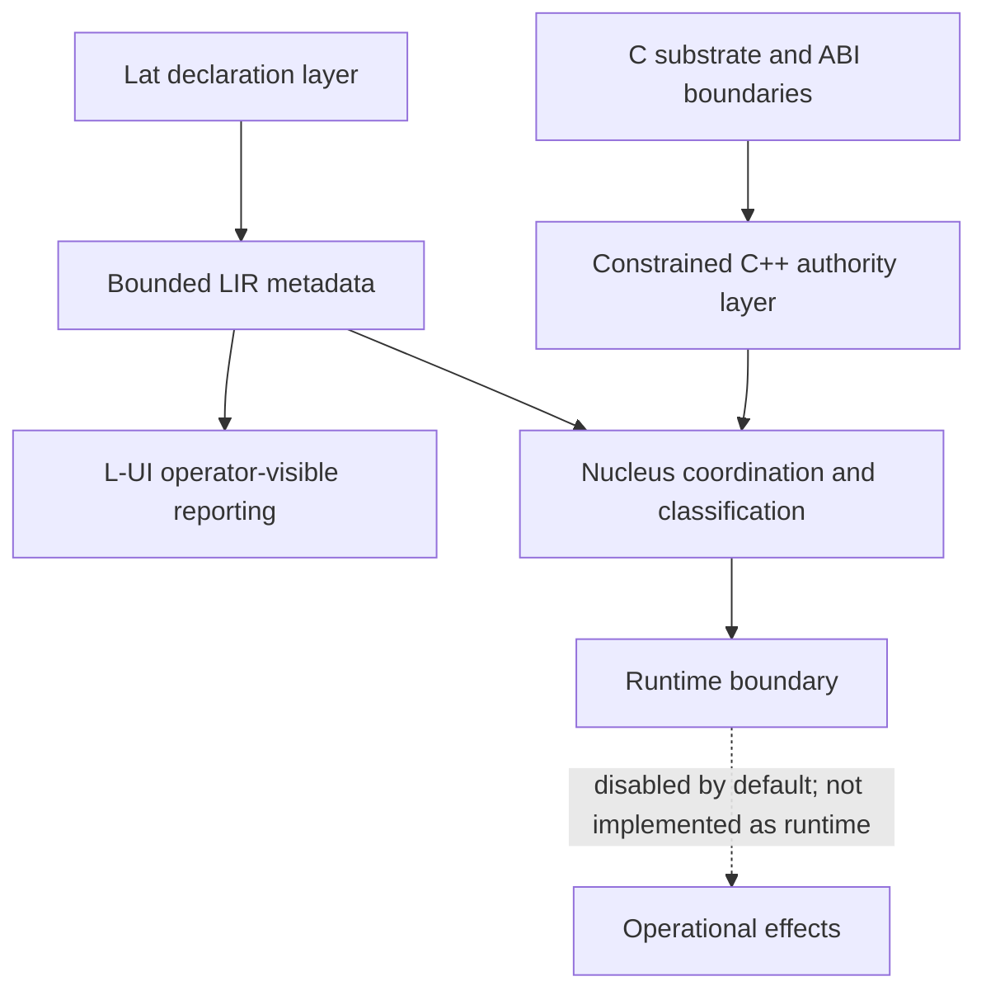
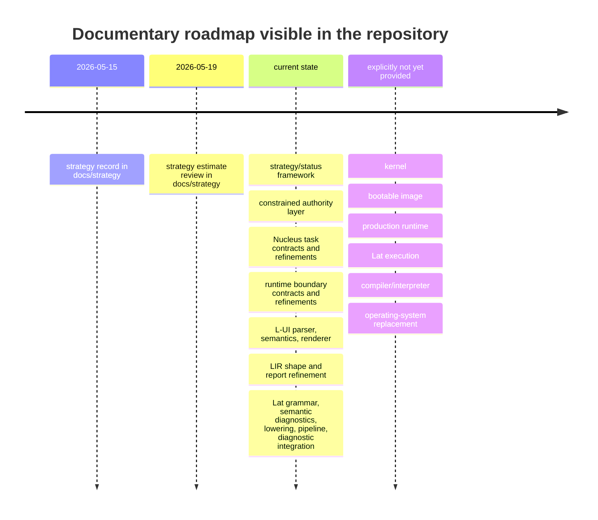

# Latticra and Lat

## Executive summary

Latticra is not, at the time of this review, a runnable operating system or an executable programming language implementation. The repository describes itself instead as an **“early-stage systems architecture implementation seed”** and repeatedly states that it is **foundational engineering work, not a deployed platform or certified product**. The strongest verified result is a contract-first, no-effect architecture centered on explicit state models, constrained authority, bounded intermediate representations, and operator-visible reporting. In other words, the project is already substantively interesting as a research program in systems specification and assurance, but it is not yet an implemented kernel, not yet a bootable OS, and not yet a compiler or interpreter for Lat. citeturn13view0turn39view2

The repository’s most concrete implemented surface is a **documented and tested front-end pipeline**: Lat grammar parsing, semantic validation, Lat-to-LIR lowering, LIR metadata production, report generation, and diagnostic integration. The README states that Lat now has a **bounded no-effect path** from parsing through semantic validation to LIR metadata lowering, and the documentation inventory confirms dedicated contracts, implementation plans, implementations, and refinements for grammar, semantics, diagnostics, lowering, and pipeline assembly. This is a meaningful milestone: Latticra already behaves more like a carefully staged language-analysis framework than like an operating system. citeturn13view0turn39view2turn3view0

As an “OS” artifact, Latticra is best understood as an **aspirational architecture** organized around a Nucleus supervisor model, a constrained C++ authority layer, a runtime boundary, effect gates, signed interaction/update models, and L-UI reporting. However, the repository explicitly states that it does **not currently provide a kernel, bootable image, installer, production runtime, runtime behavior, command execution, active Lat execution, compiler, interpreter, or operating-system replacement**. On the specific dimensions the user asked about—kernel design, process model, memory management, drivers, filesystems, IPC, and security—the strongest scholarly conclusion is therefore negative-but-informative: security and governance concepts are heavily specified, while kernel/runtime subsystems remain either unimplemented or only indirectly inferable from architecture documents. citeturn13view0turn39view2

Relative to Linux and MINIX, Latticra is not yet an OS in the conventional sense; relative to Rust, Go, and OCaml, Lat is not yet a general-purpose executable language. The project is closer to a **high-assurance systems DSL and control-plane architecture** than to a mature systems stack. Its strengths are discipline, explicit non-claims, and layered evidence; its limitations are the absence of execution, lack of published formal semantics visible from the accessible surfaces, and a very early ecosystem state: 224 commits, 1 star, 0 forks, 0 issues, 0 pull requests, no published releases, and a code mix dominated by C and shell with a small C++ layer. citeturn19view0

## Abstract

This article analyzes the GitHub repository **Bryforge/Latticra** as of May 20, 2026, focusing on both the proposed **Latticra operating system architecture** and the **Lat programming language**. The primary materials examined were the repository README, repository metadata, the accessible `docs/FOUNDATION_INDEX.md` file, and the validation surface documented in the README, with comparisons drawn from official documentation for Linux, Rust, Go, and OCaml, plus secondary architectural material on MINIX where official material was not readily accessible. citeturn13view0turn39view2turn49view0turn53view0turn54view0turn55view0turn57view0turn52search0

The central finding is that Latticra is presently a **contract-first, no-effect research and implementation seed**. Its implemented core is a documentary-and-code scaffold for assurance-oriented infrastructure: constrained authority, effect gates, deterministic reports, L-UI parsing/rendering, LIR shaping, and a Lat front-end pipeline from syntax through semantic validation into metadata lowering. The repository explicitly disclaims kernel, runtime, execution, compiler, interpreter, and OS-replacement status. Therefore, the technically rigorous reading is that Latticra is best classified as an emerging **systems architecture and language front-end project**, not yet as a runnable operating system or production programming language. citeturn13view0turn39view2turn3view0

The article argues that Latticra’s design posture is unusual and potentially valuable: unlike most experimental OS or language repositories, it foregrounds non-claims, evidence levels, disabled-by-default effects, bounded representations, and operator-visible diagnostics before enabling runtime behavior. This gives the project a distinctive research identity in high-assurance infrastructure engineering, while also sharply limiting present-day deployability. citeturn13view0turn39view2

## Introduction and background

The repository defines Latticra as a **“contract-first systems architecture project for high-assurance infrastructure engineering”** whose emphasis is explicit state models, deterministic validation, constrained authority, bounded intermediate representations, disabled-by-default effects, and operator-visible reports. It also states a sharper mission: to mature toward infrastructure settings where behavior must be inspectable, explicit, bounded, and governed before becoming operational. This framing matters because it explains why so much of the repository’s substance is in contracts, plans, refinements, and audits rather than in runtime code. citeturn13view0

The project’s core layering is stated directly in the README: **C** is the substrate and ABI boundary; **constrained C++** is the policy, validation, gate, and audit layer; **Lat** is the declaration and semantic/lowering layer; **LIR** is the bounded intermediate representation; **L-UI** is the operator-visible declaration/reporting surface; **Nucleus** is the coordination and classification boundary; and the **runtime boundary** is the disabled-by-default line before operational behavior. This is the clearest available architectural statement, and it already implies that the “OS” side of Latticra is conceived as a governance-oriented control plane rather than as a conventionally implemented kernel first. citeturn13view0

The `FOUNDATION_INDEX` strengthens that interpretation. It inventories documents for a real-system contract, evidence ladder, non-claims, architecture seed, constrained authority layer, supervisor architecture, effect gates, server interaction, self-update, host architecture targets, roadmap, state lattice, Nucleus task execution, runtime boundary, L-UI parsing and semantic validation, LIR shape, and the full Lat grammar/semantics/lowering/pipeline stack. It also imposes an explicit implementation rule: **no implementation code should be added until the relevant contract document exists** and names purpose, evidence level, effect boundary, failure behavior, non-claims, and a test or validation path. citeturn39view2turn3view0

A crucial background fact, however, is that the repository simultaneously maintains an unusually strong set of **negative claims**. The README explicitly says Latticra does **not** currently provide a kernel, bootable image, installer, production runtime, runtime behavior, command execution, effect-performing authority layer, effect-performing task execution, interactive L-UI, terminal-control rendering, LIR execution, Lat execution, compiler, interpreter, accreditation, certification, or operating-system replacement. Scholarly analysis of the repository therefore has to treat Latticra’s OS identity as **programmatic and architectural**, not operational. citeturn13view0

## Methods

This review prioritized **primary repository sources**. The direct evidence base consisted of the repository landing page and README, repository metadata, the accessible `docs/FOUNDATION_INDEX.md` page, and the validation commands named in the README. These sources were sufficient to establish the project’s explicit scope, self-description, documentary structure, implemented slices, and test surface. The review also used the repository’s visible top-level tree, which shows `docs`, `examples/l-ui`, `fixtures/lat`, `include/latticra`, `src`, and `tests`, confirming that the project contains more than prose even though only a subset of nested file pages was accessible in this environment. citeturn13view0turn39view2

Methodologically, the analysis followed a **documentary architecture reconstruction** approach. Where the repository made direct claims, those claims were treated as authoritative. Where the repository only exposed document titles and implementation-plan names, those titles were used cautiously to infer architectural emphasis but not to invent missing behavior. Any subsystem details not explicitly visible in the examined sources are marked here as **unspecified** or **inferred** rather than asserted as implemented. That distinction is especially important for the OS-style questions about kernel structure, processes, memory, drivers, and filesystems. citeturn13view0turn39view2turn3view0

For comparative context, this article used official documentation for Linux, Rust, Go, and OCaml, and secondary material for MINIX 3 when a stable official architectural description was not easily retrievable through the same interface. Those comparison sources were chosen to anchor claims about what mature systems and languages expose today: actual kernels and runtime behavior in Linux and MINIX, and executable type systems, runtimes, and toolchains in Rust, Go, and OCaml. citeturn49view0turn59view1turn59view2turn53view0turn58view0turn58view1turn54view0turn55view0turn55view1turn55view3turn57view0turn56view0turn56view1turn52search0

## Technical analysis of the Latticra operating system architecture

The technically accurate way to discuss “the Latticra Operating System” is to separate **implemented governance infrastructure** from **non-implemented runtime infrastructure**. The implemented side includes constrained authority contracts, Nucleus task execution documents and refinements, runtime boundary documents and refinements, L-UI parsing/rendering, state-lattice modeling, effect-gating documentation, and report-generation surfaces. The non-implemented side includes the conventional OS substrate the user asked about: kernel, boot process, executable runtime, device drivers, filesystem, and IPC as live system services. citeturn13view0turn39view2turn3view0

A concise reconstruction of the architecture visible from the repository is shown below. The final arrow into operational effects is explicitly marked as future and disabled-by-default, because the README says current implementation remains report/classification-oriented and is **not active runtime behavior**. citeturn13view0turn39view2



The **kernel design** is presently defined more by its absence than by its code. The README states unambiguously that Latticra does not currently provide a kernel or a bootable image. What the repository does provide instead is a set of architectural surrogates: a **Nucleus supervisor model**, a **runtime boundary**, and a **constrained authority layer**. Taken together, these imply an eventual control architecture in which execution authority is mediated, classified, and audited before effects occur. But this is an inference about intended direction, not a statement that a scheduler, syscall layer, interrupt subsystem, or hardware abstraction layer already exists. citeturn13view0turn39view2

The **process model** is similarly indirect. There is no evidence of runnable OS processes or threads, but there is strong evidence of a **task model**: `NUCLEUS_TASK_EXECUTION_CONTRACT`, `...IMPLEMENTATION_PLAN`, `...IMPLEMENTATION`, `...NO_EFFECT_REPORT_ALIGNMENT`, and `...REPORT_ONLY_EXECUTION_REFINEMENT`. The README says those slices preserve report-only, non-executing behavior and add execution-status, effect-status, and runtime-status labels. That indicates a conceptual process/task governance model in which work items are classified and reported before real execution exists. It is therefore more accurate to call the current model a **task classification and report protocol** than a process scheduler. citeturn13view0turn39view2turn3view0

The **memory-management story** is one of policy specification rather than virtual-memory implementation. The foundation index identifies a constrained C++ authority-layer contract and implementation plan covering **ownership, lifetime, allocation, exception, and boundary contract**, and the README emphasizes that the authority layer remains **no-effect, metadata-only, fixed-capacity, and denied-by-default**. This suggests that memory discipline is being framed as a governed authority problem rather than as an already implemented VM subsystem. There is no accessible evidence of page tables, allocators, paging policies, copy-on-write, or NUMA strategy inside Latticra itself. Any stronger claim would be unwarranted. citeturn13view0turn39view2

The **drivers and hardware model** are not implemented in the examined sources. The repository has a `HOST_ARCHITECTURE_TARGETS.md` document listed for x86_64 and ARM64 policy, and the README says C is the substrate at ABI boundaries, but it also says there is no kernel, no bootable image, and no production runtime. Therefore there is currently no verified device-driver framework in the Linux or MINIX sense. At most, one can infer that future work is meant to be portable across x86_64 and ARM64 and that authority around hardware interaction would likely be effect-gated. citeturn13view0turn39view2

The **filesystem** is likewise absent as an implemented subsystem. The repository tree does include `src`, `include/latticra`, and `tests`, but the accessible architectural documents do not disclose an implemented VFS, block layer, mount structure, or persistence format. The only robust conclusion is that filesystems are not yet part of the publicly evidenced runtime surface. citeturn13view0turn39view2

The **IPC and communication model** is conceptually richer, but still not a live OS IPC stack. Relevant titles include `SUPERVISOR_ARCHITECTURE`, `EFFECT_GATES`, `SERVER_INTERACTION_MODEL`, `SELF_UPDATE_MODEL`, and multiple Nucleus task/report documents. This architecture suggests a design in which interactions, updates, and authority transfers are expected to be signed, inspectable, bounded, and policy-mediated. However, without runnable services, message-passing semantics, or syscall interfaces visible in the examined sources, it is more precise to say Latticra currently has a **communication governance model** rather than implemented inter-process communication. citeturn39view2

**Security** is the most developed OS-adjacent topic in the repository. The README’s central vocabulary is defensive and auditable: explicit state, deterministic validation, constrained authority, disabled-by-default effects, and operator-visible reports. The foundation index adds a real-system contract, evidence ladder, precursor-promotion rules, non-claims, effect gates, signed server interaction, staged signed self-update with rollback, and a security policy. This is a serious security posture, but it is currently strongest as **architecture and process discipline**, not as a deployed protection boundary in a running kernel. citeturn13view0turn39view2

A subsystem-centered synthesis is therefore as follows:

| Subsystem | Evidence visible in repository | Present status | Analytic conclusion |
|---|---|---|---|
| Kernel | README explicitly says no kernel or bootable image. citeturn13view0 | Not implemented | Latticra is not yet an OS kernel. |
| Process model | Nucleus task execution contracts and report-only execution refinements. citeturn39view2turn3view0 | Conceptual / metadata-only | A task-governance model exists before execution semantics. |
| Memory management | Authority-layer contract names ownership, lifetime, allocation. citeturn39view2 | Policy-level only | Memory is treated as governed authority, not yet as VM machinery. |
| Drivers | Host architecture targets listed; no runtime/driver claims. citeturn13view0turn39view2 | Not implemented | No verified driver model yet. |
| Filesystems | No filesystem-specific implementation surfaced; runtime absent. citeturn13view0turn39view2 | Not implemented | No supported filesystem layer is currently evidenced. |
| IPC | Supervisor/effect/server-interaction docs exist. citeturn39view2 | Architectural only | Communication is specified as governed interaction, not live IPC. |
| Security | Explicit effect gates, audits, signed interaction/update, non-claims. citeturn13view0turn39view2 | Strongest current area | Security is a design posture and evidence discipline, not yet a deployed kernel mechanism. |

## Technical analysis of the Lat programming language

Lat is the most technically concrete part of the project. The README assigns Lat the role of **declaration, semantic validation, lowering metadata, and contract layer**, and then states that Lat now has a bounded no-effect path from grammar parsing to semantic validation to LIR metadata lowering. The foundation index corroborates this with a long chain of dedicated documents: grammar contract, grammar implementation plan, grammar implementation, semantic validation contract, semantic diagnostics refinement, lowering contract and implementation, pipeline contract and implementation, report refinement, diagnostic integration, main-test audit, and Lat-specific LIR refinement. This is much more than a name attached to a speculative future language; it is a staged front-end architecture. citeturn13view0turn39view2turn3view0

What can be said about **syntax** is narrower than what can be said about the pipeline. The accessible sources show that Lat has a grammar, parser result structures, AST structures, capacities, error labels, fixture paths, string handling, and source-span mapping, and that the repository contains a `fixtures/lat` directory. But the exact lexical forms, keywords, operator precedence, declaration syntax, and example programs were not visible from the accessible pages. Therefore the strongest scholarly claim is: Lat has a documented grammar and parser infrastructure, but its concrete surface syntax remains **unspecified in the examined sources**. citeturn13view0turn39view2

On **semantics**, the evidence is stronger in form than in content. The project clearly distinguishes grammar from semantics, and it has a dedicated semantic validation contract, implementation plan, semantic diagnostics refinement, and pipeline diagnostic integration. That means Lat is intended to reject ill-formed or semantically invalid programs with deterministic, source-aware diagnostics. However, the sources accessible here do not reveal the semantic rules themselves in enough detail to reconstruct a formal semantics. We can say with confidence that Lat has a **semantic checking phase** and diagnostic classification; we cannot responsibly claim more than that. citeturn13view0turn39view2turn3view0

The **type system** is the biggest unresolved question. There is no visible evidence, in the accessible sources, of Hindley–Milner inference, nominal or structural typing, ownership types, region/lifetime types, linearity, algebraic effects, or gradual typing. The existence of semantic validation implies that some semantic categories are enforced, but the current public-facing surfaces examined here do not disclose a type system specification. Accordingly, any comparison with Rust, Go, or OCaml must say that Lat’s type discipline is **not yet public or not yet visible**, rather than pretending it resembles any one of those systems. citeturn39view2turn3view0

The **compilation/runtime story** is much clearer. Lat currently lowers to **LIR metadata**, not to executable code, and the README explicitly denies Lat execution, a Lat compiler, and a Lat interpreter. The foundation index locates Lat firmly inside a no-effect front-end chain: parse, validate, lower, report, diagnose. Therefore Lat is presently a **non-executing declarative language front-end** rather than a full compiled or interpreted language system. citeturn13view0turn39view2

Tooling exists, but it is modest and repository-local. The README documents shell-based validation for the Lat pipeline, Lat pipeline diagnostic integration, Lat pipeline diagnostic main-test audit, and Lat-specific LIR refinement. It also says the repository uses shell guards and C invariant tests through a C workflow. There is no evidence of a Cargo-like package manager, a Go-like standard toolchain, an OCaml-like REPL, or a published language server. Tooling today is best described as **test-runner and invariant infrastructure for a language-analysis pipeline**. citeturn19view0

The repository also provides no visible evidence, from the examined sources, of a **standard library** for Lat. There are fixtures and tests, but no explicit standard prelude, package ecosystem, or runtime libraries are claimed. This reinforces the conclusion that Lat is currently closer to a specification/front-end DSL than to a general-purpose programming language ecosystem. citeturn13view0turn39view2

The documented validation surface makes the current state concrete:

The repository documents the following validation entry points for the Lat stack and adjacent slices. citeturn19view0

```sh
sh scripts/test-lat-pipeline-diagnostic-integration-refinement.sh
sh scripts/test-lat-pipeline.sh
sh scripts/test-lat-pipeline-diagnostic-main-test-integration-audit.sh
sh scripts/test-lat-specific-lir-refinement.sh
```

A feature synthesis for Lat is therefore:

| Aspect | Evidence-supported status | Interpretation |
|---|---|---|
| Syntax | Grammar contract and parser implementation exist; exact syntax not visible here. citeturn39view2 | Lat has a defined parser surface, but public syntax remains under-specified from the accessible sources. |
| Semantics | Separate semantic validation and diagnostics layers exist. citeturn13view0turn39view2turn3view0 | Semantics are important, deterministic, and diagnosable. |
| Type system | Not explicitly visible in examined sources. citeturn39view2turn3view0 | Open question. |
| IR | Dedicated LIR shape, refinement, and Lat-to-LIR lowering exist. citeturn13view0turn39view2 | The language is designed around bounded metadata lowering. |
| Runtime | README denies Lat execution and interpreter/compiler status. citeturn13view0 | Not an executable language yet. |
| Tooling | Shell guards and invariant tests are documented. citeturn19view0 | Early but real tooling exists for validation. |
| Standard library | No evidence visible in examined sources. citeturn13view0turn39view2 | Not yet a language ecosystem. |

## Evaluation, comparisons, and roadmap

The clearest strength of Latticra is **discipline**. Most experimental repositories overclaim; this one does the opposite. It defines non-claims, evidence levels, promotion rules, effect boundaries, and validation paths before broadening implementation. That makes it unusually credible as a research object, even while making it immature as a deployable system. A second strength is architectural layering: Lat, LIR, L-UI, Nucleus, and runtime boundary are separated conceptually and procedurally. A third is diagnostic intentionality: the Lat pipeline is explicitly report- and diagnostic-centered rather than execution-centered. citeturn13view0turn39view2turn3view0

Its main limitations follow directly from that same posture. There is no runnable kernel, no userland, no filesystem implementation, no compiler or interpreter, no standard library, and no release artifact. The project’s documentary richness currently outruns its operational realization. For researchers, that is acceptable and even interesting; for adopters seeking a functionally usable OS or language, it is a decisive constraint. citeturn13view0turn19view0

The maturity signals are correspondingly early. The repository shows **224 commits**, **1 star**, **0 forks**, **0 issues**, **0 pull requests**, and **no published releases**. Its visible language mix is mostly **C (68.4%)**, then **Shell (28.6%)**, and **C++ (3.0%)**. Those numbers support an interpretation of Latticra as a single-maintainer or very small-team research codebase with strong documentation emphasis and no public release process yet. citeturn19view0

On **build and test evidence**, the repository does expose a validation surface, and it explicitly says shell guards and C invariant tests are used through the C workflow. However, the publicly accessible surfaces examined here were sufficient to verify the **existence** of those tests, not to independently reproduce full test execution end-to-end in this environment. Accordingly, the defensible claim is that documented test entry points exist for Lat pipeline, Lat-specific LIR, L-UI rendering, Nucleus task execution, and runtime boundary slices, but this review should not be read as a completed third-party build certification. citeturn19view0

Compared with **Linux**, Latticra is profoundly earlier-stage. Linux documents itself as a full Unix-like kernel with multitasking, virtual memory, copy-on-write executables, proper memory management, and networking, and its documentation surface includes administration, drivers, filesystems, System V IPC, module governance, seccomp, and security controls. Latticra by contrast explicitly disclaims kernel/runtime status and currently emphasizes effect gates and report boundaries rather than live services. Linux is therefore a true implementation baseline; Latticra is not yet comparable on runtime capability, only on architectural ambition. citeturn49view0turn59view1turn59view2turn13view0

Compared with **MINIX 3**, Latticra is also pre-kernel. MINIX 3 is classically microkernel-oriented, with interrupts, scheduling, and message passing in the microkernel and many drivers/services in user space. That makes MINIX a useful conceptual comparator for Latticra’s supervisor-and-boundary framing. Yet the difference is still categorical: MINIX implements a microkernel architecture, while Latticra currently implements a **specification and reporting architecture** that could, in the long term, inform a microkernel-like or high-assurance control-plane design. citeturn52search0turn13view0turn39view2

Compared with **Rust**, **Go**, and **OCaml**, Lat is currently much narrower. Rust publicly specifies ownership and borrowing and ships an integrated toolchain with `rustc` and Cargo. Go publicly specifies interfaces, goroutines, and an extensive runtime that includes garbage collection and concurrency support. OCaml publicly presents type inference, polymorphism, automatic memory management, a REPL, bytecode, and native-code compilation. Lat, by contrast, presently exposes parser/semantic/lowering/report infrastructure without public evidence of execution semantics, a type system specification, package management, or a standard runtime. The best comparison is therefore not “Lat versus Rust/Go/OCaml as a full language,” but “Lat versus the front-end and specification layers of mature languages.” citeturn53view0turn58view0turn58view1turn54view0turn55view0turn55view1turn55view3turn57view0turn56view0turn56view1turn13view0turn39view2

A related and, in my view, more illuminating comparison is to **domain-specific and specification-oriented languages**. Because Lat’s current verified role is declaration, semantic validation, deterministic diagnostics, and lowering into bounded IR metadata, it resembles a contract/specification DSL or infrastructure-definition language more than a general-purpose systems language. That is an inference from the repository’s explicit pipeline shape and non-claims, but it is a strong one. citeturn13view0turn39view2

The repository’s observable roadmap is documentary rather than release-based. Its architecture index orders completed slices from strategy/status and authority-layer work through state models, Nucleus, runtime boundary, L-UI, LIR, and the Lat front-end/refinement path. It also lists dated strategy records on **2026-05-15** and **2026-05-19**, implying active planning immediately before this review. The roadmap visible from the sources can therefore be summarized as follows. citeturn39view2turn3view0



## Research directions, applications, and conclusion

The most promising future work is not “add more code” in the abstract, but **convert the existing documentary rigor into formal and executable research artifacts**. The repository already has the right scaffolding for strong systems research: evidence ladders, effect gates, no-claims, bounded IR, and deterministic diagnostics. The next scholarly step would be to turn that architecture into a falsifiable, benchmarkable, and formally inspectable artifact. citeturn13view0turn39view2

A focused next-step table for research or cautious adoption is below.

| Recommended next step | Why it matters | Likely payoff |
|---|---|---|
| Publish a visible formal Lat syntax and semantic core | Syntax and type/semantic details are the largest current blind spot. | Makes language research, critique, and tool interoperability possible. |
| Expose machine-readable AST and LIR schemas with sample fixtures | The repo already emphasizes bounded representations and source spans. | Enables external tooling, diffing, and formal analysis. |
| Add a minimal reference checker or non-effect interpreter | The project currently stops before execution. | Demonstrates semantic adequacy without abandoning the disabled-by-default posture. |
| Specify the type system explicitly | Lat semantic validation exists, but the type discipline is not yet public from accessible sources. | Allows meaningful comparison to Rust, Go, OCaml, and DSL literature. |
| Turn the Nucleus/runtime-boundary model into a small executable prototype | Current Nucleus work is primarily classification/reporting. | Clarifies whether the architecture can scale into real OS or control-plane behavior. |
| Publish reproducible CI/test artifacts and release snapshots | Tests are named, but releases are absent. | Improves external trust, citation stability, and empirical reproducibility. |
| Separate “research architecture” and “adoption profile” documentation | The repo already uses non-claims effectively. | Helps researchers and practitioners understand what is experimental versus supported. |

In terms of **applications**, the repository’s own mission statement suggests a natural niche: high-assurance infrastructure engineering where operator visibility, explicit state, bounded effects, and auditable transitions matter more than peak general-purpose runtime flexibility. Plausible future application domains therefore include infrastructure policy/control planes, signed update systems, defensive orchestration layers, regulated control environments, and educational/research platforms for effect-gated systems design. These are applications suggested by the repository’s stated goals, not by current deployable capability. citeturn13view0turn39view2

There are also important **open questions and limitations**. The most important are the unretrieved details of Lat syntax and type rules; the absence of visible kernel/runtime implementation details for the “OS” layer; the lack of accessible commit-by-commit architectural history in this review; and the lack of independently reproduced build/test execution in this environment. These gaps do not undermine the central conclusion, but they do limit how specific one can be about language semantics and OS internals beyond the repository’s own non-claims and document inventory. citeturn13view0turn39view2turn19view0

The final conclusion is straightforward. **Latticra is already a serious research repository, but it is not yet a serious operating system or a general-purpose programming language implementation.** Its strongest contribution today is a highly disciplined architecture for no-effect specification, validation, diagnostics, and authority control. Its Lat pipeline is the most advanced concrete subsystem. If the project continues to translate its unusually strong documentary method into executable semantics, reference artifacts, and eventually a minimal runtime experiment, it could become a notable contribution to high-assurance systems architecture research. For now, the most accurate scholarly characterization is: **Latticra is a contract-first systems architecture seed with an emerging declarative language front-end, not yet an OS replacement and not yet an executable language ecosystem.** citeturn13view0turn39view2turn3view0turn19view0