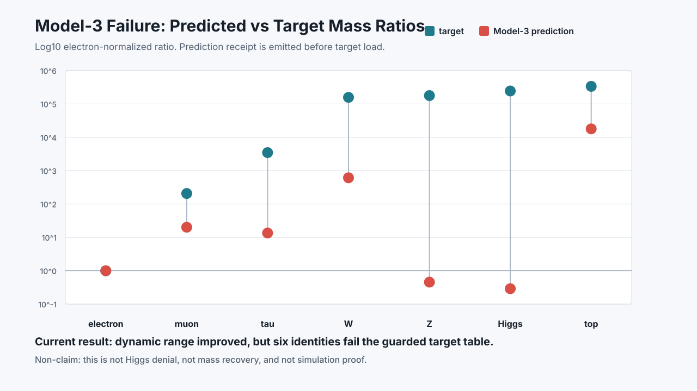
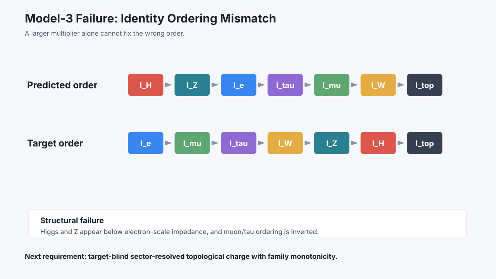
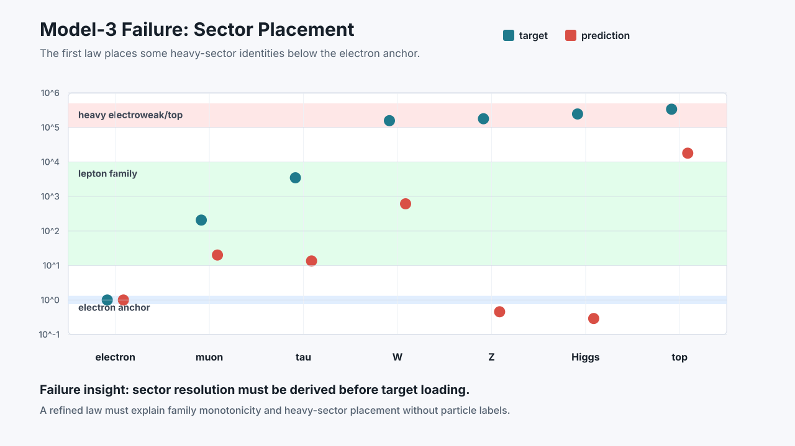

# Latticra Identity-Replay Model-3 Failure Visual Suite

Status: guarded static visual suite for the Model-3 rejection
Date: 2026-05-29 CDT
Scope: SVG visual evidence generated from the receipted Model-3 prediction, evaluation, and rejection-analysis path.

## Purpose

The Model-3 rejection analysis is credible but dense. This visual suite makes the current failure readable without weakening the non-claim boundary.

The charts are generated from the same prediction/evaluation/analysis path used by the guarded verifier. They are not hand-drawn evidence and not a proof of mass recovery.

## Visual Suite Checkpoint

```text
latticra_identity_replay_model3_failure_visual_suite_present=1
latticra_identity_replay_model3_failure_visual_suite_rendered=1
visual_suite_id=latticra-identity-replay-model3-failure-visual-suite
visual_generator=tools/render_latticra_identity_replay_model3_failure_visuals.py
visual_mode=static-svg-from-receipted-model3-rejection-analysis
ratio_chart=docs/assets/identity-replay-model3-failure/model3-failure-ratio-chart.svg
ordering_chart=docs/assets/identity-replay-model3-failure/model3-failure-ordering-chart.svg
sector_chart=docs/assets/identity-replay-model3-failure/model3-failure-sector-chart.svg
render_manifest=docs/assets/identity-replay-model3-failure/render-manifest.txt
prediction_receipt=docs/assets/identity-replay-model3-failure/model3-failure-prediction.json
evaluation_receipt=docs/assets/identity-replay-model3-failure/model3-failure-evaluation.json
rejection_analysis_receipt=docs/assets/identity-replay-model3-failure/model3-failure-rejection-analysis.json
prediction_before_target_load_visualized=1
target_evaluation_after_prediction_visualized=1
ordering_mismatch_visualized=1
sector_placement_failure_visualized=1
model3_prediction_law_rejected=1
dynamic_range_deficit_factor=5.4744404767584652275663280083338001338306169886721631882430541171586743908036395
low_electroweak_below_electron_targets=Higgs boson,Z boson
single_global_amplifier_insufficient=1
required_refined_model3_property=target_blind_sector_resolved_topological_charge_with_family_monotonicity
mass_ratio_recovery_claimed=0
standard_model_replacement_claimed=0
higgs_denied=0
higgs_checkmate_claimed=0
higgs_only_causal_closure_challenged=1
simulation_proven=0
reality_simulation_claimed=0
physics_bound_by_simulative_concepts_claimed=0
scientific_claim_promoted=0
```

## Visual Artifacts

### Predicted vs. Target Ratios



### Identity Ordering Mismatch



### Sector Placement Failure



## Current Conclusion

```text
Model-3 failure is visually inspectable: range improved, but ordering and sector placement failed.
```

The credible public answer is not “Higgs is defeated.” The answer is:

```text
Latticra has a reproducible Higgs-only causal-closure challenge whose current best candidate fails openly and usefully.
```

The follow-on [Refined Model-3 Pre-Registration](LATTICRA_IDENTITY_REPLAY_MODEL3_REFINED_PREREGISTRATION.md) records the refined Model-3 sector-resolved topological charge pre-registration that this visual failure requires before any refined prediction runner.

## Invocation

Render the visual suite:

```sh
python3 tools/render_latticra_identity_replay_model3_failure_visuals.py
```

Guard it:

```sh
sh scripts/test-latticra-identity-replay-model3-failure-visual-suite.sh
```

## Next Recommended Lane

```text
Identity-replay impedance refined Model-3 target-blind capacity gate.
```

## Non-Claims

This visual suite is not a Latticra mass recovery, not a Standard Model replacement, not a denial of CERN/ATLAS/CMS data, not a denial of the Higgs boson, not a proof that reality is simulated, not physics measurement, not experimental evidence, not a completed particle spectrum derivation, not final checkmate against Higgs, not independent reproduction, not a Standard Model precision-shadow pass, not a new experimental prediction, not scientific claim promotion, not runtime execution, not effect execution, not production readiness, not operating-system completeness, and not public promotion of a final scientific conclusion.
